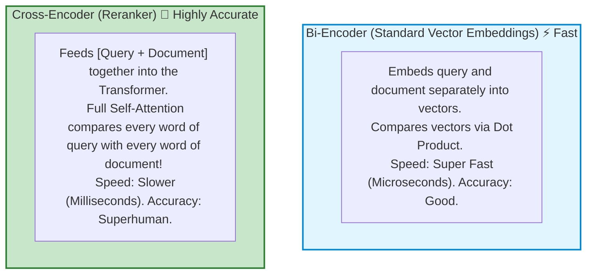

# 🤖 RAG: Reranking and Contextual Compression

## 📌 Overview

When you search a vector database, it returns a list of candidate documents ranked by cosine similarity.

However, standard vector search is **imprecise**. A document that ranks #1 might only have a loose keyword match, while the true, perfect answer is buried down at #15!

To solve this, modern production search uses a **Two-Stage Retrieval Pipeline**:
1. **Stage 1 (Broad Retrieval)**: Fast vector search retrieves the **Top 50** candidates in 10ms.
2. **Stage 2 (Reranking & Compression)**: A **Cross-Encoder Reranker** (like Cohere Rerank) deeply compares the user query with each of the 50 candidates, re-scores them with extreme accuracy, and picks the true **Top 3**!

```mermaid
flowchart LR
    Query["User Query"] --> Stage1["1. Fast Vector Search <br> (Bi-Encoder) <br> Scans 1M vectors in 15ms"]
    Stage1 --> Top50["Top 50 Broad Candidates"]
    Top50 --> Stage2["2. Cross-Encoder Reranker <br> (Cohere Rerank) <br> Deep attention re-scoring"]
    Stage2 --> Top3["Top 3 Laser-Focused Chunks"]
    Top3 --> Compress["3. Contextual Compressor <br> Extracts only relevant sentences"]
    Compress --> LLM["LLM Generates Crisp Answer!"]

    style Stage1 fill:#e1f5fe,stroke:#0288d1,stroke-width:2px
    style Stage2 fill:#fff9c4,stroke:#fbc02d,stroke-width:2px
    style Compress fill:#f3e5f5,stroke:#7b1fa2,stroke-width:2px
    style LLM fill:#c8e6c9,stroke:#2e7d32,stroke-width:2px
```



---

## 🎯 Why This Matters

1. **Massive Boost in Retrieval Accuracy**: Adding a reranker is the single most effective way to improve RAG accuracy (often boosting retrieval precision by 20% to 35%).
2. **Saves 60%+ Context Window Tokens**: Contextual compression strips out filler sentences from chunks before injecting them into the prompt, slashing token costs.
3. **Best of Both Worlds**: You get the lightning speed of vector databases with the surgical precision of deep Transformer cross-attention.

---

## 🧠 Prerequisites

- [03_Transformers_and_Attention.md](./03_Transformers_and_Attention.md): Transformer self-attention.
- [05_Embeddings_and_Vector_Search.md](./05_Embeddings_and_Vector_Search.md): Vector similarity search.
- [23_RAG_Ingestion_and_Chunking.md](./23_RAG_Ingestion_and_Chunking.md): Standard RAG pipeline.

---

## 🔍 Deep Dive

### 1. Bi-Encoder vs. Cross-Encoder

Why can't we just use Cross-Encoders for the entire database?



---

### 2. The Two-Stage Funnel Architecture

```mermaid
flowchart TD
    AllDocs["1,000,000 Documents in Database"] -->|Vector Search (Bi-Encoder)| Top50["50 Candidates"]
    Top50 -->|Cross-Encoder Reranker| Top3["Top 3 Golden Chunks"]
    Top3 -->|Contextual Compressor| CompressedPrompt["Lean, High-Density Context"]
    CompressedPrompt --> Output["Final Generation"]

    style AllDocs fill:#e0f7fa,stroke:#00838f,stroke-width:2px
    style Top50 fill:#fff9c4,stroke:#fbc02d,stroke-width:2px
    style Top3 fill:#c8e6c9,stroke:#2e7d32,stroke-width:2px
```

---

### 3. Contextual Compression: Removing the Fluff

When a 500-token chunk is retrieved, often only **2 sentences** are actually relevant:

```text
Original Chunk (500 tokens):
"Acme Corp was founded in 1994. The weather in Seattle is rainy. 
Our corporate travel meal reimbursement limit is $75 per day. 
Employees must submit receipts through Workday. For hotel bookings, see Section 3..."

After Contextual Compression (45 tokens):
"Our corporate travel meal reimbursement limit is $75 per day. Employees must submit receipts through Workday."
```

---

## 💡 Simple Example: The Job Applicant Funnel

Think of Two-Stage search like **hiring for a software company**:
- **Stage 1 (HR Keyword Filter / Bi-Encoder)**: Automated scanner filters 10,000 resumes down to 50 applicants in seconds.
- **Stage 2 (Senior Engineer Interview / Cross-Encoder)**: The hiring manager spends 45 minutes interviewing all 50 applicants deeply to pick the top 2 best candidates!

---

## 🏗️ Real-World Example: Legal Contract Discovery

In a legal compliance tool:
- Lawyer searches: *"Clause specifying liability cap under gross negligence"*.
- Vector search returns 40 contract clauses.
- **Cohere Rerank** analyzes legal phrasing nuances and elevates Clause #31 (which mentions indemnification limits) from rank #34 straight to rank #1!

---

## ⚠️ Common Mistakes & Pitfalls

1. ❌ **Reranking Too Many Documents**:
   - *Trap*: Passing 500 documents to Cohere Rerank will introduce 3,000ms+ of API latency. Keep Stage 1 candidates between **25 and 50 documents**.
2. ❌ **Over-compressing Context**:
   - *Trap*: Compressing context so aggressively that critical qualifying clauses (like *"Unless approved by VP"*) get removed.

---

## 🔥 Important Points to Remember

- **Bi-Encoders** (Embeddings) are fast for scanning millions of items.
- **Cross-Encoders** (Rerankers) use full self-attention to accurately re-score top candidates.
- **Two-Stage Retrieval**: Retrieve Top 50 $\to$ Rerank to Top 3.
- **Contextual Compression** saves token costs by stripping irrelevant sentences.

---

## 💻 Code / Commands / Configuration

Here is a TypeScript script demonstrating how to use **Cohere Rerank** to re-score vector search candidates:

```typescript
// cohere_rerank_demo.ts
// 1. Run: npm install cohere-ai dotenv
// 2. Run: npx ts-node cohere_rerank_demo.ts

import { CohereClient } from "cohere-ai";
import * as dotenv from "dotenv";

dotenv.config();

const cohere = new CohereClient({
  token: process.env.COHERE_API_KEY || "mock-token",
});

async function runRerankDemo() {
  const userQuery = "What is the maximum limit for meal reimbursements on business trips?";

  // Initial candidate documents returned from Stage 1 Vector Search (unordered / mixed relevance)
  const candidateDocs = [
    "Acme Corp was founded in 1994 and is headquartered in Seattle, Washington.",
    "Flight tickets must be booked at least 14 days in advance through the corporate travel portal.",
    "Employees traveling for business can claim a daily meal allowance up to $75 USD with valid itemized receipts.",
    "Hotel stays are capped at $200 per night for standard tier cities and $300 for major metropolitan zones.",
    "Meals provided during conferences or client dinners cannot be claimed for separate reimbursement.",
  ];

  console.log(`👤 Query: "${userQuery}"`);
  console.log(`📚 Initial Candidate Pool: ${candidateDocs.length} chunks\n`);

  try {
    // Stage 2: Call Cohere Rerank API (Cross-Encoder)
    console.log("🎯 Running Cohere Cross-Encoder Reranker...");
    
    const response = await cohere.v2.rerank({
      model: "rerank-v3.5",
      query: userQuery,
      documents: candidateDocs,
      topN: 2, // Return top 2 best matches
    });

    console.log("\n🏆 Reranked Top Results:");
    response.results.forEach((item, index) => {
      console.log(`\nRank #${index + 1} | Relevance Score: ${(item.relevanceScore * 100).toFixed(2)}%`);
      console.log(`Original Index: #${item.index}`);
      console.log(`Text: "${candidateDocs[item.index]}"`);
    });
  } catch (error) {
    console.log("Note: Set COHERE_API_KEY to run live API calls. Simulated score logic demonstrated.");
  }
}

runRerankDemo();
```

---

## 🎤 Interview Perspective

* **Q: Why are Cross-Encoders mathematically superior in retrieval accuracy compared to Bi-Encoders?**
  * **Answer**: In a Bi-Encoder, the query and document are projected into fixed vectors independently without interacting. In a Cross-Encoder, the query and document tokens are concatenated and passed through the Transformer together. The Multi-Head Self-Attention layers compute all cross-token interactions between every query word and every document word, capturing deep contextual nuances, negations, and relationships that single-vector embeddings miss.
* **Q: What is the optimal architecture for balancing latency, cost, and retrieval quality in enterprise RAG?**
  * **Answer**: A Two-Stage funnel: First, execute a hybrid search (Dense Vector + BM25) to retrieve the top 30–50 candidates in < 25ms. Second, pass those candidates to a hosted Cross-Encoder Reranker (like Cohere Rerank v3.5 or an on-premise BGE-Reranker) to extract the top 3–5 documents in ~40ms, achieving state-of-the-art precision with minimal latency.

---

## 🧩 Connection With Previous Concepts

- **Previous Lesson ([25_RAG_Corrective_and_Self_RAG.md](./25_RAG_Corrective_and_Self_RAG.md))**: Evaluated document quality with CRAG.
- **Next Lesson ([27_Vector_Databases_Overview.md](./27_Vector_Databases_Overview.md))**: We will compare the major **Vector Databases** (Pinecone, ChromaDB, Qdrant, Weaviate, pgvector) and understand **HNSW vs. IVF indexing**!

---

Previous : [25_RAG_Corrective_and_Self_RAG.md](./25_RAG_Corrective_and_Self_RAG.md) | Index: [00_Index.md](./00_Index.md) | Next: [27_Vector_Databases_Overview.md](./27_Vector_Databases_Overview.md)
