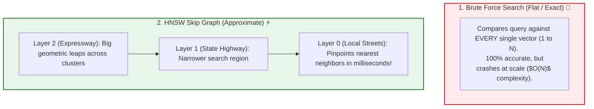
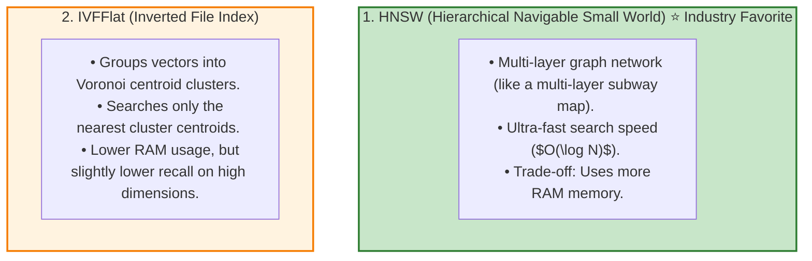

# 🤖 Vector Databases: Architecture, HNSW vs. IVF, and Provider Comparison

## 📌 Overview

If you have 10,000 vector embeddings, a simple JavaScript loop can calculate cosine similarities in a few milliseconds.

But what happens when your enterprise application grows to **10 million vectors**? 

Calculating cosine distance against 10 million vectors for every single search query (**Brute Force $O(N)$ search**) would freeze your CPU and take several seconds per request!

To solve this at scale, we use **Vector Databases**. 

Vector Databases use **Approximate Nearest Neighbor (ANN)** indexing algorithms (like **HNSW** and **IVFFlat**) to navigate multi-dimensional geometric spaces in **under 10 milliseconds**, even across billions of vectors!



---

## 🎯 Why This Matters

1. **Sub-10ms Latency at Scale**: Enables real-time semantic search and RAG for millions of concurrent users.
2. **ACID Transactions & Persistence**: Provides database durability, backups, and security instead of storing vectors in volatile server RAM.
3. **Payload Metadata Filtering**: Allows filtering vectors by tenant ID, user role, and timestamps during the search query.

---

## 🧠 Prerequisites

- [05_Embeddings_and_Vector_Search.md](./05_Embeddings_and_Vector_Search.md): Vectors, dimensions, and cosine similarity.
- [23_RAG_Ingestion_and_Chunking.md](./23_RAG_Ingestion_and_Chunking.md): Vector storage in RAG.

---

## 🔍 Deep Dive

### 1. The Two Dominant ANN Indexing Algorithms



---

### 2. Comprehensive Vector Database Comparison

| Database | Type | Best Used For | Hosting Options | Key Advantage |
|---|---|---|---|---|
| **Pinecone** | Dedicated Managed | Serverless cloud production | Fully Managed Cloud | Zero DevOps, instant autoscaling |
| **pgvector** | PostgreSQL Extension | MERN / SQL stack apps | Self-hosted / Supabase / AWS RDS | Unifies relational SQL & vectors in 1 DB! |
| **Qdrant** | Dedicated Vector DB | High performance, complex filters | Self-hosted (Docker) / Cloud | Blazing fast Rust core, rich payloads |
| **ChromaDB** | Embedded / Lightweight | Local prototyping & testing | In-memory / Local Python / Node | Easiest setup for development |
| **Weaviate** | Dedicated Vector DB | Hybrid search & GraphQL | Self-hosted / Cloud | Built-in ML vectorizers & modules |

---

### 3. The Unified Database Advantage (pgvector)

For MERN developers, adding a separate dedicated vector database (like Pinecone) introduces a **dual-database headache**:
- You must sync data between MongoDB/Postgres and Pinecone.
- If a user deletes their account, you must remember to delete vectors from both databases.

Using **pgvector** in PostgreSQL solves this: your user tables, authentication, orders, and vector embeddings all live inside the **same ACID-compliant database**!

---

## 💡 Simple Example: Finding a House on a Map

- **Brute Force**: You walk up to every single house in the entire country one by one and check if it's the right one. (Takes years).
- **HNSW Index**: You fly on a jet to the state (**Layer 2**), take a highway to the city (**Layer 1**), and drive down the street to the house (**Layer 0**). (Takes minutes)!

---

## 🏗️ Real-World Example: Multi-Tenant Enterprise Search

In a SaaS application with 5,000 corporate clients:
- Every document vector has metadata `{ organizationId: "org_991" }`.
- When a search query runs, Qdrant or pgvector performs **Filtered Vector Search**:
  `SELECT * FROM docs WHERE organizationId = 'org_991' ORDER BY vector <=> queryVector LIMIT 5`.
- Guarantees complete data isolation between corporate tenants!

---

## ⚠️ Common Mistakes & Pitfalls

1. ❌ **Forgetting to Build the Vector Index**:
   - *Trap*: Inserting 500,000 vectors into PostgreSQL without creating an `HNSW` or `IVFFlat` index causes queries to perform a sequential full-table scan (slow!).
2. ❌ **Over-provisioning Dedicated Vector DBs for Small Projects**:
   - *Trap*: Paying $70/month for Pinecone when your app only has 2,000 product vectors. An in-memory store or local SQLite/pgvector handles 2,000 vectors for free in 2ms.

---

## 🔥 Important Points to Remember

- **Vector Databases** scale semantic search across millions of records.
- **ANN (Approximate Nearest Neighbor)** trades 0.1% accuracy for $100\times$ faster search speeds.
- **HNSW** is the industry standard for maximum query speed.
- **pgvector** is ideal for MERN/full-stack developers to avoid managing dual databases.

---

## 💻 Code / Commands / Configuration

Here is a TypeScript script demonstrating how to connect to and query a **Pinecone Serverless** vector index:

```typescript
// pinecone_query_demo.ts
// 1. Run: npm install @pinecone-database/pinecone dotenv
// 2. Run: npx ts-node pinecone_query_demo.ts

import { Pinecone } from "@pinecone-database/pinecone";
import * as dotenv from "dotenv";

dotenv.config();

async function runPineconeDemo() {
  const apiKey = process.env.PINECONE_API_KEY;
  if (!apiKey) {
    console.log("ℹ️ Note: Set PINECONE_API_KEY to execute live cloud queries.");
    return;
  }

  // 1. Initialize Pinecone Client
  const pc = new Pinecone({ apiKey });
  const indexName = "enterprise-knowledge-base";

  console.log(`🔌 Connecting to Pinecone index: "${indexName}"...`);
  const index = pc.index(indexName);

  // 2. Mock 1536-dimensional query vector (e.g. from text-embedding-3-small)
  const mockQueryVector = new Array(1536).fill(0).map(() => Math.random() - 0.5);

  // 3. Execute Vector Search with Metadata Pre-Filtering
  console.log("⚡ Executing ANN Vector Search with Metadata Filters...");
  const queryResponse = await index.query({
    vector: mockQueryVector,
    topK: 3,
    includeMetadata: true,
    filter: {
      department: { $eq: "Engineering" }, // Metadata filter!
    },
  });

  console.log("\n🏆 Matches Returned:");
  queryResponse.matches.forEach((match, i) => {
    console.log(`\nMatch #${i + 1} | Score: ${(match.score! * 100).toFixed(2)}% | ID: ${match.id}`);
    console.log("Metadata:", match.metadata);
  });
}

runPineconeDemo();
```

---

## 🎤 Interview Perspective

* **Q: How does the HNSW (Hierarchical Navigable Small World) algorithm achieve sub-linear $O(\log N)$ search complexity?**
  * **Answer**: HNSW constructs a multi-layered geometric graph inspired by skip-lists. The top layers contain sparse long-range edges connecting distant vector clusters, allowing search queries to make massive geometric leaps across the vector space. As the search descends into lower layers, the graph density increases until Layer 0 locates the exact nearest neighbors via greedy local routing.
* **Q: When would you choose pgvector over a dedicated standalone vector database like Pinecone or Qdrant?**
  * **Answer**: pgvector is preferred when your dataset already lives in PostgreSQL and you want to maintain single-database simplicity, ACID consistency, unified relational SQL joins, and zero external synchronization pipelines. Dedicated vector databases are preferred when scaling beyond 50+ million high-dimensional vectors with high QPS and specialized distributed vector sharding requirements.

---

## 🧩 Connection With Previous Concepts

- **Previous Lesson ([26_RAG_Reranking_and_Compression.md](./26_RAG_Reranking_and_Compression.md))**: Covered re-ranking search results.
- **Next Lesson ([28_pgvector_in_PostgreSQL.md](./28_pgvector_in_PostgreSQL.md))**: We will dive deep into **pgvector in PostgreSQL**—writing raw SQL queries, cosine operators, and HNSW index tuning!

---

Previous : [26_RAG_Reranking_and_Compression.md](./26_RAG_Reranking_and_Compression.md) | Index: [00_Index.md](./00_Index.md) | Next: [28_pgvector_in_PostgreSQL.md](./28_pgvector_in_PostgreSQL.md)
