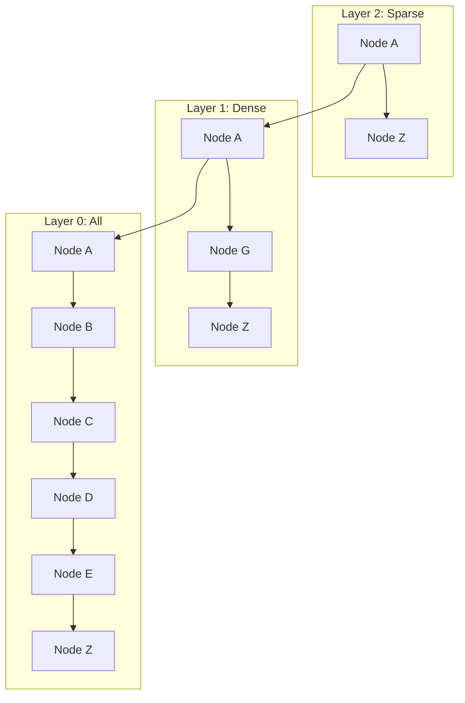

# Chapter 27: Vector Databases Overview

**Estimated Reading Time**: 25 minutes  
**Difficulty**: Intermediate to Advanced  
**Prerequisites**: Chapters 1–26.  
**Learning Objectives**:
1. Compare the architectures of Pinecone, Qdrant, Chroma, and Weaviate.
2. Choose the correct distance metric (Euclidean, Cosine, Inner Product) for a dataset.
3. Understand HNSW and IVF indexing algorithms.
4. Calculate vector distance metrics programmatically in TypeScript.

---

## Introduction

In traditional web development, databases index data using B-Trees for fast equality checks (e.g. `id = 123`). However, B-Trees cannot search high-dimensional spaces. If you search a standard database for vectors, it has to scan every row sequentially (an $O(N)$ table scan), which crashes when scaling past a few thousand records.

**Vector Databases** are specialized storage systems designed to index, store, and query high-dimensional vector embeddings in sub-millisecond times.

In this chapter, we compare popular vector databases and implement vector distance calculations in TypeScript.

---

## Theory: Index Types, Distance Metrics, and Databases

### 1. Vector Database Options
* **Pinecone**: A fully managed cloud service. It is serverless, highly scalable, and excellent for production applications that want zero operational overhead.
* **Qdrant**: An open-source vector search engine written in Rust. It is fast, supports hybrid search, and has great JS SDKs.
* **Chroma**: A lightweight, developer-friendly embedding database. It can run in-memory, making it ideal for local testing.
* **Weaviate**: An open-source vector database supporting GraphQL and semantic search features.

### 2. Distance Metrics
* **Euclidean (L2) Distance**: Measures the straight-line distance between two points in space.
* **Cosine Similarity**: Measures the difference in angle between two vectors, ignoring their length.
* **Inner (Dot) Product**: Multiplies matching dimensions and sums the results.

### 3. Approximate Nearest Neighbor (ANN) Indexing
To query millions of vectors in milliseconds, databases use ANN indexing:
* **HNSW (Hierarchical Navigable Small World)**: Builds a multi-layered proximity graph. It is very fast ($O(\log N)$ search complexity) and highly accurate, but uses a lot of RAM.
* **IVF (Inverted File Index)**: Uses $K$-means clustering to partition the vector space into cells. It uses much less RAM than HNSW but has lower accuracy.

---

## Real-World Analogy: Finding a Book in a Library

* **Flat Index (KNN)**: You walk past every single bookshelf in the library, looking at the cover of every book until you find the match. It takes days, but you are guaranteed to find it.
* **IVF (Clustering)**: The library groups books by category (e.g. Science, Art). You skip all other categories and only search the Science section.
* **HNSW (Proximity Graph)**: You ask a guide at the entrance. They point you to a general floor. On that floor, local guides point you to the correct aisle. In that aisle, someone points you to the exact shelf.

---

## Architecture Diagram: Proximity Graph (HNSW)

This diagram shows how HNSW uses multi-layered graphs to navigate vector spaces quickly.



---

## Code Example: Distance Calculator (TypeScript)

Let's write a TypeScript utility that calculates Euclidean and Inner Product distances between vectors to see how databases evaluate similarity.

Create `distance_calculator.ts`:

```typescript
// Calculates Euclidean (L2) Distance: sqrt(sum((A_i - B_i)^2))
function calculateEuclideanDistance(vecA: number[], vecB: number[]): number {
  if (vecA.length !== vecB.length) {
    throw new Error("Dimension mismatch.");
  }
  const sumSquares = vecA.reduce((sum, val, idx) => sum + Math.pow(val - vecB[idx], 2), 0);
  return Math.sqrt(sumSquares);
}

// Calculates Inner Product (Dot Product): sum(A_i * B_i)
function calculateInnerProduct(vecA: number[], vecB: number[]): number {
  if (vecA.length !== vecB.length) {
    throw new Error("Dimension mismatch.");
  }
  return vecA.reduce((sum, val, idx) => sum + val * vecB[idx], 0);
}

// Normalized mock vectors of dimension 3
const queryVector = [0.80, 0.60, 0.00];

const docVec1 = [0.78, 0.62, 0.05]; // Similar direction and length
const docVec2 = [0.10, 0.05, 0.99]; // Opposite direction

console.log("--- Vector Distance Metrics ---");
const distL2_1 = calculateEuclideanDistance(queryVector, docVec1);
const distL2_2 = calculateEuclideanDistance(queryVector, docVec2);

console.log(`L2 Distance to Doc 1: ${distL2_1.toFixed(4)} (Smaller = Closer)`);
console.log(`L2 Distance to Doc 2: ${distL2_2.toFixed(4)} (Larger = Further)`);

const ip1 = calculateInnerProduct(queryVector, docVec1);
const ip2 = calculateInnerProduct(queryVector, docVec2);

console.log(`\nInner Product to Doc 1: ${ip1.toFixed(4)} (Larger = Closer)`);
console.log(`Inner Product to Doc 2: ${ip2.toFixed(4)} (Smaller = Further)`);
```

Run this file:
```bash
npx tsx distance_calculator.ts
```

---

## Best Practices, Production & Security Considerations

### 1. Match Distance Metrics to Models
* **Production Rule**: When configuring a vector database, choose the distance metric recommended by the embedding model provider. For example, OpenAI's embedding models perform best with Cosine Similarity or Inner Product distance.

---

## Common Mistakes

1. **Deploying HNSW without sufficient RAM**: If your database host runs out of RAM, it will swap graph operations to disk, increasing search latencies from 2ms to 200ms+.

---

## Exercises & Mini Project

### Exercise 1: IVF Clustering
Research and write a brief explanation of how IVF indexes partition vector spaces using Centroids.

### Mini Project: In-Memory DB with L2 Distance
Write an in-memory database class that stores vectors and returns the top 2 closest vectors using Euclidean distance.

---

## Interview Questions

1. **Q**: What are the trade-offs of using HNSW indexes compared to IVF indexes?
   * **A**: HNSW indexes provide high search speed and recall accuracy, but use a lot of RAM. IVF indexes use less RAM but have slower query speeds and lower recall accuracy.
2. **Q**: When is the Inner Product distance metric mathematically identical to Cosine Similarity?
   * **A**: When the vectors are normalized (have a magnitude of 1.0), the denominator in the cosine similarity formula becomes 1.0, making the formulas identical.

---

## Navigation

**Prev:** [Chapter 26: Reranking and Compression](file:///d:/learning/theory/AI-tut/26_RAG_Reranking_and_Compression.md) | **Index:** [Course Overview](file:///d:/learning/theory/AI-tut/README.md) | **Next:** [Chapter 28: pgvector in PostgreSQL](file:///d:/learning/theory/AI-tut/28_pgvector_in_PostgreSQL.md)
