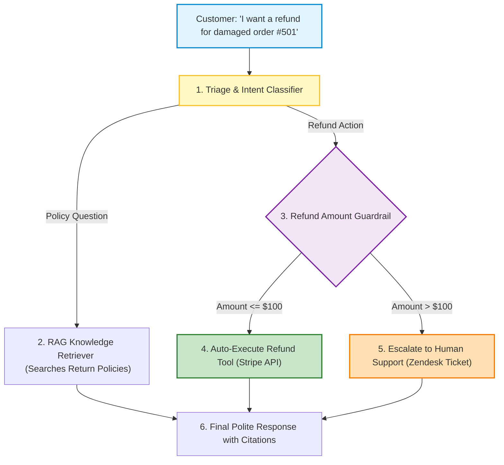

# 🤖 AI Agent Blueprints I: Customer Support and Billing Agent

## 📌 Overview

Now that you have mastered LangChain, LangGraph, RAG, and Vector Databases, it is time to build **Real-World Production AI Agents**!

In this chapter, we will build the **Autonomous Customer Support & Billing Agent**—one of the most common and high-value AI systems deployed in the software industry today.

This agent can:
1. Greet customers and look up their active orders,
2. Search company return policies using RAG,
3. Safely process automated refunds under **$100**,
4. Automatically escalate high-value or angry customers to a human agent with full ticket history!



---

## 🎯 Why This Matters

1. **Production Blueprint**: Combines all previous concepts (LangGraph, RAG, Zod tools, guardrails, conditional routing) into a single cohesive system.
2. **Defensive AI Engineering**: Demonstrates how to put hard programmatic boundaries around AI tools to prevent unauthorized financial losses.
3. **High-Demand Portfolio Project**: A cornerstone project for full-stack AI engineering portfolios and technical interviews.

---

## 🧠 Prerequisites

- [07_Function_Calling_and_Structured_Outputs.md](./07_Function_Calling_and_Structured_Outputs.md): Zod tool definitions.
- [20_LangGraph_Reducers_and_Routing.md](./20_LangGraph_Reducers_and_Routing.md): StateGraph routing.
- [23_RAG_Ingestion_and_Chunking.md](./23_RAG_Ingestion_and_Chunking.md): RAG retrieval.

---

## 🔍 Deep Dive

### 1. State Schema Architecture

The support agent state tracks the conversation, customer identity, and escalation flags:

```typescript
const SupportState = Annotation.Root({
  messages: Annotation<BaseMessage[]>({
    reducer: (curr, update) => curr.concat(update),
    default: () => [],
  }),
  customerId: Annotation<string>(),
  orderId: Annotation<string | null>(),
  isEscalated: Annotation<boolean>(),
});
```

---

### 2. The Defensive Refund Guardrail

Never let an LLM execute financial transactions without strict **programmatic validation**:

```mermaid
flowchart LR
    LLMDecision["LLM triggers refundOrder(orderId: 501, amount: 150)"] --> BackendValidator{"Node.js Guardrail Check: <br> amount <= 100?"}
    
    BackendValidator -->|True (<= $100)| CallStripe["Call Stripe API -> Success!"]
    BackendValidator -->|False (> $100)| Block["BLOCK Action -> Route to Human Manager!"]

    style BackendValidator fill:#fff9c4,stroke:#fbc02d,stroke-width:2px
    style CallStripe fill:#c8e6c9,stroke:#2e7d32,stroke-width:2px
    style Block fill:#ffebee,stroke:#c62828,stroke-width:2px
```

---

## 💡 Simple Example: The Bank Teller & Branch Manager

Think of this architecture like a **Bank Branch**:
- **The AI Teller**: Can check your balance, explain branch hours, and cash checks under $100 immediately.
- **The Branch Manager**: If you want to withdraw $5,000 or close a mortgage, the teller pauses and walks you directly to the Branch Manager's desk (**Human Escalation**).

---

## 🏗️ Real-World Example: E-Commerce Store Support

In an online clothing store:
1. Customer: *"My blue jeans arrived torn. Can I get my $45 back?"*
2. Agent calls `lookupOrder("501")` $\to$ verifies order is for $45 and delivered 2 days ago.
3. Policy check confirms items can be returned within 30 days.
4. Agent executes `refundOrder("501", 45)`.
5. Customer receives instant email confirmation and Stripe refund receipt.

---

## ⚠️ Common Mistakes & Pitfalls

1. ❌ **Allowing the LLM to Decide the Refund Cap**:
   - *Danger*: Writing in the prompt *"Only refund under $100"*. A prompt injection could trick the model into ignoring that rule.
   - *Fix*: Enforce the `< $100` condition in the **TypeScript code** inside the tool handler, completely outside the LLM's control!
2. ❌ **Not Providing Full Chat Transcript on Escalation**:
   - *Fix*: When escalating to a human support queue, bundle the full message history so the human doesn't ask the customer to repeat themselves.

---

## 🔥 Important Points to Remember

- Customer support agents combine **Triage**, **RAG Retrieval**, and **Action Tooling**.
- Always enforce financial caps in **hard backend code**, not solely in prompts.
- Seamlessly transition from AI to human support when confidence is low or policies are exceeded.

---

## 💻 Code / Commands / Configuration

Here is a complete, runnable TypeScript implementation of the **Customer Support & Billing Agent**:

```typescript
// customer_support_agent.ts
// 1. Run: npm install @langchain/langgraph @langchain/core @langchain/openai zod dotenv
// 2. Run: npx ts-node customer_support_agent.ts

import { StateGraph, START, END, Annotation } from "@langchain/langgraph";
import { ChatOpenAI } from "@langchain/openai";
import { HumanMessage, AIMessage, ToolMessage, BaseMessage } from "@langchain/core/messages";
import { DynamicStructuredTool } from "@langchain/core/tools";
import { z } from "zod";
import * as dotenv from "dotenv";

dotenv.config();

// 1. Define Support Agent State
const SupportState = Annotation.Root({
  messages: Annotation<BaseMessage[]>({
    reducer: (curr, update) => curr.concat(update),
    default: () => [],
  }),
  isEscalated: Annotation<boolean>({
    reducer: (curr, update) => update ?? curr,
    default: () => false,
  }),
});

// 2. Tools with Hardcoded Security Guardrails
const orderLookupTool = new DynamicStructuredTool({
  name: "lookup_order",
  description: "Look up details of a customer order by Order ID",
  schema: z.object({ orderId: z.string().describe("Order ID number") }),
  func: async ({ orderId }) => {
    if (orderId === "501") {
      return JSON.stringify({ orderId: "501", item: "Wireless Headphones", amount: 65.00, status: "Delivered" });
    }
    if (orderId === "999") {
      return JSON.stringify({ orderId: "999", item: "4K OLED TV", amount: 1200.00, status: "Delivered" });
    }
    return JSON.stringify({ error: "Order not found" });
  },
});

const refundTool = new DynamicStructuredTool({
  name: "process_refund",
  description: "Processes a financial refund for an order. Max auto-approval limit is $100.",
  schema: z.object({
    orderId: z.string(),
    amount: z.number().describe("Refund amount in USD"),
    reason: z.string().describe("Reason for refund"),
  }),
  func: async ({ orderId, amount, reason }) => {
    // 🛡️ HARD PROGRAMMATIC GUARDRAIL: Never allow AI to refund > $100!
    if (amount > 100) {
      return JSON.stringify({
        success: false,
        error: "AMOUNT_EXCEEDS_LIMIT",
        message: `Refund of $${amount} exceeds the $100 automated limit. Human supervisor escalation required.`,
      });
    }

    return JSON.stringify({
      success: true,
      message: `Successfully refunded $${amount} for Order #${orderId}. Confirmation code: REF-${Date.now()}`,
    });
  },
});

const tools = [orderLookupTool, refundTool];
const toolMap = { [orderLookupTool.name]: orderLookupTool, [refundTool.name]: refundTool };

// 3. Initialize Model
const model = new ChatOpenAI({ modelName: "gpt-4o-mini", temperature: 0.0 }).bindTools(tools);

// 4. Agent Node
async function agentNode(state: typeof SupportState.State) {
  console.log("🤖 [Support Agent] Processing customer request...");
  const systemPrompt = `You are a polite, helpful customer support agent for Acme Electronics.
1. When a user asks about an order or refund, first look up the order using 'lookup_order'.
2. If the user is eligible for a refund under $100, execute 'process_refund'.
3. If a refund fails because it exceeds $100, inform the user politely that a senior human support manager has been notified to process their high-value request.`;

  const response = await model.invoke([
    { role: "system", content: systemPrompt },
    ...state.messages,
  ]);

  return { messages: [response] };
}

// 5. Tool Node
async function toolNode(state: typeof SupportState.State) {
  const lastMsg = state.messages[state.messages.length - 1] as AIMessage;
  const toolResults: BaseMessage[] = [];
  let escalated = false;

  for (const call of lastMsg.tool_calls || []) {
    console.log(`⚡ [Tool Execution]: ${call.name}(${JSON.stringify(call.args)})`);
    const tool = toolMap[call.name];
    const output = await tool.invoke(call.args);
    
    if (output.includes("AMOUNT_EXCEEDS_LIMIT")) {
      escalated = true;
    }

    toolResults.push(new ToolMessage({ tool_call_id: call.id!, content: output }));
  }

  return { messages: toolResults, isEscalated: escalated };
}

// 6. Router
function router(state: typeof SupportState.State) {
  const lastMsg = state.messages[state.messages.length - 1] as AIMessage;
  if (lastMsg.tool_calls && lastMsg.tool_calls.length > 0) {
    return "tools";
  }
  return "__end__";
}

// 7. Compile Graph
async function main() {
  const workflow = new StateGraph(SupportState)
    .addNode("agent", agentNode)
    .addNode("tools", toolNode)
    .addEdge(START, "agent")
    .addConditionalEdges("agent", router, { tools: "tools", __end__: END })
    .addEdge("tools", "agent");

  const app = workflow.compile();

  // Test Case: Auto-approved $65 refund
  console.log("🚀 --- Test Scenario: $65 Refund for Order #501 ---\n");
  const result = await app.invoke({
    messages: [new HumanMessage("Hi, my headphones for order #501 arrived broken. Can I get a refund?")],
  });

  console.log("\n🏁 Final Agent Response:\n", result.messages[result.messages.length - 1].content);
}

main();
```

---

## 🎤 Interview Perspective

* **Q: Why must financial and high-stakes guardrails be implemented in application code rather than prompt instructions?**
  * **Answer**: System prompts are advisory and vulnerable to indirect prompt injection, jailbreaking, and non-deterministic compliance failures. Programmatic guardrails in the tool execution layer (e.g. `if (amount > 100) return error`) execute deterministically in the Node.js runtime, making unauthorized actions mathematically impossible regardless of model output.
* **Q: How do you handle customer sentiment escalation in a production support graph?**
  * **Answer**: We attach a lightweight sentiment analysis node or classifier to the incoming user message. If anger/frustration score exceeds a threshold (or if the user explicitly types "talk to human"), the graph routes directly to an `EscalationNode` that generates a Zendesk/Freshdesk ticket with conversation transcript and bypasses the AI tool loop.

---

## 🧩 Connection With Previous Concepts

- **Previous Lesson ([28_pgvector_in_PostgreSQL.md](./28_pgvector_in_PostgreSQL.md))**: Covered vector databases in SQL.
- **Next Lesson ([30_AI_Agent_Blueprints_2.md](./30_AI_Agent_Blueprints_2.md))**: We will build our second production blueprint: an **Automated Code Reviewer and Research Synthesis Agent**!

---

Previous : [28_pgvector_in_PostgreSQL.md](./28_pgvector_in_PostgreSQL.md) | Index: [00_Index.md](./00_Index.md) | Next: [30_AI_Agent_Blueprints_2.md](./30_AI_Agent_Blueprints_2.md)
