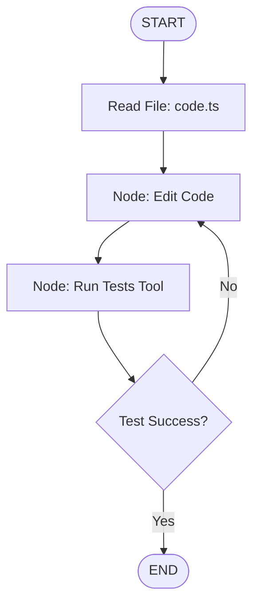

# Chapter 29: AI Agent Blueprints - Part 1

**Estimated Reading Time**: 25 minutes  
**Difficulty**: Expert  
**Prerequisites**: Chapters 1–28.  
**Learning Objectives**:
1. Architect specialized state structures and tool signatures for agent systems.
2. Design blueprints for Resume Analyzer, Coding Assistant, Support Bot, and Email Assistant.
3. Handle file system execution tool outputs securely on the backend.
4. Implement a mock validator test runner for coding agents in TypeScript.

---

## Introduction

So far, you have studied the building blocks: models, embeddings, vectors, and graphs. Now we will apply these components to design production-grade agent architectures.

An **AI Agent** is not just an API call; it is a system of state schemas, tool bindings, and routing loops.

In this chapter, we explore blueprints for the first four agent projects (Resume Analyzer, Coding Assistant, Support Bot, and Email Assistant) and write a mock validation harness in TypeScript.

---

## The 4 Agent Blueprints

### 1. AI Resume Analyzer
* **Goal**: Match candidate resumes against job descriptions (JDs) and score fit.
* **State Schema**:
  ```typescript
  interface ResumeState {
    resumeText: string;
    jobDescription: string;
    extractedSkills: string[];
    skillsGap: string[];
    fitScore: number; // 0 - 100
  }
  ```
* **Tools**: PDF text parser, vector match extractor.
* **Core Flow**: Parse Resume text $\to$ extract candidate skills $\to$ compare against JD embedding using cosine similarity $\to$ generate structured report.

### 2. AI Coding Assistant
* **Goal**: Read, edit, and debug code files recursively.
* **State Schema**:
  ```typescript
  interface CoderState {
    filePath: string;
    instructions: string;
    code: string;
    compileSuccess: boolean;
    errors?: string;
  }
  ```
* **Tools**: `readFile`, `writeFile`, `executeTests`.
* **Core Flow**: Read target file $\to$ modify code $\to$ run compiler/tests tool $\to$ if compilation fails, feed error logs back to model $\to$ repeat loop until tests pass.

### 3. AI Customer Support Bot
* **Goal**: Answer customer queries, query databases, and handle human escalation.
* **State Schema**:
  ```typescript
  interface SupportState {
    messages: BaseMessage[];
    userId: string;
    needsEscalation: boolean;
  }
  ```
* **Tools**: `getUserRecord`, `queryBilling`.
* **Core Flow**: Check user ID $\to$ fetch account status tool $\to$ answer query $\to$ if user expresses frustration or requests human, set state flag `needsEscalation: true` and halt graph.

### 4. AI Email Assistant
* **Goal**: Read email inboxes, classify urgency, draft replies, and wait for approval.
* **State Schema**:
  ```typescript
  interface EmailState {
    sender: string;
    subject: string;
    body: string;
    draftReply: string;
    approved: boolean;
  }
  ```
* **Tools**: `fetchEmails`, `sendEmailDraft`, `slackNotify`.
* **Core Flow**: Ingest unread email $\to$ draft reply $\to$ send draft to Slack with approval links $\to$ await approval webhook $\to$ send email.

---

## Real-World Analogy: The Corporate Office

Think of specialized agents as **different office departments**:
* **Resume Analyzer = HR Assistant**: Scans stacks of CVs and filters out unqualified candidates.
* **Coding Assistant = Junior Developer**: Writes code, runs compiler checks, corrects typos, and submits changes.
* **Support Bot = Receptionist**: Greets callers, answers basic questions using manuals, and routes complex calls to the manager.
* **Email Assistant = Executive Secretary**: Reads the manager's mail, categorizes mail by urgency, drafts responses, and asks the manager to sign off.

---

## Architecture Diagram: Coding Assistant Loop

This diagram maps out the recursive compilation loop of a Coding Assistant.



---

## Code Example: Validator Test Runner (TypeScript)

Let's build a TypeScript class that simulates a validator runner executing compiler commands on code files written by a coder agent.

Create `agent_validator.ts`:

```typescript
import * as fs from "fs";
import * as path from "path";

class AgentTestRunner {
  private workspacePath: string;

  constructor() {
    this.workspacePath = path.join(process.cwd(), "agent_workspace");
    if (!fs.existsSync(this.workspacePath)) {
      fs.mkdirSync(this.workspacePath);
    }
  }

  // Coder agent writes file to disk
  public writeCodeFile(fileName: string, content: string) {
    const filePath = path.join(this.workspacePath, fileName);
    fs.writeFileSync(filePath, content);
    console.log(`[Agent Workspace] Written file: ${fileName}`);
  }

  // Validator node tests compilation
  public runCompilerCheck(fileName: string): { success: boolean; errors?: string } {
    console.log(`[Validator Node] Compiling: ${fileName}...`);
    const filePath = path.join(this.workspacePath, fileName);
    const content = fs.readFileSync(filePath, "utf-8");

    // Simple mock compilation check: check for syntax errors
    if (content.includes("syntax_error") || !content.includes("export")) {
      return {
        success: false,
        errors: "Compilation Error: Missing export statement or invalid syntax identifier."
      };
    }

    return { success: true };
  }

  // Cleanup
  public cleanup() {
    const dir = fs.readdirSync(this.workspacePath);
    for (const file of dir) {
      fs.unlinkSync(path.join(this.workspacePath, file));
    }
    fs.rmdirSync(this.workspacePath);
  }
}

// Execution Block
const runner = new AgentTestRunner();

// 1. Coder writes bad code (fails compiler check)
console.log("--- Test Run 1: Coder Agent writes invalid script ---");
runner.writeCodeFile("math.ts", "const add = (a, b) => a + b; syntax_error;");
const check1 = runner.runCompilerCheck("math.ts");
console.log("Compile Success:", check1.success);
console.log("Error Log:", check1.errors);

// 2. Coder fixes code based on feedback
console.log("\n--- Test Run 2: Coder Agent corrects script ---");
runner.writeCodeFile("math.ts", "export function add(a: number, b: number) { return a + b; }");
const check2 = runner.runCompilerCheck("math.ts");
console.log("Compile Success:", check2.success);

// Clean workspace files
runner.cleanup();
```

Run this file:
```bash
npx tsx agent_validator.ts
```

---

## Best Practices, Production & Security Considerations

### 1. Sandboxing Agent File Executions
If an agent has command-line execution permissions, it can run dangerous commands (e.g. `rm -rf /`).
* **Production Rule**: Run coding agent execution tools inside sandboxed virtual environments (like Docker containers or WASM runtimes) with restricted directory access and no network connections.

---

## Common Mistakes

1. **Infinite agent loops**: Allowing coding agents to loop recursively indefinitely when compiler tests fail, draining your API budget. Always set a maximum retry counter (e.g. 3 attempts).

---

## Exercises & Mini Project

### Exercise 1: State validation schema
Create a Zod schema validating the `ResumeState` input object, ensuring `fitScore` is an integer between 0 and 100.

### Mini Project: Code Debugger Graph
Build a simple LangGraph workflow containing `Coder` and `Validator` nodes that loops until the compiler check passes or 3 attempts are hit.

---

## Interview Questions

1. **Q**: Why is code execution sandboxing critical for agent tools?
   * **A**: LLM generations are probabilistic. If an agent has shell command execution tools, a user could execute a prompt injection attack that runs unauthorized system commands, highlighting the need for isolated sandboxes (like Docker containers).
2. **Q**: How do you prevent state bloat in multi-turn coding agent graphs?
   * **A**: You save only refined summaries and compilation logs inside the main state schema, keeping raw files and compiler dumps in temporary files on disk.

---

## Navigation

**Prev:** [Chapter 28: pgvector in PostgreSQL](file:///d:/learning/theory/AI-tut/28_pgvector_in_PostgreSQL.md) | **Index:** [Course Overview](file:///d:/learning/theory/AI-tut/README.md) | **Next:** [Chapter 30: AI Agent Blueprints 2](file:///d:/learning/theory/AI-tut/30_AI_Agent_Blueprints_2.md)
