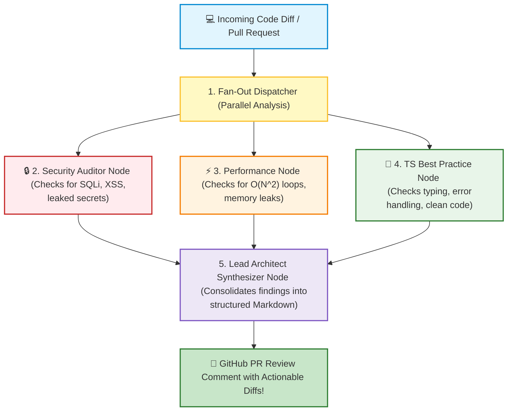

# 🤖 AI Agent Blueprints II: Code Reviewer and Research Synthesis Agent

## 📌 Overview

Reviewing Pull Requests (PRs) is one of the most time-consuming tasks for software engineering teams. 

A human senior engineer must check for security holes, memory leaks, performance bottlenecks, and TypeScript best practices across hundreds of lines of code daily.

In this chapter, we will build the **Automated Code Review & Research Synthesis Agent**—a production-grade agent that uses **Parallel Evaluation Nodes** in LangGraph to perform a multi-perspective audit of incoming code and generate a clean, actionable GitHub PR review!



---

## 🎯 Why This Matters

1. **Parallel Execution (Fan-Out / Fan-In)**: Demonstrates how LangGraph runs multiple analysis nodes concurrently to minimize latency.
2. **Specialized Domain Focus**: Each evaluation node is guided by strict domain prompts (Security, Performance, Style) to avoid missing critical edge cases.
3. **Automated CI/CD Integration**: Can be triggered directly by GitHub Actions webhooks on every Pull Request.

---

## 🧠 Prerequisites

- [13_Prompt_Engineering_Advanced.md](./13_Prompt_Engineering_Advanced.md): System prompt guardrails and XML isolation.
- [19_LangGraph_Core_Nodes_and_Edges.md](./19_LangGraph_Core_Nodes_and_Edges.md): StateGraph architecture.
- [22_LangGraph_Multi_Agent_Design.md](./22_LangGraph_Multi_Agent_Design.md): Multi-Agent design patterns.

---

## 🔍 Deep Dive

### 1. State Schema for Multi-Perspective Review

```typescript
const ReviewState = Annotation.Root({
  codeSnippet: Annotation<string>(),
  securityIssues: Annotation<string[]>({
    reducer: (curr, update) => curr.concat(update),
    default: () => [],
  }),
  performanceIssues: Annotation<string[]>({
    reducer: (curr, update) => curr.concat(update),
    default: () => [],
  }),
  styleImprovements: Annotation<string[]>({
    reducer: (curr, update) => curr.concat(update),
    default: () => [],
  }),
  finalSummary: Annotation<string>(),
});
```

---

### 2. Structured Findings Schema (Zod)

Each specialist node outputs a structured array of issues:

```typescript
const IssueListSchema = z.object({
  issues: z.array(
    z.object({
      severity: z.enum(["CRITICAL", "WARNING", "SUGGESTION"]),
      description: z.string().describe("What is wrong"),
      recommendedFix: z.string().describe("How to fix it with code"),
    })
  ),
});
```

---

## 💡 Simple Example: The Medical Board of Specialists

Think of this architecture like a **Hospital Medical Board**:
- The patient's chart (**The Code**) arrives.
- **Cardiologist (Security Auditor)** checks the heart.
- **Neurologist (Performance Auditor)** checks the brain.
- **General Physician (Style Auditor)** checks vitals.
- **Chief Medical Officer (Synthesizer)** combines all reports into one unified treatment plan!

---

## 🏗️ Real-World Example: GitHub Actions PR Bot

In a company's CI/CD pipeline:
1. Developer opens a PR adding a new payment route in Express.js.
2. GitHub Webhook triggers the Code Reviewer Agent.
3. **Security Node** flags: *"Raw SQL string concatenation detected on line 34 (SQL Injection risk)"*.
4. **Performance Node** flags: *"Database query inside a `forEach` loop on line 52 (N+1 query problem)"*.
5. Agent automatically posts a detailed review comment with diff suggestions on the PR within 10 seconds!

---

## ⚠️ Common Mistakes & Pitfalls

1. ❌ **Running Reviewers Sequentially instead of Concurrently**:
   - *Bad*: Security (3s) $\to$ Performance (3s) $\to$ Style (3s) = 9s total latency.
   - *Good*: Run all 3 in parallel via LangGraph Fan-Out = **3s total latency**!
2. ❌ **Generating Vague Feedback**:
   - *Trap*: Telling the developer *"Improve your code performance"*.
   - *Fix*: Provide exact line numbers and replacement code diffs.

---

## 🔥 Important Points to Remember

- Parallel evaluation nodes (Fan-Out) slash latency.
- Specialized prompts per node yield far deeper findings than one generalist prompt.
- The Synthesizer node aggregates and formats findings into actionable Markdown reports.

---

## 💻 Code / Commands / Configuration

Here is a complete, runnable TypeScript implementation of the **Automated Code Reviewer Agent**:

```typescript
// code_reviewer_agent.ts
// 1. Run: npm install @langchain/langgraph @langchain/core @langchain/openai zod dotenv
// 2. Run: npx ts-node code_reviewer_agent.ts

import { StateGraph, START, END, Annotation } from "@langchain/langgraph";
import { ChatOpenAI } from "@langchain/openai";
import { z } from "zod";
import * as dotenv from "dotenv";

dotenv.config();

// 1. Define Review State
const ReviewState = Annotation.Root({
  codeSnippet: Annotation<string>(),
  securityFeedback: Annotation<string>({ reducer: (c, u) => u ?? c, default: () => "" }),
  performanceFeedback: Annotation<string>({ reducer: (c, u) => u ?? c, default: () => "" }),
  finalReport: Annotation<string>(),
});

const model = new ChatOpenAI({ modelName: "gpt-4o-mini", temperature: 0.0 });

// 2. Node: Security Auditor
async function securityAuditNode(state: typeof ReviewState.State) {
  console.log("🔒 [Security Node] Auditing code for vulnerabilities...");
  const prompt = `You are an elite Application Security Engineer.
Audit this TypeScript code strictly for security risks (SQLi, XSS, insecure secrets, unvalidated inputs).
If secure, state 'NO_SECURITY_ISSUES'. If issues exist, list them concisely with severity.

Code:
${state.codeSnippet}`;

  const res = await model.invoke(prompt);
  return { securityFeedback: res.content as string };
}

// 3. Node: Performance Auditor
async function performanceAuditNode(state: typeof ReviewState.State) {
  console.log("⚡ [Performance Node] Auditing algorithmic efficiency...");
  const prompt = `You are a Principal Performance Engineer.
Audit this TypeScript code strictly for performance bottlenecks (N+1 queries, unindexed lookups, memory leaks, O(N^2) loops).
If optimal, state 'NO_PERFORMANCE_ISSUES'. If issues exist, list them concisely.

Code:
${state.codeSnippet}`;

  const res = await model.invoke(prompt);
  return { performanceFeedback: res.content as string };
}

// 4. Node: Synthesizer (Lead Architect)
async function synthesisNode(state: typeof ReviewState.State) {
  console.log("👔 [Synthesizer Node] Compiling consolidated Pull Request report...");
  const prompt = `You are a Lead Software Architect.
Synthesize the following security and performance audit notes into a clean, professional GitHub PR Review in Markdown.

Security Findings:
${state.securityFeedback}

Performance Findings:
${state.performanceFeedback}

Original Code:
${state.codeSnippet}`;

  const res = await model.invoke(prompt);
  return { finalReport: res.content as string };
}

// 5. Assemble Parallel Fan-Out / Fan-In Graph
async function runReviewerDemo() {
  const workflow = new StateGraph(ReviewState)
    .addNode("security_auditor", securityAuditNode)
    .addNode("performance_auditor", performanceAuditNode)
    .addNode("synthesizer", synthesisNode)
    
    // Fan-Out: Run Security and Performance audits in parallel from START!
    .addEdge(START, "security_auditor")
    .addEdge(START, "performance_auditor")
    
    // Fan-In: Both must complete before Synthesizer runs!
    .addEdge("security_auditor", "synthesizer")
    .addEdge("performance_auditor", "synthesizer")
    .addEdge("synthesizer", END);

  const app = workflow.compile();

  // Test Code with intentional security flaw and performance bottleneck
  const samplePRCode = `
import { Request, Response } from 'express';
import db from './database';

export async function getUserOrders(req: Request, res: Response) {
  const userId = req.query.userId;
  
  // Vulnerability: Direct SQL string interpolation
  const user = await db.query("SELECT * FROM users WHERE id = '" + userId + "'");
  
  // Bottleneck: Querying database inside a loop
  const orders = await db.query("SELECT * FROM orders WHERE user_id = " + userId);
  for (const order of orders.rows) {
    const items = await db.query("SELECT * FROM order_items WHERE order_id = " + order.id);
    order.items = items.rows;
  }
  
  res.json(orders.rows);
}
`;

  console.log("🚀 Running Parallel Code Review Agent Graph...\n");
  const result = await app.invoke({ codeSnippet: samplePRCode });

  console.log("\n🏁 Final GitHub PR Review Report:\n");
  console.log(result.finalReport);
}

runReviewerDemo();
```

---

## 🎤 Interview Perspective

* **Q: How does LangGraph support concurrent (parallel) node execution in a graph?**
  * **Answer**: In LangGraph, when multiple outgoing edges branch from a single node (or from `START`), the runtime executes those target nodes concurrently using asynchronous Promise resolution (`Promise.all`). Nodes that share incoming edges into a downstream node automatically act as a barrier synchronization point (Fan-In), ensuring the downstream node only executes after all concurrent dependencies resolve.
* **Q: Why is decomposing a code review into separate security and performance passes better than a single LLM prompt?**
  * **Answer**: A single prompt asking for security, performance, style, architecture, and typing suffers from attention dispersion and context crowding. Specialized agents focus the model's full attention capacity on a single evaluation rubric, yielding significantly fewer false negatives on subtle security exploits and algorithmic bottlenecks.

---

## 🧩 Connection With Previous Concepts

- **Previous Lesson ([29_AI_Agent_Blueprints_1.md](./29_AI_Agent_Blueprints_1.md))**: Built a customer support and billing agent.
- **Next Lesson ([31_Production_Fastify_and_Docker.md](./31_Production_Fastify_and_Docker.md))**: We will learn how to package and deploy our AI agents using **Fastify** and **Docker** for production!

---

Previous : [29_AI_Agent_Blueprints_1.md](./29_AI_Agent_Blueprints_1.md) | Index: [00_Index.md](./00_Index.md) | Next: [31_Production_Fastify_and_Docker.md](./31_Production_Fastify_and_Docker.md)
