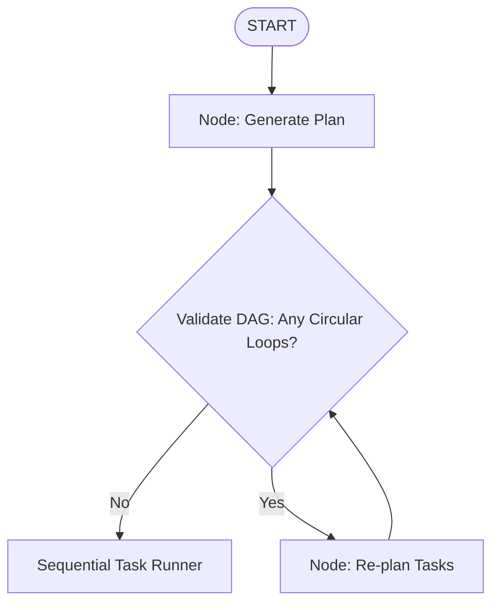

# Chapter 30: AI Agent Blueprints - Part 2

**Estimated Reading Time**: 25 minutes  
**Difficulty**: Expert  
**Prerequisites**: Chapters 1–29.  
**Learning Objectives**:
1. Design blueprints for Research Agent, Project Manager, Task Planner, and Interview Assistant.
2. Structure task plans as Directed Acyclic Graphs (DAGs).
3. Handle parallel execution nodes inside agent workflows.
4. Implement a DAG cycle detector in TypeScript.

---

## Introduction

In this chapter, we cover blueprints for the remaining four agent projects (Research Agent, Project Manager, Task Planner, and Interview Assistant) and write a dependency cycle validator in TypeScript.

These blueprints demonstrate how to coordinate parallel worker nodes and break large objectives into execution graphs.

---

## The 4 Agent Blueprints (Continued)

### 5. AI Research Agent
* **Goal**: Conduct deep-dive research on complex topics using real-time search.
* **State Schema**:
  ```typescript
  interface ResearchState {
    topic: string;
    queries: string[];
    articles: { url: string; content: string }[];
    reportMarkdown: string;
  }
  ```
* **Tools**: `googleSearch`, `scrapeUrl`.
* **Core Flow**: Generate search queries $\to$ execute web searches in parallel $\to$ fetch page content $\to$ compile and synthesize research markdown report.

### 6. AI Project Manager
* **Goal**: Match backlog issues to team members based on capacity.
* **State Schema**:
  ```typescript
  interface PMState {
    backlog: { id: string; title: string; points: number }[];
    team: { id: string; name: string; capacity: number }[];
    assignments: { ticketId: string; assigneeId: string }[];
  }
  ```
* **Tools**: `getBacklog`, `assignTicket`.
* **Core Flow**: Fetch issues $\to$ retrieve team workload state $\to$ calculate optimal assignments using LLM optimizer $\to$ update ticket statuses.

### 7. AI Task Planner
* **Goal**: Break large goals down into a sequence of dependent sub-tasks.
* **State Schema**:
  ```typescript
  interface Task { id: string; desc: string; dependencies: string[]; status: 'PENDING' | 'DONE' }
  interface PlannerState {
    goal: string;
    plan: Task[];
    valid: boolean;
  }
  ```
* **Tools**: None (Model reasoning only).
* **Core Flow**: LLM generates a task dependency plan $\to$ backend validates plan for circular loops (DAG verification) $\to$ save plan for sequential execution.

### 8. AI Interview Assistant
* **Goal**: Conduct technical chat mock interviews and score candidates.
* **State Schema**:
  ```typescript
  interface InterviewState {
    role: string;
    questions: string[];
    currentIdx: number;
    answers: { question: string; answer: string; score: number }[];
    report: string;
  }
  ```
* **Tools**: `generateSpeech` (TTS), `recordSpeech` (STT).
* **Core Flow**: Ask question $\to$ await answer $\to$ grade response $\to$ increment index $\to$ repeat 5 times $\to$ generate final scorecard dashboard.

---

## Real-World Analogy: The Planning Department

Think of these agents as **corporate operations teams**:
* **Research Agent = Research Librarian**: Collects stacks of articles, summarizes findings, and drafts briefs.
* **Project Manager = Team Lead**: Evaluates task estimates, checks developer bandwidth, and assigns tickets.
* **Task Planner = Operations Director**: Reviews the year's goals, breaks them into milestones, and schedules work to ensure dependencies are met.
* **Interview Assistant = Recruiter**: Conducts screening calls, notes responses, scores candidates, and drafts hiring recommendations.

---

## Architecture Diagram: Task Planner Workflow

This diagram maps out a task planner pipeline generating and validating task schedules.



---

## Code Example: DAG Dependency Cycle Detector (TypeScript)

Let's build a TypeScript class that validates task plans to ensure they contain no circular dependencies (e.g., Task A depends on Task B, and Task B depends on Task A), which would lock up execution pipelines.

Create `dag_validator.ts`:

```typescript
interface TaskNode {
  id: string;
  dependencies: string[]; // IDs of tasks that must run before this task
}

class DagValidator {
  /**
   * Evaluates if a list of tasks contains a circular dependency loop (Depth-First Search)
   */
  public hasCycle(tasks: TaskNode[]): boolean {
    const adjList: Map<string, string[]> = new Map();
    tasks.forEach(t => adjList.set(t.id, t.dependencies));

    const visited: Set<string> = new Set();
    const recStack: Set<string> = new Set();

    const dfs = (node: string): boolean => {
      if (recStack.has(node)) return true; // Cycle detected!
      if (visited.has(node)) return false;

      visited.add(node);
      recStack.add(node);

      const neighbors = adjList.get(node) || [];
      for (const neighbor of neighbors) {
        if (dfs(neighbor)) return true;
      }

      recStack.delete(node);
      return false;
    };

    for (const task of tasks) {
      if (dfs(task.id)) return true;
    }

    return false;
  }
}

// Ingestion and Setup
const validator = new DagValidator();

// 1. Valid Task Plan (Task A -> Task B -> Task C)
const validPlan: TaskNode[] = [
  { id: "task_A", dependencies: [] },
  { id: "task_B", dependencies: ["task_A"] },
  { id: "task_C", dependencies: ["task_B"] }
];
console.log("Valid Plan has cycle:", validator.hasCycle(validPlan)); // Should print false

// 2. Invalid Task Plan (Circular loop: A depends on C, C depends on B, B depends on A)
const invalidPlan: TaskNode[] = [
  { id: "task_A", dependencies: ["task_C"] },
  { id: "task_B", dependencies: ["task_A"] },
  { id: "task_C", dependencies: ["task_B"] }
];
console.log("Invalid Plan has cycle:", validator.hasCycle(invalidPlan)); // Should print true
```

Run this file:
```bash
npx tsx dag_validator.ts
```

---

## Best Practices, Production & Security Considerations

### 1. Enforce DAG Validation
Before running any dynamically compiled task lists, always run a cycle validation check (as shown in the code example) to prevent execution pipelines from locking up.

---

## Common Mistakes

1. **Allowing circular dependency execution**: Letting worker systems run tasks without validation, which can lock up queue systems.

---

## Exercises & Mini Project

### Exercise 1: Parallel group partition
Write a TypeScript function that partitions a list of tasks into parallel groups that can run concurrently based on their dependencies.

### Mini Project: Research Synthesis API
Build a graph that takes a topic, generates 3 Google search queries, scraping the top results, and compiles a markdown report.

---

## Interview Questions

1. **Q**: What is a Directed Acyclic Graph (DAG) in task planning?
   * **A**: A DAG is a graph containing nodes and directed edges with no circular loops, used to represent task execution sequences where tasks run based on their dependencies.
2. **Q**: How do you identify circular dependencies in task graphs?
   * **A**: By running a Depth-First Search (DFS) check that tracks node visitation states using a recursion stack. If a node is visited while already in the stack, a circular dependency exists.

---

## Navigation

**Prev:** [Chapter 29: AI Agent Blueprints 1](file:///d:/learning/theory/AI-tut/29_AI_Agent_Blueprints_1.md) | **Index:** [Course Overview](file:///d:/learning/theory/AI-tut/README.md) | **Next:** [Chapter 31: Fastify and Docker](file:///d:/learning/theory/AI-tut/31_Production_Fastify_and_Docker.md)
