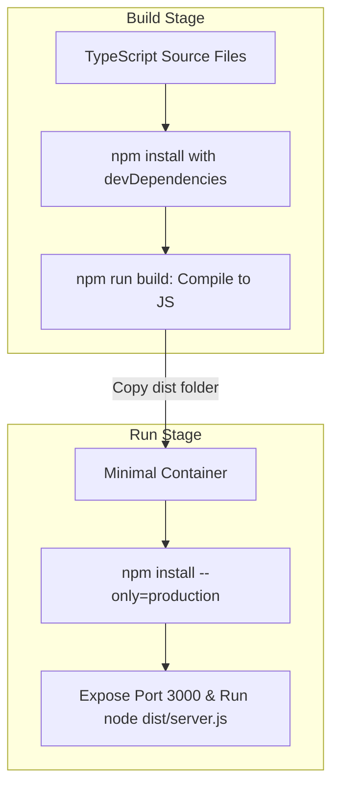

# Chapter 31: Production Fastify and Docker

**Estimated Reading Time**: 25 minutes  
**Difficulty**: Expert  
**Prerequisites**: Chapters 1–30.  
**Learning Objectives**:
1. Build high-performance AI APIs using Fastify.
2. Validate incoming API request payloads in Fastify.
3. Write multi-stage Dockerfiles for TypeScript applications.
4. Scale containerized microservices under streaming loads.

---

## Introduction

An agent script running on your local terminal is a good starting point. Deploying a secure, containerized API that handles thousands of concurrent users under streaming loads is a professional requirement.

In this chapter, we wrapper our AI logic using the **Fastify** framework and compile a multi-stage **Dockerfile** configuration to package and deploy our application.

---

## Theory: API Frameworks and Containerization

### 1. Framework Choice: Fastify vs Express
Express has been the standard in MERN stacks. However, under high-throughput streaming workloads (like Server-Sent Events), Express's middleware overhead can create latency.
* **Fastify**: Optimized for speed, low overhead, and native schema validation. It manages I/O loops efficiently, making it ideal for streaming workloads.

### 2. Multi-Stage Docker Builds
When deploying TypeScript applications, your production container should not include development tools or source files. We use a two-stage Dockerfile:
* **Stage 1 (Build)**: Ingests all source files and installs all dependencies (`devDependencies`) to compile TypeScript into plain JavaScript (`dist` folder).
* **Stage 2 (Run)**: Ingests only the compiled JavaScript and installs only production dependencies (`dependencies`), keeping the image size small and secure.

---

## Real-World Analogy: The Cargo Ship Container

Imagine shipping goods overseas:
* **Traditional Approach**: You throw furniture, tools, and paint cans into the cargo ship. It is unorganized, takes up too much space, and is hard to manage.
* **Docker Approach**: You pack only the finished products into standard containers. The containers take up minimal space and can be loaded onto any ship.
* **Multi-Stage Build**: You assemble the furniture in a local warehouse (Build Stage), pack only the completed furniture into the container, and discard the sawdust, scrap wood, and tools (Run Stage).

---

## Architecture Diagram: Multi-Stage Container Packaging

This diagram illustrates how a multi-stage Docker build compiles and packages a TypeScript application.



---

## Code Example: Fastify AI Server (TypeScript)

Let's build a Fastify server in TypeScript that provides a text completion endpoint with input validation schemas.

First, initialize a new Node project and install dependencies:
```bash
npm install fastify dotenv
npm install --save-dev typescript @types/node tsx
```

Create `fastify_server.ts`:

```typescript
import Fastify, { FastifyRequest, FastifyReply } from "fastify";
import dotenv from "dotenv";

dotenv.config();

const fastify = Fastify({
  logger: true // Enable native JSON logger (pino)
});

interface CompletionBody {
  prompt: string;
}

// 1. Register routes with input validation schemas
fastify.post(
  "/api/completions",
  {
    schema: {
      body: {
        type: "object",
        required: ["prompt"],
        properties: {
          prompt: { type: "string", minLength: 3 }
        }
      }
    }
  },
  async (request: FastifyRequest<{ Body: CompletionBody }>, reply: FastifyReply) => {
    const { prompt } = request.body;
    
    // Simulating LLM completion logic
    console.log(`[Fastify API] Received prompt: "${prompt}"`);
    return {
      status: "SUCCESS",
      output: `Completed generation for prompt: ${prompt}`
    };
  }
);

// 2. Start Fastify Server
const startServer = async () => {
  try {
    const PORT = 3000;
    await fastify.listen({ port: PORT, host: "0.0.0.0" });
    console.log(`Fastify server listening on http://localhost:${PORT}`);
  } catch (err) {
    fastify.log.error(err);
    process.exit(1);
  }
};

startServer();
```

Run this server:
```bash
npx tsx fastify_server.ts
```

---

## Dockerfile Blueprint for Production

Create a `Dockerfile` in the root folder of your project:

```dockerfile
# ==========================================
# STAGE 1: Compilation Build Context
# ==========================================
FROM node:20-alpine AS builder

WORKDIR /app

# Copy package descriptors
COPY package*.json ./
RUN npm install

# Copy source code and config files
COPY . .
RUN npm run build

# ==========================================
# STAGE 2: Minimal Runtime Container
# ==========================================
FROM node:20-alpine AS runner

WORKDIR /app
ENV NODE_ENV=production

# Install only production dependencies
COPY package*.json ./
RUN npm install --only=production

# Copy compiled JavaScript from builder stage
COPY --from=builder /app/dist ./dist

EXPOSE 3000

CMD ["node", "dist/fastify_server.js"]
```

---

## Best Practices, Production & Security Considerations

### 1. Use Non-Root Users in Containers
By default, Docker containers run as the root user. If a security vulnerability occurs, attackers can gain root access to the host machine.
* **Production Rule**: Add a non-root user configuration inside your runtime stage in the Dockerfile:
  ```dockerfile
  USER node
  ```

---

## Common Mistakes

1. **Copying devDependencies into production containers**: Packing large packages (like compilers, typescript types, build tools) into your production image, inflating image sizes.

---

## Exercises & Mini Project

### Exercise 1: Fastify Health Check
Write a Fastify plugin that registers a `/health` route, returning the current process database connectivity status.

### Mini Project: Dockerized SSE Service
Modify the Fastify server code to stream completion events using SSE, write a Dockerfile, build the image locally, and run the container.

---

## Interview Questions

1. **Q**: Why is Fastify preferred over Express for high-performance AI APIs?
   * **A**: Fastify uses native JSON parsing optimization, has lower middleware overhead, and handles persistent connections (like SSE streams) more efficiently, making it ideal for streaming workloads.
2. **Q**: What is the purpose of a multi-stage Docker build?
   * **A**: It splits the build process into compilation and runtime stages. This allows you to discard compilers, devDependencies, and raw source code, keeping the production image size small and secure.

---

## Navigation

**Prev:** [Chapter 30: AI Agent Blueprints 2](file:///d:/learning/theory/AI-tut/30_AI_Agent_Blueprints_2.md) | **Index:** [Course Overview](file:///d:/learning/theory/AI-tut/README.md) | **Next:** [Chapter 32: Redis Caching and Rate Limiting](file:///d:/learning/theory/AI-tut/32_Production_Redis_Caching_and_Rate_Limiting.md)
