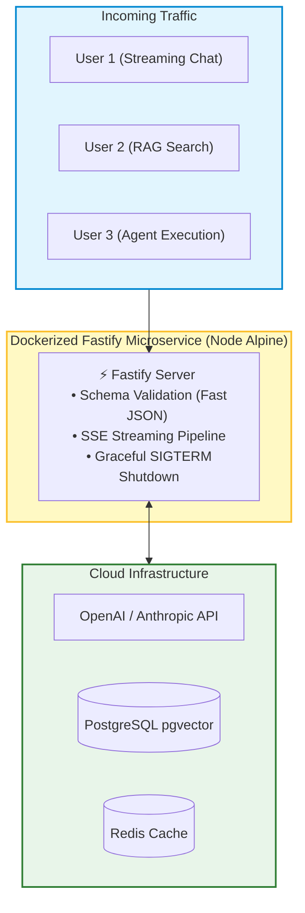
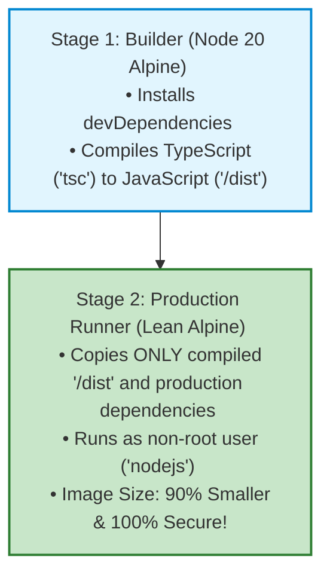
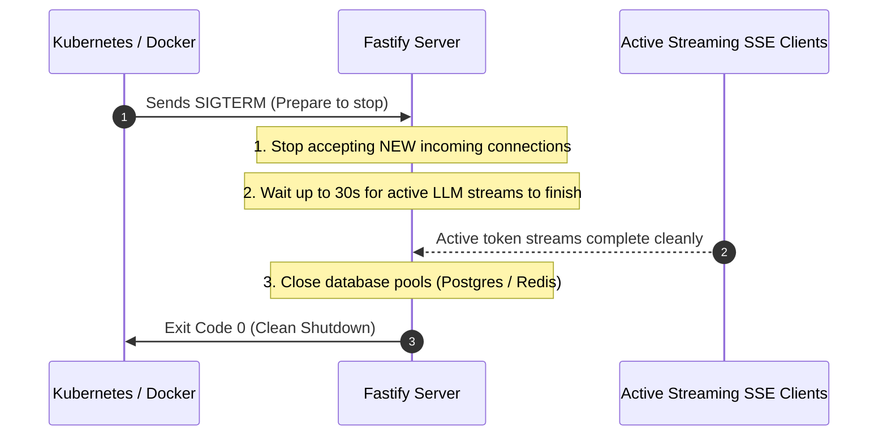

# 🤖 Production Engineering: Fastify and Docker Containerization

## 📌 Overview

Writing AI code on your local laptop is only half the battle. 

To serve real users in production, your application must be:
1. **Ultra-Fast & High-Throughput**: Capable of handling thousands of concurrent streaming connections with minimal memory overhead.
2. **Containerized & Reproducible**: Packaged into a lightweight **Docker Container** that runs identically on AWS, GCP, Azure, or Kubernetes.
3. **Resilient**: Handling graceful shutdowns so active streaming responses aren't abruptly severed during server deployments.

In this chapter, we will build a production-grade AI server using **Fastify** (the highest-performance Node.js framework) and create an enterprise **Multi-Stage Dockerfile**!



---

## 🎯 Why This Matters

1. **2x to 5x Faster than Express**: Fastify uses compiled JSON serializers and a lightweight router, significantly reducing server CPU overhead under high load.
2. **Deterministic Deployments with Docker**: Eliminates the classic *"It works on my machine"* problem by locking Node.js versions, dependencies, and OS libraries inside a container.
3. **Zero Dropped Streams during Rolling Updates**: Graceful shutdown lets in-flight AI responses finish streaming before the old container terminates.

---

## 🧠 Prerequisites

- [10_Streaming_and_SSE.md](./10_Streaming_and_SSE.md): Server-Sent Events mechanics.
- Basic familiarity with Docker and containers (`docker build`, `docker run`).

---

## 🔍 Deep Dive

### 1. Why Fastify for Generative AI Applications?

| Feature | Express.js | Fastify ⭐ |
|---|---|---|
| **Throughput (Req/sec)** | ~15,000 req/sec | **~75,000+ req/sec** |
| **JSON Serialization** | Generic `JSON.stringify()` | Compiled fast-json schema |
| **TypeScript Support** | Requires external `@types` | First-class native TypeScript |
| **Async / Await** | Middleware callback style | Native Promise-based lifecycle |

---

### 2. Multi-Stage Docker Builds (Lean & Secure)

Never copy your `node_modules` or TypeScript source files directly into a production image! Use a **Multi-Stage Build**:



---

### 3. Graceful Shutdown Lifecycle

When Kubernetes or AWS deploys a new version of your container, it sends a `SIGTERM` signal:



---

## 💡 Simple Example: The Moving Truck

Think of a Multi-Stage Docker build like **moving to a new house**:
- **Stage 1 (Packing & Sorting)**: You use packing boxes, tape guns, scissors, and scrap paper.
- **Stage 2 (The Clean House)**: You only move the finished furniture into your new home. You don't bring the empty boxes and scissors with you!

---

## 🏗️ Real-World Example: Production AI Microservice

In an enterprise fintech app:
- 50 Fastify containers run in a Kubernetes cluster behind an AWS Application Load Balancer.
- Each container streams financial advice to users with SSE.
- When an auto-scaling event occurs, new containers boot in 2 seconds thanks to the lightweight 80MB Alpine image.

---

## ⚠️ Common Mistakes & Pitfalls

1. ❌ **Running Containers as `root` User**:
   - *Security Risk*: If an attacker exploits an application vulnerability, they gain root access to the container. Always create and use a dedicated `nodejs` user.
2. ❌ **Hardcoding Secrets inside Dockerfiles**:
   - *Danger*: Never write `ENV OPENAI_API_KEY=sk-...` inside a Dockerfile. Always inject secrets at runtime via environment variables or AWS Secrets Manager.

---

## 🔥 Important Points to Remember

- **Fastify** delivers significantly higher throughput than Express for high-traffic AI APIs.
- **Multi-Stage Docker builds** produce tiny, secure production container images.
- Always implement **Graceful Shutdown** (`SIGTERM`) to allow active AI streams to complete cleanly.
- Run containers under an unprivileged non-root user.

---

## 💻 Code / Commands / Configuration

### 1. High-Performance Fastify Server with Streaming

```typescript
// server.ts
// 1. Run: npm install fastify @fastify/cors openai dotenv
// 2. Run: npx ts-node server.ts

import Fastify from "fastify";
import cors from "@fastify/cors";
import OpenAI from "openai";
import * as dotenv from "dotenv";

dotenv.config();

const fastify = Fastify({
  logger: {
    level: process.env.LOG_LEVEL || "info",
  },
});

fastify.register(cors, { origin: "*" });

const openai = new OpenAI({ apiKey: process.env.OPENAI_API_KEY });

// Health Check Endpoint (For Kubernetes / Load Balancers)
fastify.get("/health", async (request, reply) => {
  return { status: "healthy", timestamp: new Date().toISOString() };
});

// SSE Streaming AI Endpoint
fastify.post("/api/generate/stream", async (request, reply) => {
  const { prompt } = request.body as { prompt: string };

  if (!prompt) {
    return reply.status(400).send({ error: "Missing prompt" });
  }

  // Set SSE Headers
  reply.raw.setHeader("Content-Type", "text/event-stream");
  reply.raw.setHeader("Cache-Control", "no-cache");
  reply.raw.setHeader("Connection", "keep-alive");
  reply.raw.setHeader("X-Accel-Buffering", "no");

  try {
    const stream = await openai.chat.completions.create({
      model: "gpt-4o-mini",
      messages: [{ role: "user", content: prompt }],
      stream: true,
    });

    for await (const chunk of stream) {
      const text = chunk.choices[0]?.delta?.content || "";
      if (text) {
        reply.raw.write(`data: ${JSON.stringify({ text })}\n\n`);
      }
    }

    reply.raw.write("data: [DONE]\n\n");
    reply.raw.end();
  } catch (err: any) {
    fastify.log.error(err);
    reply.raw.write(`data: ${JSON.stringify({ error: "Stream error occurred" })}\n\n`);
    reply.raw.end();
  }
});

// Graceful Shutdown Handler
const closeGracefully = async (signal: string) => {
  fastify.log.info(`Received ${signal}. Closing server gracefully...`);
  await fastify.close();
  process.exit(0);
};

process.on("SIGINT", () => closeGracefully("SIGINT"));
process.on("SIGTERM", () => closeGracefully("SIGTERM"));

const start = async () => {
  try {
    const port = Number(process.env.PORT) || 3000;
    await fastify.listen({ port, host: "0.0.0.0" });
    console.log(`🚀 Fastify AI Server running on port ${port}`);
  } catch (err) {
    fastify.log.error(err);
    process.exit(1);
  }
};

start();
```

---

### 2. Production Multi-Stage `Dockerfile`

```dockerfile
# ----------------------------------------------------
# Stage 1: Build & Compile TypeScript
# ----------------------------------------------------
FROM node:20-alpine AS builder

WORKDIR /app

# Copy dependency manifests
COPY package*.json tsconfig.json ./

# Install ALL dependencies (including devDependencies for build)
RUN npm ci

# Copy source code
COPY . .

# Compile TypeScript to JavaScript (/dist folder)
RUN npm run build

# Prune development dependencies
RUN npm prune --production

# ----------------------------------------------------
# Stage 2: Lean Production Runtime Image
# ----------------------------------------------------
FROM node:20-alpine AS runner

WORKDIR /app

# Set production environment
ENV NODE_ENV=production
ENV PORT=3000

# Create a non-root user and group for security
RUN addgroup -g 1001 -S nodejs && \
    adduser -S nodejs -u 1001

# Copy compiled code and production modules from builder
COPY --from=builder --chown=nodejs:nodejs /app/dist ./dist
COPY --from=builder --chown=nodejs:nodejs /app/node_modules ./node_modules
COPY --from=builder --chown=nodejs:nodejs /app/package.json ./package.json

# Switch to non-root user
USER nodejs

# Expose server port
EXPOSE 3000

# Health check
HEALTHCHECK --interval=30s --timeout=5s --start-period=5s --retries=3 \
  CMD wget --no-verbose --tries=1 --spider http://localhost:3000/health || exit 1

# Start the server
CMD ["node", "dist/server.js"]
```

---

## 🎤 Interview Perspective

* **Q: Why is Graceful Shutdown especially critical for Generative AI streaming backends?**
  * **Answer**: LLM inference streams can last from 5 to 30 seconds. In a cloud environment with autoscaling or rolling deployments, abruptly killing a container with `SIGKILL` cuts active SSE HTTP streams midway, displaying broken sentences to end users and wasting input token costs. A graceful `SIGTERM` handler stops accepting new connections, allows in-flight streams to complete, and flushes database/logging buffers before terminating.
* **Q: How does a Multi-Stage Docker build reduce security attack surface?**
  * **Answer**: Multi-stage builds exclude build tools (compilers, git, TypeScript packages, test runners) from the final production runtime container. By running on a minimal Alpine base image containing only compiled JavaScript and production runtime dependencies under an unprivileged non-root user, the container minimizes vulnerabilities and drastically reduces image size.

---

## 🧩 Connection With Previous Concepts

- **Previous Lesson ([30_AI_Agent_Blueprints_2.md](./30_AI_Agent_Blueprints_2.md))**: Built a code reviewer agent.
- **Next Lesson ([32_Production_Redis_Caching_and_Rate_Limiting.md](./32_Production_Redis_Caching_and_Rate_Limiting.md))**: We will optimize API costs and protect our servers using **Redis Semantic Caching** and **Token-Bucket Rate Limiting**!

---

Previous : [30_AI_Agent_Blueprints_2.md](./30_AI_Agent_Blueprints_2.md) | Index: [00_Index.md](./00_Index.md) | Next: [32_Production_Redis_Caching_and_Rate_Limiting.md](./32_Production_Redis_Caching_and_Rate_Limiting.md)
