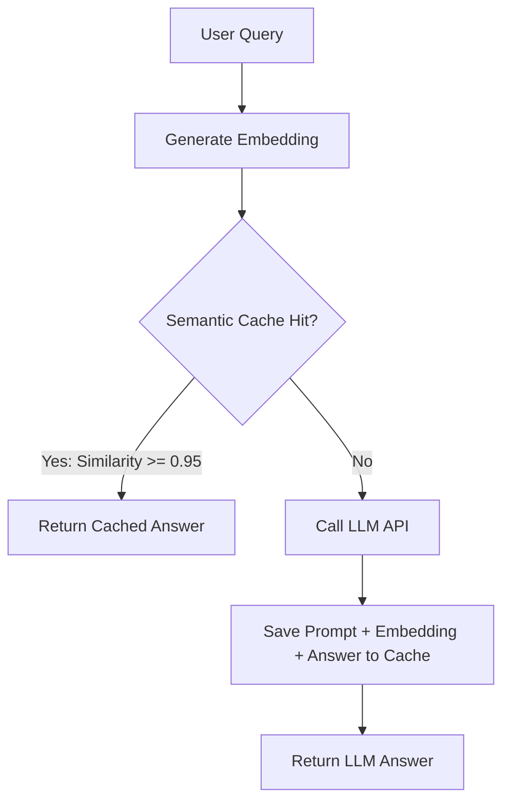

# Chapter 32: Redis Caching and Rate Limiting

**Estimated Reading Time**: 25 minutes  
**Difficulty**: Expert  
**Prerequisites**: Chapters 1–31.  
**Learning Objectives**:
1. Compare exact query caching and semantic caching.
2. Structure Redis caches using TTLs and eviction policies.
3. Track and limit prompt token usage (TPM) using Redis.
4. Implement a Redis semantic cache check in Fastify.

---

## Introduction

Generative AI queries are slow and expensive. A single GPT-4o-mini request can take 2 seconds and cost a fraction of a cent. If a thousand users ask the same question, they waste your API budget and wait for responses.

Caching solves this by saving previous responses. Traditional caches require exact keyword matches, but in AI, we search using **Semantic Caching** to identify equivalent queries. Furthermore, to protect your API budget, we enforce **Token-based Rate Limiting** using Redis.

In this chapter, we explore caching and rate limiting architectures and build a Fastify semantic cache router in TypeScript.

---

## Theory: Caches and Token Rate Limiting

### 1. Caching Strategies
* **Exact Query Caching**: Store queries in Redis using the query text string as the key. If a user asks the exact same question, return the cached response.
* **Semantic Caching**: Calculate the vector embedding of the query. Search a local vector database. If a past query has a Cosine Similarity $\ge 0.95$, return its cached response. This saves API costs and latency for similar questions (e.g. "How to reset password" vs "How do I change my password").

### 2. Rate Limiting: Tokens-per-Minute (TPM)
Traditional rate limiters count requests-per-minute (RPM). In AI systems, a single user can send a 100k-token prompt repeatedly, draining your API balance in minutes.
* **Token Bucket Algorithm**: We track token consumption in Redis per user ID. If a user exceeds their TPM limit (e.g. 5,000 tokens per minute), the API rejects the request with a `429 Too Many Requests` status.

---

## Real-World Analogy: The Help Desk

Imagine running a customer service desk:
* **No Cache**: A customer walks up and asks: "What is the Wi-Fi password?" You go find the manager, look up the password, and return. The next customer asks: "Wi-Fi password please?" You repeat the lookup process.
* **Exact Cache**: You write the Wi-Fi password on a sticky note. If another customer asks: "What is the Wi-Fi password?", you read from the note.
* **Semantic Cache**: A customer asks: "How do I connect to the internet?" You recognize that "connect to internet" is semantically the same as "Wi-Fi password". You hand them the sticky note.

---

## Architecture Diagram: Semantic Caching Lifecycle

This diagram maps out how queries are evaluated against a semantic cache store, bypassing the LLM API on cache hits.



---

## Code Example: Fastify Semantic Cache Router (TypeScript)

Let's build a Fastify server in TypeScript that implements a semantic cache check, routing requests to a cache array if a close match is found.

Create `fastify_cache.ts`:

```typescript
import Fastify, { FastifyRequest, FastifyReply } from "fastify";
import dotenv from "dotenv";

dotenv.config();
const fastify = Fastify({ logger: false });

interface CacheEntry {
  prompt: string;
  embedding: number[];
  answer: string;
}

// In-memory semantic cache store
const semanticCache: CacheEntry[] = [];

// Helper: Calculate similarity between two vector arrays
function cosineSimilarity(a: number[], b: number[]): number {
  let dot = 0, normA = 0, normB = 0;
  for (let i = 0; i < a.length; i++) {
    dot += a[i] * b[i];
    normA += a[i] * a[i];
    normB += b[i] * b[i];
  }
  return dot / (Math.sqrt(normA) * Math.sqrt(normB));
}

// Mock Embedding Generator (3-dimensional vectors)
function mockEmbedding(text: string): number[] {
  if (text.toLowerCase().includes("password")) {
    return [0.95, 0.05, 0.01]; // Password related vector coordinate
  }
  return [0.05, 0.90, 0.20]; // Default vector coordinate
}

fastify.post(
  "/api/ask",
  async (request: FastifyRequest<{ Body: { prompt: string } }>, reply: FastifyReply) => {
    const { prompt } = request.body;
    const queryVector = mockEmbedding(prompt);

    // 1. Check Semantic Cache
    const SIMILARITY_THRESHOLD = 0.95;
    let cachedAnswer: string | null = null;

    for (const entry of semanticCache) {
      const similarity = cosineSimilarity(queryVector, entry.embedding);
      if (similarity >= SIMILARITY_THRESHOLD) {
        console.log(`[Cache Hit] Matches: "${entry.prompt}" (Similarity: ${similarity.toFixed(4)})`);
        cachedAnswer = entry.answer;
        break;
      }
    }

    if (cachedAnswer) {
      return { source: "cache", response: cachedAnswer };
    }

    // 2. Cache Miss: Simulate LLM generation
    console.log("[Cache Miss] Fetching generation from model API...");
    const answer = `Generated reply for: ${prompt}`;

    // Store in cache
    semanticCache.push({
      prompt,
      embedding: queryVector,
      answer
    });

    return { source: "llm", response: answer };
  }
);

// Run Fastify
const start = async () => {
  try {
    await fastify.listen({ port: 3000 });
    console.log("Caching server running on http://localhost:3000");
  } catch (err) {
    fastify.log.error(err);
    process.exit(1);
  }
};
start();
```

Run this file:
```bash
npx tsx fastify_cache.ts
```

Test the endpoint:
```bash
# First request (Cache Miss)
curl -X POST http://localhost:3000/api/ask \
     -H "Content-Type: application/json" \
     -d '{"prompt": "How do I reset my password?"}'

# Second request (Cache Hit)
curl -X POST http://localhost:3000/api/ask \
     -H "Content-Type: application/json" \
     -d '{"prompt": "Password reset steps."}'
```

Observe the console logs. The second request will return immediately from the semantic cache, bypassing the model.

---

## Best Practices, Production & Security Considerations

### 1. Set Eviction policies in Redis
Caches should not grow indefinitely. If your Redis cluster runs out of memory, it will crash.
* **Production Rule**: Configure an eviction policy (like Least Recently Used - LRU) and set time-to-live values (`EXPIRE`) on cache keys to free up space automatically.

---

## Common Mistakes

1. **Setting similarity thresholds too low**: Setting thresholds below `0.90` for semantic caches, which can lead to unrelated queries returning incorrect cached responses.

---

## Exercises & Mini Project

### Exercise 1: Token bucket rate limiter
Research the Redis Token Bucket algorithm and write a TypeScript pseudo-code implementation that tracks token consumption per IP.

### Mini Project: Redis exact cache integration
Build a Fastify server that integrates a local Redis client (`ioredis`) to cache and retrieve exact query responses.

---

## Interview Questions

1. **Q**: What is the difference between exact and semantic caching?
   * **A**: Exact caching queries responses using exact string matches. Semantic caching vectorizes queries and returns cached responses if their cosine similarity exceeds a threshold (e.g. 0.95).
2. **Q**: Why is Token-based Rate Limiting (TPM) critical for LLM APIs?
   * **A**: Traditional RPM limits count requests, ignoring prompt sizes. A malicious user can send massive prompts repeatedly, draining your API budget. TPM rate limiters track and limit the tokens processed per minute.

---

## Navigation

**Prev:** [Chapter 31: Fastify and Docker](file:///d:/learning/theory/AI-tut/31_Production_Fastify_and_Docker.md) | **Index:** [Course Overview](file:///d:/learning/theory/AI-tut/README.md) | **Next:** [Chapter 33: Interview Prep](file:///d:/learning/theory/AI-tut/33_Interview_Questions_and_Coding_Challenges.md)
