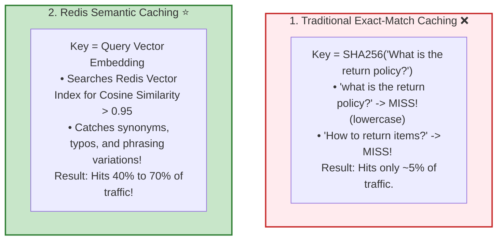
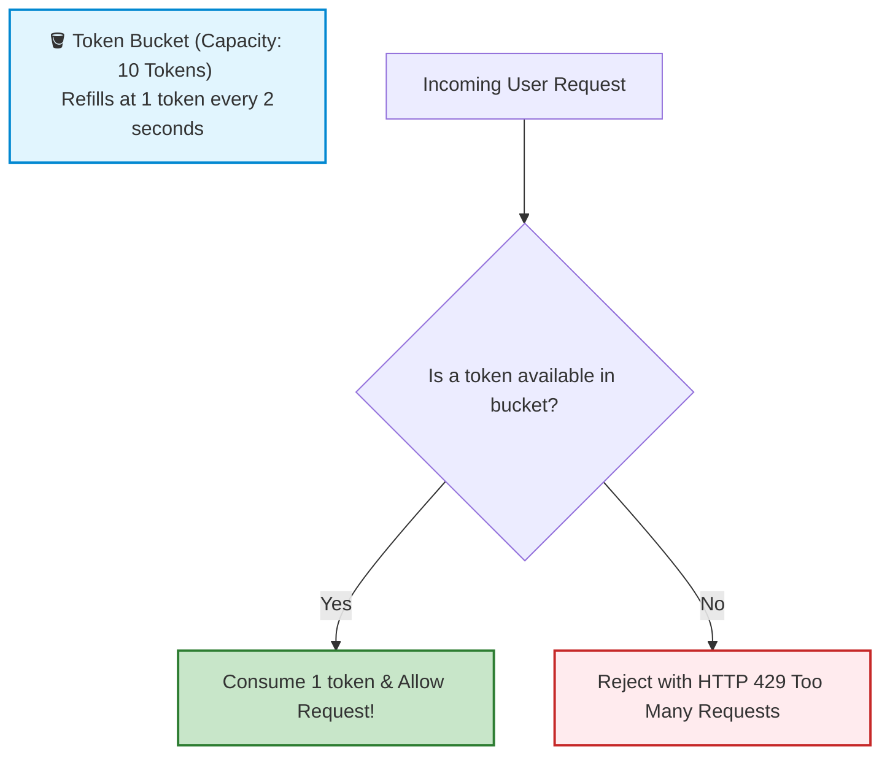

# 🤖 Production Engineering: Redis Semantic Caching and Rate Limiting

## 📌 Overview

Calling LLM APIs in production is **expensive** and **slow**:
- Every query takes 1 to 4 seconds,
- Every query costs real money in input/output tokens,
- Malicious users can spam your API endpoint and drain your company's credit card in hours!

To solve this, production AI architectures deploy two critical layers using **Redis**:
1. **Semantic Caching**: If User A asks *"What is the return policy?"* and User B asks *"How do I return an item?"*, the system detects that both questions mean the exact same thing semantically and serves the answer instantly from Redis in **5 milliseconds for $0.00**!
2. **Token-Bucket Rate Limiting**: Enforces strict limits on Requests-Per-Minute (RPM) and Tokens-Per-Minute (TPM) to prevent API abuse and runaway cloud bills.

```mermaid
flowchart TD
    UserQuery["User Query: 'How do I return a damaged product?'"] --> RateLimit{"1. Redis Rate Limiter <br> Has user exceeded TPM/RPM budget?"}
    
    RateLimit -->|Exceeded (HTTP 429)| Block["🛑 429 Too Many Requests (Blocked)"]
    RateLimit -->|Allowed| SemanticCache{"2. Redis Semantic Cache <br> Cosine Match > 0.95 in Cache?"}
    
    SemanticCache -->|Cache HIT ⚡ (5ms)| CachedAnswer["🏁 Return Cached Answer ($0.00 Cost / Instant!)"]
    SemanticCache -->|Cache MISS 🐢| CallLLM["3. Call OpenAI API ($$$ / 2000ms)"]
    
    CallLLM --> SaveCache["4. Save [Embedding -> Answer] into Redis Cache"]
    SaveCache --> FreshAnswer["🏁 Return Fresh Answer to User"]

    style UserQuery fill:#e1f5fe,stroke:#0288d1,stroke-width:2px
    style RateLimit fill:#fff9c4,stroke:#fbc02d,stroke-width:2px
    style SemanticCache fill:#f3e5f5,stroke:#7b1fa2,stroke-width:2px
    style CachedAnswer fill:#c8e6c9,stroke:#2e7d32,stroke-width:2px
    style CallLLM fill:#ffe0b2,stroke:#f57c00,stroke-width:2px
    style Block fill:#ffebee,stroke:#c62828,stroke-width:2px
```

---

## 🎯 Why This Matters

1. **Slashes API Costs by 40% to 70%**: In high-traffic apps, 50%+ of user questions are variations of the same 20 common topics.
2. **Instant Sub-10ms Responses**: Cache hits return answers in 5ms instead of waiting 3 seconds for LLM generation.
3. **Guaranteed Cloud Budget Protection**: Rate limiting prevents DDoS attacks and accidental infinite loops from bankrupting your cloud account.

---

## 🧠 Prerequisites

- [05_Embeddings_and_Vector_Search.md](./05_Embeddings_and_Vector_Search.md): Vectors and cosine similarity thresholds.
- [31_Production_Fastify_and_Docker.md](./31_Production_Fastify_and_Docker.md): Production server architecture.

---

## 🔍 Deep Dive

### 1. Exact-Match Caching vs. Semantic Caching



---

### 2. Token-Bucket Rate Limiting Algorithm

The **Token Bucket** algorithm allows burst traffic while enforcing steady long-term limits:



---

## 💡 Simple Example: The Library Helpdesk FAQ

Think of Semantic Caching like an **experienced librarian**:
- Person 1 walks up: *"Where are the restrooms?"* $\to$ Librarian points to the blue door.
- Person 2 walks up: *"Excuse me, which way to the washroom?"*
- An amateur computer (Exact match) says: *"I have never heard the word washroom, let me search 10,000 files."*
- The smart librarian (Semantic cache) immediately knows it means the same thing and points to the blue door in 1 second!

---

## 🏗️ Real-World Example: Customer Help Widget

In a food delivery app (like DoorDash or UberEats):
- Thousands of users ask: *"Where is my food?"*, *"Why is my order late?"*, *"Driver is taking too long"*.
- All queries map to the same cached semantic response and live tracking link.
- Saves the company over **$50,000/month** in OpenAI API tokens!

---

## ⚠️ Common Mistakes & Pitfalls

1. ❌ **Setting Semantic Similarity Threshold Too Low (< 0.90)**:
   - *Trap*: If threshold is set to `0.80`, the system might treat *"How do I cancel my order?"* and *"How do I re-order?"* as the same question, returning wrong answers! Always keep semantic cache threshold between **0.94 and 0.98**.
2. ❌ **Caching Personalized Responses**:
   - *Danger*: Never cache answers containing private user data (e.g. *"Your account balance is $45"*). Only cache generalized knowledge and policy answers.

---

## 🔥 Important Points to Remember

- **Semantic Caching** uses vector similarity in Redis to serve identical intent queries in 5ms.
- Always use a high similarity threshold ($> 0.94$) to prevent false cache hits.
- **Rate Limiting** protects against API budget exhaustion and denial-of-service abuse.
- Never cache private PII or user-specific account balances.

---

## 💻 Code / Commands / Configuration

Here is a complete TypeScript script demonstrating **Semantic Caching** with cosine similarity:

```typescript
// semantic_cache_demo.ts
// 1. Run: npm install @langchain/openai dotenv
// 2. Run: npx ts-node semantic_cache_demo.ts

import { ChatOpenAI, OpenAIEmbeddings } from "@langchain/openai";
import * as dotenv from "dotenv";

dotenv.config();

// In-Memory Semantic Cache Store Simulation (Represents Redis Vector Store)
interface CacheEntry {
  query: string;
  queryVector: number[];
  cachedAnswer: string;
  createdAt: number;
}

function cosineSimilarity(a: number[], b: number[]): number {
  const dot = a.reduce((sum, val, i) => sum + val * b[i], 0);
  const normA = Math.sqrt(a.reduce((sum, val) => sum + val * val, 0));
  const normB = Math.sqrt(b.reduce((sum, val) => sum + val * val, 0));
  return dot / (normA * normB);
}

class SemanticCacheManager {
  private cache: CacheEntry[] = [];
  private embeddings = new OpenAIEmbeddings({ model: "text-embedding-3-small" });
  private model = new ChatOpenAI({ modelName: "gpt-4o-mini", temperature: 0.0 });
  private similarityThreshold = 0.93; // 93% match required to trigger cache hit

  async answerQuery(userQuery: string): Promise<{ answer: string; source: "CACHE_HIT" | "LLM_GENERATION"; latencyMs: number }> {
    const startTime = Date.now();
    const queryVector = await this.embeddings.embedQuery(userQuery);

    // 1. Search Cache for Nearest Match
    let bestMatch: CacheEntry | null = null;
    let highestScore = 0;

    for (const entry of this.cache) {
      const score = cosineSimilarity(queryVector, entry.queryVector);
      if (score > highestScore) {
        highestScore = score;
        bestMatch = entry;
      }
    }

    // 2. Check if Similarity exceeds threshold
    if (bestMatch && highestScore >= this.similarityThreshold) {
      const latencyMs = Date.now() - startTime;
      console.log(`⚡ [CACHE HIT!] Matched past query: "${bestMatch.query}" (${(highestScore * 100).toFixed(1)}% match)`);
      return { answer: bestMatch.cachedAnswer, source: "CACHE_HIT", latencyMs };
    }

    // 3. Cache MISS: Generate from LLM
    console.log("🐢 [CACHE MISS] Querying LLM API...");
    const response = await this.model.invoke(userQuery);
    const answer = response.content as string;

    // 4. Save to Semantic Cache for future users
    this.cache.push({
      query: userQuery,
      queryVector,
      cachedAnswer: answer,
      createdAt: Date.now(),
    });

    const latencyMs = Date.now() - startTime;
    return { answer, source: "LLM_GENERATION", latencyMs };
  }
}

async function runDemo() {
  const cacheManager = new SemanticCacheManager();

  console.log("🚀 Testing Semantic Caching Pipeline...\n");

  // Query 1: First time asking
  const q1 = "What is the capital city of France?";
  console.log(`👤 User 1 asks: "${q1}"`);
  const res1 = await cacheManager.answerQuery(q1);
  console.log(`Result (${res1.latencyMs}ms) [${res1.source}]: "${res1.answer}"\n`);

  // Query 2: Different phrasing, same semantic meaning!
  const q2 = "Can you tell me what France's capital is?";
  console.log(`👤 User 2 asks: "${q2}"`);
  const res2 = await cacheManager.answerQuery(q2);
  console.log(`Result (${res2.latencyMs}ms) [${res2.source}]: "${res2.answer}"\n`);
}

runDemo();
```

---

## 🎤 Interview Perspective

* **Q: What is the architectural difference between an exact-match cache (like standard Redis key-value) and a semantic cache?**
  * **Answer**: An exact-match cache computes a cryptographic hash (e.g. SHA-256) of the raw prompt string, requiring character-for-character equality. A semantic cache projects the prompt into high-dimensional vector space using an embedding model and performs an Approximate Nearest Neighbor (ANN) cosine search. If the similarity between the new query vector and a cached vector exceeds a strict threshold (e.g. $\ge 0.95$), the cached answer is returned, achieving cache hit rates of 40–70% across natural language variations.
* **Q: How do you implement a distributed Token-Bucket rate limiter in a multi-instance Node.js deployment?**
  * **Answer**: We utilize Redis with atomic Lua scripts to execute the token consumption logic directly inside the Redis engine. The Lua script evaluates the timestamp, calculates refilled tokens since last access, decrements the token count atomically if available, and sets an expiration TTL, preventing race conditions across multiple server instances.

---

## 🧩 Connection With Previous Concepts

- **Previous Lesson ([31_Production_Fastify_and_Docker.md](./31_Production_Fastify_and_Docker.md))**: Containerized the application with Docker.
- **Next Lesson ([33_Interview_Questions_and_Coding_Challenges.md](./33_Interview_Questions_and_Coding_Challenges.md))**: We will review the top **25+ High-Yield AI Engineering Interview Questions and Coding Challenges**!

---

Previous : [31_Production_Fastify_and_Docker.md](./31_Production_Fastify_and_Docker.md) | Index: [00_Index.md](./00_Index.md) | Next: [33_Interview_Questions_and_Coding_Challenges.md](./33_Interview_Questions_and_Coding_Challenges.md)
