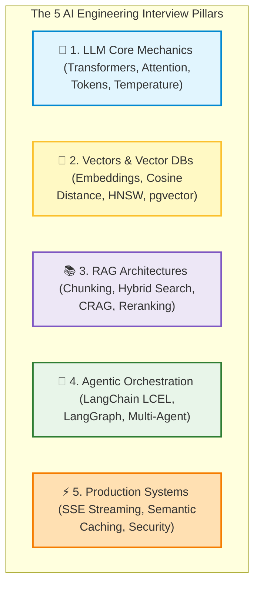

# 🤖 AI Engineering: Interview Questions and Coding Challenges

## 📌 Overview

Congratulations on making it through the technical chapters! 

To help you land high-paying roles as an **AI Engineer**, **Full-Stack AI Developer**, or **GenAI Solutions Architect**, this chapter compiles the **Top 25+ High-Yield Interview Questions** and **Practical Live-Coding Challenges** asked by top tech companies and AI startups.



---

## 🎯 High-Yield Theoretical & Architectural Questions

### 🧠 Domain 1: LLM Fundamentals & Model Mechanics

#### Q1: What is the fundamental difference between deterministic software and probabilistic AI systems?
- **Answer**: Deterministic software follows hardcoded algorithms ($f(x) = y$) where identical inputs always produce identical outputs. LLMs are probabilistic autoregressive models that predict probability distributions over vocabulary tokens ($P(w_t | w_1, \dots, w_{t-1})$). Because outputs are statistical samples, AI engineers must implement schema validation, guardrails, and deterministic retry loops.

#### Q2: Why does the Transformer's Self-Attention mechanism scale quadratically $O(N^2)$ with sequence length?
- **Answer**: Self-Attention computes a pairwise dot product similarity between the Query vector of every token and the Key vector of every other token in the sequence. For a context of $N$ tokens, this generates an $N \times N$ attention matrix, causing computational and memory requirements to grow with the square of the context length ($O(N^2)$).

#### Q3: What is the difference between `temperature` and `top_p` sampling?
- **Answer**: `temperature` scales the raw logit values before applying the Softmax function ($z_i / T$). Lower values ($T \to 0$) make the probability distribution sharper and more deterministic, while higher values flatten it for creativity. `top_p` (nucleus sampling) dynamically truncates the candidate token pool to the smallest set whose cumulative probability exceeds threshold $P$.

---

### 📐 Domain 2: Embeddings & Vector Search

#### Q4: Why is Cosine Similarity preferred over Euclidean Distance for text embeddings?
- **Answer**: Cosine similarity measures the angle between vectors and is invariant to vector magnitude (length). In text search, two documents discussing the exact same topic but with different word counts will point in the same directional angle, whereas Euclidean distance would penalize the difference in document length.

#### Q5: How does the HNSW algorithm achieve sub-linear $O(\log N)$ search speeds?
- **Answer**: HNSW (Hierarchical Navigable Small World) creates a multi-layered geometric graph structure similar to skip-lists. The top layers contain sparse long-range connections for fast global traversal across vector clusters, while lower layers increase edge density for high-precision local nearest-neighbor search.

#### Q6: When should you use pgvector in PostgreSQL instead of a dedicated vector database like Pinecone?
- **Answer**: Use `pgvector` when you already use PostgreSQL and want unified ACID transactions, relational SQL joins (`WHERE`, `JOIN`), and zero dual-database synchronization overhead. Use dedicated vector databases (like Pinecone or Qdrant) when scaling to 50M+ vectors with high queries-per-second (QPS) and distributed sharding needs.

---

### 📚 Domain 3: RAG & Advanced Retrieval

#### Q7: What is the difference between Naive RAG and Corrective RAG (CRAG)?
- **Answer**: Naive RAG directly feeds retrieved vector search chunks into the generator LLM without quality checks. CRAG inserts a Document Grader node to evaluate relevance. If the retrieved context is irrelevant or low quality, CRAG automatically falls back to live web search or query rewriting before generation.

#### Q8: How does a Cross-Encoder Reranker (e.g. Cohere Rerank) differ from a Bi-Encoder?
- **Answer**: A Bi-Encoder embeds the query and document separately into independent fixed-length vectors, comparing them via fast dot product. A Cross-Encoder feeds the concatenated `[Query + Document]` into a Transformer, allowing full bidirectional self-attention between every query word and document word, resulting in significantly higher ranking accuracy.

#### Q9: What is Hypothetical Document Embeddings (HyDE)?
- **Answer**: HyDE uses an LLM to generate a hypothetical, ideal answer passage to a user query. It then embeds that hypothetical document into vector space to search the database. This bridges the semantic embedding gap between short user questions and long declarative factual documents.

---

### 🤖 Domain 4: Agentic Orchestration & LangGraph

#### Q10: What architectural limitation in LangChain LCEL prompted the creation of LangGraph?
- **Answer**: LCEL is restricted to Directed Acyclic Graphs (DAGs) that only flow in a single forward direction. Complex agents require cyclical loops (reflection, retries), conditional branching, persistent state checkpointing, and human-in-the-loop pauses—all of which are first-class state machine primitives in LangGraph.

#### Q11: How does LangGraph handle Human-in-the-Loop (HITL) without keeping persistent server connections open?
- **Answer**: LangGraph uses checkpointers (e.g. `PostgresSaver`). When an `interruptBefore` breakpoint is hit, the entire graph state is serialized into PostgreSQL under a unique `thread_id` and the process exits cleanly. When a human approves via a web endpoint, the server instantiates a fresh worker, loads the state snapshot by `thread_id`, and resumes execution seamlessly.

---

### ⚡ Domain 5: Production & Security

#### Q12: How does Semantic Caching work and why is it superior to exact-match caching for LLMs?
- **Answer**: Exact-match caching requires character-identical string matching (SHA-256 hash). Semantic caching embeds user queries into vector space and checks Redis for past queries with cosine similarity $> 0.95$. This catches synonyms, rephrased questions, and typos, boosting cache hit rates to 40–70% and serving answers in < 10ms for $0.00.

#### Q13: What is the difference between Direct and Indirect Prompt Injection?
- **Answer**: Direct Prompt Injection (jailbreaking) occurs when the user types adversarial instructions directly into the chat prompt. Indirect Prompt Injection occurs when an agent ingests external third-party data (a webpage, email, or PDF) containing hidden adversarial instructions that hijack the agent's tool-calling execution.

---

## 💻 Live-Coding Challenges

### 🧪 Challenge 1: Implementing a Resilient SSE Token Streamer

**Task**: Write a Node.js / TypeScript function that accepts an OpenAI stream and pipes SSE frames cleanly to an HTTP response while capturing total generated token count and handling errors gracefully.

```typescript
// solution_challenge_1.ts
import { Response } from "express";
import OpenAI from "openai";

export async function streamTokensSafely(
  openai: OpenAI,
  prompt: string,
  res: Response
): Promise<{ totalTokensEmitted: number; durationMs: number }> {
  const startTime = Date.now();
  let tokenCount = 0;

  // 1. Configure SSE HTTP Headers
  res.setHeader("Content-Type", "text/event-stream");
  res.setHeader("Cache-Control", "no-cache");
  res.setHeader("Connection", "keep-alive");
  res.setHeader("X-Accel-Buffering", "no");

  try {
    const stream = await openai.chat.completions.create({
      model: "gpt-4o-mini",
      messages: [{ role: "user", content: prompt }],
      stream: true,
    });

    for await (const chunk of stream) {
      const text = chunk.choices[0]?.delta?.content || "";
      if (text) {
        tokenCount++;
        res.write(`data: ${JSON.stringify({ text })}\n\n`);
      }
    }

    res.write("data: [DONE]\n\n");
    res.end();

    const durationMs = Date.now() - startTime;
    return { totalTokensEmitted: tokenCount, durationMs };
  } catch (error: any) {
    res.write(`data: ${JSON.stringify({ error: error.message })}\n\n`);
    res.end();
    throw error;
  }
}
```

---

### 🧪 Challenge 2: Safe Zod JSON Guardrail Parser

**Task**: Write a TypeScript utility function that takes raw, potentially messy LLM output (containing markdown code fences ` ```json `), strips the fluff, and validates it against a Zod schema with automatic retries.

```typescript
// solution_challenge_2.ts
import { z, ZodSchema } from "zod";

export function parseAndValidateLLMJson<T>(rawText: string, schema: ZodSchema<T>): T {
  // 1. Strip Markdown code blocks (e.g. ```json ... ``` or ``` ...)
  let cleaned = rawText.trim();
  if (cleaned.startsWith("```")) {
    cleaned = cleaned.replace(/^```(?:json)?\n?/, "").replace(/\n?```$/, "");
  }

  // 2. Parse JSON string
  let parsedObject: unknown;
  try {
    parsedObject = JSON.parse(cleaned);
  } catch (err: any) {
    throw new Error(`JSON_SYNTAX_ERROR: LLM output could not be parsed as JSON: ${err.message}`);
  }

  // 3. Validate against strict Zod Schema
  const validation = schema.safeParse(parsedObject);
  if (!validation.success) {
    throw new Error(`ZOD_SCHEMA_VALIDATION_ERROR: ${validation.error.message}`);
  }

  return validation.data;
}

// Quick Test:
const UserSchema = z.object({ name: z.string(), age: z.number() });
const sampleLLMOutput = "```json\n{\n  \"name\": \"Alice\",\n  \"age\": 28\n}\n```";
const validUser = parseAndValidateLLMJson(sampleLLMOutput, UserSchema);
console.log("Validated Output:", validUser); // { name: 'Alice', age: 28 }
```

---

## 🎤 Interview Perspective: How to Stand Out

1. **Think in Terms of Latency & Cost**: Always mention Time-to-First-Token (TTFT), token budgets, semantic caching, and small-model routing.
2. **Emphasize Defensive Engineering**: Highlight programmatic guardrails, schema validation (Zod), and Human-in-the-Loop gates.
3. **Showcase Full-Stack Architecture**: Explain how you connect React streaming UIs, Fastify/Node.js backends, PostgreSQL pgvector stores, and LangGraph agent state machines.

---

## 🧩 Connection With Previous Concepts

- **Previous Lesson ([32_Production_Redis_Caching_and_Rate_Limiting.md](./32_Production_Redis_Caching_and_Rate_Limiting.md))**: Covered production caching and rate limiting.
- **Next Lesson ([34_Capstone_Projects.md](./34_Capstone_Projects.md))**: We will build our comprehensive **Capstone Projects** to complete your full-stack AI engineering mastery!

---

Previous : [32_Production_Redis_Caching_and_Rate_Limiting.md](./32_Production_Redis_Caching_and_Rate_Limiting.md) | Index: [00_Index.md](./00_Index.md) | Next: [34_Capstone_Projects.md](./34_Capstone_Projects.md)
