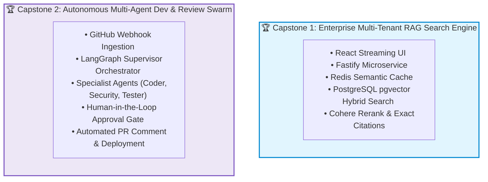
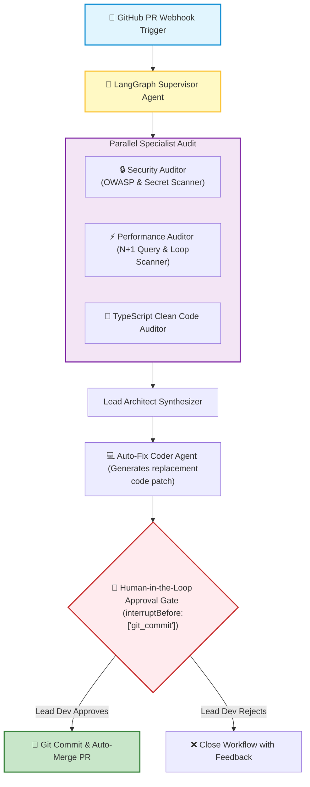
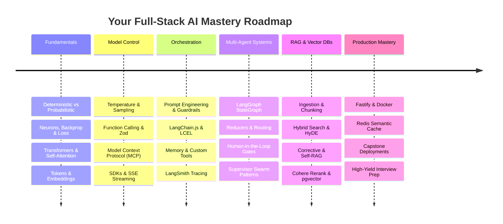

# 🤖 Capstone Projects: Enterprise AI Platforms and Autonomous Swarms

## 📌 Overview

Welcome to the **Grand Capstone Projects**! 

Throughout this entire course, you have learned the individual building blocks of modern GenAI: Tokenization, Embeddings, Prompt Engineering, LCEL Pipelines, LangGraph State Machines, Advanced RAG, pgvector, Redis Caching, and Docker Containerization.

In this capstone chapter, we bring all of these concepts together into **Two Production-Grade End-to-End Projects** that you can build, deploy, and showcase on your portfolio!



---

## 🏗️ Capstone Project 1: Enterprise Multi-Tenant RAG Platform

### 🎯 Architecture Overview

A complete, production-ready enterprise search and knowledge retrieval platform for multi-tenant SaaS applications:

```mermaid
flowchart TD
    User["👤 End User (Browser / React)"] --> Fastify["⚡ Fastify API Gateway"]
    Fastify --> RedisLimit{"1. Redis Rate Limiter (Token Bucket)"}
    
    RedisLimit -->|Allowed| RedisCache{"2. Redis Semantic Cache (Cosine > 0.95)"}
    RedisCache -->|HIT (5ms)| Fastify
    
    RedisCache -->|MISS| Hybrid["3. Hybrid Retrieval Engine <br> • Dense Vectors (pgvector HNSW) <br> • Sparse BM25 Keywords <br> • Tenant Filter: WHERE tenant_id = $1"]
    
    Hybrid --> Rerank["4. Cohere Cross-Encoder Reranker <br> (Filters Top 50 down to Top 3)"]
    Rerank --> LangChain["5. LCEL Context Synthesizer (GPT-4o)"]
    LangChain --> Stream["6. SSE Live Streaming Response with Citations"]
    Stream --> User

    style User fill:#e1f5fe,stroke:#0288d1,stroke-width:2px
    style Fastify fill:#fff9c4,stroke:#fbc02d,stroke-width:2px
    style RedisCache fill:#f3e5f5,stroke:#7b1fa2,stroke-width:2px
    style Hybrid fill:#e8f5e9,stroke:#2e7d32,stroke-width:2px
    style Stream fill:#c8e6c9,stroke:#2e7d32,stroke-width:2px
```

### 💻 Key Architectural Features

1. **Multi-Tenant Data Isolation**: Every chunk in PostgreSQL is tagged with `tenant_id` and filtered at the database level.
2. **Sub-10ms Semantic Caching**: Repetitive queries are served instantly from Redis.
3. **Two-Stage Hybrid Search**: Combines BM25 exact keyword matching with pgvector HNSW cosine distance, refined by Cohere Rerank.
4. **Real-Time SSE Streaming**: Streams tokens to React UI with exact document citation cards.

---

## 🏗️ Capstone Project 2: Autonomous Multi-Agent Dev & Review Swarm

### 🎯 Architecture Overview

An autonomous, multi-agent developer assistant that ingests GitHub Pull Requests, performs parallel audits, runs automated code fixes, and requires human approval before committing:



### 💻 Key Architectural Features

1. **LangGraph Stateful Swarm**: Multi-agent state machine coordinating specialized worker nodes.
2. **Parallel Fan-Out Execution**: Security, performance, and styling audits run concurrently.
3. **State Checkpointing with Time-Travel**: Pauses execution using `PostgresSaver` under a unique `thread_id` until a human engineer approves the suggested code changes.
4. **Zero Unsupervised Merges**: Hard programmatic guardrail preventing any AI tool from pushing code without explicit human cryptographic signature.

---

## 🚀 Production Launch Checklist

Before deploying any AI application to production, run through this **10-Point Readiness Checklist**:

- [ ] **1. API Key Security**: No keys exposed in client bundles or pushed to git; all keys loaded via secure environment variables.
- [ ] **2. Hardcoded Tool Guardrails**: Strict financial, permission, and rate limits enforced in backend TypeScript code.
- [ ] **3. Schema Validation**: 100% of LLM JSON outputs validated using strict Zod schemas with fallback error handlers.
- [ ] **4. Real-Time Streaming**: All user-facing chat endpoints stream tokens via Server-Sent Events (SSE).
- [ ] **5. Cost & Latency Controls**: Redis Semantic Caching active with similarity threshold $\ge 0.94$.
- [ ] **6. Rate Limiting**: Token-Bucket rate limiting configured to prevent API exhaustion.
- [ ] **7. Vector Index Tuning**: PostgreSQL pgvector tables have HNSW indexes enabled (`vector_cosine_ops`).
- [ ] **8. Multi-Stage Docker Container**: Built on Node.js Alpine, running as an unprivileged non-root user.
- [ ] **9. Graceful Shutdown**: `SIGTERM` handlers implemented to allow in-flight token streams to drain cleanly.
- [ ] **10. Full Observability**: LangSmith or OpenTelemetry tracing enabled for token accounting and latency waterfall inspection.

---

## 🎓 Summary of Your AI Engineering Journey



You now possess the complete, end-to-end skillset required to design, build, optimize, and deploy world-class Generative AI applications as a **Full-Stack AI Engineer**!

---

## 🧩 Course Navigation

- **Master Index**: Return to the complete curriculum and high-density revision guide in [00_Index.md](./00_Index.md).

---

Previous : [33_Interview_Questions_and_Coding_Challenges.md](./33_Interview_Questions_and_Coding_Challenges.md) | Index: [00_Index.md](./00_Index.md) | Next: —
