# AtDrive Infotech: Web Developer (Full-Stack) Interview Preparation Guide

This guide is designed for a **3–5 day focused preparation** for the Web Developer position at AtDrive Infotech. It covers technical concepts, framework-specific deep-dives, coding exercises, system design, and behavioral preparation based on the job requirements.

---

## 1. Company & Role Understanding

### Role Summary
AtDrive Infotech is seeking a Web Developer (Full-time, Remote, 1+ Years of Experience) to design, architect, and deploy secure, high-performance, and scalable full-stack web solutions. The role involves managing the full software development lifecycle (SDLC), writing robust APIs, building engaging user interfaces, and integrating AI features/APIs into modern web applications.

### Key Expectations
*   **Full SDLC Management:** From concept and architecture to testing, deployment, and maintenance.
*   **Dual-End Proficiency:** High competency in frontend (Angular/HTML5/CSS3) and backend (Node.js/Express) technologies.
*   **Database Design:** Advanced knowledge of MySQL schema design, query optimization, and transaction handling.
*   **Client Collaboration:** High proficiency in English for active communication, requirements gathering, and technical demonstrations.
*   **Testing & Quality:** Execution of real-time testing during development phases.
*   **AI Adaptability:** Implementing and consumption of AI-driven capabilities or third-party cognitive APIs.

### Technology Stack Mapping

| Layer | Technologies Mentioned | Proficiency Needed |
| :--- | :--- | :--- |
| **Frontend Framework** | Angular (plus exposure to AngularJS) | Advanced (RxJS, State Management, DI) |
| **Backend Runtime** | Node.js (Express.js, MVC Frameworks) | Intermediate to Advanced (Event Loop, Async, Streams) |
| **Database** | MySQL | Advanced (Joins, Indexing, Optimization, ACID) |
| **API** | RESTful Services, AJAX, XML, JSON | Advanced (CRUD, JWT Security, Rate Limiting, Versioning) |
| **Styling & Markup** | HTML5, CSS3, Bootstrap, jQuery | Proficient (Responsive Grid, Custom CSS properties) |
| **AI Integration** | AI APIs (OpenAI, Gemini), AI-driven workflows | Familiarity & integration patterns |

---## 2. Technical Interview Preparation

## 2. Technical Interview Preparation

### 1. Angular

#### Focus Area A: Dependency Injection (DI)
*   **What:** A design pattern and structural framework mechanism where classes request dependencies (like services) from an external injector rather than creating them manually.
*   **Why:** Promotes loose coupling, module reusability, clean separation of concerns, and simplifies unit testing by enabling simple mock injections.
*   **How:** Classes decorated with `@Injectable()` are registered as providers (using `providedIn: 'root'`, or inside component/module metadata), and Angular resolves and injects singleton or scoped instances automatically via constructors.
*   **Impact:** Simplifies code maintainability, but hierarchical injection chains can sometimes spawn duplicate singleton instances if not configured correctly.

#### Focus Area B: Change Detection
*   **What:** The internal mechanism Angular uses to detect changes in component states and update the corresponding DOM templates.
*   **Why:** Ensures the user interface remains synchronized with the underlying TypeScript application data.
*   **How:** Angular overrides standard asynchronous browser APIs (click, timers, HTTP calls) using `zone.js`, triggering a complete component-tree traversal. It can be set to `Default` (checking all elements) or optimized to `OnPush` (only checking elements whose `@Input()` reference has updated).
*   **Impact:** Standard checks can cause performance bottlenecks in heavy DOM structures, while the `OnPush` strategy significantly limits checks to improve rendering speeds.

#### Focus Area C: RxJS Observables
*   **What:** A reactive programming library for composing asynchronous and event-based streams utilizing observable sequences and operators.
*   **Why:** Provides unified, declarative patterns for managing complex data streams, WebSockets, dynamic inputs, and HTTP query pipelines.
*   **How:** Emits values asynchronously over time to subscribers. Developers use operators (`map`, `filter`, `switchMap`, `catchError`) to process data and must explicitly unsubscribe (or use the `async` pipe) to prevent leakage.
*   **Impact:** Delivers powerful async command structures, though it carries a steep learning curve and introduces memory leaks if subscriptions are left open.

#### Focus Area D: Lazy Loading
*   **What:** An application routing technique where feature modules are loaded asynchronously on-demand only when a user navigates to their specific path.
*   **Why:** Minimizes the size of the initial javascript bundle payload downloaded by the client browser, accelerating page loads.
*   **How:** Configured inside routing arrays using dynamic ES6 imports within the router config: `loadChildren: () => import('./feature.module').then(m => m.FeatureModule)`.
*   **Impact:** Drastically reduces Time-To-Interactive (TTI) and initial page loads, but requires developers to maintain modular separation across folders.

#### React Comparison (Angular Context)
*   *Architecture:* Angular is an all-in-one framework offering pre-configured routing, form engines, HTTP clients, and dependency injectors. React is a lightweight UI library focusing solely on the View layer, requiring developers to manually build their tech stack (choosing React Router, Zustand/Redux, Formik, Axios, etc.).
*   *Data Binding:* Angular supports native two-way data binding (`[(ngModel)]`) which automatically syncs model and view. React strictly enforces unidirectional data flow (props flow down, events bubble up) and uses controlled components.
*   *DOM Updates:* Angular updates the real DOM directly using incremental DOM compilation (the Ivy engine). React uses a Virtual DOM (VDOM) diffing reconciliation cycle to compute minimal changes before writing to the real DOM.

---

### 2. Node.js

#### Focus Area A: The Event Loop
*   **What:** The core processing loop within the libuv library enabling Node.js to execute non-blocking, asynchronous I/O operations.
*   **Why:** Allows a single-threaded runtime to process thousands of concurrent network transactions without the performance overhead of spawning separate threads.
*   **How:** Orchestrates async tasks through progressive execution phases: Timers (setTimeout) -> Pending Callbacks -> Poll (incoming I/O) -> Check (setImmediate) -> Close Callbacks. Microtasks (promises, nextTick) are executed between every phase.
*   **Impact:** Highly efficient, low-memory execution model for I/O operations, but CPU-intensive calculations will block the single main thread and freeze the server.

#### Focus Area B: Scaling Node Apps
*   **What:** Architecting Node.js runtimes to leverage multi-core server processors and distribute high traffic loads.
*   **Why:** By default, Node.js runs on a single core; scaling configurations are required to utilize multi-core server power.
*   **How:** Spawns multiple workers using the native `cluster` module sharing server ports, or delegates tasks to `worker_threads` for shared-memory CPU calculations.
*   **Impact:** Drastically increases application throughput and safeguards uptime, though multi-process synchronization introduces database locking challenges.

#### Focus Area C: Streams & Buffers
*   **What:** Stream processing manages data chunk-by-chunk sequentially, while Buffers act as temporary memory blocks storing raw binary data.
*   **Why:** Prevents servers from exhausting RAM limits when processing huge files, media, or log logs.
*   **How:** Pipes inputs incrementally using readable, writable, duplex, and transform streams (e.g. `fs.createReadStream().pipe(res)`), emitting `'data'`, `'end'`, and `'error'` events.
*   **Impact:** Reduces memory usage to a minimum, though developers must manage backpressure to prevent rapid readable streams from overflowing slower write targets.

---

### 3. MySQL

#### Focus Area A: Indexing
*   **What:** An optimized data structure (usually B-Tree in MySQL InnoDB) that maps key column values to physical rows.
*   **Why:** Speeds up record retrieval from millions of rows by reducing search complexity from a linear $O(N)$ scan to a logarithmic $O(\log N)$ traversal.
*   **How:** Declared on frequently used query fields (e.g., fields in `WHERE` filters, `JOIN` conditions, and `ORDER BY` clauses) using SQL commands: `CREATE INDEX idx_name ON table(column)`.
*   **Impact:** Dramatically reduces read latency, but introduces write overhead and expands disk space usage because indexes must be rebuilt on insert/update operations.

#### Focus Area B: ACID Compliance
*   **What:** A set of transactional database qualities (Atomicity, Consistency, Isolation, Durability) ensuring safe transactional operations.
*   **Why:** Prevents database corruption, partial data entry, and concurrent modifications (essential for ecommerce checkouts and user data).
*   **How:** Enforced by the InnoDB storage engine using WAL log systems (Redo and Undo logs), locking constraints, and transactional isolation levels (e.g., Repeatable Read).
*   **Impact:** Guarantees data reliability, but lock waiting states can create deadlocks and slow down high-concurrency databases.

#### Focus Area C: Joins
*   **What:** SQL query constructs combining columns from separate database tables using matching reference keys.
*   **Why:** Normalized databases split data across tables to minimize redundancy; Joins assemble the data on demand into unified query sets.
*   **How:** Linking primary/foreign keys in SQL queries using `INNER JOIN`, `LEFT JOIN`, `RIGHT JOIN`, or `CROSS JOIN` modifiers.
*   **Impact:** Selects nested tables in a single database query, but poorly indexed tables will trigger full-table scans, crashing performance.

---

### 4. API Development

#### Focus Area A: Statelessness
*   **What:** An architectural REST constraint specifying that the server must store no client context between requests.
*   **Why:** Enables horizontal scaling since any server instance behind a load balancer can handle any incoming request.
*   **How:** Clients transmit all session metadata and authorization credentials (like JWT Bearer tokens) inside the headers of each individual HTTP request.
*   **Impact:** Simplifies clustering, but increases network bandwidth payload because authentication details must travel with every request.

#### Focus Area B: Idempotency
*   **What:** An API design rule where making the exact same API request multiple times has the exact same effect on the server as making it just once. It ensures that duplicate requests do not trigger duplicate actions or state changes.
*   **Why (The Problem & Solution):** 
    *   *The Problem:* Imagine a user clicks a "Pay ₹500" button. If the network lags, they might click it 3 times, or their browser might automatically retry the request. Without idempotency, they will get charged ₹1500 (3 times).
    *   *The Solution:* With idempotency, the user is only charged ₹500 once, even if the API receives the request multiple times.
*   **How (Implementation):**
    1.  **By HTTP Methods:** Standard HTTP methods like `GET` (fetching data), `PUT` (replacing resources), and `DELETE` (removing resources) are naturally idempotent. `POST` (creating resources) is *not* idempotent by default.
    2.  **By Idempotency Keys (For POST/Create actions):** The frontend generates a unique transaction key (e.g., `idempotency-key: tx_unique_998877`) and sends it in the request header. The backend server checks this key in its cache (like Redis) or database:
        *   *If the key is new:* The server processes the payment and saves the key.
        *   *If the key already exists:* The server skips processing and simply returns the previous successful response, ignoring the duplicate charge.
*   **Impact:** Guarantees absolute consistency, prevents duplicate payments/records, and makes APIs safe against network retries, but adds a small database or cache-check lookup to the request lifecycle.

#### Focus Area C: API Security
*   **What:** A collection of security measures designed to protect API services from malicious exploits, injections, and denial-of-service (DDoS) requests.
*   **Why:** Prevents unauthorized database exposure, credential stealing, and system crashes.
*   **How:** Enforces TLS (HTTPS) transport, CORS origin checks, helmet security headers, rate limiting (Express-rate-limit), and payload parameter validation (Joi or Zod).
*   **Impact:** Minimizes API vulnerabilities, but increases overhead due to request validation layers.

---

### 5. JavaScript

#### Focus Area A: Prototypal Inheritance
*   **What:** JavaScript's native inheritance pattern where objects link directly to parent prototype objects to inherit properties and methods.
*   **Why:** Saves system memory by sharing single instances of methods across all child instances, avoiding duplicate method allocations.
*   **How:** Objects access properties down the `__proto__` chain. ES6 modern `class` and `extends` syntax serves as a wrapper on top of this prototypal system.
*   **Impact:** Highly lightweight and flexible, though excessively deep prototype lookup chains can slow down variable resolution.

#### Focus Area B: Closures
*   **What:** A closure is a feature in JavaScript where an inner function retains access to the variables and parameters of its outer (parent) function, even *after* the outer function has finished executing.
*   **Why (The Problem & Solution):**
    *   *The Problem:* In most languages, when a function finishes running, all of its local variables are deleted from memory. If you want to keep a variable alive (like a counter), you have to make it a global variable, which is dangerous because any other script can accidentally overwrite it.
    *   *The Solution:* Closures allow you to create "private variables" that stay alive in memory but are only accessible and mutable by the specific inner function that wraps them.
*   **How (The Code Example):**
    ```javascript
    function createBankCounter() {
      let balance = 0; // Private variable (cannot be accessed from outside)
      
      return function deposit(amount) {
        balance += amount; // Inner function remembers and updates 'balance'
        return `Current Balance: ₹${balance}`;
      };
    }

    const myAccount = createBankCounter(); 
    console.log(myAccount(100)); // "Current Balance: ₹100" (retains 100 in memory)
    console.log(myAccount(50));  // "Current Balance: ₹150" (adds to previous state)
    // myAccount.balance directly is undefined (completely secure/private)
    ```
*   **Impact:** Enables clean state encapsulation, modules, function currying, and event handlers, but if closures are created excessively and referenced variables are never cleaned up, it can cause memory overhead or memory leaks.

#### Focus Area C: Asynchronous Patterns
*   **What:** JavaScript's event-driven syntax enabling tasks to run concurrently without blocking execution flow.
*   **Why:** Prevents freezing the single-threaded client browser interface while waiting for server networks or filesystems.
*   **How:** Has evolved from callbacks (callback hell) -> Promises (`.then().catch()`) -> Modern `async/await` syntax built on top of Promise states (Pending, Fulfilled, Rejected).
*   **Impact:** Smooth, non-blocking interfaces, but unhandled promise rejections can crash Node.js processes.

---

### 6. HTML5 & CSS3

#### Focus Area A: Semantic Markup
*   **What:** Using structural HTML tags (like `<nav>`, `<article>`, `<section>`, `<aside>`) that describe the meaning of the content.
*   **Why:** Drastically improves accessibility (for assistive screen readers) and search engine indexing (SEO).
*   **How:** Replacing generic visual `<div>` layout wrappers with descriptive HTML5 structural tags.
*   **Impact:** Enhances code readability and search engine optimization, though requires stricter layout coordination.

#### Focus Area B: Flexbox vs. Grid Layouts
*   **What:** Flexbox is a one-dimensional layout system; CSS Grid is a two-dimensional layout system.
*   **Why:** Permits fluid, responsive web structures that align containers dynamically without using legacy absolute floats or tables.
*   **How:** Setting CSS display values to `display: flex` (organizing columns or rows) and `display: grid` (organizing columns and rows simultaneously).
*   **Impact:** Streamlines front-end design code, though rendering calculations can vary on complex dynamic trees.

---

### 7. Bootstrap

#### Focus Area A: Bootstrap Responsive Grid
*   **What:** A mobile-first CSS grid layout system composed of container wrappers, rows, and columns based on flexbox.
*   **Why:** Automates the scaling of layouts across diverse mobile, tablet, and desktop viewports without writing manual media queries.
*   **How:** Combining classes like `.container`, `.row`, and responsive columns (e.g. `.col-12 .col-md-6 .col-lg-4`).
*   **Impact:** Accelerates prototyping, but can lead to bloated styles and generic layouts if default classes are not customized.

#### Focus Area B: Customization
*   **What:** Overriding default variables inside the Bootstrap framework.
*   **Why:** Matches corporate style guides, prevents generic look, and optimizes stylesheet output.
*   **How:** Importing and overriding custom variables (e.g., `$primary: #00adb5;`) within a custom `.scss` file before compiling Bootstrap.
*   **Impact:** Maintains clean CSS structure, though requires setting up a Sass compilation build step.

---

### 8. jQuery

#### Focus Area A: DOM Traversal and Mutation
*   **What:** An imperative JavaScript library interface that queries, traverses, and alters HTML DOM nodes.
*   **Why:** Simplified DOM queries across browser engines in the pre-ES6 era, resolving early cross-browser selection bugs.
*   **How:** Selecting elements via CSS selectors and chainable commands: `$('.menu-item').children().addClass('highlight')`.
*   **Impact:** Rapid script writing, but direct browser DOM changes are slow and conflict with modern virtual DOM state-driven frameworks.

#### Focus Area B: AJAX Wrapper
*   **What:** Shorthand utility functions designed to make asynchronous HTTP calls across browsers.
*   **Why:** Normalized async execution when native browser APIs had inconsistent implementations.
*   **How:** Using wrapper hooks: `$.ajax()`, `$.get()`, `$.post()`.
*   **Impact:** Standardized AJAX queries for a decade, but modern native fetch API and libraries make this utility redundant.

---

### 9. MVC Architecture

#### Focus Area A: Separation of Concerns
*   **What:** A backend design pattern that splits data representation (Model), user display templates (View), and router business logic (Controller).
*   **Why:** Decoupled architecture allows database logic changes without affecting front-end views or controller handling.
*   **How:** Creating separate folder layers in Express (models/controllers/routes) and routing HTTP requests through controller handlers.
*   **Impact:** Promotes modular code and testing, though increases project file structures and initial setup effort.

---

### 10. AJAX & XML

#### Focus Area A: Dynamic Requests
*   **What:** Fetching raw data from a web server and updating components dynamically without page reloads.
*   **Why:** Creates responsive user interfaces where features (like carts, search bars, and chat logs) update in real-time.
*   **How:** Using async network controls like native browser `fetch()` or `XMLHttpRequest` objects.
*   **Impact:** Eliminates full-page load waiting, though developers must manage error states and loading states.

#### Focus Area B: Document Parsing
*   **What:** Serializing and parsing raw data formats between backend servers and frontend clients.
*   **Why:** Browsers and servers communicate via strings; parsing converts them back into usable objects.
*   **How:** Using browser native `DOMParser` for XML node parsing, and `JSON.parse()` for JSON arrays.
*   **Impact:** Essential data processing, but parsing massive documents synchronously blocks client execution.

---

### 11. Authentication & Security

#### Focus Area A: XSS (Cross-Site Scripting) - "The Poisoned Feedback Board"
*   **The Analogy:** Imagine a restaurant with a corkboard where customers pin sticky notes with feedback. An evil customer pins a note with a magic spell that says: *"Everyone who reads this note must give me ₹100!"* When other customers read the board, they get tricked by the spell.
*   **What is it?** XSS happens when a website lets users type raw text into input fields (like comments) and displays it directly to others without checking it. Attackers type malicious JavaScript code. When other users visit the page, their browsers accidentally execute that code.
    *   *Stored XSS (Persistent):* The "poisoned note" is saved in the database, affecting anyone who loads that page later.
    *   *Reflected XSS:* The "poisoned link" is in a web link parameter. If a user clicks the link, the script runs immediately.
    *   *DOM XSS:* The client-side Javascript code takes data from the URL hash and injects it directly into page tags using unsafe commands like `.innerHTML`.
*   **How to stop it:** Don't trust what users type! Convert tags like `<script>` into plain, harmless text (e.g. `&lt;script&gt;`) so the browser prints it instead of executing it. This is called **Sanitization** or **Output Escaping**.

#### Focus Area B: CSRF (Cross-Site Request Forgery) - "The Forged Stamp"
*   **The Analogy:** You log into your bank. The bank gives you a temporary VIP wristband (your session cookie) so you don't have to show ID every single time you make a transfer. Later, you visit a game site. The game site owner forces your browser to send a request to the bank saying: *"Transfer ₹500 to my account."* Because your browser automatically forwards your VIP wristband (cookie) to the bank, the bank processes the transaction thinking you authorized it.
*   **What is it?** CSRF is when an evil website tricks your browser into making sensitive requests to another site where you are already logged in. The browser automatically sends your login cookies along, so the server executes the command.
*   **How to stop it:** 
    1.  **SameSite Cookie Flags:** Set cookies with `SameSite=Strict` or `Lax`. This tells the browser: *"Only include this login cookie if the user is actively on our site. Block it if the request originates from a different site."*
    2.  **Anti-CSRF Tokens:** The bank gives you a secret one-time passcode (a token) when you log in. When submitting a payment, your code attaches that passcode in the request header. Since the evil game website cannot steal or read that token (thanks to browser security limits), its forged request will fail.

#### Focus Area C: CORS (Cross-Origin Resource Sharing) - "The Strict Apartment Guard"
*   **The Analogy:** An apartment building has a security guard at the gate. If a resident in Building A (domain A) wants to get a package delivered from Building B (domain B), the guard stops the delivery driver at the gate. The guard will only allow them in if a resident from Building B explicitly added a note saying: *"I allow deliveries to Building A!"*
*   **What is it?** Browsers have a security rule called the **Same-Origin Policy (SOP)**. By default, a website running on `myfrontend.com` is blocked from reading data returned from `myapi.com`. CORS headers are configured on the API server to list which frontend domains are allowed to read its data.
*   **How Preflight (OPTIONS) works:** Before sending a request with custom headers or JSON data, the browser automatically sends a quick test query first called a **Preflight OPTIONS request** to the API guard: *"Are you going to accept this request from my origin?"* If the API server responds with a header like `Access-Control-Allow-Origin: myfrontend.com`, only then does the browser execute the real payload.

#### Focus Area D: Access vs. Refresh Tokens - "The Visitor Pass & The Gold ID Card"
*   **The Analogy:** You visit a highly secure office. At the reception desk, you show your ID and password. They don't want you carrying your passport around the offices, so they give you a **Temporary visitor badge (Access Token)** that expires in **15 minutes**. When it expires, instead of forcing you to retype your password, your browser goes to the desk and shows a **Gold Key Card (Refresh Token)** to get a fresh 15-minute badge.
*   **Why use both?**
    *   **Access Tokens (Visitor Pass):** Are stateless and fast. Since they expire in 15 minutes, if an attacker steals one, they only have 15 minutes of access.
    *   **Refresh Tokens (Gold Key Card):** Are stored securely inside the browser in a special cookie (`HttpOnly`) that JavaScript cannot access. This protects it from XSS attacks.
*   **What is Refresh Token Rotation?** Every single time you trade your Refresh Token for a new Access Token, the server invalidates the old Refresh Token and gives you a brand-new one. If a hacker steals your Refresh Token and tries to reuse it, the server sees it has already been used, automatically locks down the account, and forces a logout.


---

### 12. AI Integration in Web Apps

#### Focus Area A: API Integration
*   **What:** Integrating third-party machine learning APIs (like OpenAI or Gemini) into backend web servers.
*   **Why:** Empowers standard apps with AI capabilities like chatbots, summarizing text, and dynamic forms.
*   **How:** Initiating async requests using API client libraries with access keys hidden on the backend.
*   **Impact:** Delivers advanced intelligent features, though exposes API costs and token limit overheads.

#### Focus Area B: Token Streaming (SSE)
*   **What:** Delivering AI generated text chunk-by-chunk using Server-Sent Events (SSE).
*   **Why:** AI models take several seconds to generate full responses; streaming text reduces perceived user wait time.
*   **How:** Server configures `text/event-stream` response headers, and frontend parses stream chunks in real-time.
*   **Impact:** Improves UX perception, but requires custom stream processing on client and server.

#### Focus Area C: Redis Caching
*   **What:** Storing AI API query results in a quick, in-memory database like Redis.
*   **Why:** Minimizes third-party API subscription costs and latency by bypassing LLM API calls for identical requests.
*   **How:** Matching user queries against a Redis key-value cache before requesting new completions from the AI server.
*   **Impact:** Reduces costs and response time, but requires setting up Redis clusters and TTL expiration limits.

---

## 3. Angular Interview Questions

### Q1: Compare AngularJS and Angular.
*   **AngularJS (v1.x):** Based on MVC design; utilizes scopes (`$scope`) and controllers; written in JavaScript; uses two-way data binding extensively which causes performance issues on large datasets.
*   **Angular (v2+):** Component-based architecture; written in TypeScript; supports mobile-first design; utilizes unidirectional data flow; features advanced compilation engines (Ivy) and lazy loading capabilities.

### Q2: Explain the lifecycle hooks of Angular components in order of execution.

#### Constructor vs. ngOnInit (Crucial Interview Detail)
*   **The Constructor:** This is a default JavaScript/TypeScript class constructor. It runs *first*, before Angular starts rendering anything. You should **only** use it for Dependency Injection. Do *not* fetch APIs here because properties bound to inputs (`@Input()`) are not yet resolved.
*   **ngOnInit:** This is an Angular-specific hook. It runs after Angular has finished setting up the component and initializing its inputs. This is the correct place to call API services and initialize local variables.

---

#### The Execution Timeline (Chronological Order)

```text
 [1. Constructor] -> [2. ngOnChanges] -> [3. ngOnInit] -> [4. ngDoCheck] 
                           |
            +--------------+--------------+
            |                             |
     (Content Projection)            (View Rendering)
    [5. ngAfterContentInit]        [7. ngAfterViewInit]
    [6. ngAfterContentChecked]     [8. ngAfterViewChecked]
                           |
                    [9. ngOnDestroy]
```

1.  **`ngOnChanges`**
    *   *When it runs:* Right after the constructor, and every time an input property (`@Input()`) changes its reference value.
    *   *What it does:* Receives a `SimpleChanges` object mapping the old and new values.
    *   *Real-World Use Case:* If your parent component updates a user ID parameter passed to a child component, you use `ngOnChanges` to detect the change and fetch the new user's profile from the API.

2.  **`ngOnInit`**
    *   *When it runs:* Once, immediately after the first `ngOnChanges` execution.
    *   *What it does:* Initializes the component once inputs are bound.
    *   *Real-World Use Case:* Setting up default values and triggering the HTTP service fetch to load initial page table data.

3.  **`ngDoCheck`**
    *   *When it runs:* During every single change detection run, immediately after `ngOnChanges` and `ngOnInit`.
    *   *What it does:* Allows you to write custom code to detect changes that Angular's default engine missed (like changes nested deeply inside an object).
    *   *Real-World Use Case:* Running custom checks if you need to compare complex nested arrays or trigger updates manually when using `OnPush`.

4.  **`ngAfterContentInit`**
    *   *When it runs:* Once, after Angular projects external HTML content into the component template (via `<ng-content>`).
    *   *What it does:* Signals that projected content is ready.
    *   *Real-World Use Case:* If you are building a custom tab group component, this hook is where you inspect the child tabs that were projected into the container.

5.  **`ngAfterContentChecked`**
    *   *When it runs:* After every check of projected content by the change detection engine.
    *   *What it does:* Verifies projected layout updates.
    *   *Real-World Use Case:* Re-verifying state variables that depend on projected content attributes.

6.  **`ngAfterViewInit`**
    *   *When it runs:* Once, after the component's views and child views (HTML templates) are fully initialized.
    *   *What it does:* Signals that the DOM is fully rendered and safe to interact with.
    *   *Real-World Use Case:* This is the *only* safe place to access native DOM nodes or child components selected via `@ViewChild` (e.g., initializing a third-party chart library like Chart.js on a `<canvas>` element).

7.  **`ngAfterViewChecked`**
    *   *When it runs:* After every check of the component's view template.
    *   *What it does:* Useful if your logic changes based on calculations of the freshly rendered DOM (like counting elements).
    *   *Real-World Use Case:* Scrolling a chat box down to the bottom automatically every time a new message is rendered.

8.  **`ngOnDestroy`**
    *   *When it runs:* Once, immediately before Angular destroys the component and removes it from the DOM.
    *   *What it does:* Serves as the clean-up phase.
    *   *Real-World Use Case:* Unsubscribing from custom RxJS Observables, clearing intervals (`setInterval`), and disconnecting WebSockets to prevent memory leaks in the browser.
    *   *React Comparison (Lifecycle):*
        React functional components handle lifecycle events using the **`useEffect`** hook instead of class methods:
        *   `ngOnInit` (fetch on load) -> `useEffect(() => { /* fetch data */ }, [])` (runs once due to empty dependency array).
        *   `ngOnChanges` (detect prop change) -> `useEffect(() => { /* logic */ }, [prop1, prop2])` (runs when dependency values change).
        *   `ngOnDestroy` (cleanup) -> The callback function returned inside the hook: `useEffect(() => { return () => { /* cleanup interval/socket */ } }, [])`.
        *   `ngAfterViewInit` (DOM ready) -> `useLayoutEffect(() => { ... })` or accessing components via `useRef().current` inside `useEffect`.


### Q3: What is Dependency Injection (DI) and how does it work in Angular?
DI is a design pattern where a class requests dependencies from external sources rather than creating them. Angular uses a hierarchical injector system.
*   **Root Injector:** `@Injectable({ providedIn: 'root' })` creates a single, shared instance (singleton) of the service across the application.
*   **Module Injector:** Registering a service in the `@NgModule(providers: [...])` makes it available to all components within that module.
*   **Component Injector:** Registering a service in `@Component(providers: [...])` creates a new instance of the service for that component and its children.
*   **React Comparison (Dependency Injection):**
    React has no native Dependency Injection engine. Instead, developers share services/states across components using:
    *   *Props Drilling:* Manually passing resources down as props through every layer of the tree.
    *   *React Context API (`useContext`):* Similar to Root/Module providers, Context defines a global store (e.g. `<AuthContext.Provider value={authService}>`) that any child component can read instantly, avoiding props drilling.


### Q4: Explain the difference between Reactive Forms and Template-driven Forms.

| Feature | Reactive Forms | Template-driven Forms |
| :--- | :--- | :--- |
| **Setup** | Defined programmatically in the TS class | Defined in HTML templates |
| **Data flow** | Synchronous | Asynchronous |
| **Validation** | Defined in TS (cleaner testing) | Defined in HTML directives |
| **Scalability** | High, suitable for complex structures | Moderate, best for simple forms |
| **Testing** | Simple unit tests (no DOM required) | Requires UI/DOM testing |

*   **React Comparison (Forms):**
    React maps these form concepts to:
    *   *Controlled Components (Reactive Forms equivalent):* Form values are stored inside the component's state (`useState`), and every character stroke updates the state using `onChange` handlers, providing synchronous control and instant validation.
    *   *Uncontrolled Components (Template-driven equivalent):* The DOM maintains the input data, and we query the input reference using a React Ref (`useRef`) only when needed (like on form submit).
    *   *Libraries:* Large React forms use third-party libraries like **`React Hook Form`** or **`Formik`** to handle validation, errors, and rendering optimizations (similar to Angular's FormBuilder/FormGroup validations).


### Q5: What are RxJS Observables, Subjects, and BehaviorSubjects?

#### 1. Observable - "The Newspaper Delivery (Cold & Unicast)"
*   **The Analogy:** Imagine a newspaper publisher. They will only print and deliver papers to your house if you explicitly **subscribe**. If three neighbors subscribe, the publisher prints three separate papers and delivers them to three separate doors. Each subscriber receives their own private copy.
*   **The Technical Concept:** An Observable is a "cold" stream. It does not do any work until you call `.subscribe()`. Every time someone subscribes, a brand new execution path is started specifically for that subscriber (unicast).
*   **Example:** An Angular HTTP client request (`this.http.get(...)`). It does not send a network request until you subscribe to it. If two components subscribe to it separately, it fires two separate network requests.

#### 2. Subject - "The Live Radio Broadcast (Hot & Multicast)"
*   **The Analogy:** Imagine a live radio show. The host is broadcasting music whether you are tuned in or not. If you turn on your radio at 10:00 AM, you missed the songs played at 9:00 AM—you only hear what is playing **right now**. Furthermore, 100 people tuned in all hear the exact same song at the same time.
*   **The Technical Concept:** A Subject is a "hot" stream. It broadcasts data to multiple subscribers at the same time (multicast). It can also manually produce new values by calling `.next(value)`. Subscribers only receive values emitted *after* the moment they subscribed.
*   **Example:** A global notification alert system. When a new notification is broadcasted, all active components listen and show it. Late subscribers do not see old notifications.

#### 3. BehaviorSubject - "The Store Sign (Last-Value Memory)"
*   **The Analogy:** Imagine a shop with a sign on the door that says either **"OPEN"** or **"CLOSED"**. 
    1. The sign must *always* show a state from the very beginning (it has an initial value).
    2. If you walk up to the store, you immediately see the current status.
    3. If the status changes to "CLOSED", you see the update instantly.
*   **The Technical Concept:** A BehaviorSubject is a special type of Subject that **remembers the last value it emitted**. It requires an initial default value. The moment a new component subscribes, it **instantly** receives the last stored value, and then listens for future updates.
*   **Example:** User authentication state or shopping cart state. It starts with an initial state (e.g. `User: null` or `Cart: []`). When a user logs in, the state updates. Any new page component that mounts later immediately queries the BehaviorSubject and knows exactly who the user is.
*   **React Comparison (Streams & Subjects):**
    React does not use stream-based architectures like RxJS.
    *   *Simple State:* React uses native state (`useState`) which acts similarly to a `BehaviorSubject` by holding a current value and pushing it to all rendering consumers.
    *   *Global State:* Instead of subscribing to Subjects for cross-component communication, React developers use state managers like **`Zustand`** or **`Redux`** to dispatch actions and broadcast data updates to components.


### Q6: How do Routing and Lazy Loading work?
Lazy loading imports feature modules only when their specific route path is visited. This reduces initial file sizes (`main.js`).
```typescript
// app-routing.module.ts
const routes: Routes = [
  { 
    path: 'admin', 
    loadChildren: () => import('./admin/admin.module').then(m => m.AdminModule) 
  }
];
```
*   **React Comparison (Routing & Lazy Loading):**
    React achieves route-level lazy loading using **`React.lazy()`** and the **`<Suspense>`** component, usually in combination with **`React Router`**:
    ```javascript
    import React, { Suspense, lazy } from 'react';
    import { BrowserRouter as Router, Routes, Route } from 'react-router-dom';

    const Admin = lazy(() => import('./AdminComponent'));

    function App() {
      return (
        <Router>
          <Suspense fallback={<div>Loading Page...</div>}>
            <Routes>
              <Route path="/admin" element={<Admin />} />
            </Routes>
          </Suspense>
        </Router>
      );
    }
    ```


### Q7: Explain Change Detection: Default vs. OnPush.
*   **Default (CheckAlways):** Runs change detection for the entire component tree from top to bottom on any event (click, timers, HTTP calls).
*   **OnPush:** Tells Angular to skip change detection for this component and its children *unless*:
    1.  An `@Input()` property reference changes.
    2.  An event handler inside the component fires.
    3.  An observable bound in the template via the `async` pipe emits a new value.
    4.  You manually request a check via `ChangeDetectorRef.markForCheck()`.
*   **React Comparison (Change Detection):**
    By default, React re-renders a component and *all* of its children whenever its state changes.
    *   *React.memo:* React's direct equivalent to `OnPush`. Wrapping a React component in `React.memo(Component)` prevents it from re-rendering unless its incoming props change reference.
    *   *Triggering:* React requires explicit state updates (`setCount`). There is no `zone.js` to implicitly check components on click events.

### Q8: How can you optimize the performance of an Angular application?
*   Implement `ChangeDetectionStrategy.OnPush` on presentational components.
*   Use lazy loading for routes.
*   Use `trackBy` in structural directives (`*ngFor`) to prevent re-rendering unchanged DOM nodes.
*   Apply tree shaking and Ahead-of-Time (AOT) compilation.
*   Unsubscribe from all custom RxJS subscriptions using operators like `takeUntil` in `ngOnDestroy`, or use the `async` pipe (which unsubscribes automatically).
*   **React Comparison (Performance Optimization):**
    *   Angular `trackBy` -> React list **`key`** prop (e.g. `key={user.id}`).
    *   Angular `OnPush` -> **`React.memo`**, **`useMemo`** (caches values), and **`useCallback`** (caches callbacks).
    *   Angular AOT -> React bundles compiled via production builds in Vite/Webpack.


### Q9: Scenario-based: You have a table with 5,000 dynamically updating rows. How do you prevent lag? (Deep Dive on `trackBy`)

#### 1. What is the Problem with Default `*ngFor`?
By default, when you assign a new array to a variable bound to an `*ngFor` directive (e.g., re-fetching 5,000 rows from a database), Angular cannot determine which items in the list already exist in the HTML DOM.
*   **Default Behavior:** Angular deletes **all** 5,000 existing HTML DOM rows and builds 5,000 new HTML DOM rows from scratch—even if only a single letter changed in one cell.
*   **Why this causes lag:** Creating, destroying, and appending HTML elements is the slowest operation in a web browser. Re-rendering thousands of elements simultaneously causes screen freezing and lagging.

#### 2. The Solution: `trackBy`
`trackBy` is a helper function you pass to `*ngFor` that tells Angular: *"Here is the unique ID (like a database ID) to track this item by."*
*   **How it optimizes rendering:** When the array updates, Angular checks the unique IDs. If an ID is already present in the DOM, Angular **preserves the existing DOM row** and only repaints the specific text that changed inside it. It only inserts a new row if an ID is new, or removes a row if its ID was deleted.

#### 3. How to Implement it (Code Example)

**Inside the Component (`.ts` file):**
Create a function that returns the unique field (usually the `id` column):
```typescript
trackByUserId(index: number, user: any): number {
  return user.id; // Tells Angular to track users by their unique ID, not by array index
}
```

**Inside the Template (`.html` file):**
Link the tracking function to your loop using the `trackBy` syntax:
```html
<table>
  <tr *ngFor="let user of users; trackBy: trackByUserId">
    <td>{{ user.name }}</td>
    <td>{{ user.email }}</td>
  </tr>
</table>
```

#### 4. Additional optimizations for 5k rows:
*   **Virtual Scrolling:** Use `@angular/CDK/scrolling` (`*cdkVirtualFor`) to only render the ~30 rows visible in the viewport.
*   **OnPush Change Detection:** Stop Angular from checking this table unless the array reference itself changes.

#### 5. React Comparison (Keys)
In React, this optimization is mandatory. You must provide a **`key`** prop to every item in a list map:
```javascript
users.map((user) => (
  <tr key={user.id}>
    <td>{user.name}</td>
    <td>{user.email}</td>
  </tr>
))
```
If you forget this in React, the browser prints a red warning. Angular does not warn you, but failing to use `trackBy` on large tables causes severe performance loss.


### Q10: Scenario-based: How do you intercept and inject authorization headers on every HTTP request?
Create an HTTP Interceptor that clones the request and appends the Bearer token before passing it to the next handler.
```typescript
@Injectable()
export class AuthInterceptor implements HttpInterceptor {
  intercept(req: HttpRequest<any>, next: HttpHandler): Observable<HttpEvent<any>> {
    const token = localStorage.getItem('access_token');
    if (token) {
      const cloned = req.clone({
        headers: req.headers.set('Authorization', `Bearer ${token}`)
      });
      return next.handle(cloned);
    }
    return next.handle(req);
  }
}
```
*   **React Comparison (HTTP Interceptors):**
    Because React has no built-in HTTP client service or dependency injection, developers use **Axios request interceptors** to handle token injections and global authentication updates:
    ```javascript
    import axios from 'axios';

    axios.interceptors.request.use(
      (config) => {
        const token = localStorage.getItem('access_token');
        if (token) {
          config.headers['Authorization'] = `Bearer ${token}`;
        }
        return config;
      },
      (error) => {
        return Promise.reject(error);
      }
    );
    ```


---

## 4. Node.js Interview Questions

### Q1: Explain the Node.js Event Loop in detail.

#### 1. What is the Event Loop?
JavaScript is single-threaded, meaning it can only do one thing at a time. However, Node.js is extremely fast at handling thousands of I/O operations (like reading databases, network requests, or writing files). It does this by offloading I/O tasks to the operating system kernel or **libuv's thread pool** (written in C++). The **Event Loop** is the coordinator that continuously checks if any background async tasks are finished and pushes their callback functions onto the main JavaScript execution stack.

---

#### 2. The 6 Phases of the Event Loop (executed in order)
Every iteration of the Event Loop is called a **Tick**. During a tick, Node goes through these phases:

```text
       START TICK
           │
 ┌─────────▼─────────┐
 │ 1. Timers         │ ───► Runs setTimeout() & setInterval() callbacks
 └─────────┬─────────┘
 ┌─────────▼─────────┐
 │ 2. Pending        │ ───► Runs system-level error callbacks (e.g., TCP socket errors)
 └─────────┬─────────┘
 ┌─────────▼─────────┐
 │ 3. Idle / Prepare │ ───► Used internally by Node.js for scheduling tasks
 └─────────┬─────────┘
 ┌─────────▼─────────┐
 │ 4. Poll           │ ───► Retrieves new I/O events; executes network/file callbacks
 └─────────┬─────────┘
 ┌─────────▼─────────┐
 │ 5. Check          │ ───► Runs setImmediate() callbacks
 └─────────┬─────────┘
 ┌─────────▼─────────┐
 │ 6. Close          │ ───► Runs socket/stream close callbacks (e.g., socket.on('close'))
 └─────────┬─────────┘
           │
     END OF TICK (Repeat)
```

---

#### 3. The Secret Queues: Microtasks (Priority Queues)
Between every single phase of the Event Loop, Node.js pauses to execute **Microtask Queues**. These have higher priority than the main phases.
1.  **`process.nextTick()` Queue:** The absolute highest priority queue. Runs immediately after the current operation finishes, before moving to any other phase.
2.  **Promise Queue:** Resolves all Promise `.then()` and `async/await` callbacks right after the `nextTick` queue finishes.

---

#### 4. Critical Interview Code Challenge
Predict the execution order of the following script:

```javascript
setTimeout(() => console.log('1. setTimeout (Timers phase)'), 0);
setImmediate(() => console.log('2. setImmediate (Check phase)'));
process.nextTick(() => console.log('3. process.nextTick (Microtask)'));
Promise.resolve().then(() => console.log('4. Promise (Microtask)'));
console.log('5. Synchronous Main Script');
```

**Output Order & Tracing:**
1.  **`5. Synchronous Main Script`** - Runs first because synchronous code always executes immediately on the call stack, blocking the Event Loop.
2.  **`3. process.nextTick (Microtask)`** - Runs immediately after the main script completes, as nextTick microtasks have the highest priority.
3.  **`4. Promise (Microtask)`** - Runs next because Promise resolution is the second priority microtask.
4.  **`1. setTimeout (Timers phase)`** - Once microtasks are cleared, the Event Loop enters the **Timers** phase and fires the expired timeout callback.
5.  **`2. setImmediate (Check phase)`** - Lastly, the loop passes through the Poll phase and arrives at the **Check** phase, firing the immediate callback.


### Q2: What is the difference between `setImmediate()`, `setTimeout()`, and `process.nextTick()`?
*   **`process.nextTick()`:** Executes immediately after the current operation completes, before the Event Loop moves to the next phase. Overusing this can starve the Event Loop of I/O.
*   **`setImmediate()`:** Executes callbacks during the "Check" phase of the Event Loop.
*   **`setTimeout(fn, 0)`:** Executes callbacks during the "Timers" phase once the threshold is crossed (guaranteed minimum delay of 1ms).

### Q3: What is Middleware in Express.js?
Middleware functions are functions that have access to the request (`req`), response (`res`), and the `next` function in the application’s request-response cycle.
*   **Types:**
    1.  *Application-level:* Bound to app instance using `app.use()`.
    2.  *Router-level:* Bound to `express.Router()` instances.
    3.  *Error-handling:* Defined with four parameters: `(err, req, res, next)`.
    4.  *Built-in:* e.g., `express.json()`, `express.static()`.
    5.  *Third-party:* e.g., `cookie-parser`, `cors`.

### Q4: Explain the difference between Session-based and JWT authentication.

#### 1. Session-based Authentication (Stateful Auth) - "The Coat Check"
*   **The Analogy:** Imagine you go to a high-end club. At the entrance, you hand over your coat (your username/password). The receptionist stores it in the back room and hands you a plastic ticket with a number: **Ticket #45**. Every time you want a drink at the bar, you show Ticket #45. The bartender walks to the back room, searches for hanger #45, confirms it's a valid coat, and serves you.
*   **How it works in Web Apps:**
    1.  The user sends credentials (username/password).
    2.  The server verifies them, creates a unique session record in memory or a database (like Redis), and sends the unique Session ID (e.g. `session_id=xyz123`) back to the browser in a Cookie.
    3.  For subsequent requests, the browser automatically sends the Session ID cookie.
    4.  The server **must** run a database lookup on every single request to match the Session ID to a user record.
*   **Pros:** Instant Revocation. If you want to force-logout a user (e.g. they lost their phone), you simply delete the session ID from your Redis/database, and their next API request will be instantly rejected.
*   **Cons:** Hard to Scale. If your traffic grows and you spin up three servers (Server A, B, and C), a user logged in on Server A cannot send requests to Server B unless all three servers share a centralized, fast session database (like Redis).

---

#### 2. JWT Authentication (Stateless Auth) - "The Theme Park Wristband"
*   **The Analogy:** Imagine you buy a ticket to a theme park. At the gate, you show your ID. Instead of keeping a file in a computer, they print a secure, tamper-proof wristband with a holographic stamp and print your details directly on it: *"Name: John, Access: VIP, Expires: 6:00 PM"*. Whenever you want to enter a ride, the operators do **not** check a computer. They just look at your wristband, verify the holographic stamp is genuine, read the details, and let you pass.
*   **How it works in Web Apps:**
    1.  The user logs in.
    2.  The server creates a JSON object (payload) with user details, signs it cryptographically using a **private secret key**, and returns it as a JSON Web Token (JWT) string.
    3.  The browser stores the token (e.g. in cookies or localStorage) and sends it in the Authorization header: `Bearer <token>` on every API request.
    4.  The server **does not check any database**. It decodes the token and checks the cryptographic signature using its secret key. If the signature matches and the token isn't expired, it instantly trusts the user data inside the payload.
*   **Pros:** Highly Scalable & Fast. Multiple independent API servers can validate the token instantly without hitting a shared session database.
*   **Cons:** Hard to Revoke. Once a JWT is issued, it is valid until it expires. If a hacker steals it, they have full access until the expiry timestamp (unless you build complex blacklisting tables, which makes it stateful again).

---

#### 3. Real-Time Example: Buying a Product

| Step | Session-Based (Stateful) Flow | JWT-Based (Stateless) Flow |
| :--- | :--- | :--- |
| **1. Request** | User sends a request: `GET /api/checkout` with Cookie `session_id=55`. | User sends a request: `GET /api/checkout` with header `Authorization: Bearer <jwt_token>`. |
| **2. Verification**| Server reaches out to the database/Redis: *"Hey, does session 55 exist? Who does it belong to?"* | Server decodes the token on the spot: *"Signature is valid. Payload says: User: John, Role: Customer."* |
| **3. Database** | Database responds: *"Yes, session 55 is active and belongs to John."* | **No database query needed** for authentication. The server instantly trusts the token data. |
| **4. Action** | Server executes checkout and charges John. | Server executes checkout and charges John. |


### Q5: How do streams work in Node.js? What is "backpressure"?

#### 1. What are Streams? (The "Water Pipeline" Analogy)
*   Streams allow Node.js to read and write data piece-by-piece (**chunks**, usually 64KB) dynamically instead of loading files entirely into memory.
*   **Types of Streams:**
    1.  **Readable:** To read data from (e.g. `fs.createReadStream('large_file.txt')`).
    2.  **Writable:** To write data to (e.g. `fs.createWriteStream('copy.txt')` or the Express response object `res`).
    3.  **Duplex:** Can read and write (e.g., a TCP socket network link).
    4.  **Transform:** A Duplex stream that modifies data as it passes through (e.g. zipping a file on the fly).

---

#### 2. What is Backpressure? (The "Funnel" Analogy)
*   **The Analogy:** Imagine you have a funnel placed inside a narrow glass bottle. You take a large bucket of water (Readable stream) and pour it into the funnel. The bottleneck (Writable stream) can only let a small trick of water through at a time. If you pour the bucket at full speed, the funnel fills up and overflows, spilling water all over the floor.
*   **The Technical Concept:** Backpressure occurs when the **Readable stream** reads data much faster than the **Writable stream** can write it. If left unmanaged, the unwritten data accumulates in the server's RAM buffer. If the file is huge, the buffer overflows, and the server crashes.

---

#### 3. How Node.js Manages Backpressure Under the Hood
1.  Every Writable stream has an internal buffer limit called the **`highWaterMark`** (default is 16KB).
2.  The Readable stream reads data and writes it to the Writable stream: `writer.write(chunk)`.
3.  If the Writable stream's buffer fills up and exceeds the `highWaterMark`, it returns `false`, signaling: *"I am full! Stop pouring!"*
4.  The Readable stream pauses immediately (stops reading the file).
5.  The Writable stream works through its buffer, writing data to disk or network.
6.  Once the buffer is empty and safe again, the Writable stream emits a **`'drain'` event**.
7.  Hearing the `'drain'` event, the Readable stream resumes reading.

*(Note: When you use `readableStream.pipe(writableStream)`, Node.js manages this entire pause/resume/drain cycle for you automatically).*


### Q6: How do you handle exceptions globally in Express.js?

#### 1. The Error-Handling Middleware (The 4-Argument Rule)
Express has a unique built-in mechanism for catching errors. If you define a middleware function with **exactly four arguments**, Express automatically registers it as an error-handling middleware. It must be placed at the very end of all route definitions:

```javascript
// MUST have all 4 arguments: (err, req, res, next)
app.use((err, req, res, next) => {
  console.error('SERVER ERROR LOG:', err.stack);

  const statusCode = err.statusCode || 500;
  res.status(statusCode).json({
    success: false,
    message: err.message || 'Internal Server Error',
    // Hide details in production, show in development
    stack: process.env.NODE_ENV === 'development' ? err.stack : {}
  });
});
```

---

#### 2. The Async Error Trap (Why Express 4 Fails silently)
A major gotcha in Express 4 is that if an error is thrown inside an **asynchronous** route (using `async/await`), Express **cannot** catch it automatically. The request will hang, or the process will crash with an `UnhandledPromiseRejectionWarning`.

*   **The Broken Way (Crashing the Server):**
    ```javascript
    app.get('/user', async (req, res) => {
      const user = await Database.find(); // If database is down, this throws an error
      res.json(user); // Express 4 NEVER catches this, and server hangs!
    });
    ```

*   **The Manual Way (Tedious Try-Catch):**
    You must capture the error and manually forward it to your global error handler by calling `next(err)`:
    ```javascript
    app.get('/user', async (req, res, next) => {
      try {
        const user = await Database.find();
        res.json(user);
      } catch (error) {
        next(error); // Sends error to the global (err, req, res, next) middleware
      }
    });
    ```

---

#### 3. The Professional Solution: The `catchAsync` Wrapper
Writing `try-catch` inside every single route is messy. Instead, write a reusable wrapper function that catches any rejected promises and forwards them to `next` automatically:

```javascript
// catchAsync.js wrapper helper
const catchAsync = (fn) => {
  return (req, res, next) => {
    fn(req, res, next).catch((err) => next(err)); // catches rejected promises and passes to next()
  };
};

// Inside routes: Clean and safe!
app.get('/user', catchAsync(async (req, res) => {
  const user = await Database.find(); // Error caught automatically!
  res.json(user);
}));
```


### Q7: Explain Clustering vs. Child Processes in Node.

#### 1. The Core Problem: Single-Threaded Node.js
By default, Node.js runs on a single thread. If your server runs on a CPU with 8 cores, standard Node.js will only use **one** of those cores. The other 7 cores remain completely idle, wasting 87% of your server's computing power. If a heavy database query or a slow calculation blocks that one thread, the entire server freezes for all users.
To solve this, Node.js provides two distinct ways to run tasks on separate processes: **Clustering** and **Child Processes**.

---

#### 2. The Analogies

*   **Clustering: "The Franchise Restaurant (Same Menu, Shared Phone Number)"**
    Imagine you open a pizza shop. The phone line gets jammed because you only have one worker taking orders. 
    *   To fix this, you open **8 identical kitchen branches (Worker Processes)**.
    *   You hire a **Dispatcher (Master Process)** who answers the shop's main phone number and routes incoming pizza orders evenly to the 8 kitchens.
    *   All kitchens cook the *exact same menu (same server code)* and share the *same address and phone number (same port)*.
*   **Child Processes: "The Freelance Contractors (Different Specialized Jobs)"**
    Instead of opening identical pizza kitchens, you decide you need a separate team to handle different, specialized tasks:
    *   You hire a **Graphic Designer (Child Process 1)** to design flyers.
    *   You hire a **C++ Database Programmer (Child Process 2)** to analyze sales spreadsheets.
    *   You hire an **Image Compression Script (Child Process 3)** to optimize photo assets.
    *   These contractors do *not* serve pizza, do *not* share the pizza order line, and run *different tools/languages (different code)*. You talk to them using Walkie-Talkies (Inter-Process Communication / IPC).

---

#### 3. Clustering Deep-Dive & Scheduling Policies
Clustering is specifically designed to scale **HTTP web servers** horizontally across all CPU cores on a single machine.

##### How it works:
*   The **Primary (Master) process** starts first. It does not handle requests itself; instead, it forks multiple **Worker processes** (usually one per CPU core).
*   All worker processes share the exact same network port (e.g. port `8000`).

##### Scheduling Policies (Is Round-Robin Inbuilt?):
Yes, Node.js has **built-in scheduling algorithms** that you can configure using `cluster.schedulingPolicy`:
1.  **`cluster.SCHED_RR` (Round-Robin - Inbuilt & Default on macOS/Linux):**
    *   The primary process listens on the port, accepts connections, and distributes them sequentially to workers while ensuring no single worker gets overwhelmed.
2.  **`cluster.SCHED_NONE` (OS-handled - Inbuilt & Default on Windows):**
    *   The primary process creates the server socket and passes it to the workers. The operating system kernel is then responsible for distributing incoming packets. 
    *   *Drawback:* This can be highly unequal. The OS may repeatedly direct traffic to the same worker process because of caching or thread reuse, leaving other workers idle.

```javascript
// To explicitly force Round-Robin on all operating systems:
const cluster = require('node:cluster');
cluster.schedulingPolicy = cluster.SCHED_RR;
```

##### What if I want a different scheduling approach (e.g., Least Connections, IP Hashing)?
If you want to use advanced scheduling algorithms that are not built into the basic Node `cluster` module, you should use one of the following production approaches:
1.  **External Reverse Proxy / Load Balancer (Recommended):** Start multiple independent Node.js processes on **different ports** (e.g., Worker 1 on `3001`, Worker 2 on `3002`, etc.) and place **Nginx** or **HAProxy** in front of them configured to load balance using `least_conn` or `ip_hash`.
2.  **PM2 Cluster Mode:** Use PM2 (`pm2 start app.js -i max`) which manages clustering, round-robin distribution, and automatic process monitoring out of the box.

##### Clustering Code Example:
```javascript
const cluster = require('node:cluster');
const http = require('node:http');
const numCPUs = require('node:os').availableParallelism(); // e.g., 8 cores

// Force Round-Robin scheduling across all platforms
cluster.schedulingPolicy = cluster.SCHED_RR;

if (cluster.isPrimary) {
  console.log(`Primary Master Process ${process.pid} is running.`);

  // Fork workers (one for each CPU core)
  for (let i = 0; i < numCPUs; i++) {
    cluster.fork(); 
  }

  // If a worker crashes, spawn a replacement to maintain uptime!
  cluster.on('exit', (worker, code, signal) => {
    console.log(`Worker ${worker.process.pid} died. Spawning a new one...`);
    cluster.fork();
  });

} else {
  // WORKER PROCESSES: They all share and listen on port 8000
  http.createServer((req, res) => {
    res.writeHead(200);
    res.end(`Handled by Worker Process: ${process.pid}\n`);
  }).listen(8000);

  console.log(`Worker Process ${process.pid} started.`);
}
```

---

#### 4. Child Processes Deep-Dive
The `child_process` module is used to run **arbitrary external commands, system scripts, or execute separate Node/non-Node programs** from within your main application without blocking your main event loop.

##### The 4 Core Child Process Methods:

1.  **`exec()` (Buffered Output - Command String):**
    *   *Best for:* Running quick shell commands that return small text output.
    *   *Under the hood:* Runs the command in a shell and buffers the *entire* output in memory before calling your callback.
    *   *Warning:* If the output is too large (exceeds default buffer limit of 1MB), the server will crash.
    *   *Example:*
        ```javascript
        const { exec } = require('child_process');

        // Check system disk usage
        exec('df -h', (error, stdout, stderr) => {
          if (error) {
            console.error(`Error: ${error.message}`);
            return;
          }
          console.log(`Disk Space:\n${stdout}`);
        });
        ```

2.  **`spawn()` (Streamed Output - Command + Arguments):**
    *   *Best for:* Long-running tasks that return massive data (e.g., video processing, scanning directories, downloading huge archives).
    *   *Under the hood:* Returns a stream (`stdout` / `stderr`). It processes output chunk-by-chunk in real-time, preventing high memory usage.
    *   *Example:*
        ```javascript
        const { spawn } = require('child_process');

        // Stream a ping command output chunk-by-chunk
        const ping = spawn('ping', ['google.com']);

        ping.stdout.on('data', (data) => {
          console.log(`Real-time Chunk: ${data.toString()}`);
        });

        ping.on('close', (code) => {
          console.log(`Ping process closed with code ${code}`);
        });
        ```

3.  **`execFile()` (Execute Binary directly):**
    *   *Best for:* Executing a compiled binary or executable file (like a `.exe` or shell script) directly without launching a command shell.
    *   *Under the hood:* Similar to `exec()`, but more secure and efficient because it skips opening terminal shells.
    *   *Example:*
        ```javascript
        const { execFile } = require('child_process');

        execFile('./my_c_program.exe', (error, stdout, stderr) => {
          if (error) throw error;
          console.log(stdout);
        });
        ```

4.  **`fork()` (Node-to-Node Communication with IPC):**
    *   *Best for:* Offloading heavy computational JavaScript tasks to a separate process.
    *   *Under the hood:* Spawns a new Node.js instance and sets up a dedicated **IPC (Inter-Process Communication)** channel. Parent and child can send structured objects back and forth.
    *   *Example:*
        
        **`parent.js` (Main Thread):**
        ```javascript
        const { fork } = require('child_process');
        const child = fork('./heavyTask.js');

        // Send a message to child process
        child.send({ startCalculation: true, limit: 10000000 });

        // Listen for results back from the child process
        child.on('message', (message) => {
          console.log(`Result received from child: ${message.result}`);
          child.kill(); // Stop the child process when done
        });
        ```

        **`heavyTask.js` (Child Script):**
        ```javascript
        process.on('message', (message) => {
          if (message.startCalculation) {
            let sum = 0;
            for (let i = 0; i < message.limit; i++) {
              sum += i;
            }
            // Send the result back to parent process
            process.send({ result: sum });
          }
        });
        ```

---

#### 5. Comparison Table

| Feature | Clustering | Child Processes |
| :--- | :--- | :--- |
| **Primary Goal** | **Horizontal Scaling:** Run duplicate servers to share request load. | **Isolation/Execution:** Offload CPU-heavy tasks or run external commands/scripts. |
| **Code Run** | Runs the **exact same code** as the main application. | Runs **different scripts**, shell commands, or binaries. |
| **Port Sharing** | **Yes:** Multiple workers share the same HTTP/TCP port. | **No:** Child processes run independently and do not share ports. |
| **Communication** | Handled automatically by the internal cluster module. | Custom Inter-Process Communication (IPC) via `fork()`. |
| **Worker Control** | Master automatically manages lifecycle and redirects traffic. | Developer manually spawns, sends messages to, and terminates child processes. |
| **Example Use Case** | Distributing 10,000 HTTP requests/sec across 8 CPU cores. | Converting a video file using FFmpeg or calculating prime numbers. |

### Q8: How would you handle large file uploads in Node.js securely?

#### 1. The Core Security Threats (Why standard uploads are dangerous)
Allowing users to upload files to a server is one of the most common ways websites get hacked. If done incorrectly, attackers can exploit several vulnerabilities:
*   **Memory Exhaustion (Denial of Service - DoS):** If you use default file readers (like `fs.readFile`) that load the entire file into RAM before saving it, an attacker uploading a 2GB file will instantly exhaust your server's RAM and crash the entire application.
*   **Disk Space Exhaustion:** Attackers can upload massive files repeatedly until your server runs out of hard drive space. Once the disk is 100% full, the database and the OS will crash.
*   **Remote Code Execution (RCE):** An attacker uploads a file named `shell.js` containing malicious script. If your server stores it in a public folder and allows the browser to run it, the hacker can execute commands on your operating system.
*   **Directory Traversal:** A user names their file `../../etc/passwd` or `..\..\boot.ini`. If the server saves the file under its original name without cleaning it, the attacker can overwrite critical system files.

---

#### 2. The Golden Rules of Secure File Uploads
To prevent these attacks, follow these developer best practices:

1.  **Always Stream File Uploads (No RAM Buffering):** Use a streaming parser like **Multer** or **Busboy**. They process the incoming file chunk-by-chunk as it arrives from the network stream, saving it straight to the disk or uploading it to cloud storage (like AWS S3) without loading it into the server's RAM.
2.  **Enforce Strict Size Limits:** Configure the middleware to block any files that exceed your maximum limit (e.g. limit profile pictures to 2MB).
3.  **Sanitize and Rename Files:** Never keep the original user-supplied filename. Rename files to random unique hashes (e.g. `uuid.v4() + '.jpg'`) to prevent directory traversal and overwrite attacks.
4.  **Double-Verify File Types:** Do not trust the file extension provided by the user (like `.jpg`). An attacker can easily rename a `.js` malware file to `.jpg`. Use a package like `file-type` to read the first few bytes of the file (the "magic numbers") to verify if it is indeed a real image or document.
5.  **Serve Files Safely:** 
    *   Store files on external object storage (like AWS S3 or Google Cloud Storage) rather than on your local server.
    *   If stored locally, make sure the upload directory has execution permissions disabled (`chmod 644` or equivalent) so the server never executes files within it.

---

#### 3. Secure Implementation Example (using Express & Multer)

```javascript
const express = require('express');
const multer = require('multer');
const path = require('path');
const crypto = require('crypto');

const app = express();

// 1. Configure storage to rename files to a secure, random hash
const secureStorage = multer.diskStorage({
  destination: (req, file, cb) => {
    cb(null, 'uploads/'); // Ensure this folder exists and is non-executable
  },
  filename: (req, file, cb) => {
    // Generate a secure random 16-byte name to prevent directory traversal
    const randomName = crypto.randomBytes(16).toString('hex');
    const extension = path.extname(file.originalname).toLowerCase();
    cb(null, `${randomName}${extension}`);
  }
});

// 2. Set up limits and file filters
const upload = multer({
  storage: secureStorage,
  limits: {
    fileSize: 5 * 1024 * 1024, // Strict Limit: 5 Megabytes (avoids disk exhaustion)
    files: 1 // Only allow 1 file per request
  },
  fileFilter: (req, file, cb) => {
    // Whitelist safe image MIME types
    const allowedMimeTypes = ['image/jpeg', 'image/png', 'image/gif'];
    
    if (allowedMimeTypes.includes(file.mimetype)) {
      cb(null, true);
    } else {
      cb(new Error('Invalid file type! Only JPEG, PNG, and GIF are allowed.'), false);
    }
  }
});

// 3. File Upload Route Handler with Error Catching
app.post('/upload-profile', upload.single('profilePic'), (req, res, next) => {
  if (!req.file) {
    return res.status(400).json({ success: false, error: 'No file uploaded.' });
  }

  res.status(200).json({
    success: true,
    message: 'File uploaded safely!',
    filename: req.file.filename // Send back the safe randomized filename
  });
});

// 4. Global error handler to catch Multer errors (like file too large)
app.use((err, req, res, next) => {
  if (err instanceof multer.MulterError) {
    if (err.code === 'LIMIT_FILE_SIZE') {
      return res.status(400).json({ success: false, error: 'File is too large! Maximum limit is 5MB.' });
    }
    return res.status(400).json({ success: false, error: err.message });
  }
  
  res.status(500).json({ success: false, error: err.message });
});
```

### Q9: When should you use Worker Threads instead of Clustering?

#### 1. Quick Recap: Process vs. Thread
*   **Process (Clustering):** A process is an independent program running in its own isolated memory space. It does *not* share variables with other processes. Spawning a process is heavy and takes time.
*   **Thread (Worker Threads):** A thread is a lightweight sub-execution path *inside* a process. Multiple threads run inside the same process and **share the same memory (RAM)**. Spawning a thread is much faster and consumes far less memory than spawning a full process.

---

#### 2. The Decision Guide: When to use which?

##### Use **Clustering** when:
*   Your app is **I/O-Bound (Input/Output)**: You are running an HTTP web server, database API, or routing user traffic.
*   *Why:* Each cluster worker is a separate server process. Since web servers spend most of their time waiting for network requests or database queries, splitting traffic across processes maximizes network throughput and keeps the port shared.

##### Use **Worker Threads** (`worker_threads` module) when:
*   Your app is **CPU-Bound (Heavy Calculations)**: You are doing operations that keep the CPU active and blocked (e.g., resizing massive images, video compression, data parsing, executing cryptographic hashing, running machine learning calculations, or sorting massive datasets).
*   *Why:* A heavy calculation in JavaScript blocks the event loop. By delegating the math problem to a Worker Thread, the thread runs the calculation on a separate CPU core and returns the result, keeping your main server event loop completely unblocked and responsive to other users.

---

#### 3. Can I spawn $N$ number of Worker Threads in a single Node.js process?

##### The Short Answer:
**Yes, technically you can spawn as many worker threads ($N$) as you want** because Node.js does not impose a hardcoded limit. However, in the real world, you are strictly limited by your server's hardware: **CPU Cores** and **System Memory (RAM)**.

##### The Practical Limits:
1.  **CPU Core Limit (Context Switching Overhead):**
    *   If your server has a **4-core CPU**, it can only run exactly **4 threads** at the absolute same microsecond.
    *   If you spawn **100 threads** to run heavy calculations, the CPU cannot run them all at once. It has to constantly switch back and forth between the 100 threads (this is called *context switching*).
    *   *Result:* Spawning 100 CPU-intensive threads will actually make your application **slower** than spawning just 4, because the CPU spends more time switching between threads than actually executing the calculations.
2.  **Memory Limit (RAM Exhaustion):**
    *   Each Worker Thread runs its own V8 engine instance (V8 isolate), call stack, and memory space. A single empty thread takes roughly **10MB to 30MB of RAM**.
    *   If you spawn 1,000 threads, you instantly consume **20GB to 30GB of RAM** just keeping the idle threads alive. This will lead to an Out-Of-Memory (OOM) error and crash your Node.js application.

##### Production Best Practice: Use a Thread Pool
Never spawn threads dynamically inside your route handlers (e.g. `app.post('/upload', () => new Worker())`). If 500 users upload files at once, your server will crash.
Instead, use a **Thread Pool** (using libraries like `Piscina` or manual queues):
*   Create a fixed number of workers matching your CPU cores: `const maxWorkers = require('os').availableParallelism();`
*   Queue incoming heavy tasks and feed them to the idle threads in the pool.

---

#### 4. Feature Comparison Summary

| Feature | Clustering | Worker Threads |
| :--- | :--- | :--- |
| **Memory Isolation** | Fully isolated memory space. Processes cannot read/write each other's data. | Shared memory space. Threads can share variables directly (using `SharedArrayBuffer`). |
| **Port Sharing** | **Yes:** Primary load-balances network requests on a shared port. | **No:** Cannot share network ports directly. |
| **Resource Weight** | Heavy (takes ~30MB+ RAM per process, slow to spawn). | Lightweight (takes ~10MB+ RAM per thread, fast to spawn). |
| **Uptime Safety** | High (if a worker process crashes, other processes keep running). | Medium (if a thread encounters an unhandled exception or memory leak, it can crash the entire parent process). |
| **Ideal For** | Network APIs, microservices, load-balancing web servers. | Cryptography, image/video manipulation, mathematical algorithms. |


### Q10: How do you secure an Express app in production?

#### 1. The Production Security Checklist (6 Key Layers)

To secure an Express app in production, you must implement defense-in-depth across HTTP headers, request volume, data inputs, and cookie management. Below are the standard production implementations:

---

#### 2. The Security Measures & Implementations

##### A. Set Secure HTTP Headers (using `helmet`)
*   **What it does:** By default, Express reveals headers that hackers can use to profile your server. `helmet` is a collection of 15 smaller middleware functions that set security-related HTTP headers.
*   **Why use it:**
    *   It removes `X-Powered-By: Express` (preventing attackers from knowing you are running Node/Express).
    *   It sets `X-Frame-Options: SAMEORIGIN` to prevent **Clickjacking** attacks (blocking malicious sites from loading your app inside an invisible iframe).
    *   It configures Strict-Transport-Security (HSTS) to force secure HTTPS connections.

##### B. Restrict Resource Sharing (using `cors`)
*   **What it does:** Configures the `Access-Control-Allow-Origin` headers.
*   **Why use it:** By default, anyone can send AJAX requests to your API from any domain. In production, you must restrict request origins to trusted domains (like your frontend app).

##### C. Implement Rate Limiting (using `express-rate-limit`)
*   **What it does:** Limits the number of requests a single IP address can make to your server within a set timeframe.
*   **Why use it:** Protects your app from Denial of Service (DoS) attacks, brute-force login attempts, and scraper bots.

##### D. Prevent SQL & NoSQL Injections (using Parameterized Queries & Sanitization)
*   **What it does:** Strips database-specific operators (like `$` or SQL statements) from user request bodies, query strings, and parameters.
*   **Why use it:** Prevents users from manipulating database inputs to bypass logins or delete tables.
    *   *For MySQL:* Always use **parameterized queries** (e.g. `db.query('SELECT * FROM users WHERE id = ?', [userId])`) instead of template strings.
    *   *For MongoDB/NoSQL:* Use a sanitizer middleware like `express-mongo-sanitize`.

##### E. Secure Session Cookies
*   **What it does:** Configures cookie attributes to protect session information stored in client browsers.
*   **Why use it:**
    *   `httpOnly: true`: Prevents client-side JavaScript from reading the cookie, blocking XSS token theft.
    *   `secure: true`: Forces the browser to only transmit the cookie over encrypted HTTPS channels.
    *   `sameSite: 'strict'` or `'lax'`: Stops cross-site forged requests (CSRF protection).

---

#### 3. Production-Grade Express Security Template

Below is a template combining these security libraries into a single Express script:

```javascript
const express = require('express');
const helmet = require('helmet');
const cors = require('cors');
const rateLimit = require('express-rate-limit');
const hpp = require('hpp');
const xss = require('xss-clean');

const app = express();

// 1. Enable Helmet to protect HTTP headers
app.use(helmet());

// 2. Hide specific header manually if not using helmet
app.disable('x-powered-by');

// 3. Configure CORS with whitelisted domains
const whitelist = ['https://myproductionapp.com', 'https://admin.myproductionapp.com'];
const corsOptions = {
  origin: (origin, callback) => {
    // Allow requests with no origin (like mobile apps or curl requests)
    if (!origin || whitelist.indexOf(origin) !== -1) {
      callback(null, true);
    } else {
      callback(new Error('Blocked by CORS policy!'));
    }
  },
  credentials: true, // Allow cookies to pass through
  methods: ['GET', 'POST', 'PUT', 'DELETE'],
  optionsSuccessStatus: 200
};
app.use(cors(corsOptions));

// 4. Rate Limiting: Max 100 requests per 15 minutes per IP
const limiter = rateLimit({
  windowMs: 15 * 60 * 1000, // 15 minutes
  max: 100, // limit each IP to 100 requests per window
  message: {
    success: false,
    message: 'Too many requests from this IP! Please try again after 15 minutes.'
  },
  standardHeaders: true, // Return rate limit info in the `RateLimit-*` headers
  legacyHeaders: false, // Disable the `X-RateLimit-*` headers
});
app.use('/api/', limiter); // Apply rate limiter to all API endpoints

// 5. Input Sanitization against XSS and parameter pollution
app.use(express.json({ limit: '10kb' })); // Limit body payload size (prevents giant payloads crashing server)
app.use(xss()); // Clean user input from HTML tags (XSS protection)
app.use(hpp()); // Prevent HTTP Parameter Pollution (e.g. ?id=1&id=2)

// 6. Secure Cookie Configuration for Express sessions
app.use(require('cookie-session')({
  name: 'session',
  keys: [process.env.COOKIE_SECRET_KEY], // Secret key stored in environment variables
  maxAge: 24 * 60 * 60 * 1000, // 24 hours
  secure: true, // Only send cookie over HTTPS
  httpOnly: true, // Prevents XSS scripting access
  sameSite: 'lax' // Helps block CSRF attacks
}));

// Route Example
app.get('/api/data', (req, res) => {
  res.status(200).json({ success: true, data: "Secure Data" });
});
```

---

## 5. MySQL Interview 

### Q1: Explain the different types of SQL Joins.

| Join Type | Description |
| :--- | :--- |
| **`INNER JOIN`** | Returns rows when there is a match in both tables. |
| **`LEFT JOIN`** | Returns all rows from the left table and matched rows from the right table. |
| **`RIGHT JOIN`** | Returns all rows from the right table and matched rows from the left table. |
| **`FULL JOIN`** | Returns all rows when there is a match in either table (MySQL simulates this using `UNION` of `LEFT` and `RIGHT` joins). |
| **`CROSS JOIN`** | Returns the Cartesian product of records from both tables. |

### Q2: What is Database Indexing, and how does a B-Tree work?

#### 1. What is an Index? (The Concept)
An index is a separate, highly optimized data structure (usually a **B-Tree** in MySQL InnoDB) that acts like a lookup table for your database. 
*   **Without an Index:** If you search for a user by email in a table with 10 million rows, the database has to inspect all 10 million rows one by one. This is a **Full-Table Scan** which is extremely slow ($O(N)$ linear time).
*   **With an Index:** The database uses a sorted tree structure to jump straight to the correct record in just a few operations ($O(\log N)$ logarithmic time).

#### 2. What is a B-Tree? (The Balanced Tree)
*   **Balanced Tree (Not "Binary" Tree):** The "B" in B-Tree stands for **Balanced** (meaning all leaves are at the exact same depth). Unlike a binary tree where each node holds only 1 value and has at most 2 children, a single B-Tree node can hold **hundreds of keys and child pointers** inside a single block.
*   **Wide and Flat:** Because every node is wide, the tree stays very flat. Even if you have 10 million rows, the B-Tree will typically be only **3 to 4 levels deep**.
*   **Disk-I/O Optimization:** Reading data from a hard drive is the slowest part of database operations. Databases read data in blocks called pages (usually 16KB). Because a B-Tree node fits exactly into one page, the database can load a single node containing hundreds of keys in **one disk read**, then search through them instantly in the computer's fast RAM/CPU.

---

### Q3: What is the difference between a Clustered Index and a Non-Clustered Index?

#### 1. The Analogies

*   **Clustered Index: "The Dictionary / Phonebook"**
    *   In a physical dictionary, all words are physically organized and printed in alphabetical order (A to Z). 
    *   There is no separate lookup guide at the back; the **book itself is the index**. If you know the spelling, you flip directly to the physical page where the word resides.
    *   *Rule:* Because physical pages can only be sorted in **one** physical order at a time, a database table can only have **exactly one** clustered index (by default, this is the Primary Key).
*   **Non-Clustered Index: "The Textbook Index"**
    *   Think of a textbook. The actual chapters are sorted sequentially (Chapter 1, 2, 3) by topic, not alphabetically.
    *   To find where the word "Caching" is mentioned, you flip to the **Index at the back of the book**. This index is sorted alphabetically: `"Caching" -> pages 45, 120, 310`. You find the page numbers (pointers) and then flip back to the physical chapters to read them.
    *   *Rule:* Because this index is stored in a separate set of pages, you can create **multiple** non-clustered indexes on the same table (e.g., an index on `email`, another on `created_at`).

---

#### 2. B-Tree Leaf Node Mechanics (Under the Hood)

In MySQL InnoDB, both indexes are built as B-Trees, but they differ fundamentally in what they store at their lowest level (the **Leaf Nodes**):

```text
               [ Root Node ]
                     │
             ┌───────┴───────┐
       [ Leaf Node ]   [ Leaf Node ]
             │               │
      Clustered Index:     Non-Clustered Index:
     ┌───────────────┐    ┌────────────────────┐
     │ Actual Data   │    │ Index Key + Pointer│
     │ Rows (ID, Name│    │ (Email -> ID #12)  │
     │ Email, Password)   └────────────────────┘
     └───────────────┘
```

*   **Clustered Leaf Nodes:** Contain the **actual, raw table data rows**. When you locate the key in a clustered index, you are holding the actual database record.
*   **Non-Clustered Leaf Nodes:** Contain only the **indexed column values and a pointer** (which is the Clustered Index Key/Primary ID) to the actual data row. 
    *   *Double-Lookup (Bookmark Lookup):* If you run `SELECT name, email FROM users WHERE email = 'john@example.com'`, MySQL searches the non-clustered index on `email`, finds the pointer (`ID: 12`), and then goes to the Clustered Index to fetch the actual record (specifically the `name` column).

##### Covering Index Optimization (Important Interview Concept)
If your query only requests columns that are *already part of* the non-clustered index, MySQL does **not** perform the second lookup.
*   *Example:* If you have an index on `email` and run `SELECT id, email FROM users WHERE email = 'john@example.com'`, MySQL retrieves the values directly from the non-clustered index leaf node itself. This is called a **Covering Index** query and is extremely fast.

##### What if I want to fetch all columns? (e.g., `SELECT * FROM users WHERE email = 'john@example.com'`)
If you request columns that are *not* inside the non-clustered index (such as `name`, `password`, or `*`), MySQL **cannot** use a covering index. It must perform a **Double-Lookup (Key/Bookmark Lookup)**:
1.  **Step 1:** MySQL queries the non-clustered B-Tree index on `email` to find the node for `'john@example.com'`.
2.  **Step 2:** It extracts the primary key pointer associated with it (e.g., `ID: 12`) from the leaf node.
3.  **Step 3 (The Extra Disk I/O):** MySQL now takes the key `ID: 12`, goes to the main **Clustered Index B-Tree**, traverses it, and retrieves the physical disk block containing the complete row data (all columns like `name`, `password`, `created_at`, etc.).

*   *Performance Impact:* Because it requires traversing **two separate B-Tree structures** (first the `email` index, then the `primary key` index), it takes more memory page lookups and disk reads. This is why SQL developers are taught **"Never use `SELECT *` if you only need 1 or 2 specific columns."**

---

#### 3. Comparison Table

| Feature | Clustered Index | Non-Clustered Index |
| :--- | :--- | :--- |
| **Physical Storage** | Dictates the physical, sorted order of rows on the disk. | Stored in a separate structure; does not alter physical row order. |
| **Quantity Limit** | **Exactly 1** per table. | **Multiple** (usually up to 64 per table in MySQL). |
| **Leaf Node Content** | Contains the **actual data rows** (all columns). | Contains only the **indexed keys and pointers** (Primary IDs). |
| **Default Creation** | Automatically created on the `PRIMARY KEY` (or first `UNIQUE` non-null column). | Created manually using `CREATE INDEX ... ON table(column)`. |
| **Insert/Update Speed** | Slower, as inserting out-of-order keys forces physical data rows to shift on disk. | Faster than clustered, but still adds write overhead to rebuild tree nodes. |
| **Retrieval Speed** | Extremely fast (single lookup). | Fast, but requires a secondary lookup unless it is a "Covering Index" query. |

##### Interview Warning: Clustered Index vs. Clustered Database
Do not confuse a **Clustered Index** with a **Clustered Database**. They sound similar but are completely different:
*   **Clustered Index (Disk level):** How a single database server physically sorts data rows on its local hard drive (e.g., sorted by Primary Key).
*   **Clustered Database (Server level):** Connecting **multiple physical database servers** (nodes) together to share the workload, balance read traffic, and ensure high availability (preventing downtime).
    *   *Primary-Replica (Master-Slave):* One main server handles all database **writes** and replicates changes to secondary **Replica** servers which handle the **reads**. If the Primary crashes, a Replica is automatically promoted to keep the site online (failover).
    *   *Sharded Cluster:* Splitting data horizontally across nodes (e.g., Users 1–1M on Server A, Users 1M–2M on Server B) to support infinite horizontal scaling.

##### Deep Dive: What is Database Sharding? (Horizontal Partitioning)
*   **What it is:** Sharding is a database architecture pattern where you split a single massive database table **horizontally** into smaller, faster, and more manageable parts called **shards**. Each shard is a separate physical database server holding a subset of the total data.
*   **How it splits data:**
    *   *Horizontal Partitioning (Sharding):* You split the **rows**. For example, a table with 10 million users is split: Users 1–5M go to Shard A, and Users 5M–10M go to Shard B. Both servers have the exact same columns, but completely different records.
    *   *Vertical Partitioning:* You split the **columns**. For example, you put basic text fields (like `id`, `username`, `email`) on Server A, and heavy file binary fields (like `profile_picture_blob`) on Server B.
*   **How Routing works (The Shard Key):**
    To distribute data, you choose a column as a **Shard Key** (like `user_id` or `country_code`). Common sharding routing strategies include:
    *   *Range-based:* Routing by data values (e.g. IDs 1–1M go to Shard 1, 1M–2M go to Shard 2).
    *   *Hash-based:* Running a hash function on the key: `hash(user_id) % number_of_shards` (distributes data extremely evenly).
*   **Why do we use it? (Pros):**
    *   *Infinite Scaling:* If your database exceeds the hard drive size of a single computer, you just buy another server and make it Shard C.
    *   *Uptime Safety:* If Shard A crashes, only the users stored on Shard A are affected. Users on Shard B can still log in and use the site.
*   **Why is it hard? (Cons):**
    *   *No Cross-Shard Joins:* You cannot easily perform SQL `JOIN` statements across tables stored on two different physical computers.
    *   *Rebalancing Data:* If one shard gets 90% of the traffic (e.g., a "celebrity" user shard), it becomes a bottleneck, forcing complex database rebalancing.

---

### Q4: What are ACID properties?

ACID is a set of four core principles that guarantee database transactions are processed reliably. Without ACID, database records could easily become corrupted or inconsistent during server crashes or high-traffic operations.

---

#### 1. The Scenario (To explain all 4 concepts)
Imagine **John has ₹60,000** in his bank account and wants to send **₹50,000 to a Shop** to buy a laptop. This transaction requires two database updates:
1.  **Step 1:** Deduct ₹50,000 from John's balance.
2.  **Step 2:** Add ₹50,000 to the Shop's balance.

Here is how the 4 ACID properties protect this transaction:

---

#### 2. Deep Dive: Atomicity, Consistency, Isolation, and Durability

##### A. Atomicity ("All-or-Nothing")
*   **The Concept:** A transaction must be treated as a single, indivisible unit of work. Either all database modifications succeed, or none of them do. 
*   **The Scenario:** If the database deducts ₹50,000 from John's balance (Step 1) and the power suddenly goes out before adding it to the Shop (Step 2), John's money would vanish. Under Atomicity, the database catches this half-completed failure and **rolls back** (cancels) Step 1. John gets his ₹50,000 back, and it's as if the transaction never started.
*   **Under the Hood:** MySQL InnoDB uses an **Undo Log**. As changes are made, it writes the opposite operations to a log. If a transaction fails, it uses this log to reverse all half-finished modifications.

##### B. Consistency ("Following the Rules")
*   **The Concept:** A transaction can only take the database from one valid state to another, maintaining all predefined schema constraints (such as foreign keys, unique keys, and check rules).
*   **The Scenario:** The bank database has a constraint rule: *“Account balances can never go below ₹0.”* If John tries to send ₹70,000, the database blocks the transaction and fails because it would leave John with a negative balance (-₹10,000), violating the consistency rule.
*   **Under the Hood:** Enforced by database schema validations, foreign key checks, and data type boundaries.

##### C. Isolation ("Mind Your Own Business")
*   **The Concept:** If multiple transactions run concurrently, they must not interfere with each other. The system must make it look like each transaction ran one after the other in isolation.
*   **The Scenario:** John has ₹60,000. At the exact same millisecond, John clicks "Pay Shop ₹50,000" online, and his wife withdraws ₹20,000 from an ATM. Without Isolation, both operations might read John's balance as ₹60,000 simultaneously, approve both transactions, and leave John's account with a corrupted balance. Isolation locks the rows so the ATM transaction must wait until the online payment completes (or vice versa).
*   **Under the Hood:** Managed using **locks** and **MVCC (Multi-Version Concurrency Control)**. Databases support 4 isolation levels (Read Uncommitted, Read Committed, Repeatable Read, and Serializable) to balance speed and isolation safety.

##### D. Durability ("Written in Stone")
*   **The Concept:** Once a transaction is successfully completed (committed), the changes are written to permanent storage and **cannot be lost**, even if the database crashes or the server loses power a microsecond later.
*   **The Scenario:** The moment John's screen says "Payment Successful", the bank's power cord is physically pulled out. When the server restarts, John's balance must still show ₹10,000 and the Shop's balance must show the added ₹50,000.
*   **Under the Hood:** Managed using a **Redo Log** (also called **Write-Ahead Logging / WAL**). Before MySQL writes changes to the actual heavy database tables on disk, it writes them to a fast, sequential transaction log on disk. If the server crashes, MySQL reads this log on reboot to re-apply ("redo") any committed changes that hadn't made it to the main tables yet.

---

### Q5: Explain Normalization with examples.

Normalization is the process of organizing a relational database to **eliminate data redundancy (duplicates)** and **prevent data anomalies** (insert, update, and delete errors). It involves splitting large tables into smaller, linked tables.

---

#### The Unnormalized Table (Our Starting Point)
Imagine a raw spreadsheet tracking store orders:

| OrderID | CustomerName | CustomerCity | ItemsBought | ItemPrices | StoreName | StoreZip |
| :--- | :--- | :--- | :--- | :--- | :--- | :--- |
| **101** | John | Delhi | Laptop, Mouse | 50000, 2000 | Delhi Central | 110001 |
| **102** | John | Delhi | Keyboard | 1500 | Delhi Central | 110001 |
| **103** | Priya | Mumbai | Monitor | 12000 | Mumbai West | 400001 |

This table suffers from major issues:
*   *Atomic violation:* `ItemsBought` contains a list of values (`Laptop, Mouse`).
*   *Redundancy:* John's address and the store details are duplicated, wasting disk space and risking inconsistencies (e.g. if John moves, we have to update multiple rows).

---

#### 1. First Normal Form (1NF) — "Atomic Values Only"
*   **The Rule:** Every cell must contain a single, indivisible (atomic) value. There must be no repeating groups or comma-separated lists.
*   **The Fix:** Split the lists into individual rows.

##### 1NF Table:
| OrderID | CustomerName | CustomerCity | ItemName | ItemPrice | StoreName | StoreZip |
| :--- | :--- | :--- | :--- | :--- | :--- | :--- |
| **101** | John | Delhi | **Laptop** | 50000 | Delhi Central | 110001 |
| **101** | John | Delhi | **Mouse** | 2000 | Delhi Central | 110001 |
| **102** | John | Delhi | **Keyboard** | 1500 | Delhi Central | 110001 |
| **103** | Priya | Mumbai | **Monitor** | 12000 | Mumbai West | 400001 |

*   *The New Problem:* The Primary Key is now a composite key `(OrderID, ItemName)`. Columns like `CustomerName` and `CustomerCity` depend only on `OrderID` (part of the key), not the whole composite key. This is a **Partial Dependency** and violates 2NF.

---

#### 2. Second Normal Form (2NF) — "Remove Partial Dependencies"
*   **The Rule:** Must be in 1NF, and all non-key columns must depend on the **entire** Primary Key, not just a part of it.
*   **The Fix:** Split the table. Separate order-level details (dependent on `OrderID`) from item-level details (dependent on the composite key).

##### Table A: Orders (Primary Key: `OrderID`)
| OrderID | CustomerName | CustomerCity | StoreName | StoreZip |
| :--- | :--- | :--- | :--- | :--- |
| **101** | John | Delhi | Delhi Central | 110001 |
| **102** | John | Delhi | Delhi Central | 110001 |
| **103** | Priya | Mumbai | Mumbai West | 400001 |

##### Table B: OrderItems (Composite Key: `OrderID` + `ItemName`)
| OrderID | ItemName | ItemPrice |
| :--- | :--- | :--- |
| **101** | Laptop | 50000 |
| **101** | Mouse | 2000 |
| **102** | Keyboard | 1500 |
| **103** | Monitor | 12000 |

##### Summary: The Three Normal Forms
1.  **1NF:** Eliminate comma-separated lists. (Atomic values only).
2.  **2NF:** Eliminate partial dependencies. (All columns must depend on the whole primary key).
3.  **3NF:** Eliminate transitive dependencies. (No column can depend on a non-key column).

##### What is a "Key Column" vs. a "Non-Key Column"?
*   **Key Column:** A column that is the Primary Key (or part of a composite key) used to uniquely identify a row in a table. In Table A, **`OrderID`** is the Key Column.
*   **Non-Key Column:** Any column that is *not* a key and is just used to store descriptive data. In Table A, **`CustomerName`**, **`CustomerCity`**, **`StoreName`**, and **`StoreZip`** are all Non-Key Columns.
*   **The 3NF Violation:** A non-key column should *only* depend on the primary key (the key column). However, in Table A, `StoreName` (non-key) depends on `StoreZip` (non-key). This is a transitive dependency and violates 3NF.

##### The Crucial Difference: 2NF vs. 3NF
It is easy to mix these up! Here is the exact difference:
*   **2NF (Second Normal Form) is only concerned with Composite Keys:**
    *   It only matters when your table has a **Primary Key made of 2 or more columns** (like `OrderID` + `ItemName`).
    *   2NF says: *"A non-key column cannot depend on only **part** of that composite key."* (e.g. `CustomerCity` depending only on `OrderID` instead of both `OrderID` and `ItemName`).
    *   *Note:* If your table has a **single-column Primary Key** (like just `OrderID` or just `UserID`), the table is **automatically in 2NF**.
*   **3NF (Third Normal Form) is concerned with dependencies *between* Non-Key columns:**
    *   It applies regardless of whether the primary key is single or composite.
    *   3NF says: *"One non-key column cannot depend on another non-key column."* (e.g. `StoreName` depending on `StoreZip`—both are non-keys).

---

#### 3. Third Normal Form (3NF) — "Remove Transitive Dependencies"
*   **The Rule:** Must be in 2NF, and no non-key columns can depend on other non-key columns. Non-key columns must depend *"only on the key, the whole key, and nothing but the key."*
*   **The Fix:** Split the tables again so stores have their own lookup table.

##### Table A1: Orders (Primary Key: `OrderID`)
| OrderID | CustomerName | CustomerCity | StoreZip |
| :--- | :--- | :--- | :--- |
| **101** | John | Delhi | **110001** |
| **102** | John | Delhi | **110001** |
| **103** | Priya | Mumbai | **400001** |

##### Table A2: Stores (Primary Key: `StoreZip`)
| StoreZip | StoreName |
| :--- | :--- |
| **110001** | Delhi Central |
| **400001** | Mumbai West |

*(Table B remains the same as in 2NF to track items).*


---

### Q6: What is a Stored Procedure, and what are its pros and cons?

#### 1. What is a Stored Procedure?
In simple terms, a stored procedure is a prepared collection of SQL statements saved inside the database that can be called by name.

#### 2. SQL Code Example: Posting a Job (Job-Portal Scenario)

Imagine you run a job board. When an employer posts a job, you need to check if they have exceeded their subscription limit (e.g. Free Tier can only post 3 jobs, Premium can post 20). 

Instead of running multiple select and insert statements back-and-forth from your Node.js backend server, you write a stored procedure to handle it in one database call:

```sql
DELIMITER //

CREATE PROCEDURE PostNewJob(
    IN input_employer_id INT,
    IN input_title VARCHAR(255),
    IN input_description TEXT,
    OUT posting_status VARCHAR(50)
)
BEGIN
    DECLARE total_job_count INT;
    DECLARE max_job_limit INT;
    
    -- 1. Check the total number of jobs the employer has ever posted
    SELECT COUNT(*) INTO total_job_count 
    FROM jobs 
    WHERE employer_id = input_employer_id;
    
    -- 2. Fetch the employer's subscription limit (e.g., 3 for Free, 20 for Premium)
    SELECT job_post_limit INTO max_job_limit 
    FROM subscriptions 
    WHERE employer_id = input_employer_id;
    
    -- 3. If they are under their limit, post the job; otherwise reject it
    IF total_job_count < max_job_limit THEN
        -- Insert the new job posting
        INSERT INTO jobs (employer_id, title, description, status, posted_date) 
        VALUES (input_employer_id, input_title, input_description, 'ACTIVE', NOW());
        
        SET posting_status = 'JOB_POSTED_SUCCESSFULLY';
    ELSE
        SET posting_status = 'LIMIT_EXCEEDED_UPGRADE_REQUIRED';
    END IF;
END //

DELIMITER ;
```

*How you trigger it from Node.js (using `mysql2` package):*
```javascript
const query = 'CALL PostNewJob(?, ?, ?, @status)';
const params = [402, 'Senior Angular Developer', 'We are looking for a...'];

db.query(query, params, (err, rows) => {
  if (err) throw err;
  
  // Retrieve the output parameter status
  db.query('SELECT @status AS status', (err, result) => {
    console.log(result[0].status); // "JOB_POSTED_SUCCESSFULLY" or "LIMIT_EXCEEDED_UPGRADE_REQUIRED"
  });
});
```

---

#### 3. Detailed Pros and Cons

##### The Pros (Advantages)
1.  **Reduced Network Latency (Single Round-Trip):** 
    *   *Without Stored Procedure:* Your Node.js app sends a `SELECT` query to count active jobs, waits for the response, counts limits, and then sends an `INSERT` query. This takes **two network round-trips**.
    *   *With Stored Procedure:* Your app sends a single `CALL` command. All steps run internally inside the database machine.
2.  **Performance (Pre-Compilation):** The database parses, compiles, and optimizes the query execution plan *once* when the procedure is created. Subsequent executions are faster.
3.  **Strict Security (Information Hiding):** You can grant your Node.js application permissions to run specific stored procedures *without* giving it read or write permissions to the underlying tables. If a hacker steals your Node database credentials, they still cannot run arbitrary queries on the tables.
4.  **Consolidated Business Logic:** Simplifies code maintenance if multiple separate microservices (e.g. Node, Python, and Go) need to process jobs identically.

##### The Cons (Disadvantages)
1.  **Vendor Lock-In (No Portability):** Stored procedure syntax is highly vendor-specific. A MySQL procedure written in PL/SQL or T-SQL will not run if you migrate your app to PostgreSQL, Oracle, or SQL Server. You would have to rewrite all database logic from scratch.
2.  **Database CPU Bottleneck (Scaling Difficulty):** Running loops, logic, and data manipulations shifts computing load from your web servers to your database server. Web servers are cheap and easy to scale horizontally, but database servers are expensive and difficult to scale.
3.  **Terrible Debugging & Version Control:** Debugging stored procedures is notoriously difficult compared to Node.js (there are no console logs or standard stack traces). They are also harder to track in Git version control and deploy through CI/CD pipelines.

---

#### 4. When should you use Stored Procedures? (Best Practices)

In modern software architecture, standard backend applications (like Node.js) handle most database logic. However, you should choose Stored Procedures in the following scenarios:

##### Use Stored Procedures when:
1.  **You have high-frequency multi-step queries:** If an action requires selecting data, making a decision in code, and then running inserts/updates, a stored procedure reduces network round-trip overhead to a single network call.
2.  **You need high data security:** When dealing with sensitive tables (like financial records or payroll), you can revoke direct access to those tables from the Node.js user and only allow it to run specific stored procedures.
3.  **You have a multi-language tech stack:** If you have a Node.js web server, a Python script, and a Go service all needing to execute the *exact same* database business logic, putting the logic inside the database prevents code duplication.
4.  **You do heavy batch processing:** Running reporting scripts or cron tasks on millions of rows. Fetching millions of rows to a Node.js app over the network is slow; running updates directly inside the database is dramatically faster.

##### Avoid Stored Procedures (do logic in Node.js instead) when:
1.  **You are building basic CRUD applications:** (Simple inserts, updates, and deletes).
2.  **Your application is heavily write-intensive and needs to scale horizontally:** Scaling databases (vertical scaling) is very expensive compared to spinning up cheap Node.js instances behind a load balancer.
3.  **You plan to migrate databases in the future:** (e.g. migrating from MySQL to PostgreSQL).

---

### Q7: How do you optimize a slow-running SQL query?
*   Run **`EXPLAIN`** prefix before the query to view execution plans, scanning patterns, and index usage.
*   Create appropriate indexes on columns used in `WHERE`, `JOIN`, and `ORDER BY` clauses.
*   Avoid using `SELECT *`; fetch only required columns.
*   Replace subqueries with optimized `JOIN` operations.
*   Use Query Caching and keep statistics updated.

### Q8: Scenario-based: Design schemas for an e-commerce platform.

```mermaid
erDiagram
    USERS {
        int id PK
        string email UK
        string password
        datetime created_at
    }
    PRODUCTS {
        int id PK
        string name
        decimal price
        int stock
    }
    ORDERS {
        int id PK
        int user_id FK
        decimal total_amount
        string status
        datetime order_date
    }
    ORDER_ITEMS {
        int id PK
        int order_id FK
        int product_id FK
        int quantity
        decimal unit_price
    }
    USERS ||--o{ ORDERS : places
    ORDERS ||--|{ ORDER_ITEMS : contains
    PRODUCTS ||--o{ ORDER_ITEMS : ordered_in
```


### Q9: Compare InnoDB and MyISAM.

| Feature | InnoDB | MyISAM |
| :--- | :--- | :--- |
| **Transaction support**| Yes | No |
| **Locking mechanism** | Row-level Locking (High concurrency) | Table-level Locking (Low concurrency) |
| **Foreign Keys** | Yes | No |
| **Crash Recovery** | Robust (via Redo/Undo logs) | Poor (susceptible to corruption) |
| **Read/Write ratio** | Ideal for mixed write-heavy environments | Good for read-only query loads |

### Q10: Explain Deadlocks and how to handle them.

#### 1. The Analogy: "The Two Keys & Locked Rooms"
Imagine you and a colleague need to sign a document. The document requires a blue pen and a red pen.
*   **You** grab the **blue pen** (Lock A) and wait for the **red pen**.
*   **Your colleague** grabs the **red pen** (Lock B) and waits for the **blue pen**.
*   Neither of you is willing to put down the pen you are holding until you get the other pen.
*   **Result:** You both sit there staring at each other forever. This is a **deadlock**.

---

#### 2. The Database Scenario (Step-by-Step Timeline)
In a database, a deadlock occurs when two concurrent transactions hold locks on separate database rows, and each requests a lock on the row held by the other.

Imagine John wants to send money to Priya, and at the exact same millisecond, Priya wants to send money to John:

| Time | Transaction 1 (John to Priya) | Transaction 2 (Priya to John) |
| :--- | :--- | :--- |
| **T1** | Locks **John's row** to deduct money. | Locks **Priya's row** to deduct money. |
| **T2** | Requests lock on **Priya's row** (Stuck waiting for Trans 2 to finish). | Requests lock on **John's row** (Stuck waiting for Trans 1 to finish). |
| **T3** | **Waiting...** (Locked) | **Waiting...** (Locked) |

Neither transaction can proceed, and they are stuck in a circle of waiting.

---

#### 3. How Databases Detect & Handle Deadlocks Automatically
Modern databases (like MySQL InnoDB) have a background thread called a **Deadlock Detector**:
1.  It continuously scans active locks.
2.  If it detects a cycle of waiting (T1 waits for T2, T2 waits for T1), it steps in.
3.  The database **forcibly terminates (rolls back) one of the transactions** (usually the one that has written the least amount of data).
4.  This releases that transaction's locks, allowing the remaining transaction to finish successfully.
5.  The rolled-back transaction receives an error message: `Deadlock found when trying to get lock; try restarting transaction`.

---

#### 4. Developer Best Practices: How to Prevent and Manage Deadlocks

While databases detect deadlocks, you must write code to prevent them and handle the occasional errors:

##### A. Always Lock Rows in a Consistent Order (The Best Fix)
If your code always accesses records in the exact same alphabetical or numerical order, a deadlock is mathematically impossible.
*   *Bad Code:* Transaction 1 locks User A then B. Transaction 2 locks User B then A. (Deadlock risk!).
*   *Good Code (Sorting IDs):* If you need to update User 12 and User 45, **always sort the IDs first** and lock the smaller ID first. Both transactions will attempt to lock User 12 first. One transaction will wait *before* it can lock anything else, preventing the crossing-locks circle.

##### B. Keep Transactions Short
*   Do not perform slow operations (like calling a third-party payment API or sending emails) inside a SQL database transaction. 
*   Open the transaction, execute your queries quickly, and commit it immediately to minimize lock hold times.

##### C. Implement Retry Logic in Node.js
Since deadlocks are a normal occurrence in high-traffic relational databases, your backend code must expect them and automatically retry:

```javascript
async function executeTransferWithRetry(senderId, receiverId, amount, retries = 3) {
  try {
    await db.transaction(async (trx) => {
      // Sort IDs to prevent deadlocks
      const [firstId, secondId] = [senderId, receiverId].sort((a, b) => a - b);
      
      // Lock rows in sorted order
      await trx('users').where('id', firstId).forUpdate();
      await trx('users').where('id', secondId).forUpdate();
      
      // Perform transfer logic...
    });
  } catch (error) {
    if (error.code === 'ER_LOCK_DEADLOCK' && retries > 0) {
      console.warn(`Deadlock detected! Retrying... (${retries} attempts left)`);
      // Wait 100ms before retrying to let other transactions clear
      await new Promise(resolve => setTimeout(resolve, 100));
      return executeTransferWithRetry(senderId, receiverId, amount, retries - 1);
    }
    throw error; // If all retries fail, throw the error
  }
}
```

---

### Q11: How do you prevent SQL Injection?
*   Use Prepared Statements (Parameterized Queries).
*   Use Object-Relational Mappers (ORMs) like Sequelize or TypeORM.
*   Sanitize and validate inputs at the API gateway layer using strict validation libraries.

---

### Q12: Explain the N+1 query problem and how to solve it.

#### 1. What is the N+1 Query Problem?
The N+1 query problem is a performance bug that occurs when an application executes **N additional database queries** to fetch related data for **1 initial query**. 
It is one of the most common causes of database slowdowns in production.

---

#### 2. The Job-Site Scenario
Imagine you want to display a list of the **10 latest jobs** along with the **Company Name** that posted each job.

##### The Slow Way (The N+1 Bug):
First, you run **1 initial query** to get the 10 jobs:
```sql
SELECT * FROM jobs ORDER BY posted_date DESC LIMIT 10;
```
Now, you have an array of 10 jobs in your Node.js code. To print the company name for each job, your code loops through them:
```javascript
// Loop executes 10 queries (N = 10)
for (let job of jobs) {
  const company = db.query('SELECT name FROM companies WHERE id = ?', [job.company_id]);
  console.log(`${job.title} at ${company.name}`);
}
```
*   **Total Queries Run:** $1 \text{ (initial query)} + 10 \text{ (one per job)} = 11$ queries.
*   **Why this is bad:** If you change the limit from 10 jobs to 500, your app will execute **501 queries** in a fraction of a second. This floods the database connection pool, wastes CPU, and introduces massive network lag.

---

#### 3. How to Solve It

##### Solution A: Use SQL Joins (Best for standard SQL queries)
Instead of fetching jobs and companies separately, fetch all the data in **one single query** using an `INNER JOIN` or `LEFT JOIN`:

```sql
SELECT jobs.*, companies.name AS company_name
FROM jobs
LEFT JOIN companies ON jobs.company_id = companies.id
ORDER BY jobs.posted_date DESC
LIMIT 10;
```
*   **Total Queries Run:** **1 query** (regardless of whether you fetch 10 jobs or 10,000 jobs).

##### Solution B: Query Batching / IN Clause (Best for ORMs or GraphQL)
If you cannot use a JOIN (or are using ORMs like Sequelize with lazy loading), you can batch the queries into two steps:
1.  **Step 1:** Fetch the 10 jobs:
    ```sql
    SELECT * FROM jobs ORDER BY posted_date DESC LIMIT 10;
    ```
2.  **Step 2:** Extract all unique `company_id`s in your Node.js code (e.g. `[22, 45, 89]`).
3.  **Step 3:** Fetch all matching companies in a single batch query using `IN`:
    ```sql
    SELECT id, name FROM companies WHERE id IN (22, 45, 89);
    ```
4.  **Step 4:** Map the company names back to the jobs in your Node.js memory.
*   **Total Queries Run:** **2 queries** (always 2 queries, no matter how large the list is).

---

## 6. API Development Section

### REST API Principles
REST (Representational State Transfer) follows 6 primary architectural constraints:
1.  **Client-Server:** Decouples user interface concerns from data storage concerns.
2.  **Stateless:** No client context is stored on the server between requests.
3.  **Cacheable:** Server responses must define themselves as cacheable or not.
4.  **Uniform Interface:** Simple, standardized resource identifiers (URIs) and representations (JSON/XML).
5.  **Layered System:** The client cannot tell if it is connected directly to the server or an intermediary.
6.  **Code on Demand (Optional):** Transferring executable code from server to client.

### CRUD Mapping and HTTP Methods

| HTTP Method | API Path | Action | Idempotent | Safe |
| :--- | :--- | :--- | :--- | :--- |
| **`GET`** | `/api/v1/items` | Retrieve list | Yes | Yes |
| **`POST`** | `/api/v1/items` | Create new item | No | No |
| **`PUT`** | `/api/v1/items/:id` | Replace item entirely | Yes | No |
| **`PATCH`** | `/api/v1/items/:id` | Modify item partially | No | No |
| **`DELETE`**| `/api/v1/items/:id` | Remove item | Yes | No |

### HTTP Status Codes

| Code Range | Category | Key Examples |
| :--- | :--- | :--- |
| **`2xx (Success)`** | Request accepted | `200 OK`, `201 Created`, `204 No Content` |
| **`3xx (Redirection)`** | Further action required | `301 Moved Permanently`, `304 Not Modified` |
| **`4xx (Client Error)`** | Invalid client request | `400 Bad Request`, `401 Unauthorized`, `403 Forbidden`, `404 Not Found`, `409 Conflict`, `429 Too Many Requests` |
| **`5xx (Server Error)`** | Server failed to execute | `500 Internal Server Error`, `502 Bad Gateway`, `503 Service Unavailable`, `504 Gateway Timeout` |

### API Rate Limiting
Prevents API degradation and abuse by limiting the number of requests a client can make in a given window. Common algorithms include:
*   **Token Bucket:** Tokens are added to a bucket at a fixed rate. Each request consumes a token. If the bucket is empty, the request is rejected.
*   **Leaky Bucket:** Requests enter a queue and are processed at a steady, uniform rate.

### API Versioning Strategies
*   **URI Versioning (Recommended):** `/api/v1/products` - Clear and cacheable.
*   **Header Versioning:** `Accept: application/vnd.company.v1+json` - Keeps URLs clean.
*   **Query Parameter Versioning:** `/api/products?version=1` - Easy to implement.

---

## 7. Practical Coding Questions

### Exercise 1: Angular HTTP Interceptor
Create an Angular HTTP Interceptor that adds an Authorization header and globally handles 401/403 errors by redirection.

```typescript
import { Injectable } from '@angular/core';
import { HttpInterceptor, HttpRequest, HttpHandler, HttpEvent, HttpErrorResponse } from '@angular/common/http';
import { Router } from '@angular/router';
import { Observable, throwError } from 'rxjs';
import { catchError } from 'rxjs/operators';

@Injectable()
export class SecureAuthInterceptor implements HttpInterceptor {
  constructor(private router: Router) {}

  intercept(req: HttpRequest<any>, next: HttpHandler): Observable<HttpEvent<any>> {
    const token = localStorage.getItem('token');
    let secureReq = req;

    if (token) {
      secureReq = req.clone({
        setHeaders: { Authorization: `Bearer ${token}` }
      });
    }

    return next.handle(secureReq).pipe(
      catchError((error: HttpErrorResponse) => {
        if (error.status === 401 || error.status === 403) {
          // Token expired or unauthorized -> clear local storage and redirect to login
          localStorage.removeItem('token');
          this.router.navigate(['/login']);
        }
        return throwError(() => new Error(error.message));
      })
    );
  }
}
```

### Exercise 2: Express.js JWT Auth Middleware
Write a Node.js Express middleware function to verify access tokens.

```javascript
const jwt = require('jsonwebtoken');

const authenticateJWT = (req, res, next) => {
  const authHeader = req.headers.authorization;

  if (authHeader && authHeader.startsWith('Bearer ')) {
    const token = authHeader.split(' ')[1];

    jwt.verify(token, process.env.JWT_SECRET || 'fallback_secret', (err, decodedUser) => {
      if (err) {
        return res.status(403).json({ success: false, message: 'Forbidden: Invalid or expired token' });
      }
      req.user = decodedUser; // Inject decoded payload (e.g., id, role) into request object
      next();
    });
  } else {
    res.status(401).json({ success: false, message: 'Unauthorized: Missing Authorization token' });
  }
};

module.exports = authenticateJWT;
```

### Exercise 3: JavaScript Utilities (Debounce & Array Flattening)
Implement standard utility functions in raw JavaScript.

```javascript
// 1. Debounce implementation
function debounce(func, delay) {
  let timerId;
  return function (...args) {
    const context = this;
    clearTimeout(timerId);
    timerId = setTimeout(() => {
      func.apply(context, args);
    }, delay);
  };
}

// 2. Recursive Array Flattening (without Array.prototype.flat)
function flattenArray(arr) {
  let result = [];
  for (let i = 0; i < arr.length; i++) {
    if (Array.isArray(arr[i])) {
      result = result.concat(flattenArray(arr[i]));
    } else {
      result.push(arr[i]);
    }
  }
  return result;
}

// Example usage
const debouncedSearch = debounce((query) => console.log('Searching:', query), 300);
const nested = [1, [2, [3, 4], 5], 6];
console.log(flattenArray(nested)); // [1, 2, 3, 4, 5, 6]
```

### Exercise 4: MySQL Query Exercises
Solve typical database challenges.

#### A. Find the 2nd highest salary from an Employee table.
```sql
SELECT MAX(salary) AS second_highest_salary
FROM Employee
WHERE salary < (SELECT MAX(salary) FROM Employee);
```

#### B. Get total order spend per user, filtering for users who spent more than $500.
```sql
SELECT u.id, u.email, SUM(o.total_amount) AS total_spent
FROM USERS u
INNER JOIN ORDERS o ON u.id = o.user_id
GROUP BY u.id, u.email
HAVING total_spent > 500.00
ORDER BY total_spent DESC;
```

### Exercise 5: Node.js/Express API Endpoint
Create an endpoint supporting request validation, pagination, and error containment.

```javascript
const express = require('express');
const router = express.Router();
const db = require('../config/database'); // Assume configured DB connection pool

router.get('/products', async (req, res, next) => {
  try {
    // 1. Extract and sanitize query parameters
    let page = parseInt(req.query.page) || 1;
    let limit = parseInt(req.query.limit) || 10;
    
    if (page < 1) page = 1;
    if (limit < 1 || limit > 100) limit = 10; // Cap max limit at 100

    const offset = (page - 1) * limit;

    // 2. Fetch Paginated Records using prepared statements
    const [rows] = await db.query(
      'SELECT id, name, price, stock FROM products ORDER BY id DESC LIMIT ? OFFSET ?',
      [limit, offset]
    );

    // 3. Count total records for pagination metadata
    const [[{ total }]] = await db.query('SELECT COUNT(*) AS total FROM products');

    // 4. Return formatted response
    res.status(200).json({
      success: true,
      data: rows,
      pagination: {
        totalItems: total,
        totalPages: Math.ceil(total / limit),
        currentPage: page,
        itemsPerPage: limit
      }
    });
  } catch (error) {
    next(error); // Forward to global error handler
  }
});
```

---

## 8. Machine Coding / Assignment Preparation

### Common Interview Assignments
1.  **AI-Powered Chat Interface:** A dashboard displaying live messages. Uses Angular frontend, Express backend, and OpenAI API interface.
2.  **E-Commerce Portal with Checkout:** Products screen, dynamic cart status, database order placement wrapping transactions, and order logs.

### Professional Project Structures

#### Angular Project Layout
```text
src/
├── app/
│   ├── core/                  # Singleton services, interceptors, guards, global models
│   │   ├── guards/
│   │   ├── interceptors/
│   │   └── services/
│   ├── shared/                # Reusable UI components, pipes, directives
│   │   ├── components/
│   │   └── pipes/
│   ├── features/              # Feature modules (lazy-loaded modules)
│   │   ├── auth/
│   │   ├── dashboard/
│   │   └── products/
│   ├── app-routing.module.ts
│   └── app.component.ts
```

#### Node.js / Express MVC Layout
```text
src/
├── config/                    # Database, JWT, environment configurations
├── controllers/               # Express request and response handlers
├── middlewares/               # Authentication, validation, error-handling middleware
├── models/                    # Database schemas/queries
├── routes/                    # API endpoints mapping
├── services/                  # Business logic layer
└── app.js                     # Server entry point
```

### Assignment Best Practices
*   **Input Validation:** Never trust client inputs. Use packages like `express-validator`, `joi`, or `zod` in Node.js.
*   **Environment Configuration:** Use `.env` file templates (never commit secrets to Git).
*   **Logical Database Transactions:** Use `START TRANSACTION`, `COMMIT`, and `ROLLBACK` blocks when modifying multiple dependent tables (e.g., updating orders and reducing product stock).
*   **Comprehensive Error Boundaries:** Wrap operations in `try-catch` blocks and serve normalized API responses.

---


---

## 9. System Design Basics (1+ Year Experience)

### Authentication Flow Architecture
Below is the sequence flow for a robust token-based authentication system:

```text
[ Client Application ]             [ Authentication Server ]          [ MySQL Database ]
         |                                     |                              |
         |----- 1. POST /login (Credentials) ->|                              |
         |                                     |---- 2. Query User credentials|
         |                                     |<--- 3. Return hashed pass ---|
         |                                     |                              |
         |                                     |-- Validate password (bcrypt) |
         |                                     |-- Generate Access/Refresh Tokens
         |<---- 4. Return tokens (HTTPOnly) ----|                              |
         |                                     |                              |
         |----- 5. GET /api/v1/profile --------|                              |
         |      (Header: Bearer AccessToken)   |                              |
         |                                     |---- 6. Read Profile data ----|
         |                                     |<--- 7. Return Profile Data --|
         |<---- 8. 200 OK (Render user data) --|                              |
```

### Scalable API Components
*   **Load Balancer:** Distributes incoming user requests across multiple Express instances running on different servers (horizontal scaling).
*   **Caching Layer (Redis):** Stores high-read, low-write data (e.g., product lists, configurations) in memory, bypassing expensive database query loops.
*   **Rate Limiting:** Prevents API degradation by rejecting requests that exceed thresholds (e.g., 60 requests/minute per IP).

---

## 10. Mock Interview Rapid Revision

### 50 Rapid-Fire Questions & Answers

#### HTML, CSS & JavaScript
1.  **What is hoisting in JavaScript?** It is JS default behavior of moving variable and function declarations to the top of their scope before code executes.
2.  **Explain the difference between `==` and `===`.** `==` performs type coercion (automatically converting data types to match before comparing) before comparison, whereas `===` compares both value and type without coercion.
3.  **What is a closure?** Inner function that retains access to its outer function's scope even after the outer function has returned.
4.  **What is the purpose of `use strict`?** Enforces stricter parsing and error handling in JavaScript code, preventing accidental globals.
5.  **What is the Event Loop?** The engine mechanism that monitors the Call Stack and the Callback Queue to run async tasks.
6.  **What are Promises?** Objects that will return some value sometime in future with either resolve or reject states.
7.  **What is the CSS Box Model?** A box wrapping HTML elements consisting of Content, Padding, Border, and Margin.
8.  **Explain the `z-index` property.** Controls the vertical stacking order of elements on a page; only works on positioned elements.
9.  **What is the difference between `display: none` and `visibility: hidden`?** `display: none` removes the element from document flow, whereas `visibility: hidden` hides the element but preserves its space in the layout.
10. **What is semantic HTML?** HTML tags that clearly describe their meaning to both browser and developer (e.g., `<header>`, `<article>`).
11. **Explain the difference between `localStorage` and `sessionStorage`.** `localStorage` persists until cleared; `sessionStorage` data is cleared when the page session/tab ends.
12. **What is an arrow function?** A shorthand syntax for writing JS functions introduced in ES6 that has a cleaner syntax and does not bind its own `this`, `arguments`, or `super` context (it inherits them lexically).
13. **How do you handle JSON serialization in JS?** Using `JSON.stringify(object)` to serialize and `JSON.parse(string)` to deserialize.
14. **What is the use of `Array.prototype.map()`?** Creates a new array populated with the results of calling a provided function on every element in the calling array.
15. **What is the default layout type of a `<div>` element?** Block layout.

#### Angular
16. **What is a Directive in Angular?** A class that can modify the structure or behavior of DOM elements (Component, Structural, or Attribute).
17. **What is the purpose of `ngOnChanges`?** Executes when any `@Input()` properties change value.
18. **Explain the `async` pipe.** Subscribes to an Observable or Promise and returns the latest value it has emitted, unsubscribing automatically on component destruction.
19. **What is Angular CLI?** A command-line interface tool used to initialize, develop, scaffold, and maintain Angular apps.
20. **What are route guards?** Interfaces that control navigation access to specific routes based on conditions (e.g., `CanActivate`).
21. **What does `@ViewChild` do?** Configures a query that looks for a matching element or directive in the component's view.
22. **What is Ahead-of-Time (AOT) compilation?** Compiles Angular HTML and TypeScript code during the build phase before the browser downloads and runs it.
23. **What is a service in Angular?** A class designed to share data and business logic across multiple components.
24. **How do you handle component communication?** Using `@Input()` for parent-to-child, `@Output()` with `EventEmitter` for child-to-parent, and services for unrelated components.
25. **What is `@NgModule`?** A decorator that compiles component templates and configures dependency injectors.
26. **What are RxJS Operators?** Pure functions that enable complex manipulation of observable streams (e.g., `map`, `filter`, `switchMap`).
27. **What is the difference between `switchMap` and `mergeMap`?** `switchMap` cancels the previous inner observable when a new value arrives; `mergeMap` runs all observables concurrently.

#### Node.js & APIs
28. **Is Node.js single-threaded?** Yes, the JavaScript execution thread is single-threaded, but background I/O operations are multi-threaded via C++ libuv threads.
29. **What is `npm`?** Node Package Manager, the default package manager for publishing and installing Node packages.
30. **Explain Express.js routing.** Mapping HTTP requests (methods and endpoints) to specific controller functions.
31. **What is JWT?** JSON Web Token, an open standard for securely transmitting information between parties as a JSON object.
32. **Where should you store JWTs?** In `HttpOnly` and `Secure` cookies to protect them from XSS attacks.
33. **What does the `cors` middleware do?** Allows cross-origin requests to be made to your server from specified client domains.
34. **What is `module.exports`?** The object used to expose variables/functions from a file in CommonJS module syntax.
35. **What is the difference between REST and SOAP?** REST is an architectural style utilizing HTTP, JSON, and simple URIs; SOAP is a strict protocol relying on XML and complex schemas.
36. **Explain the 404 status code.** Not Found—The server cannot locate the requested resource.
37. **Explain the 401 status code.** Unauthorized—The client must authenticate itself to get the requested response.
38. **Explain the 500 status code.** Internal Server Error—The server encountered a situation it doesn't know how to handle.
39. **What is API gateway?** A server entry point that routes client requests, enforces policies, and handles security concerns.

#### MySQL & General
40. **What is a Primary Key?** A column that uniquely identifies each row in a table; it cannot have NULL values.
41. **What is a Foreign Key?** A field in one table that uniquely identifies a row of another table, establishing a relationship.
42. **What does the `HAVING` clause do?** Filters rows *after* a `GROUP BY` aggregation has been applied (unlike `WHERE`, which filters before aggregation).
43. **What is a database transaction?** A sequence of database operations treated as a single unit of work.
44. **What is the difference between `DELETE` and `TRUNCATE`?** `DELETE` is a DML command that deletes specific rows (can be rolled back); `TRUNCATE` is a DDL command that removes all rows and resets identity columns (cannot be rolled back).
45. **What is a View in SQL?** A virtual table based on the result-set of an SQL statement.
46. **What is a deadlock?** A situation where two transactions are blocked, each waiting for locks held by the other.
47. **What is database replication?** Copying data from one database server (master) to others (slaves) to improve read performance and availability.
48. **What does the `EXPLAIN` keyword show?** It displays how MySQL plans to execute a query, including details about index scanning.
49. **How do you handle password storage?** Hash passwords using a slow algorithm like **bcrypt** before storing them in the database.
50. **What is MVC?** Model-View-Controller, an architectural pattern that separates data logic, UI presentation, and routing.

---
