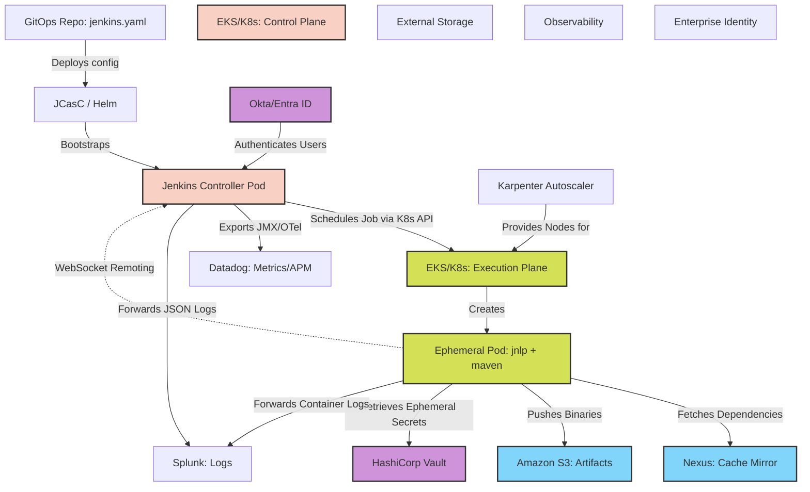

# 🏗️ Scalable CI Architecture Blueprint

## 📌 Topic Name
Project Blueprint: Architecting an Enterprise CI/CD Platform

## 🧠 Concept Explanation (Basic → Expert)
*   **Basic**: Building a Jenkins system that can handle 1,000 developers without crashing or slowing down.
*   **Expert**: Designing an enterprise Jenkins architecture requires synthesizing all distributed systems, JVM, and networking concepts. The goal is to build a platform with a **Zero-Touch Control Plane** (Stateless, GitOps driven), an **Elastic Execution Plane** (Kubernetes/Auto Scaling), and **Decoupled Telemetry** (SIEM/S3). A Staff engineer focuses on mitigating the inherent limitations of the Jenkins Monolith (Filesystem locking, JVM Heap, Remoting overhead) by offloading state and pushing compute to the edge.

## 🏗️ Mental Model
Think of this as designing a **Global Airport System**.
- **Control Tower (Jenkins Controller)**: Must be highly available. It only manages traffic; it does not carry passengers. (Executors = 0).
- **Runways (Kubernetes Agents)**: Built dynamically when planes arrive. Destroyed when planes leave. (Ephemeral, Autoscaling).
- **Luggage Storage (S3 / Artifactory)**: Never stored in the control tower. Placed in infinite external warehouses.
- **Radar & Logs (Datadog / Splunk)**: Telemetry is streamed to an external facility, ensuring the control tower isn't bogged down analyzing data.

## ⚡ Architecture Diagram

## 🔬 Component Deep Dive

### 1. The Control Plane (Stateless Controller)
*   **Deployment**: Hosted in a dedicated Management VPC on EKS. Deployed via Helm.
*   **State**: Uses **JCasC** for configuration. Uses **Job DSL** to auto-discover Multibranch pipelines via GitHub Organization Folders.
*   **Storage**: Uses an AWS EBS volume (ReadWriteOnce) for `$JENKINS_HOME` to hold `program.dat` state. Backed up via EBS Snapshots.
*   **Scaling**: Strictly **1 Replica**. Highly Available via K8s Deployment `Recreate` strategy.

### 2. The Execution Plane (Ephemeral Agents)
*   **Deployment**: Hosted in separate Execution VPCs (or Namespaces) using the Kubernetes Plugin.
*   **Agents**: 100% ephemeral K8s Pods. Zero static VMs.
*   **Containers**: PodTemplates use **Multi-container** architecture. `jnlp` for remoting, custom sidecars (e.g., `golang`, `node`) for execution. Rootless execution (Kaniko) for Docker builds.
*   **Autoscaling**: Uses **AWS Karpenter** for sub-60-second Node provisioning, utilizing Spot Instances for 80% cost savings.

### 3. Decoupled Storage & Caching
*   **Artifacts**: Native Jenkins `archiveArtifacts` is **banned**. Pipelines push binaries directly from the Agent Pod to Amazon S3 or Artifactory.
*   **Caching**: Agents utilize a local network Nexus proxy to pull Maven/NPM dependencies, avoiding public internet NAT Gateway costs and latency.
*   **Workspaces**: Ephemeral. Cleaned up immediately when the Pod is destroyed. No workspace persistence across builds.

### 4. Telemetry and Forensics
*   **Logs**: The Logstash Plugin intercepts all pipeline output and ships JSON payloads to Splunk. Local Jenkins disk logging is rotated aggressively.
*   **Metrics**: Dropwizard Metrics plugin exposes JMX data (Heap, Queue Depth) to a Prometheus sidecar, alerting via Datadog.
*   **APM**: OpenTelemetry Plugin traces pipeline execution paths, enabling engineers to visualize step-level latency.

### 5. Security and Identity
*   **AuthN**: Jenkins UI relies exclusively on **OIDC/SAML** via Azure AD or Okta. No local users.
*   **AuthZ**: Folder-level Matrix Authorization mapping OIDC groups to specific Jenkins folders.
*   **Secrets**: Jenkins XML credentials are **banned**. Agents assume AWS IAM Roles (IRSA) to retrieve deployment secrets dynamically from AWS Secrets Manager or HashiCorp Vault.

## 💥 Implementation Failure Modes
1.  **Network Bandwidth Saturation**: Putting the Controller in AWS `us-east-1` but spawning Kubernetes Agents in Azure `west-europe`. The cross-cloud Remoting traffic will be agonizingly slow and cost thousands of dollars in egress fees. **Rule**: Colocate the Controller and Agents.
2.  **Controller OOM**: Failing to decouple artifacts. If an engineer circumvents S3 and tries to `stash` a 5GB Docker tarball, the Controller's JVM Heap will instantly explode.
3.  **Karpenter Thrashing**: If Jenkins scales down Pods instantly after a build, Karpenter will terminate the EC2 node. If a new build arrives 10 seconds later, the node must boot again. **Rule**: Utilize K8s "Pause Pods" to maintain a warm pool of compute.

## ⚖️ Architectural Trade-offs
*   **Complexity vs Stability**: This architecture requires deep knowledge of Kubernetes, Helm, AWS IAM, and OpenTelemetry. It is vastly more complex than clicking `java -jar jenkins.war` on an EC2 instance. However, it is the *only* way Jenkins can scale past a few hundred developers without daily outages.

## 💼 Implementation Path
1.  **Phase 1**: Migrate all Jobs from Freestyle to Declarative Pipelines (Jenkinsfiles).
2.  **Phase 2**: Stand up K8s Controller. Migrate Agent compute to K8s Pods.
3.  **Phase 3**: Ban native artifacts. Reroute all storage to S3/Artifactory.
4.  **Phase 4**: Extract configuration into JCasC. Destroy the old Controller.
