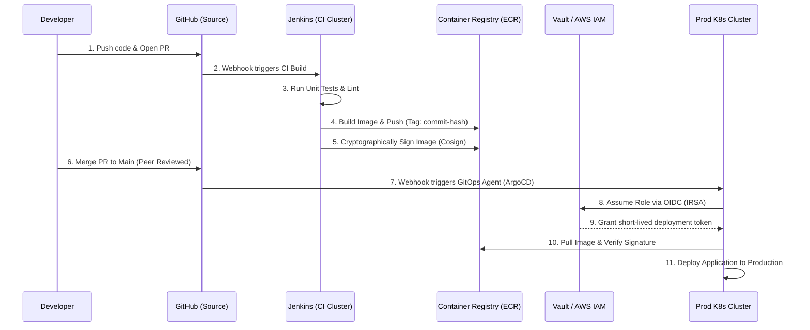

# 🛡️ Zero-Trust Deployment Pipeline

## 📌 Topic Name
Project Blueprint: Designing a Zero-Trust, Highly Secure CD Pipeline

## 🧠 Concept Explanation (Basic → Expert)
*   **Basic**: Building a pipeline that deploys to Production without giving Jenkins the master password to Production.
*   **Expert**: Traditional CI/CD architectures often grant the Jenkins Controller permanent, highly privileged credentials (e.g., AWS AdministratorAccess). If the Controller is compromised via an RCE vulnerability or a malicious pull request, the attacker owns the production environment. A Staff engineer designs a **Zero-Trust Continuous Deployment (CD) Pipeline**. This involves removing all secrets from the Controller, enforcing **Workload Identity Federation**, separating CI from CD environments, and implementing **Cryptographic Provenance** (Signing) to guarantee that only trusted code reaches production.

## 🏗️ Mental Model
Think of Zero-Trust CD as an **Armored Bank Transport**.
- **The Old Way**: You give the delivery driver (Jenkins) the master key to the bank vault. If the driver is kidnapped, the bank is robbed.
- **Zero-Trust Way**: The driver has no keys. They drive the truck to the bank. A security guard inside the bank verifies the driver's biometric ID (Workload Identity) and checks the seal on the money bags (Cryptographic Signature). If everything matches, the guard opens the door for exactly 5 minutes.

## ⚡ Architecture Diagram

## 🔬 Component Deep Dive

### 1. Separation of CI and CD
*   **Continuous Integration (Jenkins)**: Handles the "Wild West" of code. It pulls untrusted code from PRs, compiles it, and runs tests. It has **NO access** to production. It only has permissions to push images to a specific ECR repository.
*   **Continuous Deployment (GitOps/ArgoCD)**: Jenkins DOES NOT DEPLOY TO PROD. Jenkins pushes the artifact, then updates a Git repository with the new image tag. An agent sitting *inside* the secure production network (e.g., ArgoCD) detects the Git change and pulls the artifact inward. 

### 2. Eliminating Stored Secrets (Workload Identity)
*   If Jenkins *must* execute the deployment (e.g., running Terraform), it uses **AWS IRSA (IAM Roles for Service Accounts)**.
*   The Jenkins Agent runs as a Kubernetes Pod. The Pod requests an OIDC token from the K8s API.
*   The Pod exchanges this token with AWS STS for a temporary, 15-minute AWS Access Key.
*   **Result**: There are zero AWS keys stored in the Jenkins XML, no credentials in the UI, and if the Jenkins Controller is breached, no permanent keys are exposed.

### 3. Supply Chain Security (Cryptographic Provenance)
*   **The Threat**: An attacker compromises the Docker Registry and swaps out the legitimate application image with a malware-infected image possessing the same tag.
*   **The Defense**: During the CI phase, Jenkins uses a tool like **Sigstore Cosign** to cryptographically sign the Docker image digest. 
*   Before the CD phase deploys the container, the Kubernetes Admission Controller (e.g., Kyverno or OPA Gatekeeper) verifies the signature. If it doesn't match the Jenkins CI private key, the deployment is violently rejected.

### 4. Human-in-the-Loop & Auditability
*   The CD phase requires a formal, peer-reviewed Pull Request against the Infrastructure Git repository.
*   "Job/Configure" rights in Jenkins are disabled globally.
*   All executions are logged via the Audit Trail Plugin and forwarded to Splunk, satisfying SOC2 compliance.

## 💥 Implementation Failure Modes
1.  **The Over-Privileged CI Agent**: The team uses IRSA, but attaches `AdministratorAccess` to the Agent's IAM Role. A developer opens a PR with a `Jenkinsfile` that runs `aws iam create-user`. Jenkins executes the untrusted PR code using the privileged role, compromising the AWS account. **Rule**: CI roles must be heavily restricted (e.g., `s3:PutObject` only).
2.  **Shared Workspaces**: A pipeline runs `terraform plan` (requires read access) and then `terraform apply` (requires write access). If they run in the same workspace, a malicious test script could alter the terraform plan file before it is applied. **Rule**: Isolate stages and use cryptographically verifiable artifacts.
3.  **The Reverse Shell**: A developer writes a script that opens a reverse shell from the Jenkins Agent out to the internet. Because the Agent is running inside the corporate VPC, the attacker can pivot to internal databases. **Rule**: Jenkins Agents must run in isolated subnets with strict outbound Egress filtering (e.g., NAT Gateway firewalls blocking all traffic except AWS APIs and GitHub).

## ⚖️ Architectural Trade-offs
*   **Velocity vs Security**: Decoupling CI (Jenkins) from CD (ArgoCD) adds complexity. A developer can no longer click one button in Jenkins to push code directly to production. They must push code, wait for CI, then open a second PR to update the deployment manifest. This slows down ad-hoc deployments but provides mathematical certainty against supply chain attacks.

## 💼 Implementation Path
1.  **Audit**: Identify all permanent AWS Access Keys and passwords stored in Jenkins Credentials Manager.
2.  **Identity**: Migrate Jenkins Agents to EKS and implement IRSA/OIDC for cloud authentication. Delete the static keys.
3.  **Decouple**: Remove deployment scripts (`kubectl apply`, `helm upgrade`) from Jenkinsfiles. Replace them with scripts that update image tags in a Git repository.
4.  **Sign**: Introduce Cosign into the Jenkins pipeline to sign artifacts post-build.
5.  **Enforce**: Deploy a Kubernetes Admission Controller in Production to block unsigned images.
