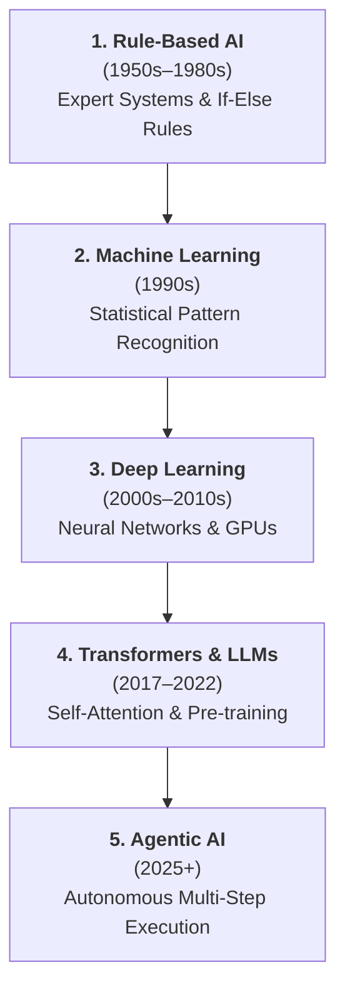
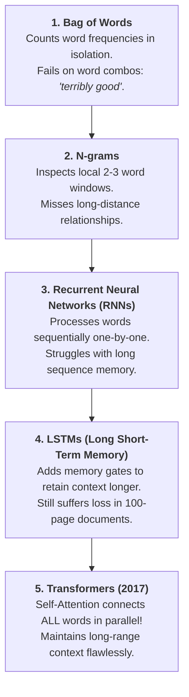

# 🤖 The Evolution of AI

> **Episode 02** | *Trace the lecture's journey from the question “Can machines think?” through rule-based systems, machine learning, deep learning, transformers, generative AI, ChatGPT, and today's agentic systems.*

---

## 📌 In This Episode

```text
01 What counts as artificial intelligence?
02 Turing, the imitation game, and the naming of AI
03 From rules to machine learning and deep learning
04 Computer vision and the language problem
05 Transformers, LLMs, and generative AI
06 The ChatGPT moment and agentic AI
07 Milestones, predictions, and the course ahead
```

---

## 🏛️ Why Begin with History?

AI is not an overnight miracle or an isolated invention—it is a **70-year evolution** driven by researchers solving one technical bottleneck after another.

To see why AI dominates the modern world, look at the **Top 10 Largest Companies in the World by Market Capitalization**:
* **9 out of 10** are tech giants investing billions into AI: **NVIDIA, Apple, Alphabet (Google), Microsoft, Amazon, Meta, Broadcom, Tesla, and Taiwan Semiconductor (TSMC)**.
* *(The only non-tech company in the top 10 is Saudi Aramco, the oil giant).*



> [!NOTE]
> **Why Understanding History Matters:**  
> When you know the historical roots, every modern concept becomes intuitive. You realize that modern architectures like Transformers, RLHF, and Agents are not random magic—they are logical solutions to earlier system failures.

---

## 🧠 What is Artificial Intelligence?

Rather than starting with an intimidating mathematical definition, the instructor introduces AI through everyday tasks:
* Driving a car requires split-second navigation decisions.
* Recommending a movie requires analyzing user taste.
* Writing a poem requires creativity and vocabulary.
* Generating a fictional selfie requires visual synthesis.

> **Working Definition from the Lecture:**  
> **Artificial Intelligence** is the science and engineering of making machines perform tasks that normally require human intelligence.

```
┌────────────────────────────────────────────────────────────────────────┐
│                   THE 6-TASK TEST: DOES THIS COUNT AS AI?              │
├──────────────────────────────────┬─────────────────────────────────────┤
│ 1. Playing Master-Level Chess    │ ✅ YES (Strategic decision-making)  │
│ 2. Detecting Email Spam          │ ✅ YES (Pattern recognition)        │
│ 3. Recommending Movies on Netflix│ ✅ YES (Preference modeling)        │
│ 4. Driving an Autonomous Car     │ ✅ YES (Real-time visual decisions) │
│ 5. Writing a Poem or Story       │ ✅ YES (Creative text generation)   │
│ 6. Generating a Fictional Selfie │ ✅ YES (Multimodal image synthesis) │
│    with Ronaldo, Messi, or Dhoni │                                     │
└──────────────────────────────────┴─────────────────────────────────────┘
```

---

## ♟️ "Can Machines Think?" (Alan Turing & The Imitation Game, 1950)

Around 1950, computers were already recognized as valuable calculators for fast arithmetic. But British mathematician **Alan Turing** asked a radically new question:

$$\mathbf{\text{"Can machines think?"}}$$

Because the internal concept of "thinking" or "consciousness" cannot be directly seen or measured, Turing proposed a practical, observable behavioral test called **The Imitation Game (The Turing Test)**:

```
                  ┌─────────────────────────────────────────┐
                  │          Human Judge / Evaluator        │
                  └────────────────────┬────────────────────┘
                                       │ (Text Messages Only)
                        ┌──────────────┴──────────────┐
                        ▼                             ▼
             ┌─────────────────────┐       ┌─────────────────────┐
             │     Hidden Room     │       │     Hidden Room     │
             │      Human (A)      │       │     Machine (B)     │
             └─────────────────────┘       └─────────────────────┘
```

### The 5-Step Setup of the Turing Test:
1. Place a **Human** in one hidden room (Room A).
2. Place a **Machine (Computer)** in a second hidden room (Room B).
3. A **Human Judge** sits in a third room and communicates with both strictly through text messages.
4. The judge asks questions on any topic—math, love, weather, poetry, jokes, or philosophy.
5. The judge tries to determine which participant is the human and which is the machine.

> **The Passing Criterion:**  
> If the judge **cannot reliably distinguish** the machine from the human based on the written responses, the machine passes the test!

---

## 🏷️ How the Field Got Its Name & The AI Winter Cycles

* **Dartmouth Conference (1955/1956):** American computer scientist and mathematician **John McCarthy** coined the term **"Artificial Intelligence"**.
* **The Dartmouth Hypothesis:** Researchers gathered around the bold belief that *every aspect of learning or intelligence could, in principle, be described so precisely that a machine could be built to simulate it.*

Progress in AI did not follow a smooth upward line. Instead, it experienced repeated **Hype Cycles and AI Winters**:

```
  1. Excitement & Huge Promises (Hype Peak!)
             /\
            /  \  2. Unrealistic Expectations Fail to Materialize
           /    \
          /      ▼
  New Tech       3. AI WINTER (Funding cut, skepticism, research slows)
  Breakthrough    \
                   \──► 4. New Paradigm Discovered! (Cycle repeats)
```

* **AI Winter:** A prolonged period of reduced funding, public skepticism, and slowed research momentum following unmet over-promises.

---

## ⚖️ Artificial Intelligence vs. Synthetic Intelligence (John Haugeland, 1986)

In 1986, philosopher **John Haugeland** raised a famous debate over the naming of the field:

```
┌──────────────────────────────────────┬─────────────────────────────────┐
│ Artificial Intelligence              │ Synthetic Intelligence          │
├──────────────────────────────────────┼─────────────────────────────────┤
│ • In common language, "artificial"   │ • "Synthetic" means genuine     │
│   often implies fake or simulated    │   intellect created through     │
│   (like artificial flowers or hair). │   non-biological means (like a  │
│ • Decisions arise strictly from      │   synthetic diamond—which is a  │
│   human-programmed algorithms.       │   real diamond, not fake glass).│
└──────────────────────────────────────┴─────────────────────────────────┘
```

> **The Pragmatic User Perspective:**  
> When an AI system writes a complete web application, debugs complex code, or diagnoses a medical scan, the user does not care whether the machine has biological consciousness. **Users care about capability, reliability, and results.**

---

## 🏆 Deep Blue: When Intelligence Became Visible (1997)

In 1997, IBM's supercomputer **Deep Blue** defeated World Chess Champion **Garry Kasparov**—one of the greatest chess players in human history.

```
  Current Chess Board ──► Evaluates 200,000,000 positions / second ──► Selects Best Move
```

* **Was Deep Blue "thinking"?** No. It had no human intuition, feelings, or learning.
* **How it worked:** It won through massive brute-force mathematical move evaluation using **tree search algorithms (Minimax and Alpha-Beta pruning)**.
* **Why it mattered:** Chess had long been considered a pinnacle of human intellect. Deep Blue made machine intelligence publicly visible and competitive with top human experts.

---

## 📜 Era 1: Rule-Based AI & Expert Systems (1950s–1980s)

For decades, AI systems were built as massive chains of human-written **`IF-THEN` rules**:

```text
Example 1: Spam Filter
IF email contains "free"    ──► Mark as SPAM
IF email contains "$$$"     ──► Mark as SPAM
IF email contains "lottery" ──► Mark as SPAM

Example 2: Medical Expert System (MYCIN)
IF patient has fever AND sore throat AND body ache ──► Suggest: "Flu / Common Cold"
```

* **Expert Systems:** Programs designed to reproduce the decisions of human domain experts (e.g., doctors writing medical symptom rules).

```
┌────────────────────────────────────────────────────────────────────────┐
│                   ⚠️ WHY RULE-BASED SYSTEMS FAILED                     │
├────────────────────────────────────────────────────────────────────────┤
│ 1. Combinatorial Explosion: The real world has too many edge cases to  │
│    manually write rules for everything.                                │
│ 2. Extreme Brittleness: Spammers bypass rules simply by writing        │
│    "f-r-e-e", "F.R.E.E", or "freee". Rigid rules break instantly!      │
│ 3. Inability to Learn: The system cannot adapt on its own.             │
└────────────────────────────────────────────────────────────────────────┘
```

---

## 📊 Era 2: Machine Learning (1990s)

Instead of human programmers writing every rule, **Machine Learning (ML)** flipped the programming paradigm:

```
  Traditional Programming : [ Data ]  +  [ Hand-Coded Rules ] ──► [ Output ]
  
  Machine Learning        : [ Data ]  +  [ Labeled Outputs ]  ──► [ Learned Model / Rules ]
```

### The Cat-versus-Dog Example:
1. Collect a dataset of **1,000,000 cat and dog images**.
2. Label each image as `"cat"` or `"dog"`.
3. Train an ML model on these examples.
4. Give the trained model a brand-new image.
5. The model outputs a probability prediction (e.g., *"Cat: 85%"*).

```
  [1,000,000 Labeled Images] ──► [ML Algorithm] ──► Model ──► New Photo ──► "Cat" (85%)
```

### The Manual Feature Engineering Bottleneck:
In traditional ML, humans still had to manually define what features the algorithm should inspect:
* A human engineer had to write code to detect whiskers, snout length, ear sharpness ratio, or color histograms (e.g., measuring an elephant's trunk or a camel's hump).

---

## 🧠 Era 3: Deep Learning (2000s–2010s)

Inspired by interconnected biological neurons in the human brain, **Deep Learning (DL)** uses multi-layered artificial neural networks.

Instead of humans hand-engineering features, deep neural networks discover features **automatically from raw unstructured data**:

```
  Raw Pixels ──► [Layer 1: Edges & Lines] ──► [Layer 2: Shapes & Ears] ──► [Layer 3: Animal Face] ──► "Cat"
```

```
┌────────────────────────────────────────────────────────────────────────┐
│                   3 FORCES THAT UNLOCKED DEEP LEARNING                 │
├───────────────────┬───────────────────┬────────────────────────────────┤
│ 1. Massive Compute│   2. Big Data     │     3. Real-World Use Cases    │
│ The GPU revolution│ The rapid growth  │ Face unlock, speech-to-text,   │
│ (NVIDIA) enabled  │ of the internet   │ autonomous vehicles, and       │
│ fast matrix math. │ supplied massive  │ automated medical diagnostics  │
│                   │ training datasets.│ attracted huge investments.    │
└───────────────────┴───────────────────┴────────────────────────────────┘
```

### Classical Machine Learning vs. Deep Learning Compared:

| Feature / Dimension | Classical Machine Learning | Deep Learning |
| :--- | :--- | :--- |
| **Dataset Size** | Works well on smaller, tabular datasets | Requires massive amounts of unstructured data |
| **Compute Needs** | Low; runs easily on standard CPUs | High; requires GPU/TPU parallel clusters |
| **Input Format** | Structured tables, Excel sheets | Unstructured images, audio, video, raw text |
| **Feature Extraction** | **Manual** (Handcrafted by human engineers) | **Automatic** (Learned internally by neural layers) |

---

## 👁️ Computer Vision: When Machines Could "See"

* **The AlexNet Breakthrough (2012):** Alex Krizhevsky, Ilya Sutskever, and Geoffrey Hinton trained a deep Convolutional Neural Network (AlexNet) on the **ImageNet** dataset, dramatically reducing visual classification error rates and kicking off the modern deep learning boom.
* **Real-World Applications:**
  * **Facial Recognition & Device Unlock:** Instant photo tagging and biometric security.
  * **Autonomous Vehicles:** Identifying pedestrians, lane markings, trucks, and road signs.
  * **Medical Diagnostics:** Scanning X-rays for bone fractures, identifying tumors in MRIs, and analyzing ultrasound reports.
  * **Visual Shopping:** Identifying products from camera photos.

> **"Machines could see":** For the first time, a machine could receive a raw image and identify the objects, people, sky, mountains, and animals inside it.

---

## 🗣️ Why Natural Language Was So Difficult for Computers

While computer vision progressed rapidly, **Natural Language Processing (NLP)** proved much harder because human language is packed with **ambiguity, idioms, and context-dependent meanings**:

```
┌────────────────────────────────────────────────────────────────────────┐
│                      AMBIGUITY IN HUMAN LANGUAGE                       │
├──────────────────────────────────┬─────────────────────────────────────┤
│ "I saw a man with a telescope."  │ Did I use a telescope to see him,   │
│                                  │ or was the man holding a telescope? │
├──────────────────────────────────┼─────────────────────────────────────┤
│ "The chicken is ready to eat."   │ Is the cooked meal ready to be      │
│                                  │ eaten, or is a live chicken hungry? │
├──────────────────────────────────┼─────────────────────────────────────┤
│ "River bank" vs "Bank of India"  │ Same word "bank" = land vs money!   │
│                                  │ A machine could wrongly parse       │
│                                  │ "River" as a financial bank!        │
└──────────────────────────────────┴─────────────────────────────────────┘
```

### The Evolution of NLP Techniques:



* **The Akshay & Aman Example:** If a story introduces Akshay and Aman, and paragraphs later says *"he scored very well"*, the system needs long-range context to resolve which person *"he"* refers to.

---

## ⚡ Transformers: Attention Changes Everything (2017)

In 2017, a team of 8 researchers at Google published the historic paper **"Attention Is All You Need"**, introducing the **Transformer** architecture.

### The Self-Attention Mechanism:
Instead of reading words sequentially from left to right like RNNs, the Transformer processes all words simultaneously and calculates **attention weights** between them:

```text
"The lion did not cross the river because it cannot swim."
                                           │
                                           └──► Attention directly links "it" to "lion"!
```

* If the sentence instead read *"The lion did not cross the river because it was too wide"*, attention would link *"it"* to *"river"*.

---

## 🏗️ What Makes a Large Language Model (LLM) Possible?

> **The LLM Formula:**  
> $$\mathbf{\text{LLM}} = \text{Transformer Architecture} + \text{Trillions of Web Tokens} + \text{Massive GPU Compute}$$

```
┌────────────────────────────────────────────────────────────────────────┐
│                        THE 3 INGREDIENTS OF AN LLM                     │
├────────────────────────┬───────────────────────────────────────────────┤
│ 1. Transformer Model   │ Provides the parallel attention architecture  │
│ 2. Massive Web Data    │ Supplies trillions of linguistic patterns     │
│ 3. GPU Compute Clusters│ Supplies the massive matrix math power        │
└────────────────────────┴───────────────────────────────────────────────┘
```

* **The Global Compute Divide:** Because training frontier models costs tens of millions of dollars in electricity and GPUs, base model training is concentrated in well-funded organizations and nations (e.g., OpenAI, Google, Anthropic, Meta, xAI in the US), while developers worldwide build applications on top of them.

---

## 🎨 Generative AI: From Deciding to Creating

```
┌────────────────────────────────┬────────────────────────────────┐
│      Earlier AI (Deciding)     │    Generative AI (Creating)    │
├────────────────────────────────┼────────────────────────────────┤
│ • Classify image as Cat or Dog │ • Generate a brand-new image   │
│ • Predict Spam vs. Not Spam    │ • Write an original story/code │
│ • Recommend a movie to watch   │ • Synthesize realistic video   │
└────────────────────────────────┴────────────────────────────────┘
```

* **The Core Word is "Generate":** The model does not just pick a label; it synthesizes a completely new sequence of text, code, audio, or pixels.
* **Multimodal AI:** A single system that works across text, audio, images, video, and documents simultaneously (e.g., generating a fictional selfie of yourself with Cristiano Ronaldo, Lionel Messi, Sachin Tendulkar, or MS Dhoni).

---

## 🚀 November 2022: The ChatGPT Moment

```text
2017 (Transformer Paper) ──► 2018–2022 (Lab Research & Scaling) ──► Nov 2022 (ChatGPT Public Release)
                                                                            │
                                                                            ▼
             Over 100 Million users in 2 months ──► Frontier Race: Gemini, Claude, Grok, LLaMA!
```

ChatGPT made AI instantly usable for non-technical people through a simple chat interface.
* **Conversational Context:** ChatGPT could remember earlier turns in the conversation (e.g., remembering that the user is a software engineer when giving subsequent coding answers).
* Models were pre-trained on massive public internet data scraped across the web.

---

## 🤖 From a Responder to an Agent (Agentic AI)

Modern AI systems are **multilingual** (English, Hindi, Marathi, Gujarati, Konkani, Tamil, Arabic, French, Italian, Chinese) and **multimodal**.

The major evolutionary shift is moving from **passive answering** to **active execution (Agentic AI)**:

```
  Traditional Chatbot (Passive Answering)       Autonomous AI Agent (Active Doing)
  ┌───────────────────────────────────────┐     ┌───────────────────────────────────────┐
  │ • User asks a question                │     │ • User assigns an end goal            │
  │ • Model generates text response       │ ──► │ • Agent plans multi-step strategy     │
  │ • Generation stops and waits          │     │ • Agent calls APIs & search tools     │
  │                                       │     │ • Agent writes, runs & debugs code    │
  │                                       │     │ • Agent builds, tests & deploys apps  │
  └───────────────────────────────────────┘     └───────────────────────────────────────┘
```

---

## 🎯 AlphaGo and Move 37 (2016)

In 2016, Google DeepMind's **AlphaGo** defeated World Go Champion **Lee Sedol** 4–1.
* **Go Complexity:** The board game Go has more possible positions ($10^{170}$) than atoms in the observable universe.
* **Move 37 in Match 2:** AlphaGo played an unprecedented stone placement on the 5th line that human experts initially dismissed as a blunder. It turned out to be an extraordinary, creative move that won the game—demonstrating that reinforcement learning self-play can discover strategies beyond human grandmaster knowledge.

---

## 🔮 What May Come Next? (The Instructor's Outlook)

1. **Personal & Legacy Agents:** AI avatars created from personal chat and video histories (e.g., an "Akshay Saini Agent" speaking in his teaching style, or legacy digital personas of family members).
2. **Everyday Routine Delegation:** Autonomous agents handling taxes, booking flights, ordering groceries, and drafting personalized email/WhatsApp replies.
3. **Long & Photorealistic Video Generation:** Progressing from short 8-second clips to full-length films and simulations.
4. **Multi-Agent Orchestration:** Specialized AI agent teams collaborating like a software company:
   $$\text{Product Manager Agent} \longrightarrow \text{Developer Agent} \longrightarrow \text{Designer Agent} \longrightarrow \text{QA Tester Agent} \longrightarrow \text{DevOps Agent}$$
5. **Humanoid Robotics:** Rapidly advancing physical coordination (e.g., coordinated dancing humanoid robots at the Chinese Spring Festival Gala).

---

## 📚 What This Course Covers

* ✅ **Deep Focus:** How LLMs and ChatGPT work, Transformer architecture, the *"Attention Is All You Need"* paper, Post-Training (SFT & RLHF), Reasoning models, RAG (Retrieval-Augmented Generation), Tool use, and building Agentic AI applications.
* ❌ **Not Covered:** Dense classical statistics, heavy mathematical proofs, and legacy machine learning algorithms.

---

## 📝 Chapter Summary

Artificial Intelligence began in 1950 with Alan Turing's question *"Can machines think?"* and John McCarthy coining the term at Dartmouth in 1956. Rule-based systems failed due to real-world edge cases (`f-r-e-e`), leading to Machine Learning (learning from labeled data) and Deep Learning (automatic feature discovery enabled by GPUs, big data, and real-world applications).

Natural language processing struggled with ambiguity (`telescope`, `chicken`, `bank`) across Bag of Words, N-grams, RNNs, and LSTMs until the 2017 Transformer architecture introduced Self-Attention. Combining Transformers with massive datasets and GPU compute created Large Language Models (LLMs). The release of ChatGPT in 2022 launched the Generative AI era, which is now advancing into autonomous Agentic AI systems.

---

## 🔥 Key Takeaways

* **AI Definition:** Making machines perform tasks that require human intelligence.
* **Turing Test:** Passes if a human judge cannot distinguish machine text from human text.
* **The Evolution:** Handcrafted Rules $\rightarrow$ Machine Learning $\rightarrow$ Deep Learning $\rightarrow$ Transformers $\rightarrow$ Autonomous Agents.
* **Feature Discovery:** Traditional ML requires manual human feature engineering; Deep Learning learns features automatically.
* **Attention Mechanism:** Solved language ambiguity by connecting words across full context in parallel.
* **LLM Recipe:** $\text{Transformer Architecture} + \text{Trillions of Tokens} + \text{Massive GPU Compute}$.
* **Generative to Agentic:** Transitioning from generating text responses to autonomous planning, tool execution, and deployment.

---

Previous : — | Index: [00_index.md](../00_index.md) | Next: [02. Does ChatGPT Know or Does It Guess](./02_Does_ChatGPT_Know_or_Does_It_Guess.md)
