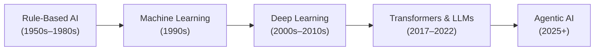
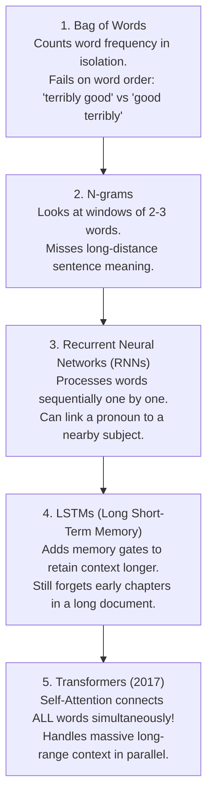

# 🤖 The Evolution of AI

> **Episode 02** | *Trace the journey from the question "Can machines think?" through rule-based systems, machine learning, deep learning, transformers, generative AI, ChatGPT, and today's agentic systems.*

---

## 📌 In This Episode

```text
01 What counts as artificial intelligence?
02 Turing, the imitation game, and the naming of AI
03 From rules to machine learning and deep learning
04 Computer vision and the language problem
05 Transformers, LLMs, and generative AI
06 The ChatGPT moment and agentic AI
07 Milestones, predictions, and the course ahead
```

---

## 🏛️ Why Begin with History?

AI is not an overnight invention—it is the result of a **70-year journey** of solving one bottleneck after another.

Look at the **Top 10 Largest Companies in the World by Market Cap** today:
* **9 out of 10** are tech giants investing heavily in AI: NVIDIA, Apple, Microsoft, Alphabet (Google), Amazon, Meta, Broadcom, Tesla, TSMC.
* *(The only non-tech exception is Saudi Aramco).*



> [!NOTE]
> **Why Understanding History Matters:**  
> Every new breakthrough in AI was created to fix a specific flaw in the previous system. When you understand the flaw, the new architecture becomes intuitive and easy to understand.

---

## 🧠 What is Artificial Intelligence?

> **Simple Definition:**  
> **Artificial Intelligence (AI)** is the science and engineering of making machines perform tasks that normally require human intelligence (such as recognizing patterns, making decisions, learning from experience, and understanding language).

```
┌────────────────────────────────────────────────────────────────────────┐
│                   THE 6-TASK TEST: DOES THIS COUNT AS AI?              │
├──────────────────────────────────┬─────────────────────────────────────┤
│ 1. Playing Master-Level Chess    │ ✅ YES (Strategic decision-making)  │
│ 2. Filtering Email Spam          │ ✅ YES (Pattern recognition)        │
│ 3. Recommending Movies on Netflix│ ✅ YES (User preference modeling)   │
│ 4. Driving an Autonomous Car     │ ✅ YES (Real-time visual decisions) │
│ 5. Writing a Poem or Story       │ ✅ YES (Creative text generation)   │
│ 6. Generating a Fictional Selfie │ ✅ YES (Multimodal synthesis)       │
└──────────────────────────────────┴─────────────────────────────────────┘
```

---

## ♟️ "Can Machines Think?" (The Turing Test, 1950)

In 1950, British mathematician **Alan Turing** published a landmark paper titled *"Computing Machinery and Intelligence"*. 

Instead of getting bogged down in endless philosophical debates about what "thinking" means, Turing proposed a practical, observable test called **The Imitation Game**:

```
                  ┌─────────────────────────────────────────┐
                  │          Human Judge / Evaluator        │
                  └────────────────────┬────────────────────┘
                                       │ (Text Chat Only)
                        ┌──────────────┴──────────────┐
                        ▼                             ▼
             ┌─────────────────────┐       ┌─────────────────────┐
             │     Hidden Room     │       │     Hidden Room     │
             │      Human (A)      │       │     Machine (B)     │
             └─────────────────────┘       └─────────────────────┘
```

### The 5-Step Setup:
1. Place a **Human** in Room A.
2. Place a **Machine (Computer)** in Room B.
3. A **Human Judge** in a third room communicates with both using text messages only.
4. The judge asks questions on any topic (math, poetry, feelings, daily life).
5. The judge tries to guess which respondent is the human and which is the machine.

> **The Passing Criterion:**  
> If the judge **cannot reliably distinguish** the machine's answers from the human's answers, the machine passes the test!

---

## 🏷️ How the Field Got Its Name & The AI Winters

* **Dartmouth Conference (1956):** American computer scientist **John McCarthy** coined the term **"Artificial Intelligence"**.
* **The Dartmouth Hypothesis:** Every aspect of learning or intelligence can be described so precisely that a machine can be made to simulate it.

```
  Excitement & Big Promises (Hype Peak!)
             /\
            /  \
           /    \  Unrealistic Expectations Not Met
          /      \
  New Tech        ▼
  Discovery      AI WINTER (Funding cut, skepticism, research slowdown)
                  \
                   \──► New Breakthrough Discovered! (Cycle repeats)
```

* **AI Winter:** A period of reduced funding, harsh skepticism, and stalled research caused by over-promising capabilities that early hardware and algorithms could not deliver.

---

## 💎 Artificial Intelligence vs. Synthetic Intelligence (1986)

Philosopher **John Haugeland** raised a famous question: Is AI "fake" intelligence or "real" intelligence?

```
┌──────────────────────────────────────┬─────────────────────────────────┐
│ Artificial Intelligence              │ Synthetic Intelligence          │
├──────────────────────────────────────┼─────────────────────────────────┤
│ • "Artificial" sounds fake or fake   │ • "Synthetic" means genuine,    │
│   imitation (like artificial flowers │   created through artificial    │
│   or artificial hair).               │   means (like a synthetic diamond│
│ • Focuses on copying humans.         │   which is still a real diamond)│
└──────────────────────────────────────┴─────────────────────────────────┘
```

> **The Practical Perspective:**  
> When you need working code, a medical diagnosis, or language translation, you care about the **capability and result**, not whether the intelligence originated from a biological brain or a silicon chip.

---

## 🏆 Deep Blue: When Intelligence Became Visible (1997)

In 1997, IBM's supercomputer **Deep Blue** defeated the reigning World Chess Champion, **Garry Kasparov**.

```
  Current Board State ──► Evaluates 200,000,000 positions / second ──► Plays Best Move
```

* **Was Deep Blue truly "thinking"?** No. It had no intuition, no feelings, and no learning.
* **How it worked:** Brute-force calculation using **heuristic tree search (Minimax with Alpha-Beta pruning)**. It succeeded because chess has fixed, mathematical rules and a finite board.

---

## 📜 Era 1: Rule-Based AI & Expert Systems (1950s–1980s)

Early AI systems relied on human programmers manually writing thousands of **`IF / THEN` rules**:

```text
Example 1: Spam Filter
IF email contains "free"    ──► Mark as SPAM
IF email contains "$$$"     ──► Mark as SPAM
IF email contains "lottery" ──► Mark as SPAM

Example 2: Medical Expert System (MYCIN)
IF patient has fever AND sore throat AND cough ──► Suggest: "Common Cold / Flu"
```

```
┌────────────────────────────────────────────────────────────────────────┐
│                   ⚠️ WHY RULE-BASED SYSTEMS FAILED                     │
├────────────────────────────────────────────────────────────────────────┤
│ 1. Combinatorial Explosion: The real world is too complex to write     │
│    rules for every edge case.                                          │
│ 2. Extreme Brittleness: A spammer simply writes "f-r-e-e" or "F.R.E.E" │
│    and the rigid rule immediately breaks!                              │
│ 3. Inability to Learn: The system never improves on its own.           │
└────────────────────────────────────────────────────────────────────────┘
```

---

## 📊 Era 2: Machine Learning (1990s)

Instead of hand-coding every rule, **Machine Learning (ML)** flipped the equation: feed data into an algorithm and let the machine learn patterns on its own!

```
  Traditional Programming : [ Data ]  +  [ Rules ]  ──► [ Output ]
  
  Machine Learning        : [ Data ]  +  [ Output ] ──► [ Learned Rules / Model ]
```

```
  [100,000 Cat Images] ──┐
                         ├──► [ML Algorithm] ──► Learned Model ──► New Image ──► "Cat" (92%)
  [100,000 Dog Images] ──┘
```

### The Lingering Bottleneck in Traditional ML:
* **Manual Feature Engineering:** A human expert still had to tell the computer *what features to measure* (e.g., ear sharpness ratio, whisker count, snout length, color histograms).

---

## 🧠 Era 3: Deep Learning (2000s–2010s)

Inspired by biological neurons in the human brain, **Deep Learning (DL)** uses multi-layered artificial neural networks.

Instead of humans crafting features by hand, the deep network discovers features **automatically from raw data**:

```
  Raw Pixels ──► [Layer 1: Edges & Lines] ──► [Layer 2: Shapes & Ears] ──► [Layer 3: Faces] ──► "Cat"
```

```
┌────────────────────────────────────────────────────────────────────────┐
│                   3 FORCES THAT UNLOCKED DEEP LEARNING                 │
├───────────────────┬───────────────────┬────────────────────────────────┤
│ 1. Massive Compute│   2. Big Data     │     3. Real-World Value        │
│ High-performance  │ The internet,     │ Face unlock, speech-to-text,   │
│ GPUs (NVIDIA) for │ social media, and │ autonomous vehicles, and       │
│ matrix math       │ digitized files   │ automated medical diagnostics  │
└───────────────────┴───────────────────┴────────────────────────────────┘
```

### Machine Learning vs. Deep Learning Comparison:

| Dimension | Classical Machine Learning | Deep Learning |
| :--- | :--- | :--- |
| **Data Requirements** | Works well on small/medium tabular datasets | Requires massive amounts of unstructured data |
| **Hardware** | Runs on standard CPUs | Requires powerful GPU/TPU clusters |
| **Feature Extraction** | **Manual** (Handcrafted by human engineers) | **Automatic** (Learned directly by neural layers) |
| **Best For** | Structured tables, Excel sheets, fraud rules | Images, audio, video, natural language text |

---

## 👁️ Computer Vision: When Machines Learned to "See"

* **The AlexNet Breakthrough (2012):** A deep Convolutional Neural Network (CNN) created by Alex Krizhevsky, Ilya Sutskever, and Geoffrey Hinton crushed the ImageNet competition, cutting error rates in half.
* **Real-World Impact:**
  * **Facial Recognition:** Instant device unlocking and photo tagging.
  * **Autonomous Vehicles:** Real-time pedestrian, lane, and obstacle detection.
  * **Healthcare:** Detecting bone fractures in X-rays and spotting early-stage tumors in MRI scans.

---

## 🗣️ Why Natural Language Was So Difficult for Computers

Computers are great at numbers, but human language is packed with **ambiguity, idioms, and context**:

```
┌────────────────────────────────────────────────────────────────────────┐
│                      THE AMBIGUITY OF HUMAN LANGUAGE                   │
├──────────────────────────────────┬─────────────────────────────────────┤
│ "I saw a man with a telescope."  │ Did I use a telescope to see him,   │
│                                  │ or was the man holding a telescope? │
├──────────────────────────────────┼─────────────────────────────────────┤
│ "The chicken is ready to eat."   │ Is the food cooked, or is the bird  │
│                                  │ hungry and waiting for food?        │
├──────────────────────────────────┼─────────────────────────────────────┤
│ "River bank" vs "Bank of India"  │ Same word "bank" = land vs money!   │
└──────────────────────────────────┴─────────────────────────────────────┘
```

### The Search for Better Language Models:



---

## ⚡ Transformers: Attention Changes Everything (2017)

In 2017, a team of 8 researchers at Google published the groundbreaking paper **"Attention Is All You Need"**, introducing the **Transformer** architecture.

### The Self-Attention Breakthrough:
Instead of reading words slowly one-by-one from left to right, the Transformer looks at **all words in a sequence simultaneously** and calculates how much attention every word should pay to every other word:

```text
"The lion did not cross the river because it cannot swim."
                                           │
                                           └──► Attention directly links "it" to "lion"!
```

If the sentence instead read *"The lion did not cross the river because it was too wide"*, attention would immediately link *"it"* to *"river"*.

---

## 🏗️ What Makes a Large Language Model (LLM) Possible?

> **The LLM Recipe:**  
> $$\mathbf{\text{LLM}} = \text{Transformer Architecture} + \text{Trillions of Internet Tokens} + \text{Massive GPU Compute}$$

* **The Compute Divide:** Training modern frontier models requires tens of thousands of specialized GPUs running for months, costing tens of millions of dollars.

---

## 🎨 Generative AI: From Deciding to Creating

```
┌────────────────────────────────┬────────────────────────────────┐
│      Earlier AI (Deciding)     │    Generative AI (Creating)    │
├────────────────────────────────┼────────────────────────────────┤
│ • Classify image as Cat or Dog │ • Generate a brand-new image   │
│ • Flag email as Spam / Inbox   │ • Write an original story/code │
│ • Predict customer churn rate  │ • Synthesize realistic video   │
└────────────────────────────────┴────────────────────────────────┘
```

* **Multimodal AI:** A single system that understands and generates across text, audio, images, video, and code simultaneously (e.g., generating a fictional selfie of yourself with a celebrity).

---

## 🚀 November 2022: The ChatGPT Moment

```text
2017 (Transformer Paper) ──► 2018–2022 (Lab Research & Scaling) ──► Nov 2022 (ChatGPT Launch)
                                                                            │
                                                                            ▼
                 Over 100M users in 2 months ──► Gemini, Claude, Grok, LLaMA race begins!
```

ChatGPT made AI instantly accessible to the non-technical public through a simple, intuitive conversational interface.

---

## 🤖 From a Responder to an Agent (Agentic AI)

The latest frontier moves from passive chatbots to **autonomous agents**:

```
  Traditional Chatbot (Passive Answering)       Autonomous AI Agent (Active Doing)
  ┌───────────────────────────────────────┐     ┌───────────────────────────────────────┐
  │ • User asks a question                │     │ • User assigns a high-level goal      │
  │ • Model generates text answer         │ ──► │ • Agent breaks goal into step-by-step │
  │ • Model stops and waits               │     │ • Agent calls APIs, tools, & browsers │
  │                                       │     │ • Agent writes, runs, tests & fixes   │
  └───────────────────────────────────────┘     └───────────────────────────────────────┘
```

---

## 🎯 AlphaGo and Move 37 (2016)

In 2016, DeepMind's **AlphaGo** played against world Go champion **Lee Sedol**.
* **Go Complexity:** There are more possible board configurations in Go ($10^{170}$) than atoms in the observable universe.
* **Move 37 in Game 2:** AlphaGo played a bizarre stone placement on the 5th line that human commentators initially called a mistake. It turned out to be a brilliant, creative move that changed the course of the game and proved AI could discover novel strategies beyond human teaching.

---

## 🔮 What May Come Next?

1. **Personal & Legacy Agents:** Interactive AI avatars that retain personal memories, writing styles, and family stories.
2. **Everyday Routine Automation:** Agents booking appointments, managing finances, and handling customer support end-to-end.
3. **Full-Length Video Generation:** Creating customized movies, simulations, and interactive educational content.
4. **Multi-Agent Software Teams:** Specialized AI agents collaborating (Product Manager Agent $\rightarrow$ Developer Agent $\rightarrow$ QA Tester Agent $\rightarrow$ DevOps Agent).

---

## 📝 Chapter Summary

AI began in 1950 with Alan Turing's question *"Can machines think?"* and John McCarthy coining the term at Dartmouth in 1956. Rule-based expert systems failed due to real-world complexity, leading to Machine Learning (learning from data) and Deep Learning (automatic feature discovery enabled by GPUs and big data).

Natural language progressed from Bag of Words and RNNs to the 2017 Transformer architecture. Combining Transformers with massive datasets and GPU clusters created Large Language Models (LLMs). The launch of ChatGPT in 2022 opened the Generative AI era, which is now rapidly evolving into autonomous Agentic AI systems.

---

## 🔥 Key Takeaways

* **AI Definition:** Making machines perform tasks that require human intelligence.
* **Turing Test:** Passes if a human judge cannot distinguish machine text from human text.
* **The Evolution:** Handcrafted Rules $\rightarrow$ Machine Learning $\rightarrow$ Deep Learning $\rightarrow$ Transformers $\rightarrow$ Autonomous Agents.
* **Language Difficulty:** Solved by Transformers using Self-Attention to connect words across full context in parallel.
* **LLM Formula:** $\text{Transformer Architecture} + \text{Trillions of Tokens} + \text{Massive GPU Compute}$.
* **Generative to Agentic:** Moving from passive text generation to active multi-step planning and tool execution.

---

Previous : — | Index: [00_index.md](../00_index.md) | Next: [02. Does ChatGPT Know or Does It Guess](./02_Does_ChatGPT_Know_or_Does_It_Guess.md)
