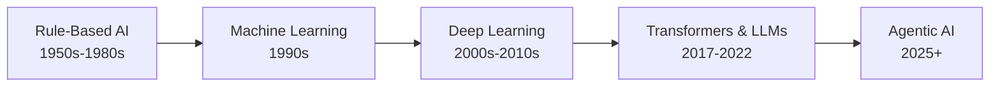
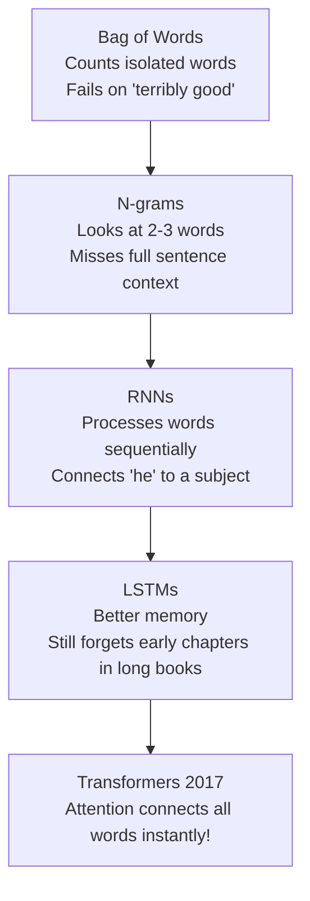

# 🤖 The Evolution of AI

> **Episode 02** | *Trace the lecture's journey from the question "Can machines think?" through rule-based systems, machine learning, deep learning, transformers, generative AI, ChatGPT, and today's agentic systems.*

---

## 📌 In This Episode

```text
01 What counts as artificial intelligence?
02 Turing, the imitation game, and the naming of AI
03 From rules to machine learning and deep learning
04 Computer vision and the language problem
05 Transformers, LLMs, and generative AI
06 The ChatGPT moment and agentic AI
07 Milestones, predictions, and the course ahead
```

---

## 🏛️ Why Begin with History?

AI is not an overnight miracle—it is a **70-year evolution**.

Look at the **Top 10 Largest Companies by Market Cap** today:
* **9 out of 10** are heavily investing in AI: NVIDIA, Apple, Alphabet (Google), Microsoft, Amazon, Meta, Broadcom, Tesla, TSMC.
* *(Saudi Aramco is the sole oil exception).*



> [!NOTE]
> **Why This Matters:** Understanding the past gives you a clear mental model. Every new model is a logical fix for a prior limitation, not random magic.

---

## 🧠 What is Artificial Intelligence?

> **Working Definition:**  
> **Artificial Intelligence** is the science of making machines perform tasks that normally require human intelligence.

```
┌────────────────────────────────────────────────────────────────────────┐
│                   THE 6-TASK TEST: DOES THIS COUNT AS AI?              │
├──────────────────────────────────┬─────────────────────────────────────┤
│ 1. Playing Master Chess          │ ✅ YES (Strategic decision-making)  │
│ 2. Detecting Email Spam          │ ✅ YES (Pattern recognition)        │
│ 3. Recommending Movies           │ ✅ YES (Preference modeling)        │
│ 4. Driving a Car                 │ ✅ YES (Real-time visual decisions) │
│ 5. Writing a Poem                │ ✅ YES (Creative text generation)   │
│ 6. Generating a Fictional Selfie │ ✅ YES (Multimodal synthesis)       │
└──────────────────────────────────┴─────────────────────────────────────┘
```

---

## ♟️ "Can Machines Think?" (The Turing Test, 1950)

Before 1950, computers were just calculators. **Alan Turing** asked: *"Can machines think?"*

To test this without getting lost in philosophy, he created **The Imitation Game**:

```
                  ┌─────────────────────────────────────────┐
                  │          Human Judge / Evaluator        │
                  └────────────────────┬────────────────────┘
                                       │ (Text Chat Only)
                        ┌──────────────┴──────────────┐
                        ▼                             ▼
             ┌─────────────────────┐       ┌─────────────────────┐
             │     Hidden Room     │       │     Hidden Room     │
             │      Human (A)      │       │     Machine (B)     │
             └─────────────────────┘       └─────────────────────┘
```

* **5 Steps:** 1) Human in Room A, 2) Machine in Room B, 3) Judge asks questions via text, 4) Judge reads replies, 5) Judge tries to spot the human.
* **Passing Rule:** If the judge **cannot distinguish** the machine from the human, the machine passes!

---

## 🏷️ A Field Gets a Name & Enters Hype Cycles

* **1955–1956:** **John McCarthy** coined the term *"Artificial Intelligence"* at the Dartmouth Workshop.
* **Dartmouth Hypothesis:** Every aspect of learning and intelligence can be described so precisely that a machine can simulate it.

```
  Excitement & Big Promises (Hype Peak!)
             /\
            /  \
           /    \  Expectations Unmet
          /      \
  New Tech        ▼
  Discovery      AI WINTER (Funding cut, skepticism, slowdown)
                  \
                   \──► New Paradigm Discovered! (Cycle repeats)
```

---

## ⚖️ Artificial Intelligence vs. Synthetic Intelligence (1986)

Philosopher **John Haugeland** debated the naming:

```
┌──────────────────────────────┬──────────────────────────────┐
│   Artificial Intelligence    │    Synthetic Intelligence    │
├──────────────────────────────┼──────────────────────────────┤
│ • Sounds "fake" or simulated │ • Genuine machine intellect  │
│   (like artificial hair)     │ • Learns & acts on its own   │
│ • Focus on imitating humans  │ • Non-biological, but REAL   │
└──────────────────────────────┴──────────────────────────────┘
```

* **The Practical View:** Users care about **results and capability** (can it write working code or diagnose scans?), not whether its brain is biological or silicon.

---

## 🏆 Deep Blue: When Intelligence Became Visible (1997)

IBM's **Deep Blue** defeated World Chess Champion **Garry Kasparov**.

```
  Board State ──► Evaluate 200,000,000 moves/sec (Brute Force Math) ──► Pick Best Move
```

* **Was it thinking?** No. It had no intuition or learning. It won through pure computational speed and mathematical evaluation trees.

---

## 📜 Rule-Based AI and Expert Systems (1950s–1980s)

Built entirely on human-written **`if/else` logic**:

```text
Example 1: Spam Detector
IF email contains "free"    -> SPAM
IF email contains "$$$"     -> SPAM
IF email contains "lottery" -> SPAM

Example 2: Medical System
IF fever + cold + body ache -> "Looks like flu"
```

> [!WARNING]
> **What Went Wrong?**  
> Rules cannot cover the infinite variations of the real world. A spammer simply writes `f-r-e-e`, and the rigid rule breaks!

---

## 📊 Machine Learning: Learn from Examples (1990s)

Instead of writing rules, **feed labeled examples** to the machine:

```
  [1,000,000 Cat Images] ──┐
                           ├──► [Train ML Model] ──► Give New Image ──► Prediction: "Cat" (90%)
  [1,000,000 Dog Images] ──┘
```

* **Limitation:** Humans still had to manually tell the model what features to look for (ear shape, whiskers, snout).

---

## 🧠 Deep Learning: Learn the Features Too (2000s–2010s)

Inspired by human brain neurons, **Deep Neural Networks** automatically discover features from raw data!

```
┌────────────────────────────────────────────────────────────────────────┐
│                   3 FORCES THAT UNLOCKED DEEP LEARNING                 │
├───────────────────┬───────────────────┬────────────────────────────────┤
│  1. More Compute  │   2. More Data    │     3. Real Applications       │
│  GPUs & parallel  │ Internet provided │ Face unlock, speech-to-text,   │
│  processing chips │ massive datasets  │ self-driving cars, translation │
└───────────────────┴───────────────────┴────────────────────────────────┘
```

### ML vs. Deep Learning Comparison:
| Feature | Machine Learning | Deep Learning |
| :--- | :--- | :--- |
| **Dataset Size** | Smaller | Massive |
| **Compute** | Low / Fast | High (GPU clusters) |
| **Input Data** | Structured tables | Unstructured (Images, Audio, Text) |
| **Feature Extraction** | Handcrafted by humans | **Learned automatically by neural network** |

---

## 👁️ Computer Vision: When Machines Could "See"

* **2012 Breakthrough:** **AlexNet** won the ImageNet competition, drastically slashing image recognition error rates.
* **Real-World Impact:**
  * Face unlock on phones
  * Self-driving car navigation
  * Medical imaging: detecting bone fractures in X-rays, tumors in scans

---

## 🗣️ Why Natural Language Was So Hard

Language is full of **ambiguity and context**:

```
┌────────────────────────────────────────────────────────────────────────┐
│                      AMBIGUITY IN HUMAN LANGUAGE                       │
├──────────────────────────────────┬─────────────────────────────────────┤
│ "I saw a man with a telescope."  │ Who has the telescope? Me or him?   │
│ "The chicken is ready to eat."   │ Is it cooked, or is it hungry?      │
│ "River bank" vs "Bank of India"  │ Same word "bank" = land vs money!   │
└──────────────────────────────────┴─────────────────────────────────────┘
```



---

## ⚡ Transformers: Attention Changes Everything (2017)

Google's paper **"Attention Is All You Need"** introduced **Self-Attention**:
* Every word looks at and connects with every other word in the sentence simultaneously.

```text
"The lion did not cross the river because it cannot swim."
                                           │
                                           └──► Attention directly connects "it" to "lion"!
```

---

## 🏗️ What Makes a Large Language Model (LLM) Possible?

> **Formula:**  
> $$\mathbf{\text{LLM}} = \text{Transformer Architecture} + \text{Trillions of Text Tokens} + \text{Massive GPU Compute}$$

* **Global Divide:** High compute costs mean only well-funded companies and nations can train frontier base models.

---

## 🎨 Generative AI: From Deciding to Creating

```
┌────────────────────────────────┬────────────────────────────────┐
│      Earlier AI (Deciding)     │    Generative AI (Creating)    │
├────────────────────────────────┼────────────────────────────────┤
│ • Classify image as Cat or Dog │ • Generate a brand-new image   │
│ • Predict Spam vs Not Spam     │ • Write a full story, code, doc│
│ • Recommend a movie            │ • Synthesize realistic video   │
└────────────────────────────────┴────────────────────────────────┘
```

* **Multimodal AI:** Works across text, audio, images, video, and documents simultaneously (e.g., generating a fictional selfie with Messi or Ronaldo).

---

## 🚀 November 2022: The ChatGPT Moment

```text
2017 (Transformers) ──► 2018-2022 (Trained in labs) ──► Nov 2022 (ChatGPT Public Release)
                                                                 │
                                                                 ▼
                         World explosive adoption ──► Gemini, Claude, Grok, LLaMA race begins!
```

---

## 🤖 From a Responder to an Agent (Agentic AI)

```
  Traditional Chatbot (Answering)           Autonomous AI Agent (Acting)
  ┌──────────────────────────────┐          ┌──────────────────────────────┐
  │ User asks a question         │          │ User assigns an end goal     │
  │ Model outputs text response  │   ──►    │ Agent plans steps            │
  │ Generation stops.            │          │ Agent calls APIs & tools     │
  │                              │          │ Agent writes, tests & deploys│
  └──────────────────────────────┘          └──────────────────────────────┘
```

---

## 🎯 AlphaGo and Move 37 (2016)

* Google DeepMind's **AlphaGo** defeated Go master **Lee Sedol** 4–1.
* **Move 37 in Game 2:** AlphaGo played a move never seen in human history that surprised all experts, proving reinforcement learning can discover strategies beyond human training.

---

## 🔮 What May Come Next?

1. **Personal & Legacy Personas:** Interactive digital agents of yourself or historical figures.
2. **Routine Automation:** AI agents booking flights, filing taxes, and ordering groceries.
3. **Realistic Long Video:** AI generating entire full-length films.
4. **Multi-Agent Teams:** Specialized AI teams (PM agent $\rightarrow$ Dev agent $\rightarrow$ QA agent $\rightarrow$ DevOps agent).

---

## 📚 What This Course Covers

* ✅ **In Scope:** How LLMs & ChatGPT work, Transformers & Attention, RLHF & Post-training, Reasoning models, RAG, Tool use, Agentic AI, and practical projects.
* ❌ **Out of Scope:** Dense classical statistics and advanced mathematical proofs.

---

## 📝 Chapter Summary

AI began with Turing's 1950 question *"Can machines think?"* and McCarthy coining the term in 1956. Rule-based expert systems failed due to real-world complexity, giving rise to Machine Learning (learning from data) and Deep Learning (automatic feature discovery enabled by GPUs and big data). 

Natural language evolved from Bag of Words and RNNs/LSTMs to the 2017 Transformer architecture. Combining Transformers with massive web datasets and GPU compute created LLMs. ChatGPT launched the public Generative AI era in 2022, which is now evolving into autonomous Agentic AI systems.

---

## 🔥 Key Takeaways

* **AI Definition:** Science of making machines perform tasks requiring human intelligence.
* **Turing Test:** Passes if a human judge cannot distinguish machine responses from human responses.
* **The Evolution:** Handcrafted Rules $\rightarrow$ Machine Learning $\rightarrow$ Deep Learning $\rightarrow$ Transformers $\rightarrow$ Agents.
* **Language Difficulty:** Solved by Transformers using Self-Attention to connect words across full context.
* **LLM Formula:** $\text{Transformer} + \text{Trillions of Tokens} + \text{Large-Scale GPU Compute}$.
* **Generative to Agentic:** Moving from passive text generation to active multi-step planning and tool execution.

---

## ❓ Revision Questions & Answers

1. **How does the instructor define artificial intelligence?**  
   *Answer:* The science of making machines perform tasks that normally require human intelligence.
2. **Which six tasks does he use to test whether something counts as AI?**  
   *Answer:* Playing chess, detecting spam, recommending movies, driving an autonomous car, writing poetry, and generating fictional selfies with public figures.
3. **Why was "Can machines think?" different from asking machines to calculate faster?**  
   *Answer:* Calculating faster is following fixed arithmetic rules. "Thinking" involves judgment, perception, reasoning, and adapting to novel situations.
4. **How is the Turing test arranged, and what condition counts as passing?**  
   *Answer:* A human judge in a separate room interacts via text with a hidden human and a hidden machine. If the judge cannot distinguish the machine from the human, the machine passes.
5. **What does the lecture mean by an AI winter?**  
   *Answer:* A period of reduced funding, public skepticism, and slowed research momentum caused by over-promising and failing to meet expectations.
6. **How does the synthetic-intelligence debate differ from the usual artificial-intelligence framing?**  
   *Answer:* "Artificial" implies fake or simulated intelligence, whereas "Synthetic" describes genuine intelligence created through non-biological means.
7. **Why did Deep Blue's victory look intelligent, and why does the instructor qualify that impression?**  
   *Answer:* It defeated a world chess champion, looking intelligent, but it was actually performing brute-force mathematical move evaluations rather than human-like thought.
8. **How does a rule-based spam detector work, and why does `f-r-e-e` expose a limitation?**  
   *Answer:* It looks for exact keyword matches like `"free"`. Spammers easily bypass rules by adding hyphens (`f-r-e-e`), showing that manual rules cannot cover infinite real-world variations.
9. **What changes when a system learns from labeled examples?**  
   *Answer:* Instead of humans writing explicit rules, the machine discovers statistical patterns and relationships directly from data.
10. **What human assistance remains in the lecture's machine-learning explanation?**  
    *Answer:* Humans still had to manually define, engineer, and extract the relevant features (e.g., measuring ear shapes, whiskers).
11. **How does deep learning change feature extraction?**  
    *Answer:* Neural networks learn the features automatically from raw unstructured data without human feature engineering.
12. **Which three conditions helped deep learning expand?**  
    *Answer:* More GPU compute, massive internet datasets, and practical high-value commercial applications (face unlock, translation, self-driving).
13. **Why does the instructor describe computer vision as enabling machines to "see"?**  
    *Answer:* Because deep models could finally process raw pixel arrays and accurately recognize objects, faces, tumors, and street scenes.
14. **Give both meanings of "I saw a man with a telescope."**  
    *Answer:* 1) I used a telescope to observe a man. 2) I saw a man who was holding a telescope.
15. **Why do bag of words and n-grams fail to capture full context?**  
    *Answer:* Bag of words ignores order (failing on *"terribly good"*), and N-grams only look at immediate adjacent words, missing long-distance sentence relationships.
16. **What long-distance relationship is difficult in the RNN/LSTM examples?**  
    *Answer:* Connecting a pronoun (*"he"*) back to the correct subject introduced paragraphs or pages earlier in a long text.
17. **What does attention connect in the lion-and-river sentence?**  
    *Answer:* It connects the pronoun *"it"* directly to *"lion"*, recognizing that the lion cannot swim (rather than the river).
18. **What three ingredients does the episode identify for an LLM?**  
    *Answer:* Transformer architecture, massive web training data, and large-scale GPU compute.
19. **How does generative AI differ from classification, prediction, and recommendation?**  
    *Answer:* Classification and prediction assign labels or categories to inputs; Generative AI creates entirely new original sequences of text, code, images, or audio.
20. **What does multimodal mean here?**  
    *Answer:* The ability of a single AI model to understand and generate across multiple modalities simultaneously (text, image, audio, video, code).
21. **Why is November 2022 treated as a turning point?**  
    *Answer:* The public release of ChatGPT made conversational generative AI accessible, intuitive, and instantly useful to the general public.
22. **Which abilities make an AI system agentic in this lecture?**  
    *Answer:* Autonomous planning, multi-step reasoning, tool/API usage, code execution, and completing complex real-world workflows.
23. **What was significant about AlphaGo's Move 37 according to the instructor?**  
    *Answer:* It was an unexpected, highly creative move that human grandmasters had never played, discovered purely through reinforcement learning self-play.
24. **Which future statements are observations, and which are predictions?**  
    *Answer:* Tool use and coding assistants are current observations; legacy grandmother personas and fully automated multi-agent companies are future predictions.
25. **What topics will Namaste AI study deeply, and which subjects will remain high-level?**  
    *Answer:* Modern LLMs, Transformers, Attention, RAG, and Agentic workflows will be taught deeply; advanced classical math and legacy ML theory will remain high-level.

---

Previous : — | Index: [00_index.md](../00_index.md) | Next: [02. Does ChatGPT Know or Does It Guess](./02_Does_ChatGPT_Know_or_Does_It_Guess.md)
