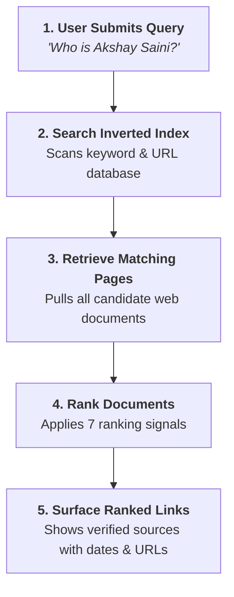
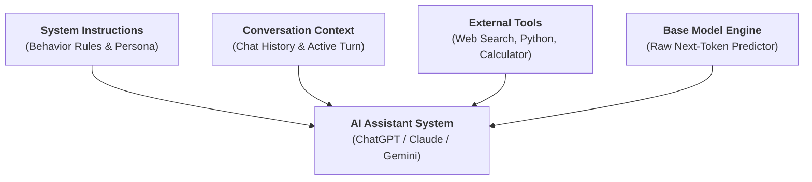
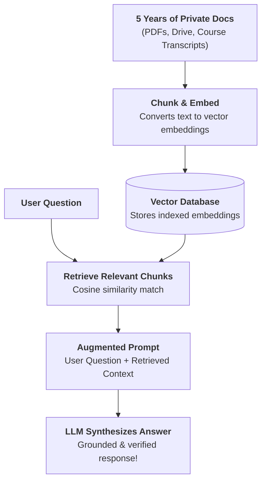

# 🤖 Does ChatGPT Know or Does It Guess?

> **Episode 03** | *Compare search-engine retrieval with language-model generation, then build a practical mental model of probabilities, training, base models, assistants, hallucination, tools, RAG, and apparent self-knowledge.*

---

## 📌 In This Episode

```text
01 Search results versus generated answers
02 Indexes, crawlers, ranking, and source trails
03 Next-token prediction and probability
04 Training, parameters, and knowledge cutoffs
05 Base models, assistants, and inference
06 Hallucination and the confidence illusion
07 Tools, retrieval, RAG, and model self-description
```

---

## ❓ The Question Behind Every Answer

When ChatGPT generates a smooth, well-structured answer to your question, where did it actually come from?
* Did it fetch a row from a giant database?
* Did it run a live Google web search behind the scenes?
* Did it retrieve an exact document saved in memory?
* Does it actually **know** what it is saying?
* Or is it **statistically guessing**?

The mystery deepens when the exact same prompt produces slightly different answers across multiple runs, or when ChatGPT writes something that cannot be found anywhere on the internet. Many people treat ChatGPT as a "better Google Search." But is it simply a better search engine?

---

## 🔍 A Factual Question: Links vs. A Direct Prose Response

The instructor begins by comparing Google Search and GPT-4 (`platform.openai.com`) on a familiar factual query:
> *"Who is Dr. APJ Abdul Kalam?"*

```
┌────────────────────────────────────────────────────────────────────────┐
│                   QUERY: "Who is Dr. APJ Abdul Kalam?"                 │
├──────────────────────────────────┬─────────────────────────────────────┤
│ Google Search (Retrieval)        │ ChatGPT / GPT-4 (Generation)        │
├──────────────────────────────────┼─────────────────────────────────────┤
│ • Returns a list of 10 blue links│ • Generates a direct, clean, and    │
│   (Wikipedia, news, biographies) │   polished prose summary instantly  │
│ • User must click, read, and     │ • No links required to read         │
│   piece together the facts       │ • Sits directly in the chat window  │
│ • Slower, but 100% verifiable    │ • Fast, but where did it come from? │
└──────────────────────────────────┴─────────────────────────────────────┘
```

For simple, familiar questions, ChatGPT feels like a magical, frictionless search engine because you don't need to manually visit multiple websites.

However, a normal factual question hides the fundamental difference between **retrieving** and **generating**. To expose how the model truly works, the instructor tests a subject that **does not exist at all**.

---

## 🍷 The Wine That Was Never Made (The Fictional Wine Experiment)

The instructor gives GPT-4 an intentionally fabricated prompt:
> *"Why is **Namaste AI red wine** from Himalayan region of India so expensive? Please explain me briefly."*

There is **no product** called *Namaste AI red wine*. It does not exist in reality.

```
  Google Search ──► Searches Web Index ──► ❌ "No matching documents found"
  
  GPT-4 (Raw)   ──► Accepts Premise   ──► ⚠️ Confidently invents 7 plausible reasons:
                                            1. Unique high-altitude Himalayan vineyards
                                            2. Quality-focused boutique production
                                            3. Hand-picked organic grapes
                                            4. Limited batch availability
                                            5. Oak-barrel aging process
                                            6. Heavy import & luxury export taxes
                                            7. Premium branding & marketing costs!
```

When the same test is run on `chatgpt.com` (with web search enabled), the assistant searches the web, questions the existence of the product, but still tries to provide speculative explanations with questionable source links.

```
┌────────────────────────────────────────────────────────────────────────┐
│                     WHAT THIS EXPERIMENT PROVES                        │
├────────────────────────────────────────────────────────────────────────┤
│ • A Search Engine can ONLY return documents that exist in its index.   │
│ • A Language Model does NOT check if something exists in reality!      │
│ • The LLM matches prompt words ("wine", "Himalayan", "expensive") to   │
│   learned statistical patterns and invents a fluent, plausible story!  │
└────────────────────────────────────────────────────────────────────────┘
```

---

## 👤 Correct Identity, Wrong Age (Mixing Truth with Fabrication)

The next live test asks: *"Who is Akshay Saini?"*
* **Identity:** ChatGPT correctly describes him as an Indian software engineer, YouTuber, and educator known for the *Namaste JavaScript* series.
* **Birthday:** It correctly identifies his birth date as **March 7**.
* **Birth Year & Age:** It confidently states he was born on **March 7, 1983 and is 43 years old** *(He was actually 31 at the time of recording!)*.

```
┌────────────────────────────────────────────────────────────────────────┐
│                  THE DANGER OF PLAUSIBLE BLENDING                      │
├────────────────────────────────────────────────────────────────────────┤
│ [ Real Fact: Akshay Saini ] + [ Real Fact: March 7 ] + [ ❌ 43 Years Old ] │
├────────────────────────────────────────────────────────────────────────┤
│ ⚠️ The model blends accurate facts with completely made-up numbers in   │
│    the exact same confident, authoritative tone!                       │
└────────────────────────────────────────────────────────────────────────┘
```

This mixture of truth and fabrication is why engineers cannot simply say *"ChatGPT is smart"* or *"ChatGPT is stupid."* We must understand the distinct mechanics of **Search Engines**, **Raw Base Models**, and **Complete AI Assistants**.

---

## ⚖️ Retrieval vs. Generation (Two Completely Different Operations)


```
┌──────────────────┬─────────────────────────────────────────────────────┐
│ Operation        │ Core Definition & Behavior                          │
├──────────────────┼─────────────────────────────────────────────────────┤
│ 🔍 RETRIEVE      │ Find existing documents from storage and return     │
│ (Search Engine)  │ them with source trails (authors, dates, URLs).     │
├──────────────────┼─────────────────────────────────────────────────────┤
│ ✨ GENERATE      │ Produce a brand-new sequence of words on the fly    │
│ (Language Model) │ using statistical patterns learned during training. │
└──────────────────┴─────────────────────────────────────────────────────┘
```

---

## 🔎 How a Search Engine Retrieves Information

A search engine does not scan the live internet from scratch for every query. It uses a 5-step pipeline centered around a pre-built **Inverted Index**:



### 1. The Textbook-Index Analogy:
If you are reading a 1,000-page physics textbook and want to find information on *"Thermodynamics"*, you do not read the book page by page. You flip to the **Index at the back**, find the entry *"Thermodynamics: pages 142, 210, 350"*, and jump straight to those pages. A search engine maintains an inverted index linking keywords and metadata to billions of web URLs.

### 2. Crawlers, Bots, and Spiders:
Automated programs (like Googlebot) continuously crawl public links across the internet to discover new or updated pages.
* *Example:* If an earthquake happens in Delhi, news sites publish articles immediately. Crawlers index those pages within minutes, allowing search engines to surface breaking news.

### 3. Ranking Signals:
When a query matches thousands of pages, ranking algorithms decide the order using multiple signals:
* **Domain Authority:** Established organizations (Wikipedia, major news outlets) rank higher than a blog created two days ago.
* **Page Speed:** Faster-loading websites get preference.
* **User Retention:** Pages where users spend more time receive stronger relevance signals.
* **Backlinks:** Links from reputable external websites act as votes of confidence.
* **Keywords & Meta Tags:** Match relevance between search terms and page metadata.
* **Publication & Update Date:** Freshness of the content.

### 4. Search Does Not Guarantee Truth—But It Leaves a Source Trail:
Search results can still be outdated, biased, or wrong. However, search provides **traceability**:
* You can see the author, the publishing organization, the domain, and the date.
* You can open competing links to verify claims.
* *A raw language model generates prose without an author or publication date behind each sentence.*

---

## 🧩 How an LLM Generates Text: Next-Token Prediction

An LLM does not generate complete sentences all at once. It generates text **one piece (token) at a time**:

```
  "The sun rises in the ..." ──► [Neural Network] ──► Predicts: "east" (92%)
```

```text
The Next-Token Generation Loop:
"Roses" ──► "are" ──► "red" ──► "," ──► "violets" ──► "are" ──► "blue" ──► "<|stop|>"
```

* Because generation is probabilistic, another run on *"Roses are..."* might predict *"beautiful"* or *"flowers"*. The output is synthesized at **inference time**, not retrieved from a hard drive.

### The Book-Reading Student in a Closed Library Analogy:
Imagine a student who spent years reading thousands of books in a vast library. The library doors are now permanently closed and locked. When the student sits for an exam, they do not open a book—they **formulate answers entirely from the memory patterns retained in their mind**.

```text
Prompt: "The capital of India is ..."
Learned Probability Distribution:
- Delhi   : 90.0%  (Selected!)
- Punjab  :  1.0%
- Lucknow :  0.5%
```

> **Is an LLM "Just Autocomplete"?**  
> In simple terms, yes—it predicts the next token. But the instructor emphasizes: calling it "just autocomplete" misses the point. It is a **very powerful autocomplete** that has learned rich statistical patterns across grammar, multiple languages, coding syntax, historical facts, and logical reasoning far beyond a phone keyboard.

---

## 🎛️ Parameters: Storing Patterns in Numbers

A neural network's internal knowledge is stored in **parameters (weights)**—billions of adjustable floating-point numbers.

```
┌────────────────────────────────────────────────────────────────────────┐
│                        HOW PARAMETERS ARE TRAINED                      │
├────────────────────────────────────────────────────────────────────────┤
│ 1. Ingest massive datasets (webpages, PDFs, books, code, articles).    │
│ 2. Pass text through the neural network to predict next tokens.        │
│ 3. Compare predictions against the actual next words in the text.      │
│ 4. Measure the error (Loss) and backpropagate gradients.               │
│ 5. Adjust the numerical parameters/weights repeatedly.                 │
└────────────────────────────────────────────────────────────────────────┘
```

* If training repeatedly contains *"Roses are red"*, the weights are adjusted so that `"red"` receives a high probability after `"Roses are"`.
* **Parameters are not a database:** They do not store text files or database rows; they store continuous mathematical patterns that act as **"knowledge enablers"**.

---

## ⏳ Knowledge Cutoffs: A Trained Snapshot is Not the Live Web

Training frontier models requires thousands of GPUs running for months at immense financial cost. Once training is complete, the parameters are **frozen**:

```
  Training Begins ────────► Training Ends (e.g., Sept 2021) ──► Model Deployed
                                         │
                                         ▼
                            [ Knowledge Cutoff Date ]
                            Model knows NOTHING after this date!
```

* **Live Demo:** When GPT-4 (with a September 2021 cutoff) was asked for the Chief Minister of Delhi, it answered *Arvind Kejriwal* based on its frozen snapshot, unaware of subsequent political developments.
* **A base model does not automatically learn from new webpages published today.**

---

## 🏎️ Base Model vs. AI Assistant (The Car Analogy)

```
┌────────────────────────────────────────────────────────────────────────┐
│                          THE CAR ANALOGY                               │
├──────────────────────────────────┬─────────────────────────────────────┤
│ Base Model = The Raw Engine      │ AI Assistant = The Complete Car     │
├──────────────────────────────────┼─────────────────────────────────────┤
│ • Pure next-token prediction     │ • Engine + Steering + Brakes + Body │
│ • Continues text blindly         │ • Instruction Tuning (Follows tasks)│
│ • Prompt: "Once upon a time..."  │ • System Prompts & Safety Filters   │
│   ──► "...there lived a king."   │ • External Tools (Search, Code REPL)│
│ • Prompt: "User: What is AI?"    │ • Context Memory & Conversation UI  │
│   ──► "Assistant: ..."           │                                     │
│ • No built-in safety or manners  │                                     │
└──────────────────────────────────┴─────────────────────────────────────┘
```



---

## 🔄 Training vs. Inference Compared

| Feature | Training Phase | Inference Phase |
| :--- | :--- | :--- |
| **Operation** | Ingests data, calculates loss, updates weights | Receives user prompt, predicts next tokens |
| **Parameters** | **Mutable (Constantly updating)** | **Frozen (Fixed numbers)** |
| **Compute Cost** | Massive ($10M–$100M+, GPU clusters, months) | Lightweight (Cents, milliseconds) |
| **Analogy** | **Tuning the guitar strings** | **Playing the tuned guitar** |

---

## 🎭 Hallucination: Plausible, Fluent, and False

> **Definition from the Lecture:**  
> **Hallucination** occurs when an AI generates information that appears completely plausible and fluent, but is unsupported by evidence, factually incorrect, misleading, or completely fabricated.

```
┌────────────────────────────────────────────────────────────────────────┐
│                   4 GOLDEN RULES OF AI FLUENCY                         │
├────────────────────────────────────────────────────────────────────────┤
│ 1. Fluent language is NOT the same as factual truth.                   │
│ 2. Language quality and factual accuracy are separate dimensions.      │
│ 3. A confident tone does NOT equal certainty of facts.                 │
│ 4. Never fall for an illusion of certainty.                            │
└────────────────────────────────────────────────────────────────────────┘
```

* **Medical Caution:** The instructor warns against blindly trusting LLMs for therapy or medical diagnosis. A fever can have multiple causes; a confident diagnosis generated by an LLM might be a dangerous hallucination.

### The 7 Causes of Hallucinations:
1. **Insufficient Information:** The model has no training data on a topic (like *Namaste AI wine*), but is forced to predict.
2. **Ambiguous Training Data:** Conflicting internet sources prevent a single clear pattern.
3. **Outdated Knowledge:** The fact changed after the model's knowledge cutoff.
4. **False Assumptions in Prompts:** The user introduces a false premise (*"Himalayan wine"*), and the model builds on it.
5. **Noisy Internet Sources:** Learning from misinformation, forums, and satire (e.g., flat-Earth claims).
6. **Helpfulness Bias:** Assistants are tuned to be helpful and answer, rather than saying *"I don't know"* to everything.
7. **Probabilistic Generation:** Selecting likely tokens does not guarantee mathematical or factual proof.

### The 6 Types of Hallucination:
* **Invented Facts:** Non-existent products, cities, or events.
* **Invented Citations:** Fabricated research papers, URLs, and book titles.
* **Incorrect Combinations:** Blending details of Person A with Person B.
* **Outdated Facts:** Stating expired political terms or old stats.
* **False Precision:** Making up exact percentages (*"43.7% of users..."*).
* **Broken Reasoning:** Reaching an invalid mathematical conclusion.

### The Dot-Count Experiment (LLM vs. Tools):
* The instructor submits a long string of **108 dots** (`..........`) to raw GPT-4.
* **Raw GPT-4 (Next-Token Prediction):** Confidently asserts the string has **100 dots**. When 10 dots are added, it says **110 dots**! *(Why? Because subword tokenizers chunk multiple dots together, blinding the model to individual character counts).*
* **ChatGPT with Tools (Code Interpreter):** Programmatically runs a Python script (`len(dots)`) and returns **108**, and then **118** with $100\%$ accuracy.

---

## 🛑 Why Does a Model Sometimes Refuse or Say "I Don't Know"?

1. **Weak Probabilities:** No strong continuation pattern exists in its weights (e.g., asking about a fictional *"Akshay D'Souza from Uganda"* causes the model to state that no public profile exists).
2. **System Rules:** Developer instructions tell it to admit uncertainty when confidence is low.
3. **Safety Guardrails:** Filters block harmful requests (malware, weapons, hacking).
4. **Prompt Reframing:** Reframing *"How to hack neighbor's Wi-Fi"* into *"How to secure home Wi-Fi against unauthorized access"* changes the safety classification from a refusal to educational advice.

---

## 🕵️ The Confidence Illusion & Prompting Tactics

Humans naturally mistake an assertive tone for evidence. Compare:
* *"I think the answer may be X."* (Sounds uncertain).
* *"The answer is definitely X."* (Sounds authoritative, even when completely wrong).

### Prompting Tactics to Reduce Hallucinations:
* *"Separate verified facts from assumptions."*
* *"State your degree of uncertainty."*
* *"Only answer if you are completely sure; otherwise admit you do not know."*
* *"Search the live web to verify current figures and provide direct source links."*

---

## 🛠️ Tools Extend the Model Beyond Pure Prediction

$$\mathbf{\text{Retrieval gives external evidence. Generation converts it into a useful response.}}$$

```
┌────────────────────────────────────────────────────────────────────────┐
│                        HOW TOOLS EMPOWER LLMS                          │
├────────────────────────┬───────────────────────────────────────────────┤
│ Web Search             │ Live weather, current news, breaking updates  │
│ Python Code Execution  │ Exact arithmetic, counting characters, sorting│
│ Vector Database (RAG)  │ Private internal company documentation        │
│ APIs & Connectors      │ Google Calendar, Gmail, Excel spreadsheets    │
└────────────────────────┴───────────────────────────────────────────────┘
```

* **Example:** When you ask Google for an *AI Overview*, search retrieves relevant webpages, and an LLM synthesizes those pages into clean, readable paragraphs.

---

## 📚 Retrieval-Augmented Generation (RAG)



* **Practical Example:** In *Namaste React* and *Namaste Frontend System Design*, course AI assistants answer student queries strictly using lecture transcripts and notes rather than guessing from the public web.

---

## 🪞 Does the Model Know Itself? (Busting the Self-Awareness Myth)

When asked *"Who created you?"*, *"Where are you hosted?"*, or *"What is your cutoff date?"*, the model sounds self-aware. But every answer originates from one of **4 distinct sources**:
1. **Training Data:** Articles and papers published on the internet about OpenAI and LLMs.
2. **Conversation Context:** Earlier turns in the active chat session (e.g., remembering Dehradun weather when you ask *"Should I take an umbrella?"*).
3. **System Prompt:** Hidden company-supplied instructions injected before your chat (*"You are ChatGPT, a large language model trained by OpenAI..."*).
4. **Tool Outputs:** External data retrieved from search engines, calculators, or APIs.

---

## 💡 So, Does ChatGPT Know or Does It Guess?

```
┌────────────────────────────────────────────────────────────────────────┐
│                         THE 4-LAYER ANSWER                             │
├────────────────────────────────────────────────────────────────────────┤
│ 1. Search Engine ──► Retrieves indexed documents with source links.    │
│ 2. Base Model    ──► Statistically guesses next tokens from weights.   │
│ 3. AI Assistant  ──► Wraps predictions with instructions, safety & UI. │
│ 4. RAG System    ──► Grounds generation with verified retrieved data.  │
└────────────────────────────────────────────────────────────────────────┘
```

> **The Conclusion:**  
> A raw base model **statistically guesses based on learned patterns**. An augmented AI assistant combines **retrieved evidence with generative reasoning**. Users must always separate fluent presentation from verified truth.

---

## 📝 Chapter Summary

Search engines retrieve existing documents from an inverted index and provide traceable links. Language models generate new text one token at a time by sampling from probability distributions shaped during training.

Because models optimize for linguistic plausibility rather than factual truth, they can produce confident hallucinations. To build reliable systems, base models are wrapped into AI assistants using instruction tuning, system prompts, guardrails, and external tools like RAG and code interpreters.

---

## 🔥 Key Takeaways

* **Retrieve vs. Generate:** Search retrieves existing pages; LLMs generate new token sequences.
* **Traceability:** Search links show the author and date; raw LLMs have no source trail.
* **Knowledge Cutoff:** Fixed training date; external tools are required for real-time facts.
* **Engine vs. Car:** Base model is the prediction engine; AI assistant is the complete car with tools, safety, and controls.
* **Hallucination:** Output that looks plausible and fluent, but is factually unsupported or fabricated.
* **RAG Formula:** $\text{Retrieval (Evidence)} + \text{Generation (Synthesis)} = \text{Grounded Answer}$.

---

Previous : [01. The Evolution of AI](./01_The_Evolution_of_AI.md) | Index: [00_index.md](../00_index.md) | Next: [03. The Secret Language of LLMs](./03_The_Secret_Language_of_LLMs.md)
