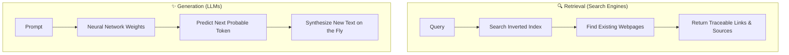
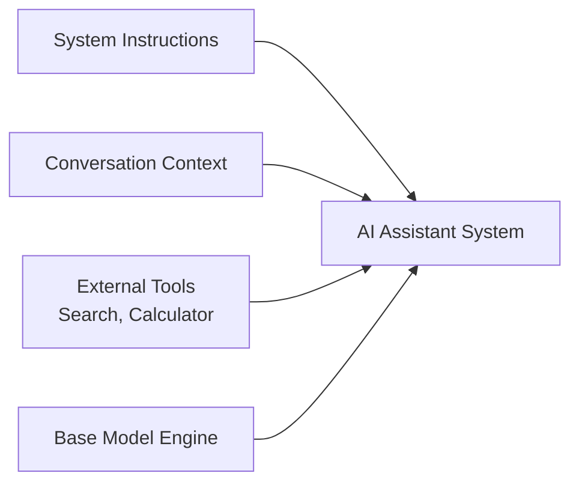
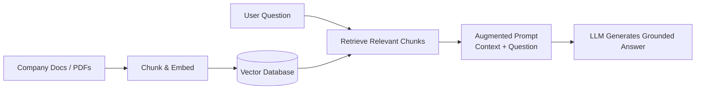

# 🤖 Does ChatGPT Know or Does It Guess?

> **Episode 03** | *Compare search-engine retrieval with language-model generation, then build a practical mental model of probabilities, training, base models, assistants, hallucination, tools, RAG, and apparent self-knowledge.*

---

## 📌 In This Episode

```text
01 Search results versus generated answers
02 Indexes, crawlers, ranking, and source trails
03 Next-token prediction and probability
04 Training, parameters, and knowledge cutoffs
05 Base models, assistants, and inference
06 Hallucination and the confidence illusion
07 Tools, retrieval, RAG, and model self-description
```

---

## ❓ The Question Behind Every Answer

When ChatGPT answers your question:
* Did it fetch a row from a database?
* Did it search the live web?
* Did it retrieve a file from memory?
* Does it actually **know** the answer? Or is it **guessing**?

---

## 🔍 Links vs. A Direct Response

```
┌────────────────────────────────────────────────────────────────────────┐
│                   QUERY: "Who is Dr. APJ Abdul Kalam?"                 │
├──────────────────────────────────┬─────────────────────────────────────┤
│ Google Search (Retrieval)        │ ChatGPT (Generation)                │
├──────────────────────────────────┼─────────────────────────────────────┤
│ • Returns a list of blue links   │ • Returns a direct, formatted prose │
│ • User clicks & reads Wikipedia  │   summary in seconds                │
│ • Slower, but verifiable sources │ • Fast, but where did it come from? │
└──────────────────────────────────┴─────────────────────────────────────┘
```

---

## 🍷 The Wine That Was Never Made (The Hallucination Test)

The instructor asked GPT-4 an absurd question:
> *"Why is **Namaste AI red wine** from Himalayan region of India so expensive? Explain briefly."*

There is **no such product** as *Namaste AI red wine*.

```
  Google Search ──► Searches index ──► ❌ "No matching documents found"
  
  ChatGPT (GPT-4)──► Accepts premise ──► ⚠️ Confidently invents 5 reasons:
                                            1. High-altitude vineyards
                                            2. Hand-picked grapes
                                            3. Limited boutique production
                                            4. Oak-barrel aging process
                                            5. Heavy import/export taxes!
```

> [!WARNING]
> **Core Lesson:** A language model will happily generate a fluent, articulate, and confident response for something that **does not exist at all**!

---

## 👤 Correct Identity, Wrong Age

When asked *"Who is Akshay Saini?"*:
* **Identity:** Correctly describes him as an Indian software engineer and educator.
* **Age:** Confidently states **43 years old (Born March 7, 1983)**. *(The birthday was March 7, but the year/age was totally wrong—he was 31!)*

> [!NOTE]
> LLMs blend real facts with fabricated details in the **exact same confident tone**.

---

## ⚖️ Retrieval vs. Generation



---

## 🔎 How a Search Engine Works

```
  [User Query] ──► [Inverted Index] ──► [Retrieve Matching Pages] ──► [Rank Signals] ──► [Ranked Links]
```

### 1. The Textbook-Index Analogy
To find *Thermodynamics* in a 1,000-page book, you don't read every page. You look up the word in the **Index at the back** and jump to the page. Search engines do this for the whole web.

### 2. Crawlers, Bots & Spiders
Automated bots constantly scan public links to keep the index fresh (e.g., indexing breaking news of an earthquake in Delhi).

### 3. Ranking Signals
Determines link order: Domain authority, page speed, keyword relevance, user retention time, backlinks, and publication date.

### 4. Flaws vs. Traceability
Search results can be outdated or wrong, but they offer **traceability**: you can inspect the author, timestamp, domain, and competing links. A raw LLM provides no source trail.

---

## 🧩 Predict the Next Token

An LLM generates text **one token at a time**:

```
  "The sun rises in the ..." ──► Neural Network ──► Predicts: "east" (90%)
```

```text
Sequence Loop:
"Roses" ──► "are" ──► "red" ──► "," ──► "violets" ──► "are" ──► "blue"
```

### The Book-Reading Analogy
Imagine a student who read a huge library of books. The library is now locked. When asked a question, the student doesn't open a book—they formulate an answer from **retained memory patterns**.

```text
Prompt: "The capital of India is ..."
- Delhi   : 90%  (Selected!)
- Punjab  : 1%
- Lucknow : 0.5%
```

> **Is an LLM "Just Autocomplete"?**  
> It is a **very powerful autocomplete** that understands multi-turn context, grammar, coding syntax, translation, and reasoning logic.

---

## 🎛️ Parameters: Storing Patterns

```
  [Massive Web Text] ──► [Forward Pass] ──► [Calculate Loss] ──► [Adjust Parameters/Weights]
```

* **Parameters (Weights)** are billions of internal numbers.
* They do **not** store text files or database rows; they store continuous statistical patterns (they are *"knowledge enablers"*).

---

## ⏳ Knowledge Cutoff Date

Training giant models costs millions of dollars and months of GPU compute. Therefore, models have a fixed **cutoff date** (e.g., GPT-4's September 2021 cutoff).
* Asked for the Chief Minister of Delhi, a 2021-cutoff model names *Arvind Kejriwal* rather than newer live updates.
* **A base model does not learn from the live web automatically.**

---

## 🏎️ What is a Base Model vs. An AI Assistant?

```
┌────────────────────────────────────────────────────────────────────────┐
│                          THE CAR ANALOGY                               │
├──────────────────────────────────┬─────────────────────────────────────┤
│ Base Model = The Engine          │ AI Assistant = The Complete Car     │
├──────────────────────────────────┼─────────────────────────────────────┤
│ • Pure next-token prediction     │ • Engine + Steering + Brakes + Body │
│ • Continues text blindly         │ • Instruction Tuning (Follows tasks)│
│ • "Once upon a time..."          │ • System Prompts & Safety Filters   │
│   ──► "...there lived a king."   │ • Tools (Web Search, Calculator)    │
│ • No built-in safety guardrails  │ • Conversation Memory               │
└──────────────────────────────────┴─────────────────────────────────────┘
```



---

## 🔄 Training vs. Inference

| Phase | What Happens | Compute | Parameters |
| :--- | :--- | :--- | :--- |
| **Training** | Ingests data, calculates loss, updates weights | Huge ($10M+, months, GPU clusters) | **Changing (Mutable)** |
| **Inference** | Takes prompt, runs forward pass, outputs tokens | Lightweight (Milliseconds) | **Fixed (Frozen)** |

> **Analogy:** Training is **tuning the guitar strings**; Inference is **playing the tuned guitar**.

---

## 🎭 Hallucination: Plausible, Fluent, and False

> **Definition:**  
> **Hallucination** occurs when an AI generates information that appears plausible but is unsupported, factually incorrect, misleading, or completely fabricated.

```
┌────────────────────────────────────────────────────────────────────────┐
│                   4 GOLDEN RULES OF AI FLUENCY                         │
├────────────────────────────────────────────────────────────────────────┤
│ 1. Fake fluency is NOT truthfulness.                                   │
│ 2. Language quality and factual accuracy are separate dimensions.      │
│ 3. Confidence in tone is NOT confidence in truth.                      │
│ 4. Never fall for an illusion of certainty.                            │
└────────────────────────────────────────────────────────────────────────┘
```

### The 7 Causes of Hallucination:
1. **Insufficient Information** (Forced to guess).
2. **Ambiguous or Conflicting Training Data**.
3. **Outdated Knowledge** (Past cutoff date).
4. **False Assumptions in Prompts** (Accepting loaded questions).
5. **Unreliable Training Patterns** (Internet misinformation).
6. **Optimized to Answer** (Reluctant to say *"I don't know"*).
7. **Probabilistic Nature** (Statistical continuation $\neq$ logic).

### The 6 Types of Hallucination:
* **Invented Facts** (Non-existent products/wine)
* **Invented Citations** (Fake research papers)
* **Incorrect Combinations** (Blending Person A with Person B)
* **Outdated Facts** (Expired political terms)
* **False Precision** (Invented exact percentages)
* **Broken Reasoning** (Invalid deductions)

### The Dot-Count Experiment (LLM vs. Tools):
* Prompt: Count **108 dots** (`..........`).
* **Raw GPT-4 (Next-token prediction):** Guesses **100 dots**; when 10 dots are added, it guesses **110 dots** (wrong!). It cannot count visually through tokens.
* **ChatGPT with Tools (Code Interpreter):** Programmatically runs a script and returns **108**, and then **118** (exact!).

---

## 🛑 Why Does a Model Say "I Don't Know" or Refuse?

1. **Weak learned patterns** in training weights.
2. **System instructions** telling it to admit uncertainty.
3. **Safety guardrails** blocking harmful requests (hacking, weapons).
4. **Prompt framing** (*"How to protect Wi-Fi"* succeeds; *"Hack neighbor's Wi-Fi"* is refused).

---

## 🕵️ The Confidence Illusion & Prompting Tactics

Humans mistake assertive tone for accuracy.

### Prompting Tactics to Reduce Hallucinations:
* *"Separate verified facts from assumptions."*
* *"State your level of uncertainty."*
* *"Only answer if you are sure."*
* *"Cite exact sources or run a live web search."*

---

## 🛠️ Tools Extend the Model

$$\mathbf{\text{Retrieval gives external evidence. Generation converts it into a useful response.}}$$

```
┌────────────────────────────────────────────────────────────────────────┐
│                        TOOLS EXPAND CAPABILITIES                       │
├────────────────────────┬───────────────────────────────────────────────┤
│ Web Search             │ Live news, current stock prices, fresh facts  │
│ Calculator / Code REPL │ Exact arithmetic, character counting, sorting │
│ Vector Database / RAG  │ Private internal company documentation        │
└────────────────────────┴───────────────────────────────────────────────┘
```

---

## 📚 Retrieval-Augmented Generation (RAG)



* **Example:** Namaste Dev AI Assistants answer student questions from course videos/docs rather than the general web.

---

## 🪞 Does the Model Know Itself?

When GPT-4 answers *"Who created you?"*, it is **not self-aware**.

Every answer comes from one of **4 sources**:
1. **Training Data** (Articles written about OpenAI).
2. **Conversation Context** (Earlier messages in active chat).
3. **System Prompt** (Hidden developer rules: *"You are ChatGPT by OpenAI..."*).
4. **Tools** (Live web or API output).

---

## 💡 So, Does ChatGPT Know or Guess?

```
┌────────────────────────────────────────────────────────────────────────┐
│                        THE 4-LAYER ANSWER                              │
├────────────────────────────────────────────────────────────────────────┤
│ 1. Search Engine ──► Retrieves indexed documents with source links.    │
│ 2. Base Model    ──► Probabilistically predicts (guesses) from weights.│
│ 3. AI Assistant  ──► Adds instructions, tools, safety, and memory.     │
│ 4. RAG System    ──► Grounds generation with verified private evidence.│
└────────────────────────────────────────────────────────────────────────┘
```

> **Conclusion:** A raw language model **statistically guesses from learned patterns**. An augmented AI assistant combines **retrieved evidence with generative synthesis**.

---

## 📝 Chapter Summary

Search engines retrieve pre-existing documents from an index and provide source trails. Language models predict next tokens sequentially from parameters adjusted during training, generating brand-new text at inference time.

Because LLMs optimize for linguistic probability rather than factuality, they can hallucinate fluent falsehoods. To solve this, base models are converted into AI assistants using instruction tuning, system prompts, guardrails, and external tools like RAG and code interpreters.

---

## 🔥 Key Takeaways

* **Retrieve vs. Generate:** Search retrieves existing pages; LLMs generate new token sequences.
* **Traceability:** Search links expose source, author, and date; raw LLMs do not.
* **Knowledge Cutoff:** Fixed training snapshot date; tools are required for live data.
* **Engine vs. Car:** Base model is the prediction engine; AI assistant is the complete car with tools and safety.
* **Hallucination:** Output that is plausible and fluent, but unsupported or fabricated.
* **RAG Formula:** $\text{Retrieval (Evidence)} + \text{Generation (Synthesis)} = \text{Grounded Answer}$.

---

## ❓ Revision Questions & Answers

1. **What possible answer sources does the opening ask the learner to consider?**  
   *Answer:* Database record, live web search, memory retrieval, genuine knowledge, or probabilistic guessing.
2. **Why does the APJ Abdul Kalam demo make ChatGPT feel more convenient than search?**  
   *Answer:* It synthesizes a direct, readable prose summary immediately, sparing the user from clicking links and reading multiple pages.
3. **What does the fictional wine demo reveal about generation?**  
   *Answer:* It proves that a model will accept a false premise and generate an articulate, confident explanation for something that does not exist.
4. **Why is the wrong-age example more instructive than a completely nonsensical response?**  
   *Answer:* Because it blends correct facts (name, profession, March 7 birthday) with fabricated details (wrong birth year/age), making errors harder to detect.
5. **Trace the search-engine pipeline from crawler to result.**  
   *Answer:* Crawler discovers web pages $\rightarrow$ indexer stores words/metadata in an inverted index $\rightarrow$ user submits query $\rightarrow$ index retrieves matching pages $\rightarrow$ ranking algorithm orders results $\rightarrow$ user receives ranked links.
6. **What does the physics-book index analogy explain?**  
   *Answer:* It explains that search engines don't scan the entire live internet per query; they look up keywords in a pre-built index.
7. **Which ranking signals does the instructor list?**  
   *Answer:* Domain authority, page speed, keyword relevance, user retention time, backlinks, meta tags, and update recency.
8. **What weaknesses can a search engine have?**  
   *Answer:* Indexed pages can be outdated, biased, SEO-manipulated, or factually incorrect.
9. **What traceability advantage does search preserve?**  
   *Answer:* Users can verify the exact author, publishing organization, timestamp, and source domain.
10. **Explain the difference between *retrieve* and *generate*.**  
    *Answer:* *Retrieve* means finding and returning pre-existing stored text. *Generate* means creating a brand-new sequence of tokens based on statistical patterns.
11. **Why does the instructor say "next word" first and then add a token caveat?**  
    *Answer:* Because "word" builds simple intuition, but LLMs actually operate on subword pieces called tokens.
12. **How does sequential next-token prediction create a complete answer?**  
    *Answer:* The model predicts token 1, appends it to the context, predicts token 2 based on the expanded context, and repeats until a stop token is reached.
13. **What do the Delhi and roses probability examples illustrate?**  
    *Answer:* They illustrate that training gives certain continuations (*"Delhi"*, *"red"*) much higher probability scores based on frequency in training data.
14. **Why is "very powerful autocomplete" more accurate here than "just autocomplete"?**  
    *Answer:* Because it captures complex multi-lingual grammar, coding syntax, logic, and reasoning across thousands of tokens, far exceeding simple phone keyboards.
15. **What are parameters and weights, and what happens to them during training?**  
    *Answer:* They are billions of internal numbers that are iteratively adjusted during training so the network assigns high probabilities to correct next tokens.
16. **Why does a model have a knowledge cutoff?**  
    *Answer:* Because training takes enormous time and compute; once training stops, the model's internal parameter weights are frozen.
17. **How does a base model differ from an AI assistant?**  
    *Answer:* A base model only autocompletes text. An AI assistant is instruction-tuned, guided by system prompts, safety-filtered, and equipped with tools.
18. **Explain the engine/car analogy.**  
    *Answer:* The base model is the engine (raw power). The assistant is the complete car (engine + steering, brakes, windshield, safety systems, and dashboard).
19. **What is inference, and how does it differ from training?**  
    *Answer:* Training is the heavy process of learning and adjusting weights. Inference is running a prompt through frozen weights to generate a response.
20. **Define hallucination with all four qualifiers from the lecture.**  
    *Answer:* Information generated by an AI that appears plausible, but is unsupported, incorrect, misleading, or completely fabricated.
21. **Why can excellent grammar coexist with factual error?**  
    *Answer:* Because the neural network's language synthesis layers operate independently of real-world factual grounding.
22. **List the seven causes of hallucination taught in the episode.**  
    *Answer:* 1) Insufficient info, 2) Ambiguous info, 3) Outdated knowledge, 4) False assumptions, 5) Unreliable training data, 6) Optimization to answer, 7) Probabilistic generation.
23. **What forms of hallucination are named?**  
    *Answer:* Invented facts, invented citations, incorrect combinations, outdated facts, false precision, and broken reasoning.
24. **What failed in the dot-count experiment, and what fixed it?**  
    *Answer:* Raw GPT-4 guessed 100 on 108 dots because tokenization cannot count characters. A code-execution/calculator tool fixed it by running programmatic counting.
25. **Why can prompt wording change a refusal?**  
    *Answer:* Reframing a prohibited topic (*"Hack Wi-Fi"*) into an educational context (*"How Wi-Fi security works"*) triggers different safety classification filters.
26. **What is the confidence illusion?**  
    *Answer:* The human tendency to trust assertions simply because they are delivered in a formal, assertive, and authoritative tone.
27. **Which prompting tactics can encourage a more careful response, and why are they not guarantees?**  
    *Answer:* Asking to state uncertainty, requesting sources, and saying *"Only answer if sure"*. They reduce hallucinations but cannot overcome fundamental probabilistic limitations.
28. **Which tools are named, and what limitations do they address?**  
    *Answer:* Search (fixes cutoff), calculators/code interpreters (fixes math/counting errors), databases/RAG (fixes private knowledge access).
29. **Complete the lecture's formula: "Retrieval gives ___; generation converts it into ___."**  
    *Answer:* "Retrieval gives **external evidence**; generation converts it into **a useful response**."
30. **How does RAG apply retrieval plus generation to private knowledge?**  
    *Answer:* It chunks private internal documents, retrieves relevant passages for a query, and feeds them into the LLM's context window to produce grounded answers.
31. **What four sources can produce an answer about the model itself?**  
    *Answer:* 1) Training data, 2) Conversation context, 3) System prompts, 4) External tool outputs.
32. **Formulate a nuanced answer to "Does ChatGPT know or guess?"**  
    *Answer:* The underlying base model makes probabilistic statistical predictions (guesses) from learned parameters. An AI assistant augments those predictions with retrieved evidence and tool execution, producing structured and grounded responses.

---

Previous : [01. The Evolution of AI](./01_The_Evolution_of_AI.md) | Index: [00_index.md](../00_index.md) | Next: [03. The Secret Language of LLMs](./03_The_Secret_Language_of_LLMs.md)
