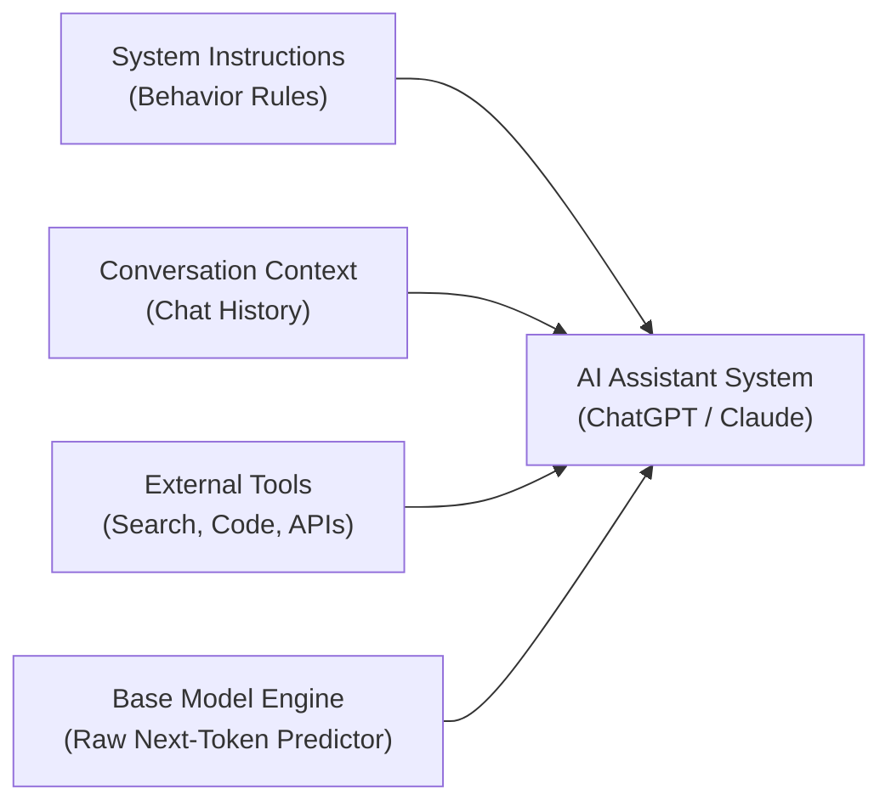
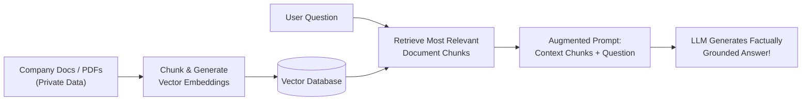

# 🤖 Does ChatGPT Know or Does It Guess?

> **Episode 03** | *Compare search-engine retrieval with language-model generation, then build a practical mental model of probabilities, training, base models, assistants, hallucination, tools, RAG, and apparent self-knowledge.*

---

## 📌 In This Episode

```text
01 Search results versus generated answers
02 Indexes, crawlers, ranking, and source trails
03 Next-token prediction and probability
04 Training, parameters, and knowledge cutoffs
05 Base models, assistants, and inference
06 Hallucination and the confidence illusion
07 Tools, retrieval, RAG, and model self-description
```

---

## ❓ The Question Behind Every Answer

When ChatGPT provides a clear, well-written answer to your question:
* Did it look up a record in a database?
* Did it run a live Google search?
* Did it retrieve a file saved in memory?
* Does it actually **know** what it's saying, or is it **statistically guessing**?

To understand what is happening inside the model, let's contrast how a **Search Engine** answers questions versus how a **Language Model** answers questions.

---

## 🔍 Links vs. A Direct Prose Response

```
┌────────────────────────────────────────────────────────────────────────┐
│                   QUERY: "Who is Dr. APJ Abdul Kalam?"                 │
├──────────────────────────────────┬─────────────────────────────────────┤
│ Google Search (Retrieval)        │ ChatGPT (Generation)                │
├──────────────────────────────────┼─────────────────────────────────────┤
│ • Returns a list of 10 blue links│ • Synthesizes a direct, readable,   │
│   (Wikipedia, news, biographies) │   and polished paragraph instantly  │
│ • User clicks, reads, and verifies│ • No links required to read         │
│ • Slower, but 100% traceable     │ • Fast, but where did it come from? │
└──────────────────────────────────┴─────────────────────────────────────┘
```

---

## 🍷 The Wine That Was Never Made (The Hallucination Experiment)

To test whether ChatGPT actually "knows" facts, the instructor asked GPT-4 an intentionally fabricated question:
> *"Why is **Namaste AI red wine** from the Himalayan region of India so expensive? Explain briefly."*

There is **no such product** as *Namaste AI red wine*. It does not exist in the real world.

```
  Google Search ──► Checks Web Index ──► ❌ "No matching documents found"
  
  ChatGPT (GPT-4)──► Accepts Premise ──► ⚠️ Confidently invents 5 plausible reasons:
                                            1. High-altitude Himalayan vineyards
                                            2. Hand-picked organic grapes
                                            3. Limited boutique batch production
                                            4. Oak-barrel maturation process
                                            5. Heavy import & luxury taxes!
```

> [!WARNING]
> **The Core Lesson:**  
> A Large Language Model does **not check if something exists in reality**. It looks at the words in your prompt, matches them to statistical linguistic patterns, and generates the most plausible-sounding continuation!

---

## 👤 Correct Identity, Wrong Age (Truth Mixed with Fiction)

When asked *"Who is Akshay Saini?"*:
* **Identity:** Correctly identifies him as an Indian software engineer, YouTuber, and educator known for JavaScript tutorials.
* **Birthday:** Correctly identifies his birth date as **March 7**.
* **Birth Year & Age:** Confidently states he was born in **1983 and is 43 years old** *(He was actually 31!)*.

```
┌────────────────────────────────────────────────────────────────────────┐
│                  THE DANGER OF PLAUSIBLE BLENDING                      │
├────────────────────────────────────────────────────────────────────────┤
│ [ Real Fact: Akshay Saini ] + [ Real Fact: March 7 ] + [ ❌ 43 Years Old ] │
├────────────────────────────────────────────────────────────────────────┤
│ ⚠️ Because the entire response is written in the exact same fluent,    │
│    authoritative tone, errors are extremely difficult to spot!         │
└────────────────────────────────────────────────────────────────────────┘
```

---

## ⚖️ Retrieval vs. Generation (The Fundamental Difference)


---

## 🔎 How a Search Engine Retrieves Information

Search engines do not read the live internet from scratch every time you search. They use a pre-built **Inverted Index**:

```
  [User Query] ──► [Inverted Index] ──► [Matching Pages] ──► [Ranking Signals] ──► [Ranked Links]
```

### 1. The Textbook-Index Analogy:
If you want to find *"Thermodynamics"* in a 1,000-page physics book, you don't read the whole book. You turn to the **Index at the back**, find *"Thermodynamics: pages 142, 210, 350"*, and jump straight to those pages. A search engine does this for billions of webpages.

### 2. Crawlers, Bots & Spiders:
Automated programs (like Googlebot) continuously follow web links to keep the index fresh (e.g., indexing breaking news about an earthquake in Delhi within minutes).

### 3. Ranking Signals:
Algorithms rank candidate pages based on authority, keyword relevance, backlinks, page speed, and recency.

### 4. Source Traceability:
Even if a webpage contains incorrect info, search provides **traceability**: you can inspect who wrote it, when it was published, and what domain it comes from. A raw LLM provides no source trail.

---

## 🧩 How an LLM Generates Text: Next-Token Prediction

An LLM does not generate complete sentences all at once. It generates text **one token (word/subword piece) at a time**:

```
  "The sun rises in the ..." ──► [Neural Network] ──► Predicts: "east" (92%)
```

```text
The Next-Token Generation Loop:
"Roses" ──► "are" ──► "red" ──► "," ──► "violets" ──► "are" ──► "blue" ──► "<|stop|>"
```

### The Closed-Library Student Analogy:
Imagine a student who read an entire library of books over a year. The library is now locked. When the student is asked an exam question, they do not open a book—they **formulate an answer from the memory patterns retained in their mind**.

```text
Prompt: "The capital of India is ..."
- Delhi   : 90.0%  (Selected!)
- Punjab  :  1.0%
- Lucknow :  0.5%
```

> **Is an LLM "Just Autocomplete"?**  
> Yes, but it is an **extraordinarily powerful autocomplete**. It does not merely guess the next letter; it tracks multi-paragraph context, grammar, coding syntax, translation, and multi-step logic across thousands of words.

---

## 🎛️ Parameters: The Stored Knowledge Patterns

During training across trillions of words:
1. The model takes a sentence.
2. It tries to predict the next word.
3. If it makes a mistake, it calculates the error (**Loss**).
4. It adjusts its internal numbers (**Parameters / Weights**).

* **Parameters are not a database:** They do not store text files, PDFs, or table rows. They are continuous mathematical numbers that act as **"knowledge enablers"**.

---

## ⏳ Knowledge Cutoffs: Why Base Models Don't Know Today's News

Training a giant model costs millions of dollars and months of continuous GPU compute. Once training stops, the parameters are **frozen**:

```
  Training Started ──────────► Training Finished (Sept 2021) ──► Model Deployed
                                         │
                                         ▼
                            [ Knowledge Cutoff Date ]
                            Model knows NOTHING after this date!
```

* If asked in 2024 who the Chief Minister of Delhi is, a model with a September 2021 cutoff will name *Arvind Kejriwal* based on its frozen weights, unaware of recent political changes.
* **A base model cannot update itself from the live web without external tools.**

---

## 🏎️ Base Model vs. AI Assistant (The Car Analogy)

```
┌────────────────────────────────────────────────────────────────────────┐
│                          THE CAR ANALOGY                               │
├──────────────────────────────────┬─────────────────────────────────────┤
│ Base Model = The Raw Engine      │ AI Assistant = The Complete Car     │
├──────────────────────────────────┼─────────────────────────────────────┤
│ • Pure next-token prediction     │ • Engine + Steering + Brakes + Body │
│ • Blindly continues text         │ • Instruction Tuning (Follows tasks)│
│ • Prompt: "Once upon a time..."  │ • System Prompts & Safety Filters   │
│   ──► "...there lived a king."   │ • Tools (Web Search, Calculator)    │
│ • No built-in safety or manners  │ • Conversation Context Memory       │
└──────────────────────────────────┴─────────────────────────────────────┘
```



---

## 🔄 Training vs. Inference Compared

| Feature | Training Phase | Inference Phase |
| :--- | :--- | :--- |
| **What It Does** | Reads data, computes loss, updates parameters | Takes user prompt, predicts tokens |
| **Parameters** | **Mutable (Constantly changing)** | **Frozen (Fixed numbers)** |
| **Compute Cost** | Massive ($10M–$100M+, GPU clusters, months) | Lightweight (Cents, milliseconds) |
| **Analogy** | **Tuning the guitar strings** | **Playing the tuned guitar** |

---

## 🎭 Hallucination: Plausible, Fluent, and False

> **Definition:**  
> **Hallucination** occurs when an AI generates information that appears completely plausible and fluent, but is unsupported by evidence, factually incorrect, or completely fabricated.

```
┌────────────────────────────────────────────────────────────────────────┐
│                   4 GOLDEN RULES OF AI FLUENCY                         │
├────────────────────────────────────────────────────────────────────────┤
│ 1. Fluent language is NOT the same as factual truth.                   │
│ 2. Grammatical quality and factual accuracy are separate dimensions.   │
│ 3. A confident tone does NOT equal certainty of facts.                 │
│ 4. Never mistake eloquence for intelligence.                           │
└────────────────────────────────────────────────────────────────────────┘
```

### The 7 Causes of Hallucinations:
1. **Insufficient Training Data** (Forced to interpolate).
2. **Ambiguous or Conflicting Training Data** (Internet disagreement).
3. **Outdated Knowledge** (Events occurring past the cutoff date).
4. **False Assumptions in Prompts** (Blindly accepting loaded questions like *"Namaste AI wine"*).
5. **Noisy Internet Sources** (Satire, forums, and misinformation).
6. **Helpfulness Bias** (Optimized to give an answer rather than admit uncertainty).
7. **Probabilistic Sampling** (Text generation is inherently statistical).

### The 6 Types of Hallucination:
* **Invented Facts:** Non-existent products, cities, or events.
* **Invented Citations:** Fabricated research papers, URLs, and book titles.
* **Incorrect Combinations:** Blending details of Person A with Person B.
* **Outdated Facts:** Stating expired political terms or old stats.
* **False Precision:** Making up exact numbers (*"43.7% of users..."*).
* **Broken Reasoning:** Reaching an invalid mathematical conclusion.

### The Dot-Count Experiment (LLM vs. Tools):
* Prompt: Count the dots: `...................................................` (108 dots total).
* **Raw GPT-4 (Text Token Prediction):** Guesses **100 dots**; when 10 dots are added, it guesses **110 dots**. It cannot count characters directly because tokenizers group characters into subword chunks!
* **ChatGPT with Tools (Code Interpreter):** Writes and runs a 1-line Python script (`len(dots)`) and returns **108**, then **118** with $100\%$ accuracy.

---

## 🛑 Why Does a Model Sometimes Refuse or Say "I Don't Know"?

1. **Weak Probabilities:** No strong statistical continuation exists in its weights.
2. **System Rules:** Developer instructions tell it to admit uncertainty on low confidence.
3. **Safety Guardrails:** Keyword and semantic filters block harmful requests (malware, weapons, hacking).
4. **Prompt Framing:** *"How to secure home Wi-Fi"* is answered; *"How to hack neighbor's Wi-Fi"* is refused.

---

## 🕵️ The Confidence Illusion & Better Prompting

Humans naturally trust authoritative, confident language.

### How to Prompt for Greater Accuracy:
* *"Separate verified facts from assumptions."*
* *"If you are not certain, explicitly state your degree of uncertainty."*
* *"Search the live web to verify current figures before answering."*
* *"Cite exact URLs for factual claims."*

---

## 🛠️ Tools Extend the Model Beyond Prediction

$$\mathbf{\text{Retrieval gives external evidence. Generation converts it into a useful response.}}$$

```
┌────────────────────────────────────────────────────────────────────────┐
│                        HOW TOOLS EMPOWER LLMS                          │
├────────────────────────┬───────────────────────────────────────────────┤
│ Web Search             │ Supplies live news, weather, and fresh facts  │
│ Python Code Execution  │ Performs exact arithmetic, data analysis, math│
│ Vector Database (RAG)  │ Supplies private internal company knowledge   │
└────────────────────────┴───────────────────────────────────────────────┘
```

---

## 📚 Retrieval-Augmented Generation (RAG)



* **Real-World Example:** NamasteDev AI assistants answer student queries strictly using transcripts from course lectures rather than guessing from the general internet.

---

## 🪞 Does the Model Know Itself? (Busting the Self-Awareness Myth)

When ChatGPT says *"I am a large language model trained by OpenAI..."*, it is **not self-aware**.

Every answer comes from one of **4 distinct sources**:
1. **Training Data:** Articles and papers written about AI on the public internet.
2. **Conversation Context:** The messages you exchanged earlier in the chat.
3. **System Prompt:** Hidden developer instructions injected before your prompt (*"You are ChatGPT, a helpful assistant..."*).
4. **Tool Outputs:** Real-time data retrieved from web search or API tools.

---

## 💡 So, Does ChatGPT Know or Does It Guess?

```
┌────────────────────────────────────────────────────────────────────────┐
│                         THE 4-LAYER ANSWER                             │
├────────────────────────────────────────────────────────────────────────┤
│ 1. Search Engine ──► Retrieves indexed documents with source links.    │
│ 2. Base Model    ──► Statistically guesses next tokens from weights.   │
│ 3. AI Assistant  ──► Aligns predictions with tasks, safety & memory.   │
│ 4. RAG System    ──► Combines retrieved evidence with fluent synthesis.│
└────────────────────────────────────────────────────────────────────────┘
```

> **The Conclusion:**  
> A standalone language model **statistically guesses based on learned patterns**. An augmented AI assistant combines **retrieved evidence with generative reasoning**.

---

## 📝 Chapter Summary

Search engines retrieve existing documents from an inverted index and provide traceable links. Language models generate new text one token at a time by sampling from probability distributions shaped during training.

Because models optimize for linguistic plausibility rather than factual truth, they can produce confident hallucinations. To build reliable systems, base models are wrapped into AI assistants using instruction tuning, system prompts, guardrails, and external tools like RAG and code interpreters.

---

## 🔥 Key Takeaways

* **Retrieve vs. Generate:** Search retrieves existing pages; LLMs generate new token sequences.
* **Traceability:** Search links show the author and date; raw LLMs have no source trail.
* **Knowledge Cutoff:** Fixed training date; external tools are required for real-time facts.
* **Engine vs. Car:** Base model is the prediction engine; AI assistant is the complete car with tools, safety, and controls.
* **Hallucination:** Output that looks plausible and fluent, but is factually unsupported or fabricated.
* **RAG Formula:** $\text{Retrieval (Evidence)} + \text{Generation (Synthesis)} = \text{Grounded Answer}$.

---

Previous : [01. The Evolution of AI](./01_The_Evolution_of_AI.md) | Index: [00_index.md](../00_index.md) | Next: [03. The Secret Language of LLMs](./03_The_Secret_Language_of_LLMs.md)
