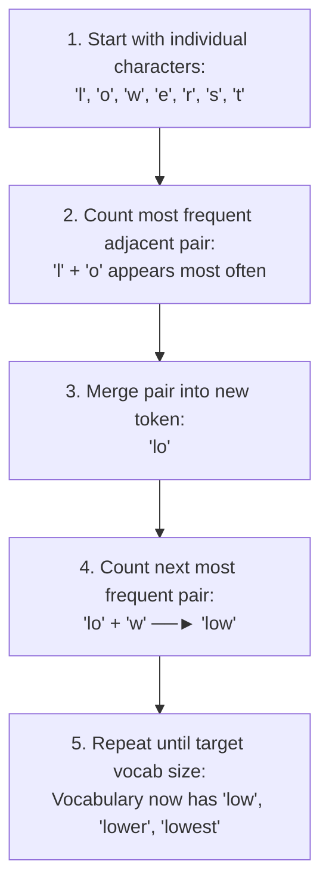

# 🤖 The Secret Language of LLMs

> **Episode 04** | *Follow a prompt as it becomes tokens and token IDs, then explore subword vocabularies, BPE, multilingual text, emoji and code, special tokens, context windows, and the cost of every extra token.*

---

## 📌 In This Episode

```text
01 From human text to token IDs
02 Tokenizers, subwords, and vocabularies
03 BPE, WordPiece, and Unigram
04 English, Hindi, Hinglish, emoji, and code
05 Special tokens and hidden message structure
06 Context windows and long conversations
07 Prompt relevance, token cost, and the meaning gap
```

---

## 🗣️ Which Language Does an LLM Understand?

Does an LLM understand English? Hindi? French, Spanish, or German?

**The answer is NONE of them.**

Computers do not process letters, words, or sentences. They only understand **numbers**. Before a neural network can process a single word, human text must be converted into numerical pieces called **tokens and token IDs**.

```text
Human Text:      "How"       "are"       "you"       "?"
                   │           │           │          │
Token IDs:       [1548]      [389]       [527]       [30]
```

---

## 🔄 The Complete Text-to-Token Pipeline

```mermaid
flowchart LR
    A["Human Input Text\n('Namaste AI is amazing')"] --> B["Tokenizer\n(Splits into subwords)"]
    B --> C["Tokens\n('Namaste', 'AI', 'is', 'amazing')"]
    C --> D["Vocabulary Lookup\n(Assigns integer IDs)"]
    D --> E["Token IDs\n[78, 12, 37, 108]"]
    E --> F["LLM Neural Network\n(Predicts next IDs)"]
    F --> G["Predicted Token IDs\n[14] ('.')"]
    G --> H["Decoder\n(Converts IDs to text)"]
    H --> I["Human Output Text\n('Namaste AI is amazing.')"]
```



```
┌────────────────────────────────────────────────────────────────────────┐
│                        THE 4 CORE DEFINITIONS                          │
├─────────────────┬──────────────────────────────────────────────────────┤
│ 1. Token        │ A chunk or unit of text recognized by a tokenizer.   │
│ 2. Token ID     │ The specific integer number assigned to that token   │
│                 │ in the model's vocabulary table.                     │
│ 3. Encoding     │ The process of turning human text ──► Token IDs.     │
│ 4. Decoding     │ The process of turning generated IDs ──► Human text. │
└─────────────────┴──────────────────────────────────────────────────────┘
```

---

## ⚙️ What is a Tokenizer?

A **tokenizer** is a dedicated software program (written in code by engineers) that sits between the human and the LLM. It chops input strings into tokens and maps them to numbers.

* **Vendor Specific:** OpenAI, Google, Meta, and Anthropic each build their own custom tokenizers.
* **Token IDs Are Local:** Token ID `4998` in OpenAI's tokenizer is completely different from ID `4998` in Google's tokenizer.

---

## 🔤 One Word Does Not Mean One Token

A token is a **subword piece**, not necessarily a single dictionary word:

```text
"playing"      ──►  "play" | "ing"        (2 tokens)
"untrustable"  ──►  "un" | "trust" | "able" (3 tokens)
```

```
┌────────────────────────────────────────────────────────────────────────┐
│                          WHAT COUNTS AS A TOKEN?                       │
├──────────────────────────────────┬─────────────────────────────────────┤
│ • A full common word             │ "apple", "cat", "the"               │
│ • Part of a word (subword)       │ "un", "trust", "ing"                │
│ • A single character             │ "a", "b", "z", "!"                  │
│ • A word with leading whitespace │ " Hello" (starts with a space)      │
│ • All or part of an emoji        │ "❤️", "🔥", "🤯"                    │
│ • Code indentation & syntax      │ "    " (4 spaces), "\n", "{}"       │
│ • Special control markers        │ "<|im_start|>", "<|endoftext|>"     │
└──────────────────────────────────┴─────────────────────────────────────┘
```

### 3 Live Tokenizer Rules:
1. **Capitalization changes token IDs:** `"amazing"` $\rightarrow$ ID `4998`, while `"Amazing"` $\rightarrow$ ID `23181`.
2. **Whitespace changes token boundaries:** `" Hello"` (with space) $\neq$ `"Hello"` (no space).
3. **Different models use different vocabularies:** The same sentence will have different token splits across GPT-4, Claude, and LLaMA.

---

## ⚖️ Why Tokenizers Use Subwords (The Balancing Act)

Why not use full words, or just single characters?

```
┌────────────────────────────────────────────────────────────────────────┐
│                      THE SUBWORD BALANCING ACT                         │
├──────────────────────────────────┬─────────────────────────────────────┤
│ Extreme 1: Whole-Word Vocabulary │ Extreme 2: Character-Only Vocabulary│
├──────────────────────────────────┼─────────────────────────────────────┤
│ • Pro: Short token sequences     │ • Pro: Tiny vocabulary (26 letters) │
│ • Con: Massive vocabulary size!  │ • Con: Extremely long sequences!    │
│   (Millions of words needed;     │   (Each word takes 8-12 tokens;     │
│   fails on typos or new words)   │   memory & compute costs explode!)  │
├──────────────────────────────────┴─────────────────────────────────────┤
│ 🎯 THE SWEET SPOT: Subword Tokenization                                │
│ • Common words stay whole ("apple", "code").                           │
│ • Rare, long, or new words break into reusable subwords:               │
│   "unconditionable" ──► "un" | "condition" | "able"                    │
└────────────────────────────────────────────────────────────────────────┘
```

---

## 📖 Vocabulary and Token IDs

A tokenizer's **vocabulary** is its dictionary of known tokens mapped to integer IDs:

```text
ID 10    ──► "the"
ID 15    ──► "ing"
ID 373   ──► "un"
ID 562   ──► "able"
ID 90349 ──► "trust"
```

* **Vocabulary Size:** Older models (GPT-2) used $\sim 50,000$ tokens. Modern frontier models (GPT-4o, LLaMA-3) use $\sim 128,000–200,000$ tokens to provide better coverage for multiple languages and code.

---

## 🧬 Byte-Pair Encoding (BPE)

> **Definition:**  
> **Byte-Pair Encoding (BPE)** builds a subword vocabulary by **repeatedly counting and merging the most frequent neighboring character pairs** in a dataset.



### Other Subword Algorithms:
* **WordPiece (BERT):** Merges pairs based on maximum statistical likelihood rather than pure frequency count.
* **Unigram (SentencePiece):** Starts with a massive initial vocabulary and iteratively *prunes away* less useful tokens top-down.

---

## 🔠 Familiar English vs. Random Gibberish

```
  Common English : "The quick brown fox jumps over the lazy dog." ──► 10 tokens (Compact!)
  Random Gibberish: "asdkjfhweiuhrfksjdhfgbsdm"                   ──► 24 tokens (Split into 1-letter chars!)
```

> [!WARNING]
> **Token Boundaries Are Not Meaning Boundaries:**  
> Turning `"India"` into ID `4210` is just a lookup map. The tokenizer has **no idea what India is**. Semantic meaning is learned later by **Vector Embeddings** inside the neural network.

---

## 🇮🇳 Multilingual Token Fertility: English vs. Hindi vs. Hinglish

```
┌────────────────────────────────────────────────────────────────────────┐
│             SAME SENTENCE: "I am learning artificial intelligence"     │
├──────────────────────────────────┬─────────────────────────────────────┤
│ English Script                   │ 6 tokens                            │
│ Hindi Script (Devanagari)        │ 15 tokens (was 68 in older GPT-3!)  │
│ Mixed Script / Hinglish          │ 10 tokens                           │
└──────────────────────────────────┴─────────────────────────────────────┘
```

* **Tokenization Fertility:** The ratio of tokens produced per word in a language.
  * Higher fertility = more token fragments per sentence = higher API costs, slower speed, and faster context exhaustion.
* **The Hinglish Challenge:** Informal phonetic variations (`main`/`mai`, `samjhao`/`samjho`) break common subwords, forcing tokenizers into character-level fragments.

---

## 🎨 Emojis, Code & Whitespace

* **Emojis:** Simple emojis take 1 token (`❤️`, `🔥`); complex composite emojis (combining base emojis, gender markers, and skin tones) take 2–4 tokens (`🤯`, `👩🏽‍💻`).
* **Code Formatting:** Indentation spaces (`    `), newlines (`\n`), and punctuation brackets (`{}`) are individual tokens. This enables LLMs to generate clean, properly indented code!

---

## 🎭 Hidden Special Tokens in Prompts

What you see in a chat UI is wrapped in hidden **control and role tokens**:

```text
<|im_start|>system
You are a helpful coding assistant.<|im_end|>
<|im_start|>user
How are you?<|im_end|>
<|im_start|>assistant
```

* **`<|im_start|>` & `<|im_end|>:`** Delimit message boundaries so the model never confuses developer rules with user input.
* **`<|endoftext|>:`** The stop token that instructs the model to cease generating further words.

---

## 🪟 Context: Why "Here" Means Dehradun

```text
Turn 1: User: "Hello, I am visiting Dehradun right now."
        Assistant: "Welcome to Dehradun! How can I help?"

Turn 2: User: "Which tourist places should I see here?"
```

The model understands that `"here"` refers to **Dehradun** because the previous conversation turns are passed back into the **Context Window** on every prompt!

> **Definition:**  
> The **Context Window** is the maximum number of tokens a model can hold in active memory during a single forward pass.

---

## 💰 The Shared Context Window Budget

$$\mathbf{\text{Total Context Budget}} = \text{System Prompt} + \text{Chat History} + \text{User Input} + \text{Generated Response}$$

```
┌────────────────────────────────────────────────────────────────────────┐
│                       THE SHARED CONTEXT BUDGET                        │
├────────────────────────────────────────┬───────────────────────────────┤
│ [System Rules] [History] [User Query]  │ [Generated Output Tokens]     │
│ ◀──────────── Input Tokens ───────────►│ ◀────── Output Tokens ───────►│
├────────────────────────────────────────┴───────────────────────────────┤
│ ◀──────────────────── Total Model Context Limit ──────────────────────►│
└────────────────────────────────────────────────────────────────────────┘
```

* **When the Window Fills Up:** Older messages must be dropped (truncated), summarized, or retrieved via RAG.
* **Visible Chat $\neq$ Active Context:** A chat app may show 100 messages on your screen from a database, but the API may only send the last 10 messages to fit the LLM's budget.

---

## ✍️ Prompt Length: Short vs. Redundant vs. Relevant

```
┌────────────────────────────────────────────────────────────────────────┐
│                        3 CLOSURE PROMPTS COMPARED                      │
├────────────────────────┬───────────────────────────────────────────────┤
│ 1. Short & Sufficient  │ "Explain closures in JS with 1 code example"  │
│ 2. Long & Redundant    │ "Please explain closures very simply, easily, │
│                        │ simply and easily without complexity..."      │
│                        │ (Wastes budget with useless filler words!)    │
│ 3. Long & Relevant     │ "Explain closures to a beginner who knows     │
│                        │ functions and scope. Include a counter example│
│                        │ in <250 words."                               │
│                        │ (Every extra token adds a useful constraint!) │
└────────────────────────┴───────────────────────────────────────────────┘
```

* **API Cost:** LLM providers charge per 1M input/output tokens. Removing redundant filler words saves money and reduces latency.

---

## 🚫 5 Misconceptions to Leave Behind

```
┌──────────────────────────────────────┬─────────────────────────────────┐
│ Misconception                        │ Reality                         │
├──────────────────────────────────────┼─────────────────────────────────┤
│ 1. One token = one whole word        │ ❌ Tokens are subword pieces.   │
│ 2. One emoji = one single token      │ ❌ Complex emojis split into 2+.│
│ 3. A bigger vocabulary is always best │ ❌ Balances model size & speed. │
│ 4. A larger context = perfect memory │ ❌ Information can get lost.    │
│ 5. More words = better answer quality│ ❌ Clear constraints matter most│
└──────────────────────────────────────┴─────────────────────────────────┘
```

---

## 🌉 Tokens $\neq$ Meaning (The Setup for Embeddings)

Token IDs are just arbitrary numeric labels:
```text
"dog"    ──► ID 12
"cat"    ──► ID 32
"grapes" ──► ID 8521
```

Nothing in the number `12` tells the model that a `dog` is an animal similar to a `cat`. 

**Tokenization provides the alphabet; Vector Embeddings provide the meaning** (Episode 05).

---

## 📝 Chapter Summary

LLMs operate on numerical token IDs rather than human words. Tokenizers chop text into subword units using algorithms like BPE, striking the ideal balance between vocabulary size and sequence length.

Tokenization handles capitalization, whitespace, code formatting, emojis, and language scripts. Prompts are wrapped in special control tokens and share a finite context budget with the generated response. While tokenization solves numerical representation, vector embeddings are needed to give those numbers semantic meaning.

---

## 🔥 Key Takeaways

* **Pipeline:** $\text{Text} \xrightarrow{\text{Encode}} \text{Token IDs} \xrightarrow{\text{LLM}} \text{Predicted IDs} \xrightarrow{\text{Decode}} \text{Text}$.
* **Subwords:** Strike the balance between massive whole-word dictionaries and long character sequences (`untrustable` $\rightarrow$ `un` + `trust` + `able`).
* **BPE Algorithm:** Repeatedly merges frequent character pairs into reusable tokens.
* **Shared Budget:** Input prompt tokens and generated output tokens share the exact same context window.
* **Tokens $\neq$ Meaning:** Token IDs are discrete integer labels; vector embeddings are required to capture semantic meaning.

---

Previous : [02. Does ChatGPT Know or Does It Guess](./02_Does_ChatGPT_Know_or_Does_It_Guess.md) | Index: [00_index.md](../00_index.md) | Next: [04. How Machines Represent Meaning](./04_How_Machines_Represent_Meaning.md)
