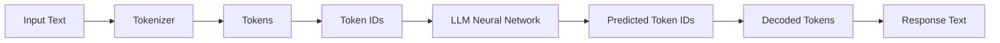
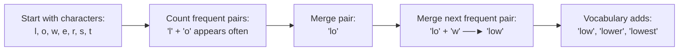

# 🤖 The Secret Language of LLMs

> **Episode 04** | *Follow a prompt as it becomes tokens and token IDs, then explore subword vocabularies, BPE, multilingual text, emoji and code, special tokens, context windows, and the cost of every extra token.*

---

## 📌 In This Episode

```text
01 From human text to token IDs
02 Tokenizers, subwords, and vocabularies
03 BPE, WordPiece, and Unigram
04 English, Hindi, Hinglish, emoji, and code
05 Special tokens and hidden message structure
06 Context windows and long conversations
07 Prompt relevance, token cost, and the meaning gap
```

---

## 🗣️ Which Language Does an LLM Understand?

Does an LLM understand English, Hindi, French, or Spanish? **None of them.**

Computers only understand **numbers**. Before a neural network processes any text, words are converted into numerical pieces called **tokens and token IDs**.

```text
Human Text:      "How"     "are"     "you"     "?"
                   │         │         │        │
Token IDs:       [1548]    [389]     [527]     [30]
```

---

## 🔄 The Complete Text-to-Token Pipeline



```
┌────────────────────────────────────────────────────────────────────────┐
│                        THE 4 CORE DEFINITIONS                          │
├─────────────────┬──────────────────────────────────────────────────────┤
│ 1. Token        │ A piece or unit of text defined by a tokenizer.      │
│ 2. Token ID     │ The integer number assigned to that token in a vocab.│
│ 3. Encoding     │ Converting human text ──► Token IDs.                 │
│ 4. Decoding     │ Converting generated Token IDs ──► Human text.       │
└─────────────────┴──────────────────────────────────────────────────────┘
```

```text
Example Walkthrough:
Text:      "Namaste AI is amazing."
Tokens:    Namaste | AI | is | amazing | .
Token IDs: 78      | 12 | 37 | 108     | 14
```

---

## ⚙️ What is a Tokenizer?

A **tokenizer** is an algorithm (a program written in code by engineers) that takes a text string and chops/maps it into tokens and IDs.

* **Vendor Specific:** OpenAI, Google, Meta, and Anthropic each use different tokenizers.
* **Token IDs Are Local:** Token ID `4998` in one model's vocabulary does **not** mean the same thing in another model!

---

## 🔤 One Word Does Not Mean One Token

A token is a **unit of text**, not necessarily a single whole word:

```text
"playing"  ──►  "play" | "ing"  (2 tokens)
```

```
┌────────────────────────────────────────────────────────────────────────┐
│                          WHAT CAN BE A TOKEN?                          │
├──────────────────────────────────┬─────────────────────────────────────┤
│ • A whole common word            │ "apple", "cat", "the"               │
│ • Part of a word (subword)       │ "un", "trust", "able"               │
│ • A single character             │ "a", "b", "c", "!"                  │
│ • Whitespace + Word              │ " Hello" (with leading space)       │
│ • All or part of an emoji        │ "❤️", "🔥", "🤯"                    │
│ • Code syntax & indentation      │ "    ", "\n", "{}"                  │
│ • Special control marker         │ "<|im_start|>", "<|endoftext|>"     │
└──────────────────────────────────┴─────────────────────────────────────┘
```

### 3 Live Tokenizer Rules:
1. **Capitalization changes token IDs:** `amazing` $\rightarrow$ ID `4998`, while `Amazing` $\rightarrow$ ID `23181`.
2. **Whitespace changes token boundaries:** `" Hello"` $\neq$ `"Hello"`.
3. **Different tokenizers give different IDs** for the exact same sentence.

---

## ⚖️ Why Tokenizers Use Subwords

```
┌────────────────────────────────────────────────────────────────────────┐
│                      THE SUBWORD BALANCING ACT                         │
├──────────────────────────────────┬─────────────────────────────────────┤
│ Extreme 1: One Token Per Word    │ Extreme 2: One Token Per Character  │
├──────────────────────────────────┼─────────────────────────────────────┤
│ • Pro: Short sequence length     │ • Pro: Tiny vocabulary (26 letters) │
│ • Con: Massive vocabulary size   │ • Con: Super long token sequences   │
│   (Millions of words needed!)    │   (Huge compute & memory costs!)    │
├──────────────────────────────────┴─────────────────────────────────────┤
│ 🎯 THE SWEET SPOT: Subword Tokenization                                │
│ • "untrustable" ──► "un" | "trust" | "able"                            │
│ • Reuses common pieces across words without blowing up vocabulary!     │
└────────────────────────────────────────────────────────────────────────┘
```

---

## 📖 Vocabulary and Token IDs

A tokenizer's **vocabulary** is its dictionary of known tokens mapped to IDs:

```text
ID 10    ──► "the"
ID 15    ──► "ing"
ID 373   ──► "un"
ID 562   ──► "able"
ID 90349 ──► "trust"
```

* **Vocab Size:** Older models had $\sim 50,000$ tokens; modern frontier models have $\sim 200,000$ tokens for better multilingual coverage.

---

## 🧬 Byte-Pair Encoding (BPE)

> **Definition:**  
> **Byte-Pair Encoding (BPE)** builds a vocabulary by **repeatedly merging the most frequently occurring neighboring character pairs**.



### Other Tokenization Algorithms:
* **WordPiece:** Selects pieces that maximize training data likelihood (longest-match first).
* **Unigram:** Starts with a giant vocabulary and iteratively *prunes* less useful pieces top-down.

---

## 🔠 Familiar English vs. Gibberish

```
  Common English : "The quick brown fox jumps..." ──► 14 tokens (Compact!)
  Random Gibberish: "asdkjfhweiuhrfksjdhf"         ──► 38 tokens (Fragmented into 1-char pieces!)
```

> [!WARNING]
> **Token Boundaries Are Not Meaning Boundaries:**  
> Converting `"India"` into ID `4210` is just a string-to-number map. The tokenizer does **not** know what India means. Semantic meaning is learned by embeddings.

---

## 🇮🇳 Multilingual Text, Fertility & Hinglish

```
┌────────────────────────────────────────────────────────────────────────┐
│             SAME SENTENCE: "I am learning artificial intelligence"     │
├──────────────────────────────────┬─────────────────────────────────────┤
│ English Script                   │ 6 tokens                            │
│ Hindi Script (Devanagari)        │ 15 tokens (was 68 in older GPT-3!)  │
│ Mixed Script / Hinglish          │ 10 tokens                           │
└──────────────────────────────────┴─────────────────────────────────────┘
```

* **Tokenization Fertility:** Measures how many tokens a language produces per word. Higher fertility = more fragmented pieces = higher API cost & latency.
* **Hinglish Challenge:** Irregular phonetic spellings (`main`/`mai`, `samjhao`/`samjho`) produce different token splits for the exact same intended word.

---

## 🎨 Emojis, Whitespace & Code

* **Emojis are text:** Simple emojis take 1 token (`❤️`, `🔥`); complex composite emojis take 2+ tokens (`🤯`, `😅`).
* **Code Formatting:** Spaces, tabs, brackets (`{}`), and newlines (`\n`) are all tokenized. That's why LLMs output beautifully formatted, indented code!

---

## 🎭 The Prompt Contains Hidden Structure

What you type is wrapped in hidden role tags and **special tokens**:

```text
<|im_start|>system
You are a helpful assistant.<|im_end|>
<|im_start|>user
How are you?<|im_end|>
<|im_start|>assistant
```

---

## 🪟 Context: Why "Here" Means Dehradun

```text
Turn 1: User: "Hello, I am in Dehradun right now."
        Assistant: "Hello! Welcome to Dehradun."

Turn 2: User: "Which places can I visit here?"
```

The model understands `"here"` = **Dehradun** because the prior messages are passed into its **Context Window**.

> **Definition:**  
> The **Context Window** is the finite amount of tokenized information a model can hold in active memory during a forward pass.

---

## 💰 Input & Output Share the Context Window

$$\mathbf{\text{Total Context Budget}} = \text{System Prompt} + \text{Chat History} + \text{User Input} + \text{Generated Response}$$

```
┌────────────────────────────────────────────────────────────────────────┐
│                       THE SHARED CONTEXT BUDGET                        │
├────────────────────────────────────────┬───────────────────────────────┤
│ [System Rules] [History] [User Prompt] │ [Generated Output Space]      │
│ ◀──────────── Input Tokens ───────────►│ ◀────── Output Tokens ───────►│
├────────────────────────────────────────┴───────────────────────────────┤
│ ◀──────────────────── Total Context Limit ────────────────────────────►│
└────────────────────────────────────────────────────────────────────────┘
```

* **When the Window Fills:** Older messages are truncated, summarized, or retrieved via RAG.
* **Visible Chat $\neq$ Active Context:** The UI can show 100 messages from a database, while the LLM only receives the last 10 messages.

---

## ✍️ Prompt Length: Short vs. Redundant vs. Relevant

```
┌────────────────────────────────────────────────────────────────────────┐
│                        3 CLOSURE PROMPTS COMPARED                      │
├────────────────────────┬───────────────────────────────────────────────┤
│ 1. Short & Sufficient  │ "Explain closures in JS with 1 simple example"│
│ 2. Long & Redundant    │ "Make it super easy, basic, simple, easy..."  │
│                        │ (Wastes tokens with useless filler!)          │
│ 3. Long & Relevant     │ "Explain closures to a beginner who knows     │
│                        │ functions/scope. Use a counter example <250w" │
│                        │ (Every extra token adds a useful constraint!) │
└────────────────────────┴───────────────────────────────────────────────┘
```

* **API Cost:** LLMs bill per token. Removing filler words saves money and speeds up responses.

---

## 🚫 5 Misconceptions to Remove

```
┌──────────────────────────────────────┬─────────────────────────────────┐
│ Misconception                        │ Reality                         │
├──────────────────────────────────────┼─────────────────────────────────┤
│ 1. One token = one word              │ ❌ Tokens are subword pieces.   │
│ 2. One emoji = one token             │ ❌ Many emojis split into 2+.   │
│ 3. Larger vocab is always better     │ ❌ Balances model size & speed. │
│ 4. Larger context = perfect memory   │ ❌ Context is finite & lossy.   │
│ 5. More tokens = better output       │ ❌ Quality constraints matter.  │
└──────────────────────────────────────┴─────────────────────────────────┘
```

---

## 🌉 Tokens $\neq$ Meaning

Token IDs are just arbitrary labels:
```text
"dog"   ──► ID 12
"cat"   ──► ID 32
"grapes"──► ID 8521
```

Nothing in the number `12` tells the computer that a `dog` is an animal related to `cat`. 

**Tokenization provides the alphabet; Embeddings provide the meaning** (Episode 05).

---

## 📝 Chapter Summary

LLMs operate on token IDs rather than human words. Tokenizers break text into subword units using algorithms like BPE, balancing vocabulary size and sequence length.

Tokenization reacts to capitalization, whitespace, code formatting, and language scripts. Prompts are wrapped in special control tokens and share a finite context window with generated output. Tokenization solves numerical representation, but vector embeddings are required to capture semantic meaning.

---

## 🔥 Key Takeaways

* **Pipeline:** $\text{Text} \xrightarrow{\text{Encode}} \text{Token IDs} \xrightarrow{\text{LLM}} \text{Predicted IDs} \xrightarrow{\text{Decode}} \text{Text}$.
* **Subwords:** Balance massive word vocabularies with long character sequences (`untrustable` $\rightarrow$ `un` + `trust` + `able`).
* **BPE:** Iteratively merges frequent character pairs into reusable tokens.
* **Shared Budget:** Input prompt and generated response share the exact same context window.
* **Tokens $\neq$ Meaning:** Token IDs are discrete integer labels; vector embeddings are needed to capture semantic relationships.

---

## ❓ Revision Questions & Answers

1. **Why does the instructor call tokens the LLM's secret language?**  
   *Answer:* Because LLMs cannot process human letters directly; they operate exclusively on token IDs (numerical representations).
2. **Trace the encode-predict-decode pipeline from prompt to response.**  
   *Answer:* User text $\rightarrow$ Tokenizer encodes text into token IDs $\rightarrow$ LLM predicts next token IDs $\rightarrow$ Tokenizer decodes IDs into human-readable response text.
3. **Define token, token ID, tokenizer, encoding, and decoding.**  
   *Answer:* A *token* is a piece of text; a *token ID* is its numerical vocabulary integer; a *tokenizer* is the algorithm that splits and maps text; *encoding* converts text to IDs; *decoding* converts IDs to text.
4. **Why is `playing` $\rightarrow$ `play | ing` an important correction to the word-level explanation?**  
   *Answer:* It shows that tokenizers break words into reusable subword stems and suffixes rather than requiring whole words.
5. **What three changes in the live demo alter token IDs?**  
   *Answer:* Changing capitalization (`amazing` vs `Amazing`), adding/removing whitespace, and switching to a different tokenizer.
6. **Why can token IDs not be compared freely across tokenizers?**  
   *Answer:* Because token IDs are local indices tied to a specific tokenizer's vocabulary table.
7. **What is subword tokenization?**  
   *Answer:* A method that keeps common words whole while breaking unfamiliar/rare words into reusable smaller pieces.
8. **What disadvantage comes with a whole-word vocabulary?**  
   *Answer:* An impossibly massive vocabulary size that cannot handle new, misspelled, or compound words.
9. **What disadvantage comes with character-only tokenization?**  
   *Answer:* Token sequences become extremely long, exponentially increasing computation and memory costs.
10. **How does `untrustable` $\rightarrow$ `un | trust | able` illustrate reuse?**  
    *Answer:* It reuses common prefixes (`un`) and suffixes (`able`) with a known root (`trust`) without needing a unique vocabulary slot.
11. **What does a tokenizer vocabulary contain?**  
    *Answer:* A fixed lookup table of all recognized text tokens and their assigned integer IDs.
12. **How does the lecture explain BPE with `low`, `lower`, and `lowest`?**  
    *Answer:* It counts frequent letter pairs (`l`+`o` $\rightarrow$ `lo`, `lo`+`w` $\rightarrow$ `low`), merging them into reusable vocabulary entries.
13. **What limitation does the instructor attach to his WordPiece explanation?**  
    *Answer:* He notes that it is a brief high-level sketch based on longest-match scoring, not a deep mathematical derivation.
14. **How does the Unigram sketch differ from the BPE sketch?**  
    *Answer:* BPE builds up from characters by merging; Unigram starts with a large candidate set and prunes less useful tokens top-down.
15. **Why does gibberish usually consume more tokens in the demonstration?**  
    *Answer:* Because random character strings do not match common vocabulary subwords and must be split into 1-character pieces.
16. **Explain "token boundaries are not meaning boundaries."**  
    *Answer:* Tokenization merely chops text into strings; it does not assign semantic definitions or conceptual meaning.
17. **What do the English, Hindi, and mixed-script counts show?**  
    *Answer:* Non-English scripts historically suffered from higher token fragmentation (fertility), though newer tokenizers improve balance.
18. **Why is Hinglish difficult for a tokenizer?**  
    *Answer:* Because phonetic romanized spellings vary widely (`main`/`mai`, `samjhao`/`samjho`), fragmenting subword matches.
19. **What does tokenization fertility measure?**  
    *Answer:* The average number of tokens required to represent a single word or linguistic concept in a given language.
20. **Why can one emoji become more than one token?**  
    *Answer:* Complex emojis are formed by combining multiple Unicode codepoints (e.g., base emoji + skin tone modifier).
21. **How do whitespace and capitalization affect token IDs?**  
    *Answer:* Leading spaces and capital letters are distinct characters in the vocabulary, producing entirely different token IDs.
22. **Why does code indentation participate in tokenization?**  
    *Answer:* Spaces, tabs, and newlines are encoded as tokens so the model can learn and generate correct syntax formatting.
23. **Which special/control information may surround the visible prompt?**  
    *Answer:* System prompt boundaries, start/end tokens, user/assistant role markers, and tool output tags.
24. **Why is the `system/user/assistant` sketch not an exact provider format?**  
    *Answer:* Because each provider uses proprietary special tokens (e.g. `<|im_start|>`) rather than plain English text.
25. **What does the Dehradun example teach about context?**  
    *Answer:* That the model understands pronouns and relative words (*"here"*) only because the conversation history is passed into its context.
26. **Which items can occupy a context window?**  
    *Answer:* System prompts, user queries, chat history, uploaded document text, retrieved RAG passages, and tool outputs.
27. **Why do input and output share one context budget in the lecture's model?**  
    *Answer:* Because the Transformer calculates self-attention across the combined sequence of input prompt tokens and generated output tokens.
28. **What can happen when the context window fills?**  
    *Answer:* Requests are rejected, older conversation turns are dropped/truncated, or summaries are generated.
29. **Why can visible conversation history differ from active model context?**  
    *Answer:* The UI database may show 100 messages, but the backend API only feeds the last few turns to the LLM to fit the context limit.
30. **Compare the short, redundant, and relevant JavaScript-closure prompts.**  
    *Answer:* Short is concise; redundant adds useless filler words that waste tokens; relevant adds clear technical constraints that improve response quality.
31. **How does token use affect API cost?**  
    *Answer:* LLM providers bill per 1,000 or 1,000,000 input and output tokens; fewer tokens mean lower costs.
32. **Which five misconceptions does the episode reject?**  
    *Answer:* 1) 1 token = 1 word, 2) 1 emoji = 1 token, 3) Bigger vocab is always better, 4) Bigger context = perfect memory, 5) More tokens = better output.
33. **What meaning question remains unanswered after tokenization?**  
    *Answer:* How the model knows that `dog` and `cat` are related animals, or that `bank` has multiple meanings (polysemy).
34. **Which tokenizer experiments does the instructor ask learners to perform?**  
    *Answer:* Test capitalization, whitespace, multilingual text, emojis, and code formatting in an interactive online tokenizer.

---

Previous : [02. Does ChatGPT Know or Does It Guess](./02_Does_ChatGPT_Know_or_Does_It_Guess.md) | Index: [00_index.md](../00_index.md) | Next: [04. How Machines Represent Meaning](./04_How_Machines_Represent_Meaning.md)
