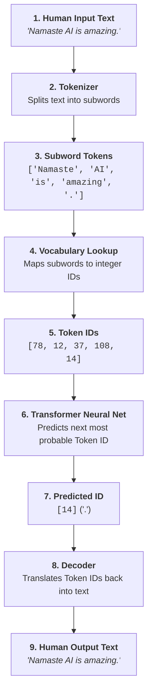
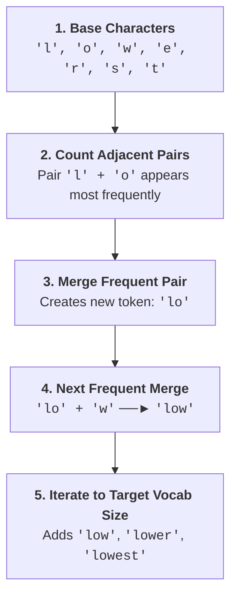

# 🤖 The Secret Language of LLMs

> **Episode 04** | *Follow a prompt as it becomes tokens and token IDs, then explore subword vocabularies, BPE, multilingual text, emoji and code, special tokens, context windows, and the cost of every extra token.*

---

## 📌 In This Episode

```text
01 From human text to token IDs
02 Tokenizers, subwords, and vocabularies
03 BPE, WordPiece, and Unigram
04 English, Hindi, Hinglish, emoji, and code
05 Special tokens and hidden message structure
06 Context windows and long conversations
07 Prompt relevance, token cost, and the meaning gap
```

---

## 🗣️ Which Language Does an LLM Understand?

Does an LLM understand English? Hindi? Punjabi, Marathi, Telugu, Tamil, Kannada, Malayalam, French, or German?

**The answer is NONE of them.**

When a human reads words like *"Namaste"*, *"AI"*, or *"amazing"*, meaning immediately "clicks" in our biological brain. But a computer does not experience human language. Before a neural network can process a single word, human text must be converted into numerical pieces called **tokens and token IDs**.

```text
Human Text:      "How"       "are"       "you"       "?"
                   │           │           │          │
Token IDs:       [1548]      [389]       [527]       [30]
```

The "secret language" of Large Language Models is **not English or Hindi—it is the language of Token IDs**.

---

## 🔄 The Complete Text-to-Token Pipeline



```
┌────────────────────────────────────────────────────────────────────────┐
│                        THE 4 CORE DEFINITIONS                          │
├─────────────────┬──────────────────────────────────────────────────────┤
│ 1. Token        │ A chunk or unit of text recognized by a tokenizer.   │
│ 2. Token ID     │ The specific integer number assigned to that token   │
│                 │ in the model's vocabulary lookup table.              │
│ 3. Encoding     │ The process of converting human text ──► Token IDs.  │
│ 4. Decoding     │ The process of converting generated IDs ──► Text.    │
└─────────────────┴──────────────────────────────────────────────────────┘
```

> **The Core Realization:**  
> An LLM never directly predicts an English or Hindi word. It predicts the **next Token ID number**. The tokenizer then translates that numerical sequence into readable human text, code, or emojis for the user.

---

## ⚙️ What is a Tokenizer?

A **tokenizer** is not a mysterious physical machine. It is a piece of software code—a program or algorithm written by engineers that runs on a CPU or GPU. It accepts a raw text string, chops it into tokens, and maps them to numerical IDs.

* **No Single Universal Tokenizer:** OpenAI, Google, Meta, and Anthropic each design proprietary tokenizers tailored to their models.
* **Token IDs Are Strictly Local:** Token ID `4998` in OpenAI's tokenizer is an entirely different word or character in Google's or Meta's tokenizer.
* **Tokenizers Evolve:** As models advance, engineers build newer tokenizers with larger vocabularies to handle multiple languages and code more efficiently.

---

## 🔤 One Word Does Not Mean One Token

A token is a **unit of text**, not necessarily a single dictionary word:

```text
"playing"      ──►  "play" | "ing"        (2 tokens)
"untrustable"  ──►  "un" | "trust" | "able" (3 tokens)
```

```
┌────────────────────────────────────────────────────────────────────────┐
│                          WHAT CAN BE A TOKEN?                          │
├──────────────────────────────────┬─────────────────────────────────────┤
│ • A full common word             │ "apple", "cat", "the"               │
│ • Part of a word (subword)       │ "un", "trust", "able", "ing"        │
│ • A single character             │ "a", "b", "z", "!"                  │
│ • A word with leading whitespace │ " Hello" (starts with a space)      │
│ • Punctuation marks              │ ",", ".", "?", "!"                  │
│ • All or part of an emoji        │ "❤️", "🔥", "🤯"                    │
│ • Code indentation & syntax      │ "    " (4 spaces), "\n", "{}"       │
│ • Special control markers        │ "<|im_start|>", "<|endoftext|>"     │
└──────────────────────────────────┴─────────────────────────────────────┘
```

### The 3 Live Tokenizer Experiments:
1. **Capitalization Changes Token IDs:** Lowercase `"amazing"` is ID `4998`, while capitalized `"Amazing"` is ID `23181`.
2. **Whitespace Modifies Boundaries:** `" Hello"` (with a leading space) produces a different token ID than `"Hello"` (without a space).
3. **Different Tokenizers Produce Different Counts:** Testing `"Namaste AI is amazing"` across older vs. newer tokenizers shows different subword splits and ID numbers. *(Try testing this on `platform.openai.com/tokenizer` or `tiktokenizer.vercel.app`)*.

---

## ⚖️ Why Tokenizers Use Subwords (The Balancing Act)

Why not assign one token to every single word, or just use single characters?

```
┌────────────────────────────────────────────────────────────────────────┐
│                      THE SUBWORD BALANCING ACT                         │
├──────────────────────────────────┬─────────────────────────────────────┤
│ Extreme 1: Whole-Word Vocabulary │ Extreme 2: Character-Only Vocabulary│
├──────────────────────────────────┼─────────────────────────────────────┤
│ • Pro: Short token sequences     │ • Pro: Tiny vocabulary (26 letters) │
│ • Con: Massive vocabulary size!  │ • Con: Extremely long sequences!    │
│   (Millions of words needed;     │   (Each word takes 8-12 tokens;     │
│   fails on typos, slang, or new  │   computational cost and memory     │
│   compound words)                │   explode quadratically!)           │
├──────────────────────────────────┴─────────────────────────────────────┤
│ 🎯 THE SWEET SPOT: Subword Tokenization                                │
│ • Common words stay whole ("apple", "code").                           │
│ • Rare, long, or compound words break into reusable subwords:          │
│   "unconditionable" ──► "un" | "condition" | "able"                    │
│   "unimaginable"    ──► "un" | "imagin"    | "able"                    │
│ • Reuses common prefixes ('un') and suffixes ('able') universally!     │
└────────────────────────────────────────────────────────────────────────┘
```

---

## 📖 Vocabulary and Token IDs

A tokenizer's **vocabulary** is its dictionary of recognized tokens mapped to unique integer IDs:

```text
ID 10    ──► "the"
ID 14    ──► "."
ID 15    ──► "ing"
ID 373   ──► "un"
ID 562   ──► "able"
ID 90349 ──► "trust"
```

* **Vocabulary Size Evolution:** Older models (like GPT-2) used $\sim 50,257$ tokens (the "50K base"). Modern frontier models (like GPT-4o and LLaMA-3) use $\sim 128,000–200,000$ tokens (the "200K base") to provide richer coverage across global languages and programming frameworks.

---

## 🧬 Byte-Pair Encoding (BPE)

> **Definition:**  
> **Byte-Pair Encoding (BPE)** builds a subword vocabulary by **repeatedly counting and merging the most frequent neighboring character pairs** in a training dataset.



### Connection to Bits and Bytes:
* A **bit** is a binary `0` or `1`.
* A **byte** contains 8 bits (representing $256$ possible values, from $0$ to $255$).
* BPE operates at the byte level (UTF-8 bytes), allowing it to represent any text, symbol, or foreign script without failing on "Out-of-Vocabulary" errors.

### Other Subword Tokenization Algorithms:
* **WordPiece (used in BERT):** Merges character pairs based on maximum statistical likelihood rather than pure frequency count (longest-match first).
* **Unigram (used in SentencePiece & T5):** Starts with a massive initial vocabulary and iteratively *prunes away* less useful tokens top-down until the target size is reached.

---

## 🔠 Familiar English vs. Random Gibberish

```
  Common English : "The quick brown fox jumps over the lazy dog." ──► 14 tokens (Compact!)
  Random Gibberish: "asdkjfhweiuhrfksjdhfgbsdm"                   ──► 38 tokens (Fragmented into 1-char pieces!)
```

* **Why?** Common English phrases match large pre-existing subwords in the vocabulary. Random gibberish matches no common patterns, forcing the tokenizer to split it into single-character tokens.

> [!WARNING]
> **Token Boundaries Are Not Meaning Boundaries:**  
> If `"India"` becomes Token ID `4210`, the tokenizer has performed a simple string-to-number mapping. It has **no understanding of India's geography, culture, or history**. That semantic meaning is learned by **Vector Embeddings** inside the neural network.

---

## 🇮🇳 Multilingual Token Fertility: English vs. Hindi vs. Hinglish

When the exact same idea—*"I am learning artificial intelligence"*—is entered across different scripts:

```
┌────────────────────────────────────────────────────────────────────────┐
│             SAME SENTENCE: "I am learning artificial intelligence"     │
├──────────────────────────────────┬─────────────────────────────────────┤
│ English Script                   │ 6 tokens                            │
│ Hindi Script (Devanagari)        │ 15 tokens (was 68 in older GPT-3!)  │
│ Mixed Script / Hinglish          │ 10 tokens                           │
└──────────────────────────────────┴─────────────────────────────────────┘
```

* **Tokenization Fertility:** The ratio of tokens produced per word in a language.
  * Higher fertility = more token fragments per sentence = higher API costs, slower response latency, and faster exhaustion of the context window.
  * Newer 200K tokenizers have improved multilingual coverage dramatically (dropping Hindi token counts from 68 down to 15).
* **The Hinglish Challenge:** Informal phonetic spellings (`main`/`mai`, `samjhao`/`samjho`) break standard vocabulary subwords, producing wildly different token splits for the exact same intended word.

---

## 🎨 Emojis, Code & Whitespace

* **Emojis:** Simple emojis take 1 token (`❤️`, `🔥`); complex composite emojis (combining base characters, gender modifiers, and skin tones) take 2 to 4 tokens (`🤯`, `👩🏽‍💻`).
* **Whitespace & Indentation:** Leading spaces, tabs, and newlines (`\n`) are all tokenized.
  * *Why Code Has Beautiful Formatting:* The neural network is trained on token sequences that explicitly include indentation and newlines. Code formatting is part of the learned statistical sequence, not an afterthought!

---

## 🎭 Hidden Special Tokens in Prompts

What you type in a chat interface is secretly wrapped in **special control tokens**:

```text
<|im_start|>system
You are a helpful programming mentor.<|im_end|>
<|im_start|>user
How are you?<|im_end|>
<|im_start|>assistant
```

* **Role Delimiters (`<|im_start|>`, `<|im_end|>`):** Ensure the model cleanly separates developer system instructions from untrusted user input.
* **Stop Tokens (`<|endoftext|>`):** Signal the model to terminate generation.

---

## 🪟 Context Window: Why "Here" Means Dehradun

```text
Turn 1: User: "Hello, I am visiting Dehradun right now."
        Assistant: "Welcome to Dehradun! How can I help you today?"

Turn 2: User: "Which tourist places should I visit here?"
```

The model understands that `"here"` refers to **Dehradun** because the previous conversation history is fed back into the **Context Window** on every prompt.

> **Definition:**  
> The **Context Window** is the maximum number of tokens a model can hold in active memory during a single forward pass.

```
┌────────────────────────────────────────────────────────────────────────┐
│                        WHAT OCCUPIES A CONTEXT WINDOW?                 │
├────────────────────────────────────────────────────────────────────────┤
│ • System instructions and personas                                     │
│ • Multi-turn chat history                                              │
│ • Current user prompt and attached documents (PDFs, text files)        │
│ • Retrieved RAG passages from private databases                        │
│ • Output returned by external tools (live weather, search results)     │
│ • Generated output tokens                                              │
└────────────────────────────────────────────────────────────────────────┘
```

---

## 💰 The Shared Context Window Budget

$$\mathbf{\text{Total Context Budget}} = \text{Input Tokens (System + History + Prompt + Tools)} + \text{Generated Output Tokens}$$

```
┌────────────────────────────────────────────────────────────────────────┐
│                       THE SHARED CONTEXT BUDGET                        │
├────────────────────────────────────────┬───────────────────────────────┤
│ [System Rules] [History] [User Query]  │ [Generated Output Tokens]     │
│ ◀──────────── Input Tokens ───────────►│ ◀────── Output Tokens ───────►│
├────────────────────────────────────────┴───────────────────────────────┤
│ ◀──────────────────── Total Model Context Limit ──────────────────────►│
└────────────────────────────────────────────────────────────────────────┘
```

* **Numerical Example:** If total context is 10,000 tokens, and your prompt + chat history uses 8,000 tokens, only 2,000 tokens remain for the model's generated answer.
* **When the Window Fills:** Applications must truncate older messages, summarize chat history, or retrieve relevant passages via RAG.
* **Visible Chat $\neq$ Active Context:** A chat app may display 100 messages on your screen from a database, but the API may only send the last 10 messages to fit the LLM's active budget.

---

## ✍️ Prompt Length: Short vs. Redundant vs. Relevant

```
┌────────────────────────────────────────────────────────────────────────┐
│                        3 CLOSURE PROMPTS COMPARED                      │
├────────────────────────┬───────────────────────────────────────────────┤
│ 1. Short & Sufficient  │ "Explain closures in JS with 1 simple example"│
│ 2. Long & Redundant    │ "Please explain closures very simply, easily, │
│                        │ uncomplicatedly, without making it hard..."   │
│                        │ (Wastes budget on useless filler words!)      │
│ 3. Long & Relevant     │ "Explain closures to a beginner who knows     │
│                        │ functions and scope. Include a counter example│
│                        │ in <250 words."                               │
│                        │ (Every extra token adds a useful constraint!) │
└────────────────────────┴───────────────────────────────────────────────┘
```

* **API Cost:** LLM providers charge per 1M input/output tokens. Writing concise, constraint-driven prompts saves money, reduces latency, and prevents confusion.

---

## 🚫 5 Misconceptions to Leave Behind

```
┌──────────────────────────────────────┬─────────────────────────────────┐
│ Misconception                        │ Reality                         │
├──────────────────────────────────────┼─────────────────────────────────┤
│ 1. One token = one whole word        │ ❌ Tokens are subword pieces.   │
│ 2. One emoji = one single token      │ ❌ Complex emojis split into 2+.│
│ 3. A bigger vocabulary is always best │ ❌ Balances model size & speed. │
│ 4. A larger context = perfect memory │ ❌ Context is finite and lossy. │
│ 5. More words = better answer quality│ ❌ Clear constraints matter most│
└──────────────────────────────────────┴─────────────────────────────────┘
```

---

## 🌉 Tokens $\neq$ Meaning (The Setup for Embeddings)

Token IDs are just arbitrary numeric labels:
```text
"dog"         ──► ID 12
"cat"         ──► ID 32
"cow"         ──► ID 07
"programming" ──► ID 9
"coding"      ──► ID 17
"Python"      ──► ID 34
```

How does the LLM know that `dog`, `cat`, and `cow` are related animals? How does it know that `Python` can mean a programming language or a reptile depending on context?

**Tokenization provides the alphabet; Vector Embeddings provide the meaning** (Episode 05).

---

## 📝 Chapter Summary

LLMs operate on numerical token IDs rather than human words. Tokenizers chop text into subword units using algorithms like BPE, striking the ideal balance between vocabulary size and sequence length.

Tokenization handles capitalization, whitespace, code formatting, emojis, and language scripts. Prompts are wrapped in special control tokens and share a finite context budget with the generated response. While tokenization solves numerical representation, vector embeddings are needed to give those numbers semantic meaning.

---

## 🔥 Key Takeaways

* **Pipeline:** $\text{Text} \xrightarrow{\text{Encode}} \text{Token IDs} \xrightarrow{\text{LLM}} \text{Predicted IDs} \xrightarrow{\text{Decode}} \text{Text}$.
* **Subwords:** Strike the balance between massive whole-word dictionaries and long character sequences (`untrustable` $\rightarrow$ `un` + `trust` + `able`).
* **BPE Algorithm:** Repeatedly merges frequent character pairs into reusable tokens.
* **Shared Budget:** Input prompt tokens and generated output tokens share the exact same context window.
* **Tokens $\neq$ Meaning:** Token IDs are discrete integer labels; vector embeddings are required to capture semantic meaning.

---

Previous : [02. Does ChatGPT Know or Does It Guess](./02_Does_ChatGPT_Know_or_Does_It_Guess.md) | Index: [00_index.md](../00_index.md) | Next: [04. How Machines Represent Meaning](./04_How_Machines_Represent_Meaning.md)
