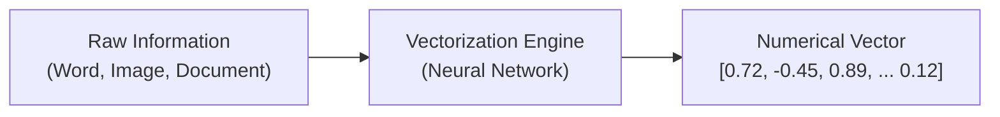

# 🤖 How Machines Represent Meaning

> **Episode 05** | *This episode follows the path from meaningless token IDs to learned embeddings, then shows how dimensions, similarity, position, context, and practical retrieval systems help machines work with relationships in language and other data.*

---

## 📌 In This Episode

```text
01 Why token IDs do not contain meaning
02 From vectorization to learned embeddings
03 Dimensions, coordinates, and vector neighborhoods
04 Semantic and cosine similarity
05 Token, text, positional, and contextual representations
06 Bias and the limits of similarity
07 Search, recommendations, clustering, and RAG
08 Multimodal embeddings and final misconceptions
```

---

## 🍎 When the Same Word Means Completely Different Things

Consider how humans use the same word in different contexts:

```
┌────────────────────────────────────────────────────────────────────────┐
│                        POLYSEMY (MULTIPLE MEANINGS)                    │
├──────────────────────────────────┬─────────────────────────────────────┤
│ "I ate a sweet apple for lunch." │ 🍎 Fruit (Edible)                   │
│ "Apple launched a new MacBook."  │ 💻 Tech Corporation (Business)      │
├──────────────────────────────────┼─────────────────────────────────────┤
│ "Sitting on a river bank."       │ 🌊 Land beside water (Geography)    │
│ "Depositing money in the bank."  │ 🏦 Financial Institution (Finance)  │
└──────────────────────────────────┴─────────────────────────────────────┘
```

How can a computer, which only sees numbers, distinguish between these completely different real-world meanings?

---

## 🏷️ Why Token IDs Do Not Contain Meaning

In the previous episode, we learned that text is converted into token IDs:

```text
Token       Dummy Token ID
dog     ──► 8123
mango   ──► 612
cat     ──► 123
grapes  ──► 8521
```

* Numerically, `8123` (dog) is very close to `8521` (grapes), but conceptually they have no relationship!
* `8123` (dog) and `123` (cat) are related domestic pets, but their integer numbers share no mathematical connection.

```
┌────────────────────────────────────────────────────────────────────────┐
│                        TWO EVERYDAY ANALOGIES                          │
├──────────────────────────────────┬─────────────────────────────────────┤
│ 1. Student Roll Numbers          │ Roll #102 and #103 sit near each    │
│                                  │ other on a list, but that tells you │
│                                  │ nothing about their personalities!  │
├──────────────────────────────────┼─────────────────────────────────────┤
│ 2. Hotel Room Numbers            │ Room 401 and 402 share a hallway,   │
│                                  │ but the guests have zero connection.│
└──────────────────────────────────┴─────────────────────────────────────┘
```

> **The Core Insight:**  
> Token IDs are merely arbitrary index labels in a vocabulary table. **Token IDs carry ZERO semantic meaning.**

---

## 📐 Vectorization: Turning Information into Numbers

> **Definition:**  
> **Vectorization** is the process of converting information (words, sentences, documents, images, audio, video, code, JSON) into a **numerical vector** (an array of numbers / coordinates).



* **Why do computers need vectors?**  
  Computers cannot calculate on words or pixels. Vectors give computers **spatial coordinates** to perform math (measuring distances, calculating angles, and grouping similarities).

---

## 🍉 A 3-Dimensional Fruit Exercise

Imagine ranking edible items along 3 human-assigned properties from $0.0$ to $1.0$:

```
┌─────────────┬──────────────────────┬──────────────────┬────────────────────────┐
│ Item        │ Sweetness (Dim 1)    │ Size (Dim 2)     │ Crunchiness (Dim 3)    │
├─────────────┼──────────────────────┼──────────────────┼────────────────────────┤
│ Apple       │ 0.7                  │ 0.4              │ 0.8                    │
│ Banana      │ 0.8                  │ 0.6              │ 0.2                    │
│ Carrot      │ 0.2                  │ 0.5              │ 0.9                    │
│ Watermelon  │ 0.6                  │ 0.9              │ 0.5                    │
└─────────────┴──────────────────────┴──────────────────┴────────────────────────┘
```

* **Apple Vector:** `[0.7, 0.4, 0.8]`
* **Banana Vector:** `[0.8, 0.6, 0.2]`

In this 3D coordinate space, **Apple** and **Carrot** share high crunchiness ($0.8$ & $0.9$), while **Apple** and **Banana** share high sweetness ($0.7$ & $0.8$).

> [!WARNING]
> Real embeddings have **hundreds or thousands of dimensions** (e.g., 768, 1536, 4096). Real dimensions are **not** labeled with human names like *"sweetness"*; meaning is learned and distributed across high-dimensional space.

---

## 🧠 What Makes a Vector an Embedding?

> **Definition:**  
> An **Embedding** is a **learned numerical vector** that captures useful semantic relationships with other items.

The word **"learned"** is what separates an embedding from an arbitrary list of random numbers.

During training across millions of sentences:
* *"A banana is a sweet fruit."*
* *"I ate a sweet banana."*
* *"Monkeys like to eat bananas."*

Words that appear in similar linguistic contexts are repeatedly adjusted so their coordinates move close together in **vector space**:

```text
4-Dimensional Simplified Example:
king   = [0.81, 0.32, 0.52, 0.17]
queen  = [0.79, 0.36, 0.48, 0.22]   <-- Coordinates are nearly identical!
banana = [0.12, 0.85, 0.05, 0.91]   <-- Coordinates point far away in another region
```

---

## 🏘️ Vector Space and Semantic Neighborhoods

When thousands of embeddings are plotted in multi-dimensional space, **semantic neighborhoods (clusters)** naturally emerge:

```
                      2D PROJECTION OF VECTOR NEIGHBORHOODS
                      
       (Royalty Neighborhood)                   (Programming Neighborhood)
          [King]     [Queen]                        [Python]     [JavaScript]
             [Crown]                                        [React]
             
       (Fruit Neighborhood)                     (Celestial Neighborhood)
          [Apple]    [Banana]                       [Sun]        [Moon]
             [Mango]                                        [Earth]
```

### Vector Arithmetic (Directional Relationships):
Embeddings capture geometric analogies through simple vector addition and subtraction:

$$\vec{v}_{\text{King}} - \vec{v}_{\text{Man}} + \vec{v}_{\text{Woman}} \approx \vec{v}_{\text{Queen}}$$

* The mathematical vector direction from `Man` to `Woman` matches the direction from `King` to `Queen`!

---

## 📈 How Many Dimensions Are Enough?

* **Height & Weight Analogy:** If you describe a person using only 2 numbers (Height and Weight), you miss their age, occupation, location, skills, and hobbies. Adding more dimensions captures richer, subtle details.
* **The Trade-Off:** More dimensions capture complexity, but require more RAM, more disk storage, and higher compute latency during search. **More dimensions do not automatically make a model smarter.**

---

## 🎯 Semantic Similarity: Looking Beyond Exact Words

**Semantic similarity** measures closeness in meaning or intent, rather than exact character matches:

```
┌────────────────────────────────────────────────────────────────────────┐
│                        KEYWORD MATCH vs. INTENT                        │
├──────────────────────────────────┬─────────────────────────────────────┤
│ Query A: "How do I center a div?"│ Shared words: near zero             │
│ Query B: "How can I align an     │ Semantic Similarity: NEAR 100% MATCH│
│ HTML element in middle of parent"│ (Both point to the exact same intent)│
└──────────────────────────────────┴─────────────────────────────────────┘
```

### The Opposite Failure (Same Words, Different Meaning):
* *"How do I learn Java?"* (Programming language)
* *"How do I make Java coffee?"* (Beverage)
* Naive keyword search groups them together; semantic embeddings separate them into different vector neighborhoods.

---

## 📐 Cosine Similarity: Comparing Vector Angles

To compare two embedding vectors, we use **Cosine Similarity**, which measures the **angle ($\theta$)** between their directions rather than their lengths:

$$\text{Cosine Similarity}(A, B) = \cos(\theta) = \frac{A \cdot B}{\|A\| \times \|B\|}$$

```
┌────────────────────────────────────────────────────────────────────────┐
│                      THE COSINE SIMILARITY SCALE                       │
├──────────────────────────┬─────────────────────────────────────────────┤
│ Angle $\theta \approx 0^\circ$   │ $\cos(\theta) \approx +1.0$ ──► Same Direction (High Similarity)    │
│ Angle $\theta \approx 90^\circ$  │ $\cos(\theta) \approx 0.0$  ──► Orthogonal (Unrelated Concepts)     │
│ Angle $\theta \approx 180^\circ$ │ $\cos(\theta) \approx -1.0$ ──► Opposite Direction                  │
└──────────────────────────┴─────────────────────────────────────────────┘
```

```
       Near 0° (Cosine ≈ 1)           Near 90° (Cosine ≈ 0)          Near 180° (Cosine ≈ -1)
          ▲      ▲                       ▲                               ▲
          │     /                        │                               │
          │    /                         │                               │
          │   /                          │                               │
          │  /                           └──────────►                    │
          │ /                                                            ▼
    (Similar Direction)               (Orthogonal / Unrelated)         (Opposite Direction)
```

---

## ⚠️ Similarity is Not Truth

Embeddings measure **topical relatedness**, NOT factual truth or agreement!

```text
Statement 1: "JavaScript is the best programming language."
Statement 2: "JavaScript is the worst programming language."
```

* Both sentences discuss opinions on JavaScript in identical grammatical structures.
* Their embedding vectors will be **highly similar**, even though their judgments are polar opposites!

> [!IMPORTANT]
> Similarity measures topical closeness. Embeddings capture relationships; they do not judge truth, quality, or safety.

---

## 🔭 Seeing Embeddings in a Projector

Using **TensorFlow Embedding Projector** (`projector.tensorflow.org`), high-dimensional vectors (e.g., 768D) can be projected into 2D or 3D using dimensionality reduction algorithms (PCA, t-SNE, UMAP).

Searching for `sun` visually highlights neighbors like `moon`, `solar`, `sky`, and `eclipse`.

---

## 📍 Token Embeddings vs. Positional Embeddings vs. Text Embeddings

```text
Sentence 1: "dog bites man"
Sentence 2: "man bites dog"
```

Both sentences contain the exact same three token embeddings (`dog`, `bites`, `man`), but their real-world meaning is completely different!

Therefore, modern language models combine two vectors:

$$\mathbf{\text{Transformer Input}} = \text{Token Embedding (Identity)} + \text{Positional Embedding (Order)}$$

```
┌──────────────────────────────────┬─────────────────────────────────────┐
│ Token Embedding                  │ Text Embedding                      │
├──────────────────────────────────┼─────────────────────────────────────┤
│ • Represents a single subword    │ • Represents an entire sentence/doc │
│ • Used internally by Transformer │ • Stored in Vector DBs for search,  │
│   attention layers               │   recommendations, and RAG systems  │
└──────────────────────────────────┴─────────────────────────────────────┘
```

---

## 🔄 Context Modifies the Representation (Polysemy Resolution)

A static embedding assigns one fixed starting vector to the word `Apple`.

Inside a Transformer, **Self-Attention** dynamically updates the token's vector based on its surrounding context across multiple layers:
* In *"I ate an **Apple** for lunch"*, attention pulls `Apple` toward fruit coordinates.
* In *"**Apple** released a new iPhone"*, attention pulls `Apple` toward technology company coordinates.

$$\mathbf{\text{"Context modifies the representation."}}$$

---

## ⚖️ When Data Patterns Include Bias

Because training data is scraped from human-created internet text, embeddings can encode societal, gender, and racial biases present in historical data (e.g., associating certain professions disproportionately with one gender). AI developers must implement mitigation and safety layers to avoid amplifying stereotypes.

---

## 🔍 Semantic Search and Hybrid Search


### Hybrid Search (The Best of Both Worlds):
* **Semantic Vector Search:** Handles intent, synonyms, and natural language concepts (*"how to fix login issue"*).
* **Exact Keyword Search (BM25):** Essential for exact part numbers, error codes (`ERR_CONNECTION_REFUSED`), dates, and legal clauses.
* **Hybrid Search** combines keyword matching and vector similarity to ensure maximum retrieval accuracy.

---

## 📚 Real-World Use Cases of Embeddings

```
┌────────────────────────────────────────────────────────────────────────┐
│                        APPLICATIONS OF EMBEDDINGS                      │
├────────────────────────┬───────────────────────────────────────────────┤
│ Recommendation Systems │ Compare user interest vector with video vector│
│                        │ (YouTube, Spotify, Netflix)                   │
├────────────────────────┼───────────────────────────────────────────────┤
│ Clustering             │ Automatically group thousands of customer     │
│                        │ support tickets by topic                      │
├────────────────────────┼───────────────────────────────────────────────┤
│ RAG (2,000-Page Book)  │ 1. Split book into paragraph chunks           │
│                        │ 2. Embed chunks into Vector Database          │
│                        │ 3. Embed user query ("What is thermodynamics")│
│                        │ 4. Retrieve closest chunk via Cosine Search   │
│                        │ 5. Pass retrieved chunk to LLM to answer!     │
├────────────────────────┼───────────────────────────────────────────────┤
│ Multimodal Search      │ Match text query "white cat" with image       │
│                        │ embedding of a white cat (CLIP)               │
└────────────────────────┴───────────────────────────────────────────────┘
```

---

## 🚫 4 Misconceptions to Leave Behind

```
┌──────────────────────────────────────┬─────────────────────────────────┐
│ Misconception                        │ Reality                         │
├──────────────────────────────────────┼─────────────────────────────────┤
│ 1. An embedding is a dictionary      │ ❌ It is a learned vector space.│
│ 2. Each dimension has 1 fixed label  │ ❌ Meaning is distributed.      │
│ 3. Similar vectors prove factual truth│ ❌ Measures topical similarity. │
│ 4. More dimensions = smarter model   │ ❌ Storage & compute trade-offs.│
└──────────────────────────────────────┴─────────────────────────────────┘
```

---

## 📝 Chapter Summary

Token IDs assign discrete numbers, but carry no meaning. Vectorization converts data into numbers, and training shapes those numbers into high-dimensional embeddings that capture semantic relationships in vector space.

Cosine similarity compares vector directions. Positional embeddings provide word order, while self-attention contextualizes words to resolve polysemy. Embeddings power semantic search, hybrid search, recommendation engines, clustering, and Retrieval-Augmented Generation (RAG).

---

## 🔥 Key Takeaways

* **Token ID vs. Embedding:** Token ID is an arbitrary label; an Embedding is a learned numerical coordinate.
* **Vector Space:** Semantic concepts naturally cluster into neighborhoods (royalty, animals, coding).
* **Cosine Similarity:** Measures vector direction angle $\theta$ ($+1$ = same direction, $0$ = orthogonal, $-1$ = opposite).
* **Similarity $\neq$ Truth:** Opposing views on the same topic share close embedding vectors.
* **Contextualization:** Self-attention dynamically updates static token vectors based on context.
* **Hybrid Search:** Merges exact keyword matching with semantic vector search.

---

Previous : [03. The Secret Language of LLMs](./03_The_Secret_Language_of_LLMs.md) | Index: [00_index.md](../00_index.md) | Next: [05. The Computational Brain of Machines](./05_The_Computational_Brain_of_Machines.md)
