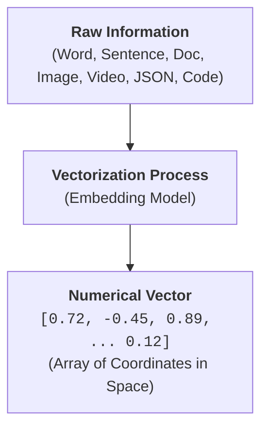
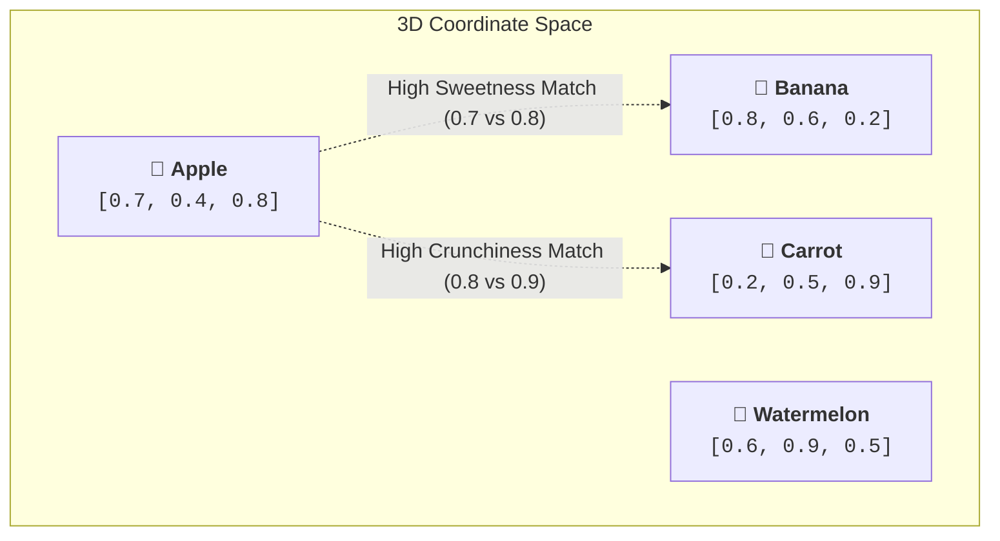
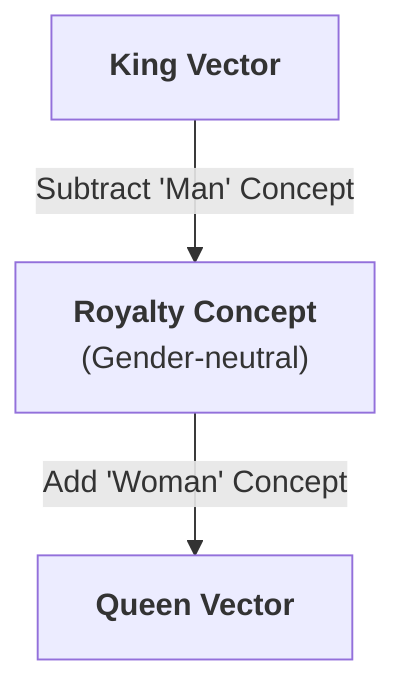
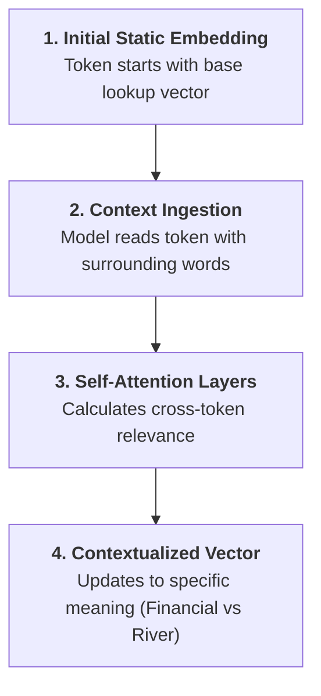
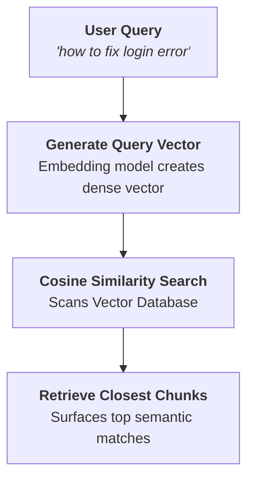
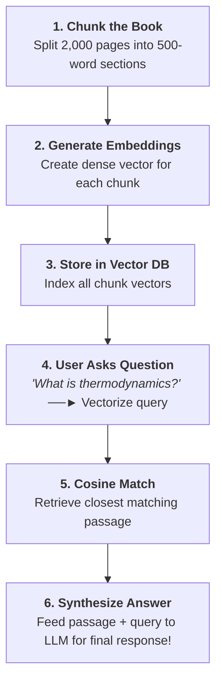

# 🤖 How Machines Represent Meaning

> **Episode 05** | *This episode follows the path from meaningless token IDs to learned embeddings, then shows how dimensions, similarity, position, context, and practical retrieval systems help machines work with relationships in language and other data.*

---

## 📌 In This Episode

```text
01 Why token IDs do not contain meaning
02 From vectorization to learned embeddings
03 Dimensions, coordinates, and vector neighborhoods
04 Semantic and cosine similarity
05 Token, text, positional, and contextual representations
06 Bias and the limits of similarity
07 Search, recommendations, clustering, and RAG
08 Multimodal embeddings and final misconceptions
```

---

## 🍎 01. When the Same Word Means Different Things (Polysemy)

Human language is packed with words whose meaning changes completely depending on how they are used. This phenomenon is called **Polysemy** (one word possessing multiple distinct meanings):

```
┌──────────────────────────────────────────────────────────────────────────────────┐
│                             POLYSEMY IN HUMAN LANGUAGE                           │
├──────────────┬──────────────────────────────────┬────────────────────────────────┤
│ Word         │ Sentence Example                 │ Real-World Meaning             │
├──────────────┼──────────────────────────────────┼────────────────────────────────┤
│ Apple        │ "I ate an apple in the afternoon."│ 🍎 Edible fruit                │
│              │ "Apple launched a new device."   │ 💻 Technology company / brand  │
├──────────────┼──────────────────────────────────┼────────────────────────────────┤
│ Bank         │ "Sitting near a peaceful river   │ 🌊 Land alongside a body of    │
│              │  bank."                          │    water                       │
│              │ "Depositing savings in the bank."│ 🏦 Financial institution       │
├──────────────┼──────────────────────────────────┼────────────────────────────────┤
│ Java         │ "Building a backend in Java."    │ ☕ Programming language         │
│              │ "Brewing a fresh cup of Java."   │ ☕ Coffee                       │
│              │ "Traveling to the island of Java."│ 🏝️ Geographic Indonesian island│
├──────────────┼──────────────────────────────────┼────────────────────────────────┤
│ Bat          │ "The bat flew out of the cave."  │ 🦇 Flying nocturnal mammal     │
│              │ "He swung the cricket bat hard." │ 🏏 Wooden sports equipment     │
├──────────────┼──────────────────────────────────┼────────────────────────────────┤
│ State        │ "California is a large state."   │ 🗺️ Political territory        │
│              │ "Water changed to a solid state."│ 🧊 Physical state of matter    │
│              │ "He was in an anxious state."    │ 🧠 Mental / emotional condition│
└──────────────┴──────────────────────────────────┴────────────────────────────────┘
```

Furthermore, **tone and sarcasm** add an extra layer of complexity. The exact same phrase—such as *"Oh, fantastic job!"*—can communicate genuine praise or stinging criticism.

How can a computer, which fundamentally operates only on numbers, understand which meaning is intended?

---

## 🏷️ 02. Why Token IDs Do Not Contain Meaning

In previous lessons, we saw that tokenizers break text into tokens and assign each token an integer **Token ID**.

To see why token IDs are completely useless for understanding meaning, consider four dummy IDs invented for demonstration:

```text
Token       Dummy Token ID
dog     ──► 8123
mango   ──► 612
cat     ──► 123
grapes  ──► 8521
```

```
┌──────────────────────────────────────────────────────────────────────────────────┐
│                          THE TOKEN ID PARADOX                                    │
├──────────────────────────────────┬───────────────────────────────────────────────┤
│ Numerical Proximity vs. Meaning  │ • 8123 (dog) and 8521 (grapes) are numerically │
│                                  │   close integers, but conceptually unrelated! │
│                                  │ • 8123 (dog) and 123 (cat) are related animal │
│                                  │   companions, but mathematically far apart!   │
└──────────────────────────────────┴───────────────────────────────────────────────┘
```

```
┌──────────────────────────────────────────────────────────────────────────────────┐
│                              TWO EVERYDAY ANALOGIES                              │
├──────────────────────────────────┬───────────────────────────────────────────────┤
│ 1. Student Roll Numbers          │ Roll numbers #102 and #103 sit adjacent on    │
│                                  │ an attendance sheet. Does that mean both      │
│                                  │ students have similar personalities, study    │
│                                  │ habits, or hobbies? No!                       │
├──────────────────────────────────┼───────────────────────────────────────────────┤
│ 2. Hotel Room Numbers            │ Rooms 401 and 402 share a corridor wall, but   │
│                                  │ the guests inside have zero connection.       │
└──────────────────────────────────┴───────────────────────────────────────────────┘
```

> **The Core Realization:**  
> A token ID is merely an arbitrary address or lookup key in a tokenizer's vocabulary table. **A token ID itself contains zero meaning.**

---

## 📐 03. Vectorization: Turning Information into Numbers

To allow computers to reason about relationships, we need **Vectorization**.



* **What is a vector?**  
  In plain language, a vector is an **ordered array (list) of numbers** representing coordinates in a multi-dimensional space.
* **What can be vectorized?**  
  * A single word, subword, sentence, paragraph, or entire document
  * An image, photo, or frame of a video
  * Audio recordings and speech waveforms
  * Structured JSON objects and source code
  * Products in an e-commerce catalog or user profiles
* **Why convert everything into numbers?**  
  Computers cannot perform arithmetic on English words or raw pixels. Numerical vectors give algorithms mathematical coordinates so they can calculate distances, measure angles, and evaluate similarities.

> [!NOTE]
> Vectorization provides the numerical container (the array of numbers); **training/learning** is what fills those numbers with meaningful relationships.

---

## 🍉 04. A 3-Dimensional Fruit Exercise

To visualize how multi-dimensional coordinates represent properties, consider scoring edible items along 3 human-assigned dimensions between $0.0$ and $1.0$:

```
┌─────────────┬──────────────────────┬──────────────────┬────────────────────────┐
│ Item        │ Sweetness (Dim 1)    │ Size (Dim 2)     │ Crunchiness (Dim 3)    │
├─────────────┼──────────────────────┼──────────────────┼────────────────────────┤
│ Apple       │ 0.7                  │ 0.4              │ 0.8                    │
│ Banana      │ 0.8                  │ 0.6              │ 0.2                    │
│ Carrot      │ 0.2                  │ 0.5              │ 0.9                    │
│ Watermelon  │ 0.6                  │ 0.9              │ 0.5 (or 0.6)           │
└─────────────┴──────────────────────┴──────────────────┴────────────────────────┘
```

* **Apple Vector:** `[0.7, 0.4, 0.8]`
* **Banana Vector:** `[0.8, 0.6, 0.2]`
* **Carrot Vector:** `[0.2, 0.5, 0.9]`
* **Watermelon Vector:** `[0.6, 0.9, 0.5]`



### Key Lesson of the Fruit Exercise:
1. One item can be described by several numerical coordinates.
2. In this 3D space, **Apple** and **Banana** are close along Dimension 1 (Sweetness), while **Apple** and **Carrot** are close along Dimension 3 (Crunchiness).
3. **Important Warning:** Real embedding dimensions are **not** hand-labeled as *"sweetness"*, *"size"*, or *"crunchiness"*. Real embeddings have hundreds or thousands of dimensions where meaning is **distributed and learned automatically**.

---

## 🧠 05. What Makes a Vector an "Embedding"?

```
┌──────────────────────────────────────────────────────────────────────────────────┐
│                              WHAT IS AN EMBEDDING?                               │
├──────────────────────────────────────────────────────────────────────────────────┤
│ An EMBEDDING is a LEARNED numerical representation of an item that captures      │
│ useful relationships with other items in a multi-dimensional vector space.       │
└──────────────────────────────────────────────────────────────────────────────────┘
```

The word **"learned"** is crucial. An embedding is not an arbitrary array of numbers assigned by a human programmer. It is generated by an **embedding model** trained on massive corpora of text.

### How Relationships are Learned from Co-occurrence:
Consider how words repeatedly appear in natural language:
* *"A banana is a sweet fruit."*
* *"I ate a delicious, sweet banana."*
* *"My kids love bananas because they are sweet."*

As related words repeatedly appear in similar sentence structures and linguistic environments, the training process continuously adjusts their numerical coordinates so that conceptually related words drift closer together.

```text
Simplified 4-Dimensional Example:
king   = [0.81, 0.32, 0.52, 0.17]
queen  = [0.79, 0.36, 0.48, 0.22]   <-- Coordinates match very closely across all dims!
banana = [0.12, 0.85, 0.05, 0.91]   <-- Coordinates point to a completely different region
```

* `0.81` vs `0.79`, `0.32` vs `0.36`, `0.52` vs `0.48`, `0.17` vs `0.22`.
* These numbers do not define "royalty" in human words; their spatial closeness mathematically captures their strong semantic relationship.

---

## 🏘️ 06. Vector Space and Semantic Neighborhoods

When thousands of learned embeddings are placed together, they form a **Vector Space** containing distinct **Semantic Neighborhoods (Clusters)**:

```
                              2D PROJECTION OF VECTOR NEIGHBORHOODS
                              
       👑 ROYALTY NEIGHBORHOOD                      💻 PROGRAMMING NEIGHBORHOOD
       [King]        [Queen]                        [Python]       [JavaScript]
          [Crown]   [Castle]                            [TypeScript]   [React]
            [Kingdom]                                        [Node.js]
            
       🍎 FRUIT NEIGHBORHOOD                        🌌 CELESTIAL NEIGHBORHOOD
       [Apple]       [Banana]                       [Sun]          [Moon]
          [Mango]   [Orange]                            [Earth]    [Planet]
            [Watermelon]                                     [Solar]
```

### Two Everyday Learning Analogies:
1. **The Child and the Fairytales:** A young child repeatedly listens to bedtime stories mentioning *kings, queens, crowns, thrones, and castles*. The child naturally builds a mental association grouping these concepts together.
2. **The Playful Adults and the Monkey:** Imagine adults constantly pointing to monkeys and calling them "kings" in front of an infant. The child's brain would naturally learn that monkeys belong in the "king" cluster. **The training data dictates the learned associations.**

### Vector Arithmetic (Directional Relationships):
Because vector space captures geometric relationships, vector directions encode conceptual analogies:

$$\vec{v}_{\text{King}} - \vec{v}_{\text{Man}} + \vec{v}_{\text{Woman}} \approx \vec{v}_{\text{Queen}}$$



* The spatial direction from `Man` to `Woman` is almost identical to the direction from `King` to `Queen`!

---

## 📈 07. How Many Dimensions Are Enough?

Why can't language models get by with just 2 or 3 dimensions like our fruit exercise?

```
┌──────────────────────────────────────────────────────────────────────────────────┐
│                         THE PERSON DESCRIPTION ANALOGY                           │
├──────────────────────────────────┬───────────────────────────────────────────────┤
│ 2 Dimensions (Height, Weight)    │ Tells you a person is 5'10" and 70kg.         │
│                                  │ Completely misses: age, profession, location, │
│                                  │ skills, language, hobbies, personality, etc.  │
├──────────────────────────────────┼───────────────────────────────────────────────┤
│ Hundreds of Dimensions           │ Captures rich, nuanced facets of identity.    │
└──────────────────────────────────┴───────────────────────────────────────────────┘
```

### Complexities that Demand High Dimensionality in Language:
1. **Polysemy:** Multiple meanings for the same word (`Apple`, `Java`, `bank`, `bat`, `state`).
2. **Multilingual Concepts:** Representing relationships across hundreds of languages.
3. **Grammar & Tone Variations:** Imperfect phrasing, slang, irony, and sarcasm.
4. **Idiomatic Expressions:** In the phrase *"terribly good"*, the word *"terribly"* does not mean bad; it acts as an intensifier meaning *"extremely good"*.

### The Dimensionality Trade-Off:
* Common embedding models use **768, 1536, or 4096 dimensions**.
* **More dimensions $\neq$ Automatically smarter model.**
* Higher dimensions require vastly more RAM, more storage, and higher compute latency during search. It is an engineering trade-off between semantic richness and computational cost.

---

## 🎯 08. Semantic Similarity: Looking Beyond Exact Keywords

**Semantic Similarity** measures how close two pieces of text are in **meaning or intent**, even if they share zero identical words:

```
┌──────────────────────────────────────────────────────────────────────────────────┐
│                       KEYWORD MATCHING vs. INTENT MATCHING                       │
├──────────────────────────────────┬───────────────────────────────────────────────┤
│ Query A: "How do I center a div?"│ Word Overlap: Zero shared important words!    │
│ Query B: "How can I align an     │ Semantic Similarity: NEAR 100% MATCH          │
│ HTML element in middle of parent"│ (Both represent the exact same coding intent) │
├──────────────────────────────────┼───────────────────────────────────────────────┤
│ Query A: "How can I reset my     │ Word Overlap: Very low                        │
│ password?"                       │ Semantic Similarity: HIGH MATCH               │
│ Query B: "I forgot my password.  │ (Both represent the same user support intent) │
│ How do I create a new one?"      │                                               │
├──────────────────────────────────┼───────────────────────────────────────────────┤
│ Query A: "The application crashes│ Word Overlap: Zero shared technical words     │
│ after login."                    │ Semantic Similarity: HIGH MATCH               │
│ Query B: "The software closes    │ (Both describe the exact same bug behavior)   │
│ immediately when I sign in."     │                                               │
└──────────────────────────────────┴───────────────────────────────────────────────┘
```

### The Opposite Failure: Exact Keywords with Different Meaning
* **Query 1:** *"How do I learn Java?"* (Software engineering)
* **Query 2:** *"How do I make Java coffee?"* (Brewing a beverage)
* A naive keyword search matches both because of the word *"Java"*, but a semantic embedding system places them in completely separate neighborhoods!

---

## 📐 09. Cosine Similarity: Comparing Vector Angles

To mathematically compare two embedding vectors, we use **Cosine Similarity**. It measures the **angle ($\theta$)** between two vectors in space, rather than their physical length:

$$\text{Cosine Similarity}(A, B) = \cos(\theta) = \frac{A \cdot B}{\|A\| \times \|B\|} = \frac{\sum (A_i \times B_i)}{\sqrt{\sum A_i^2} \times \sqrt{\sum B_i^2}}$$

```
┌──────────────────────────────────────────────────────────────────────────────────┐
│                           THE COSINE SIMILARITY SCALE                            │
├──────────────────────────┬──────────────┬────────────────────────────────────────┤
│ Angle ($\theta$)         │ Cosine Value │ Interpretation                         │
├──────────────────────────┼──────────────┼────────────────────────────────────────┤
│ Angle $\approx 0^\circ$   │ $\approx +1$ │ Same direction ──► Highly similar      │
│ Angle $\approx 90^\circ$  │ $\approx 0$  │ Orthogonal ──► Unrelated / independent │
│ Angle $\approx 180^\circ$ │ $\approx -1$ │ Opposite direction ──► Diametric       │
└──────────────────────────┴──────────────┴────────────────────────────────────────┘
```

```
       Near 0° (Cosine ≈ +1)          Near 90° (Cosine ≈ 0)         Near 180° (Cosine ≈ -1)
          ▲      ▲                       ▲                               ▲
          │     /                        │                               │
          │    /                         │                               │
          │   /                          │                               │
          │  /                           └──────────►                    │
          │ /                                                            ▼
    (Similar Direction)               (Orthogonal / Unrelated)         (Opposite Direction)
```

* **Why angle instead of length?**  
  A short sentence (*"Machine learning is fun"*) and a long paragraph explaining machine learning concepts might have different vector lengths, but their vector arrows point in the exact same direction in concept space.

---

## ⚠️ 10. Similarity is Not Truth

Embeddings measure **topical relatedness**, NOT factual truth, agreement, quality, or safety!

```text
Statement 1: "JavaScript is the best programming language in the world."
Statement 2: "JavaScript is the worst programming language in the world."
```

* Both sentences discuss opinions about JavaScript and share identical syntactic structures.
* Their embedding vectors will be **extremely close in vector space**, even though their conclusions are diametrically opposed!

> [!IMPORTANT]
> **Embeddings capture relationships; they do not judge them.**  
> Similarity does not prove truth, correctness, safety, or mutual agreement.

---

## 🔭 11. Seeing Embeddings in a Projector

Using interactive tools like the **TensorFlow Embedding Projector** (`projector.tensorflow.org`), we can explore high-dimensional spaces projected into 3D:
* Searching for **`sun`** reveals close neighbors: `moon`, `solar`, `sky`, `eclipse`.
* Searching for **`king`** reveals royalty clusters: `queen`, `prince`, `monarch`, `throne`.
* Searching for **`JavaScript`**, **`Apple`**, or **`bank`** demonstrates multiple branches of association.

> [!NOTE]
> **Projection $\neq$ Original Space:** A 2D or 3D projector is a compressed human-viewable approximation of a 768-dimensional space. It aids intuition, but does not display the exact high-dimensional geometry.

---

## 📍 12. Token, Positional, Text, and Contextual Representations

```
┌──────────────────────────────────────────────────────────────────────────────────┐
│                      WORD ORDER CHANGES MEANING COMPLETELY                       │
├──────────────────────────────────┬───────────────────────────────────────────────┤
│ Sentence 1: "dog bites man"      │ Normal, unnoteworthy occurrence               │
│ Sentence 2: "man bites dog"      │ Bizarre, headline-worthy news event!          │
└──────────────────────────────────┴───────────────────────────────────────────────┘
```

Both sentences contain the exact same three token IDs (`dog`, `bites`, `man`). If a model only looked at isolated token vectors, both sentences would look identical!

### The Solution: Combining Identity and Order
To fix this, modern LLMs inject positional information:

$$\mathbf{\text{Transformer Input}} = \text{Token Embedding (Identity)} + \text{Positional Embedding (Order)}$$

```
┌──────────────────────────────────┬───────────────────────────────────────────────┐
│ Representation Type              │ Primary Purpose                               │
├──────────────────────────────────┼───────────────────────────────────────────────┤
│ Token Embedding                  │ Represents a single token / subword identity. │
│ Positional Embedding             │ Encodes the exact position in the sequence.   │
│ Text Embedding                   │ Compresses an entire sentence, paragraph, or  │
│                                  │ document into a single vector for search/RAG. │
└──────────────────────────────────┴───────────────────────────────────────────────┘
```

### Context Modifies the Representation (The 4-Step Process):
How does a Transformer resolve polysemy for words like `Apple` or `bank`?



$$\mathbf{\text{"Context modifies the representation."}}$$

---

## ⚖️ 13. When Data Patterns Include Bias

Because training data is scraped from the public internet, it reflects human history, cultural patterns, historical inequalities, and stereotypes:
* **Gender-Occupation Associations:** If historical text frequently pairs nurses with females and engineers with males, the embedding model learns that spatial proximity.
* **Sensitive Categories:** Race, religion, ethnicity, and controversial historical narratives require careful curation and safety tuning.
* **Company Responsibility:** AI developers have a social responsibility to implement filters, balance training datasets, and prevent models from reinforcing harmful stereotypes.

---

## 🔍 14. Semantic Search and Hybrid Search



### Hybrid Search: The Industry Standard
While semantic search understands intent, exact keyword search is still irreplaceable for:
* Specific product SKUs, serial numbers, and part codes
* Exact error codes (e.g., `ERR_SSL_PROTOCOL_ERROR`)
* Precise dates, geographical coordinates, and legal contract clauses

**Hybrid Search** combines the strengths of **Keyword Search (BM25)** and **Vector Semantic Search** to provide the highest retrieval accuracy.

---

## 📚 15. Practical Applications of Embeddings

```
┌──────────────────────────────────────────────────────────────────────────────────┐
│                         REAL-WORLD EMBEDDING USE CASES                           │
├──────────────────────────┬───────────────────────────────────────────────────────┤
│ 1. Recommendations       │ Compare a video's content vector with a user's        │
│                          │ watch-history vector (YouTube, Spotify, LinkedIn, X). │
│                          │ E.g., a video on "Event Loop" matches a user query on │
│                          │ "Microtask Queue" even with different wording.        │
├──────────────────────────┼───────────────────────────────────────────────────────┤
│ 2. Clustering            │ Group thousands of unstructured customer queries,     │
│                          │ emails, or comments into thematic topic clusters.     │
├──────────────────────────┼───────────────────────────────────────────────────────┤
│ 3. Support Ticket        │ Automatically sort incoming support tickets into      │
│    Classification        │ 4 distinct business buckets:                          │
│                          │ • 💳 Billing or invoice                               │
│                          │ • 🛠️ Technical issues (video crash, login error)      │
│                          │ • 💵 Refund requests                                  │
│                          │ • 🔑 Authentication or access permission issues       │
├──────────────────────────┼───────────────────────────────────────────────────────┤
│ 4. Duplicate Detection   │ Identify duplicate forum questions or plagiarized     │
│                          │ articles by flagging cosine scores > 0.95.            │
├──────────────────────────┼───────────────────────────────────────────────────────┤
│ 5. Multimodal Retrieval  │ Align text vectors with image vectors (e.g., CLIP).   │
│                          │ Searching for "white cat" retrieves images of white   │
│                          │ cats because their vectors occupy the same space!     │
└──────────────────────────┴───────────────────────────────────────────────────────┘
```

### 📖 The 2,000-Page Physics Book RAG Workflow:
How does a language model answer questions about a massive 2,000-page book?



---

## 🚫 16. Misconceptions to Leave Behind

```
┌──────────────────────────────────────┬───────────────────────────────────────────┐
│ Common Misconception                 │ What is Actually Happening                │
├──────────────────────────────────────┼───────────────────────────────────────────┤
│ 1. An embedding is a dictionary of   │ ❌ An embedding is a learned spatial      │
│    tokens and definitions.           │    vector capturing relationships.        │
├──────────────────────────────────────┼───────────────────────────────────────────┤
│ 2. Each dimension has one fixed      │ ❌ Meaning is distributed across hundreds │
│    human label like "sweetness".     │    of unlabelled mathematical dimensions. │
├──────────────────────────────────────┼───────────────────────────────────────────┤
│ 3. Similar embeddings prove factual  │ ❌ High similarity only proves topical    │
│    truth or mutual agreement.        │    relatedness, not factual validity.     │
├──────────────────────────────────────┼───────────────────────────────────────────┤
│ 4. One embedding model is best for   │ ❌ Suitability depends on domain, text    │
│    every single task.                │    length, modality, and objective.       │
├──────────────────────────────────────┼───────────────────────────────────────────┤
│ 5. More dimensions automatically     │ ❌ Larger vectors increase storage and    │
│    make a model smarter.             │    latency without guaranteeing quality.  │
└──────────────────────────────────────┴───────────────────────────────────────────┘
```

### The Complete Language Pipeline So Far:
$$\text{Raw Text} \longrightarrow \text{Tokens} \longrightarrow \text{Token IDs} \longrightarrow \text{Token Embeddings} \longrightarrow \text{Positional Encoding} \longrightarrow \text{Transformer Layers (Contextualization)} \longrightarrow \text{Vector Similarity \& Retrieval}$$

---

## 📝 Chapter Summary

1. **Token IDs carry no semantic meaning**; they are just integer lookup indexes.
2. **Vectorization** converts diverse data types into arrays of numbers.
3. **Embeddings are learned coordinates** shaped by data co-occurrence during training.
4. **Vector spaces** organize concepts into semantic neighborhoods (royalty, coding, fruits).
5. **Cosine similarity** compares vector directions ($+1$ for similar, $0$ for unrelated, $-1$ for opposite).
6. **Similarity $\neq$ Truth**; opposing arguments on the same topic share close vectors.
7. **Positional embeddings** provide sequence order (`dog bites man` vs `man bites dog`).
8. **Self-Attention** contextualizes tokens dynamically, resolving polysemy (`Apple` fruit vs `Apple` company).
9. **Embeddings power core AI applications**: semantic search, hybrid search, recommendations, support ticket classification, RAG, and multimodal cross-search.

---

## 🔥 Key Takeaways

* **Token ID vs. Embedding:** A Token ID is an arbitrary identifier; an Embedding is a learned vector coordinate in concept space.
* **Co-occurrence Shapes Meaning:** Words appearing in similar linguistic contexts are pulled together mathematically.
* **Cosine Similarity Scale:** Evaluates the angle $\theta$ between vectors ($\cos 0^\circ = 1$, $\cos 90^\circ = 0$, $\cos 180^\circ = -1$).
* **Context is King:** Static embeddings assign initial vectors; Transformer layers modify representations dynamically based on surrounding tokens.
* **Hybrid Search:** Merges exact keyword matching (for error codes/SKUs) with vector semantic search (for natural language intent).
* **RAG Workflow:** Chunk $\rightarrow$ Embed $\rightarrow$ Store in Vector DB $\rightarrow$ Cosine Match $\rightarrow$ Augment LLM prompt.

---

Previous : [03. The Secret Language of LLMs](./03_The_Secret_Language_of_LLMs.md) | Index: [00_index.md](../00_index.md) | Next: [05. The Computational Brain of Machines](./05_The_Computational_Brain_of_Machines.md)
