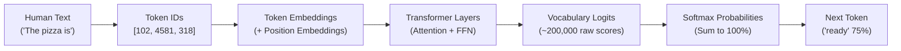
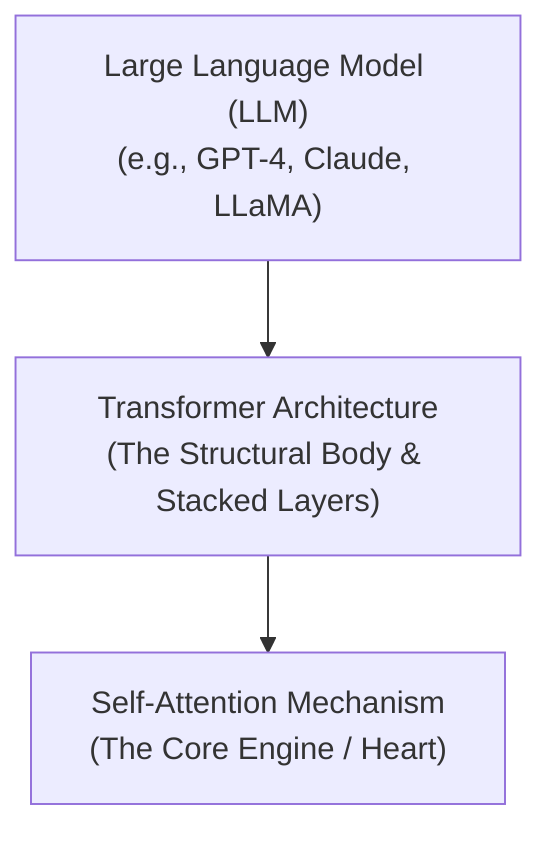
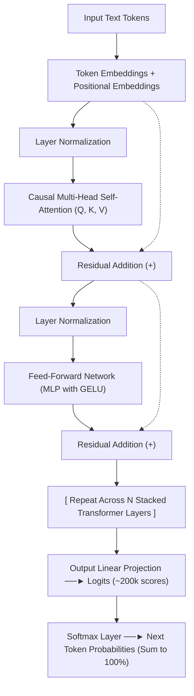

# 🤖 The Computational Brain of Machines

> **Episode 06** | *This episode treats the neural network as the prediction engine inside an LLM and follows one input through embeddings, position, normalization, causal multi-head attention, residual pathways, feed-forward processing, logits, softmax, and repeated transformer layers.*

---

## 📌 In This Episode

```text
01 Next-token prediction as an iterative loop
02 GPT, transformers, and attention
03 Embeddings, position, and normalization
04 Causal multi-head self-attention
05 Residual pathways and feed-forward processing
06 Logits, softmax, and vocabulary-wide prediction
07 Q, K, V, projection, and stacked layers
08 Inference, model scale, code, and research reading
```

---

## 🧠 The Neural Network: The Computational Brain

Machines can write poetry, code software, translate languages, and solve complex mathematical equations. What is the computation behind these capabilities?

The **Neural Network is the computational brain** of the machine.

At its core, a Generative LLM runs a simple, continuous 4-step loop:
1. **Receive input text.**
2. **Predict the next token.**
3. **Append the predicted token to the text.**
4. **Repeat.**

```
  Prompt: "The pizza is ..." ──► [Neural Network] ──► Predicts: "ready" (0.75) / "hot" (0.68)
                                                      [Plausible: delicious, round | Poor: potato, lazy]
```



---

## 🔄 Generation Reuses the Growing Context

When generating a sentence, the model does **not** process only the newest word in isolation. It feeds the **entire growing sequence** back through the network on every single step:

```text
Step 1: "The pizza is"                     ──► Predicts: "ready"
Step 2: "The pizza is ready"               ──► Predicts: "to" (0.85)
Step 3: "The pizza is ready to"            ──► Predicts: "eat"
Step 4: "The pizza is ready to eat"        ──► Predicts: "with"
Step 5: "The pizza is ready to eat with"   ──► Predicts: "Coke"
Step 6: "The pizza is ready to eat with Coke." ──► Stop Token reached! (<|endoftext|>)
```

---

## 💡 What Does GPT Mean?

```
┌────────────────────────────────────────────────────────────────────────┐
│                        DECODING THE ACRONYM                            │
├─────────────────┬──────────────────────────────────────────────────────┤
│ G - Generative  │ Generates brand-new text continuations on the fly.   │
│ P - Pre-trained │ Already trained on massive trillions of internet     │
│                 │ tokens before you ever interact with it.             │
│ T - Transformer │ The attention-based neural network architecture.     │
└─────────────────┴──────────────────────────────────────────────────────┘
```

---

## 🏛️ The Transformer Hierarchy

Introduced in the 2017 Google research paper **"Attention Is All You Need"** (by 8 researchers), the Transformer replaced older sequential architectures (RNNs and LSTMs).



> **The Metaphor:**  
> The Transformer is the *body/heart* of the LLM; **Attention** is the *heart* of the Transformer.

---

## 👀 Attention: Which Earlier Words Matter?

Consider the sentence:
> *"The cat sat on a mat because **it** was tired."*

How does the machine know what *"it"* refers to?

```text
Attention Weights for the word "it":
- "it" ↔ "the" : 0.1
- "it" ↔ "cat" : 0.9  <-- Highest Attention Score! Connects "it" to "cat".
- "it" ↔ "sat" : 0.2
- "it" ↔ "mat" : 0.4
```

### Self-Attention:
**Self-Attention** means tokens within a sequence examine and score their relationships with all other tokens in that exact same sequence. No human labels these connections—the network computes attention dynamically.

* **Resolving Polysemy:**
  * *"I went to the **bank** to deposit **money**."* $\rightarrow$ Attention connects `bank` to `deposit` and `money` (finance).
  * *"I sat on the **bank** of a **river**."* $\rightarrow$ Attention connects `bank` to `sat` and `river` (geography).

---

## 📍 Token Identity Plus Positional Embeddings

Because Transformers process all tokens in parallel, word order would be lost without position:

$$\mathbf{\text{Input to Transformer}} = \text{Token Embedding (Identity)} + \text{Positional Embedding (Location)}$$

* Distinguishes *"The dog bites a man"* from *"The man bites a dog"*.
* In educational visualizations (like nanoGPT), a toy sequence like `C B A B B C` (Token IDs `2 1 0 1 1 2`) is represented by 48-dimensional vectors before entering the layers.

---

## ⚖️ Layer Normalization (Scale Control)

As numbers pass through deep matrix multiplications and additions, values can explode (e.g., from `[0.2, 0.3]` up to `[22, 36, 56]`).

**Layer Normalization** calculates the mean and variance across vector elements, rescaling values using learned parameters **$\gamma$ (gamma / scale)** and **$\beta$ (beta / shift)** to maintain stable numerical flow across deep layers.

---

## 📐 Causal Multi-Head Self-Attention

```
┌────────────────────────────────────────────────────────────────────────┐
│                        3 ATTENTION CONCEPTS                            │
├──────────────────────┬─────────────────────────────────────────────────┤
│ 1. Self-Attention    │ Tokens gather context from within same sequence.│
│ 2. Causal Masking    │ Tokens can ONLY attend to past and present words│
│                      │ (Future words are masked to prevent cheating!). │
│ 3. Multi-Head (MHA)  │ Multiple attention heads run in parallel to scan│
│                      │ syntax, grammar, and long-range relationships.  │
└──────────────────────┴─────────────────────────────────────────────────┘
```

### Why Causal Masking Forms a Lower Triangle:
During next-token generation, future tokens do not exist yet. Therefore, future positions are masked:

```text
Sequence: "I went to the bank to deposit money"

I       [ ■ □ □ □ □ □ □ ]  (Can only see "I")
went    [ ■ ■ □ □ □ □ □ ]  (Can see "I", "went")
to      [ ■ ■ ■ □ □ □ □ ]
the     [ ■ ■ ■ ■ □ □ □ ]
bank    [ ■ ■ ■ ■ ■ □ □ ]  (Cannot see future word "money" yet!)
deposit [ ■ ■ ■ ■ ■ ■ □ ]
money   [ ■ ■ ■ ■ ■ ■ ■ ]  (Can look BACKWARD to connect with "bank"!)

(■ = Allowed Attention | □ = Masked Future Cells)
```

> **Q: If `bank` cannot look forward to `money`, how do they get connected?**  
> **A:** When the model later reaches the word `money`, `money` attends **backward** to `bank`! The relationship is captured without leaking future information into the past.

---

## 🔀 Residual Connections (Skip Connections)

Instead of replacing the incoming vector completely at each layer, a **Residual Connection** adds the original input directly to the layer's output:

$$\mathbf{\text{Updated Vector}} = \text{Original Input Vector} + \text{Layer Output Update}$$

* **Why?** It prevents the network from forgetting early token representations and creates a smooth highway for gradients to flow backward during training without vanishing.

---

## ⚙️ The Feed-Forward Network (FFN / MLP): Per-Token Processing

After Multi-Head Attention allows tokens to communicate across the sequence, the **Feed-Forward Network (FFN / MLP)** processes each token **independently**:

```
┌──────────────────────────────────┬─────────────────────────────────────┐
│ Attention Layer                  │ Feed-Forward Network (FFN / MLP)    │
├──────────────────────────────────┼─────────────────────────────────────┤
│ • Lets tokens COMMUNICATE        │ • Lets each token "THINK" in private│
│ • Gathers context across sequence│ • Processes each token independently│
│ • Causal lower-triangular mask   │ • Expands vector dimensionality (4x)│
│ • Multiple parallel heads        │ • Non-linear activation (GELU)      │
└──────────────────────────────────┴─────────────────────────────────────┘
```

---

## 📊 From Logits to a Probability Distribution

At the end of all stacked Transformer layers, the final vector must be mapped back to human words:
1. **Output Linear Projection:** Projects the hidden vector onto the entire vocabulary (e.g., ~200,000 token scores).
2. **Logits:** The raw, unnormalized numerical scores output by the linear layer.
3. **Softmax:** Converts raw logits into positive probabilities between $0.0$ and $1.0$ that sum to exactly $1.0$ (or $100\%$):

```text
Vocabulary Logits ──► Softmax ──► Probability Distribution:
- "cat"   : 62%
- "dog"   : 23%
- "car"   : 10%
- "pizza" : 5%
```

---

## 🔍 Query, Key, and Value (Q, K, V)

Inside each attention head, every token vector is transformed into three specialized vectors:

```
┌───────────┬────────────────────────────────────────────────────────────┐
│ Vector    │ Role / Meaning                                             │
├───────────┼────────────────────────────────────────────────────────────┤
│ Q = Query │ What this token is searching for ("I am 'it', find my noun")│
│ K = Key   │ What this token offers ("I am 'cat', a singular noun")     │
│ V = Value │ The actual semantic content to pass along if matched       │
│ O = Output│ The combined, projected result from all attention heads     │
└───────────┴────────────────────────────────────────────────────────────┘
```

### The JavaScript Object Analogy:
```javascript
const user = { name: "Akshay" }; // key: "name", value: "Akshay"
console.log(user.name);          // querying the key "name" retrieves the value "Akshay"
```
In attention, a token's **Query** takes dot products with all previous **Keys** to calculate attention weights; it then computes a weighted sum of their **Values**.

---

## 🧱 The Complete Transformer Block Flow



---

## 🔭 Inference, Model Scale, and Code

* **Inference:** Running a prompt through an already-trained model with frozen parameters.
* **Scale Progression (Human $\rightarrow$ Earth $\rightarrow$ Milky Way):**
  * **nanoGPT:** Toy model with $\sim 85,000$ parameters.
  * **GPT-2:** $1.5\text{ Billion}$ parameters.
  * **GPT-3:** $175\text{ Billion}$ parameters.

### Reading Model Code:
Andrej Karpathy's `nanoGPT` (`model.py`) is only $\sim 330$ lines of code! The code is concise; the vast complexity lies in **training data curation, distributed GPU orchestration, and massive compute**.

---

## 📖 A 7-Step Method for Reading Research Papers

```text
1. Read slowly, one information-dense sentence at a time.
2. When encountering an unfamiliar term, stop and investigate it immediately.
3. After a first reading pass, ask an LLM to summarize the paper.
4. Compare that summary with your own understanding.
5. Ask follow-up questions for concepts left unexplained.
6. Ask the LLM to quiz you on key mechanisms.
7. Repeat until your mental model and the paper align.
```

---

## 📝 Chapter Summary

An LLM generates text through an autoregressive loop, repeatedly predicting the next token from the full growing context. Inside the Transformer architecture, token embeddings provide identity and positional embeddings provide order. Layer normalization stabilizes numerical scales across layers.

Causal multi-head self-attention uses Query, Key, and Value vectors to model relationships across past tokens while masking future tokens in a lower-triangular matrix. Residual connections preserve prior representations, while Feed-Forward Networks enrich tokens independently. Stacked across multiple layers, the final output is projected into logits and converted by Softmax into a vocabulary-wide probability distribution.

---

## 🔥 Key Takeaways

* **Autoregressive Loop:** The growing sentence is reprocessed on every forward pass.
* **Attention Mechanism:** Enables tokens to communicate and resolve context/polysemy.
* **Causal Masking:** Restricts attention strictly to past tokens (lower triangle).
* **Residual Connections:** Adds input back to output ($x + \text{Layer}(x)$), preventing data loss.
* **Attention vs. FFN:** Attention lets tokens *communicate*; FFN lets each token *think* independently.
* **Logits to Softmax:** Raw scores (logits) are normalized into probabilities summing to $1.0$.

---

Previous : [04. How Machines Represent Meaning](./04_How_Machines_Represent_Meaning.md) | Index: [00_index.md](../00_index.md) | Next: [06. Sharpening the Brain](./06_Sharpening_the_Brain.md)
