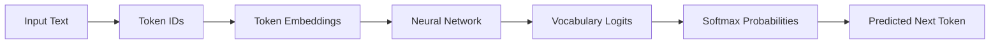
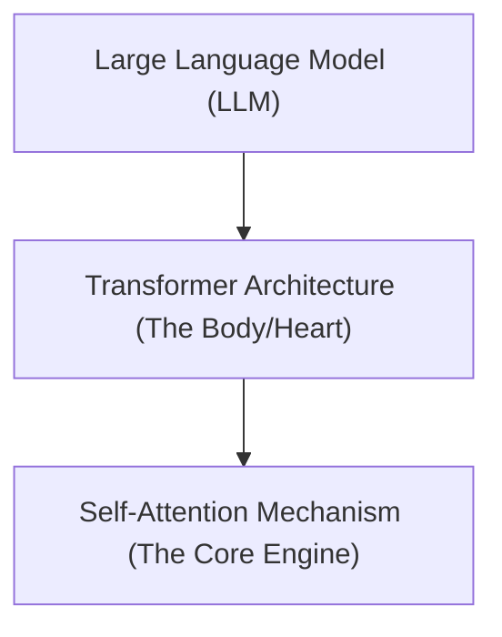
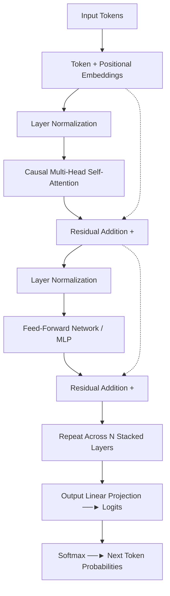

# 🤖 The Computational Brain of Machines

> **Episode 06** | *This episode treats the neural network as the prediction engine inside an LLM and follows one input through embeddings, position, normalization, causal multi-head attention, residual pathways, feed-forward processing, logits, softmax, and repeated transformer layers.*

---

## 📌 In This Episode

```text
01 Next-token prediction as an iterative loop
02 GPT, transformers, and attention
03 Embeddings, position, and normalization
04 Causal multi-head self-attention
05 Residual pathways and feed-forward processing
06 Logits, softmax, and vocabulary-wide prediction
07 Q, K, V, projection, and stacked layers
08 Inference, model scale, code, and research reading
```

---

## 🧠 The Neural Network: Prediction Engine

The neural network is the machine's **"Computational Brain"**.

It runs a simple, continuous 4-step loop:
1. **Receive input text.**
2. **Predict the next token.**
3. **Append the token to the context.**
4. **Repeat.**

```
  "The pizza is" ──► [Neural Network] ──► Predicts: "ready" (0.75) / "hot" (0.68)
```



---

## 🔄 Generation Reuses the Growing Context

The model does **not** process only the newest word in isolation. It feeds the **entire growing sentence** back through the network on every step:

```text
Step 1: "The pizza is"                   ──► Predicts: "ready"
Step 2: "The pizza is ready"             ──► Predicts: "to" (0.85)
Step 3: "The pizza is ready to"          ──► Predicts: "eat"
Step 4: "The pizza is ready to eat"      ──► Predicts: "with"
Step 5: "The pizza is ready to eat with" ──► Predicts: "Coke"
Step 6: "The pizza is ready to eat with Coke." ──► Stop Token reached!
```

---

## 💡 What Does GPT Mean?

```
┌────────────────────────────────────────────────────────────────────────┐
│                        DECODING THE ACRONYM                            │
├─────────────────┬──────────────────────────────────────────────────────┤
│ G - Generative  │ Generates brand-new text continuations.              │
│ P - Pre-trained │ Already trained on massive web data before chat.     │
│ T - Transformer │ The attention-based neural network architecture.     │
└─────────────────┴──────────────────────────────────────────────────────┘
```

---

## 🏛️ The Transformer Hierarchy

* **Origin:** 2017 Google paper *"Attention Is All You Need"* (by 8 researchers).
* Replaced older sequential models (RNNs and LSTMs).



> **The Metaphor:** The Transformer is the *heart* of the LLM; **Attention** is the *heart* of the Transformer.

---

## 👀 Attention: Which Earlier Words Matter?

> *"The cat sat on a mat because **it** was tired."*

How does the model know what *"it"* refers to?

```text
Attention Scores for "it":
- "it" ↔ "the" : 0.1
- "it" ↔ "cat" : 0.9  <-- Highest Attention! Connects "it" to "cat".
- "it" ↔ "sat" : 0.2
- "it" ↔ "mat" : 0.4
```

* **Self-Attention:** Tokens within a sequence examine and score relationships with other tokens in the same sequence without human labels.
* **Resolving Polysemy:** In *"deposit money in bank"*, attention connects `bank` to `deposit` and `money` (finance). In *"sit on bank of river"*, attention connects `bank` to `river`.

---

## 📍 Token Identity + Position

Transformers process all tokens simultaneously. To preserve sequence order:

$$\mathbf{\text{Transformer Input}} = \text{Token Embedding (Identity)} + \text{Positional Embedding (Order)}$$

* Distinguishes *"The dog bites a man"* from *"The man bites a dog"*.
* In nanoGPT toy models, tokens (e.g. `C B A B B C`) are represented by 48-dimensional vectors.

---

## ⚖️ Layer Normalization (Scale Control)

As numbers pass through deep matrix multiplications, values can blow up (e.g., from `[0.2, 0.3]` to `[22, 36, 56]`).

**Layer Normalization** calculates the mean and variance, rescaling vectors with learned weights **$\gamma$ (gamma / scale)** and **$\beta$ (beta / shift)** to keep computation numerically stable.

---

## 📐 Causal Multi-Head Attention

```
┌────────────────────────────────────────────────────────────────────────┐
│                        3 ATTENTION CONCEPTS                            │
├──────────────────────┬─────────────────────────────────────────────────┤
│ 1. Self-Attention    │ Tokens gather context from the same sequence.   │
│ 2. Causal Masking    │ Tokens can ONLY see past and present (No future)│
│ 3. Multi-Head (MHA)  │ Multiple heads scan different aspects in parallel│
└──────────────────────┴─────────────────────────────────────────────────┘
```

### Why Causal Attention Forms a Lower Triangle:
Because future tokens have not been generated yet, future cells are masked (zeroed):

```text
Sequence: "I went to the bank to deposit money"

I       [ ■ □ □ □ □ □ □ ]
went    [ ■ ■ □ □ □ □ □ ]
to      [ ■ ■ ■ □ □ □ □ ]
the     [ ■ ■ ■ ■ □ □ □ ]
bank    [ ■ ■ ■ ■ ■ □ □ ]  (Cannot look ahead to "money" yet!)
deposit [ ■ ■ ■ ■ ■ ■ □ ]
money   [ ■ ■ ■ ■ ■ ■ ■ ]  (Looks BACKWARD to connect with "bank"!)

(■ = Allowed Attention | □ = Masked Future Cells)
```

---

## 🔀 Residual Connections (Skip Connections)

Instead of overwriting the vector completely, the layer's output is **added** back to its original input:

$$\mathbf{\text{Updated Vector}} = \text{Original Vector} + \text{Layer Output Update}$$

* Preserves earlier token identity and allows gradients to flow without vanishing.

---

## ⚙️ Feed-Forward Network (FFN / MLP): Per-Token Processing

```
┌──────────────────────────────────┬─────────────────────────────────────┐
│ Attention Layer                  │ Feed-Forward Network (FFN / MLP)    │
├──────────────────────────────────┼─────────────────────────────────────┤
│ • Lets tokens COMMUNICATE        │ • Lets each token "THINK" in private│
│ • Gathers sequence relationships │ • Processes each token independently│
│ • Causal lower-triangle mask     │ • Expands & contracts dimensions    │
│ • Multiple parallel heads        │ • Non-linear activation (GELU)      │
└──────────────────────────────────┴─────────────────────────────────────┘
```

---

## 📊 From Logits to Probabilities

```text
Final Hidden Vector ──► [Linear Projection] ──► Logits (~200,000 raw scores)
                                                      │
                                                      ▼
                                              [Softmax Layer]
                                                      │
                                                      ▼
                                           Probabilities (Sum to 100% / 1.0):
                                           - "cat"   : 62%
                                           - "dog"   : 23%
                                           - "car"   : 10%
                                           - "pizza" : 5%
```

---

## 🔍 Query, Key, and Value (Q, K, V)

Inside each attention head, token vectors are split into 3 specialized roles:

```
┌───────────┬────────────────────────────────────────────────────────────┐
│ Vector    │ Role / Meaning                                             │
├───────────┼────────────────────────────────────────────────────────────┤
│ Q = Query │ What this token is searching for ("I am 'it', find my noun")│
│ K = Key   │ What this token offers ("I am 'cat', a singular noun")     │
│ V = Value │ The actual semantic content to pass along if matched       │
│ O = Output│ The projected combination of all attention heads           │
└───────────┴────────────────────────────────────────────────────────────┘
```

### JavaScript Object Analogy:
```javascript
const user = { name: "Akshay" }; // key: "name", value: "Akshay"
console.log(user.name);          // query "name" returns value "Akshay"
```

---

## 🧱 The Complete Transformer Block Walkthrough



---

## 🔭 Inference & Scale

* **Inference:** Running input through an already-trained model with frozen parameters.
* **Scale Analogy (Human $\rightarrow$ Earth $\rightarrow$ Milky Way):**
  * **nanoGPT:** $\sim 85,000$ parameters (Toy model).
  * **GPT-2:** $1.5\text{ Billion}$ parameters.
  * **GPT-3:** $175\text{ Billion}$ parameters.

### Reading Model Code (nanoGPT):
Andrej Karpathy's `nanoGPT` (`model.py`) is only $\sim 330$ lines of code! The code is concise; the difficulty is **data curation, distributed compute, and training optimization**.

---

## 📖 7-Step Method for Reading Research Papers

```text
1. Read slowly, one dense sentence at a time.
2. Stop and investigate unfamiliar terms immediately.
3. Ask an LLM to summarize the paper after a first pass.
4. Compare the summary with your own understanding.
5. Ask follow-up questions for unexplained concepts.
6. Ask the LLM to quiz you on key mechanics.
7. Repeat until your understanding and the paper align.
```

---

## 📝 Chapter Summary

An LLM generates text through an autoregressive loop, repeatedly predicting the next token from the full growing context. Inside the Transformer architecture, token embeddings provide identity and positional embeddings provide order. Layer normalization stabilizes numerical scales across layers.

Causal multi-head self-attention uses Query, Key, and Value vectors to model relationships across past tokens while masking future tokens in a lower-triangular matrix. Residual connections preserve prior representations, while Feed-Forward Networks enrich tokens independently. Stacked across multiple layers, the final output is projected into logits and converted by Softmax into a vocabulary-wide probability distribution.

---

## 🔥 Key Takeaways

* **Autoregressive Loop:** The growing sentence is reprocessed on every forward pass.
* **Attention Mechanism:** Enables tokens to communicate and resolve context/polysemy.
* **Causal Masking:** Restricts attention strictly to past tokens (lower triangle).
* **Residual Connections:** Adds input back to output ($x + \text{Layer}(x)$), preventing data loss.
* **Attention vs. FFN:** Attention lets tokens *communicate*; FFN lets each token *think* independently.
* **Logits to Softmax:** Raw scores (logits) are normalized into probabilities summing to $1.0$.

---

## ❓ Revision Questions & Answers

1. **Walk through how "The pizza is" becomes one predicted next token.**  
   *Answer:* Text is tokenized $\rightarrow$ token and positional embeddings are looked up $\rightarrow$ passed through normalized Transformer layers with causal attention and FFNs $\rightarrow$ projected to vocabulary logits $\rightarrow$ Softmax outputs probabilities where *"ready"* ($0.75$) wins.
2. **Why is the entire growing sentence processed again instead of only the newest token?**  
   *Answer:* Because the newly generated token alters the full sequence context, requiring all prior tokens to be re-attended to determine the next prediction.
3. **What does each word in Generative Pre-trained Transformer mean?**  
   *Answer:* *Generative* = creates new sequences; *Pre-trained* = trained on massive data before user interaction; *Transformer* = attention-based neural network architecture.
4. **Which paper and year does the lecture connect with the transformer architecture?**  
   *Answer:* The 2017 Google paper *"Attention Is All You Need"*.
5. **How do the illustrative attention scores resolve `it` in "The cat sat on a mat because it was tired"?**  
   *Answer:* The attention head calculates a high score ($0.9$) between `it` and `cat`, linking the pronoun to its antecedent.
6. **What does *self* mean in self-attention?**  
   *Answer:* The sequence attends to itself—tokens within the same input evaluate relationships without requiring external human labels.
7. **Why are positional embeddings added to token embeddings?**  
   *Answer:* Because Transformers process all tokens in parallel; positional embeddings inject sequential order so the model can distinguish *"dog bites man"* from *"man bites dog"*.
8. **What does layer normalization try to keep stable, and what part of the lecture's explanation remains uncertain?**  
   *Answer:* It keeps numerical vector scales stable across deep layers; the instructor notes the exact variance formulas and ratio preservation as areas where exact implementations vary.
9. **Distinguish self-attention, causal self-attention, and multi-head attention.**  
   *Answer:* Self-attention links tokens within a sequence; causal attention masks future tokens so information only flows from past to present; multi-head attention runs multiple attention mechanisms in parallel.
10. **Why must a causal position not attend to a future token?**  
    *Answer:* Because during autoregressive generation, future tokens do not yet exist; looking forward would leak unavailable information.
11. **What does a residual or skip connection add back into a layer's update?**  
    *Answer:* It adds the original unmodified input vector back to the layer's output ($x + \text{SubLayer}(x)$).
12. **Complete the lecture's contrast: "Attention lets tokens communicate; FFN lets each token..."**  
    *Answer:* "...'think' and process what it learned independently."
13. **What does MLP stand for, and how is it used in this explanation?**  
    *Answer:* Multi-Layer Perceptron (Feed-Forward Network), used to expand and contract individual token representations non-linearly using activations like GELU.
14. **What are logits, and what does softmax do to them?**  
    *Answer:* Logits are raw unnormalized output scores; Softmax converts them into positive probabilities that sum up to $1.0$ (or $100\%$).
15. **Why must the output calculation cover the whole vocabulary rather than only the four displayed candidates?**  
    *Answer:* Because the model must score every possible token in its dictionary (~200,000 tokens) to pick the globally most probable continuation.
16. **What do Q, K, and V stand for?**  
    *Answer:* Query, Key, and Value.
17. **Why does the causal attention matrix have a triangular shape?**  
    *Answer:* Because future token positions are zeroed/masked out, leaving only the lower half of the matrix active.
18. **How can the later word `money` capture a relationship with the earlier word `bank`?**  
    *Answer:* When the model processes the later position `money`, its Query attends backward to `bank`'s Key, capturing their financial relationship.
19. **What happens to the outputs of several attention heads?**  
    *Answer:* They are concatenated together and passed through an output projection linear layer.
20. **Why is one transformer block not the whole LLM?**  
    *Answer:* An LLM stacks dozens of identical Transformer blocks on top of each other, refining representations hierarchically layer by layer.
21. **What is inference, and what assumption does this episode make about the model's parameters?**  
    *Answer:* Inference is generating outputs from prompts; this episode assumes all parameter weights are already trained and frozen.
22. **What did the Bycroft visualization add to the instructor's explanation?**  
    *Answer:* It allowed learners to interactively inspect exact numerical vectors, matrix multiplications, LayerNorm steps, and attention maps.
23. **Why do the reported `model.py` and `src/models.py` line counts not prove that building an LLM is easy?**  
    *Answer:* The code implementation is concise, but the vast complexity lies in training data curation, cluster orchestration, optimization algorithms, and massive GPU compute.
24. **Reproduce the instructor's research-paper reading method in order.**  
    *Answer:* 1) Read slowly sentence-by-sentence, 2) Investigate unfamiliar terms immediately, 3) Request LLM summary, 4) Compare summary with understanding, 5) Ask follow-up questions, 6) Have LLM quiz you, 7) Repeat until mastery.

---

Previous : [04. How Machines Represent Meaning](./04_How_Machines_Represent_Meaning.md) | Index: [00_index.md](../00_index.md) | Next: [06. Sharpening the Brain](./06_Sharpening_the_Brain.md)
