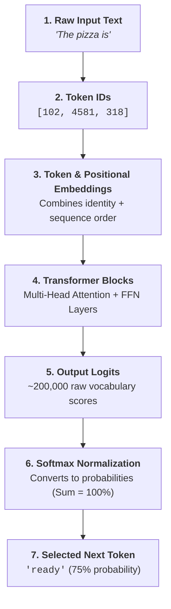
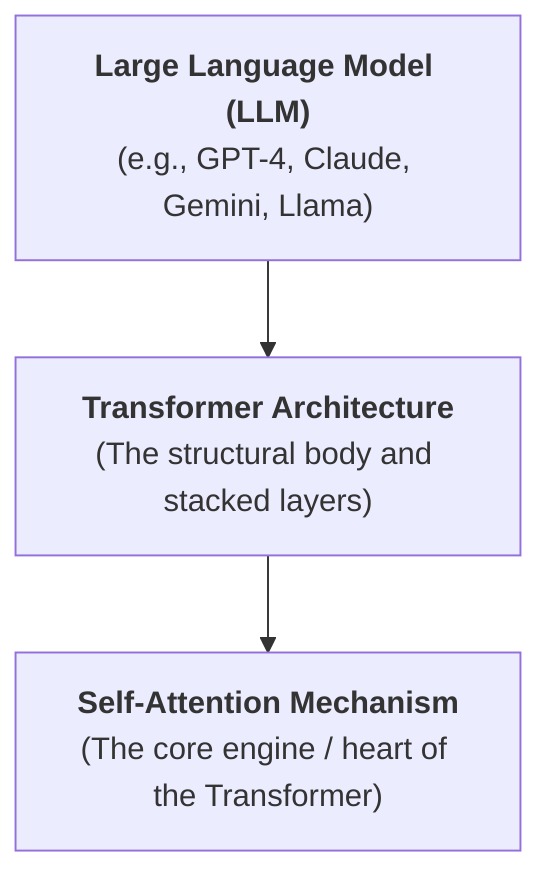
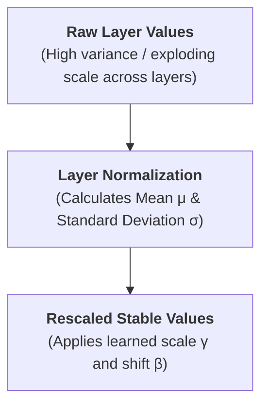
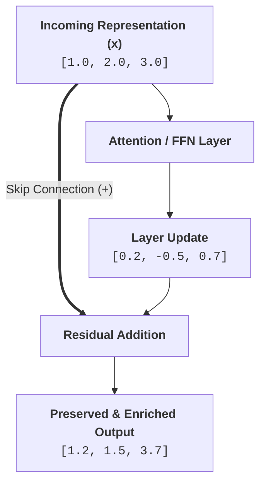
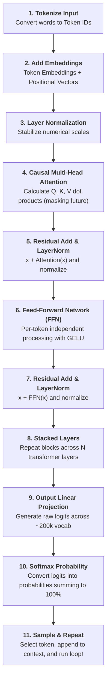

# 🤖 The Computational Brain of Machines

> **Episode 06** | *This episode treats the neural network as the prediction engine inside an LLM and follows one input through embeddings, position, normalization, causal multi-head attention, residual pathways, feed-forward processing, logits, softmax, and repeated transformer layers.*

---

## 📌 In This Episode

```text
01 Next-token prediction as an iterative loop
02 GPT, transformers, and attention
03 Embeddings, position, and normalization
04 Causal multi-head self-attention
05 Residual pathways and feed-forward processing
06 Logits, softmax, and vocabulary-wide prediction
07 Q, K, V, projection, and stacked layers
08 Inference, model scale, code, and research reading
```

---

## 🧠 01. The Neural Network as a Prediction Engine

Modern AI models can write poems, compose songs, produce videos, generate photorealistic images, pass difficult exams, write software, and assist scientific research. What computational mechanism drives all these diverse capabilities?

The answer is the **Neural Network**—the machine's **"computational brain."**

At its simplest and most fundamental level, a Generative Large Language Model performs an iterative **4-step loop**:

```text
1. Receive input text.
2. Predict the single next token.
3. Append that predicted token to the text.
4. Repeat the entire process.
```

### The Running Prompt Example:
```text
Input Prompt: "The pizza is"
```

```
┌──────────────────────────────────────────────────────────────────────────────────┐
│                           NEXT-TOKEN CANDIDATE SCORING                           │
├──────────────────────────────────┬───────────────────────────────────────────────┤
│ Plausible Candidates (High Score)│ • "ready" (Score: 0.75)                       │
│                                  │ • "hot"   (Score: 0.68)                       │
│                                  │ • "delicious", "round", "cold"                │
├──────────────────────────────────┼───────────────────────────────────────────────┤
│ Poor Candidates (Near Zero Score)│ • "potato", "bright", "lazy", "fast"          │
└──────────────────────────────────┴───────────────────────────────────────────────┘
```



---

## 🔄 02. Generation Reuses the Full Growing Context

A common beginner misconception is that the model only looks at the most recently generated token. In reality, on **every single step**, the model feeds the **entire accumulated conversation/sentence** back through the network:

```
┌──────────────────────────────────────────────────────────────────────────────────┐
│                       STEP-BY-STEP CONTEXT EXPANSION LOOP                        │
├────────┬────────────────────────────────────────┬────────────────────────────────┤
│ Step   │ Full Context Ingested by Network       │ Next Token Predicted           │
├────────┼────────────────────────────────────────┼────────────────────────────────┤
│ Step 1 │ "The pizza is"                         │ "ready" (0.75)                 │
│ Step 2 │ "The pizza is ready"                   │ "to"    (0.85)                 │
│ Step 3 │ "The pizza is ready to"                │ "eat"                          │
│ Step 4 │ "The pizza is ready to eat"            │ "with"                         │
│ Step 5 │ "The pizza is ready to eat with"       │ "Coke"                         │
│ Step 6 │ "The pizza is ready to eat with Coke." │ `<|endoftext|>` (Stop Token)   │
└────────┴────────────────────────────────────────┴────────────────────────────────┘
```

* The model halts generation when it predicts a special **Termination Token** (such as `<|endoftext|>`) indicating the completion of the response.
* Selection is not always a hard rule of picking the top #1 number; sampling techniques (temperature, top-p) can select among closely ranked high-probability candidates.

---

## 💡 03. What Does "GPT" Mean?

```
┌──────────────────────────────────────────────────────────────────────────────────┐
│                            DECODING THE "GPT" ACRONYM                            │
├─────────────────┬────────────────────────────────────────────────────────────────┤
│ G - Generative  │ The model generates brand-new text continuations on the fly,   │
│                 │ rather than simply looking up static records in a database.   │
├─────────────────┼────────────────────────────────────────────────────────────────┤
│ P - Pre-trained │ Before you ever prompt it, the model has already been trained  │
│                 │ on trillions of words across the public internet.              │
├─────────────────┼────────────────────────────────────────────────────────────────┤
│ T - Transformer │ The specific neural network architecture invented to process   │
│                 │ sequences in parallel using self-attention.                    │
└─────────────────┴────────────────────────────────────────────────────────────────┘
```

* **Search Engine vs. LLM:** A search engine indexes and retrieves existing documents; an LLM dynamically generates text token by token via repeated probability scoring.

---

## 🏛️ 04. The Transformer Architecture and Attention

The Transformer architecture was introduced in June 2017 in the landmark Google research paper:  
**"Attention Is All You Need"** (authored by 8 researchers: Vaswani et al.). It completely superseded older recurrent architectures (**RNNs** and **LSTMs** - Long Short-Term Memory).



> **The Structural Hierarchy:**  
> The Transformer is the *body* of the LLM; **Attention** is the *heart* of the Transformer.

---

## 👀 05. Attention: Which Earlier Words Matter?

Consider this classic pronoun resolution sentence:
> *"The cat sat on a mat because **it** was tired."*

How does the neural network know whether *"it"* refers to the cat, the mat, or the act of sitting?

```
┌──────────────────────────────────────────────────────────────────────────────────┐
│                      ATTENTION WEIGHTS FOR THE PRONOUN "it"                      │
├──────────────────────────┬──────────────────┬────────────────────────────────────┤
│ Word Pair Relationship   │ Attention Score  │ Interpretation                     │
├──────────────────────────┼──────────────────┼────────────────────────────────────┤
│ "it" ↔ "the"             │ 0.10             │ Minimal grammatical relevance      │
│ "it" ↔ "cat"             │ 0.90             │ 🎯 Highest connection! "it" = cat │
│ "it" ↔ "sat"             │ 0.20             │ Action context                     │
│ "it" ↔ "mat"             │ 0.40             │ Object context                     │
└──────────────────────────┴──────────────────┴────────────────────────────────────┘
```

### Self-Attention:
* **"Self"** means that tokens within a sequence examine relationships within that exact same sequence.
* No human programmer manually labels these scores; the attention heads calculate dynamic connection weights mathematically.

### Resolving Polysemy via Attention:
* *"I went to the **bank** to deposit **money**."* $\rightarrow$ Attention connects `bank` with `deposit` and `money` (finance).
* *"I sat on the **bank** of a **river**."* $\rightarrow$ Attention connects `bank` with `sat` and `river` (nature).

---

## 📍 06. Token Identity Plus Positional Embeddings

Because Transformers process all tokens in parallel (unlike RNNs which processed words sequentially one by one), word order would be completely lost without an explicit positional signal:

```
┌──────────────────────────────────────────────────────────────────────────────────┐
│                      WORD ORDER CHANGES MEANING COMPLETELY                       │
├──────────────────────────────────┬───────────────────────────────────────────────┤
│ Sentence A: "The dog bites a man."│ Normal domestic incident                      │
│ Sentence B: "The man bites a dog."│ Bizarre, sensational headline!                │
└──────────────────────────────────┴───────────────────────────────────────────────┘
```

$$\mathbf{\text{Transformer Input Vector}} = \text{Token Embedding (Identity)} + \text{Positional Embedding (Order)}$$

* In educational visualizers (like nanoGPT), a toy sequence like `C B A B B C` (Token IDs `2 1 0 1 1 2`) is represented by 48-dimensional vectors before entering the network.
* Both vectors are added element-by-element to give the model both **what** the word is and **where** it appears.

---

## ⚖️ 07. Layer Normalization: Numerical Scale Control

As numbers flow through dozens of stacked matrix multiplications, additions, and residual updates, numerical values tend to grow uncontrollably:
* Starting vector values around `[0.20, 0.34, 0.50, 0.62]` can explode into `[22.0, 36.0, 14.0, 56.0]`.



* **Layer Normalization** calculates the mean ($\mu$) and standard deviation ($\sigma$) across the vector components.
* It applies learned parameters: **$\gamma$ (gamma / scale weight)** and **$\beta$ (beta / shift bias)** to bring numbers back into a well-behaved, stable distribution.

---

## 📐 08. Causal Multi-Head Self-Attention

```
┌──────────────────────────────────────────────────────────────────────────────────┐
│                          3 CORE ATTENTION DISTINCTIONS                           │
├──────────────────────────┬───────────────────────────────────────────────────────┤
│ 1. Self-Attention        │ Tokens examine and pull information from other tokens │
│                          │ in the same sequence.                                 │
├──────────────────────────┼───────────────────────────────────────────────────────┤
│ 2. Causal Masking        │ A token is strictly forbidden from looking into the   │
│                          │ future; it can only attend to itself and past tokens! │
├──────────────────────────┼───────────────────────────────────────────────────────┤
│ 3. Multi-Head (MHA)      │ Multiple attention heads run in parallel, each        │
│                          │ focusing on different aspects (grammar, facts, tone). │
└──────────────────────────┴───────────────────────────────────────────────────────┘
```

### Why Causal Masking Forms a Lower Triangle Matrix:
During next-token generation, future tokens do not exist yet. To prevent the model from "cheating" during training, future positions are masked (zeroed out):

```text
Sentence: "I went to the bank to deposit money"

Position   I     went    to    the   bank  deposit  money
I        [ ■      □      □      □     □       □       □   ]
went     [ ■      ■      □      □     □       □       □   ]
to       [ ■      ■      ■      □     □       □       □   ]
the      [ ■      ■      ■      ■     □       □       □   ]
bank     [ ■      ■      ■      ■     ■       □       □   ]  <-- Cannot see future "money"
deposit  [ ■      ■      ■      ■     ■       ■       □   ]
money    [ ■      ■      ■      ■     ■       ■       ■   ]  <-- Can look BACKWARD to "bank"!

(Legend: ■ = Allowed Attention | □ = Masked Future Token)
```

> **Q: If `bank` cannot look forward to `money`, how does the model connect them?**  
> **A:** When the sequence reaches the later position `money`, `money` is allowed to look **backward** to `bank`! The relationship is preserved without leaking future information into earlier tokens.

---

## 🔀 09. Residual Connections (Skip Connections)

A **Residual Connection** (or skip connection) creates an alternate highway that bypasses a layer and adds the original input directly to the layer's output:

$$\mathbf{\text{Output}} = \mathbf{x} + \text{Layer}(\mathbf{x})$$



* **Why is this critical?**  
  1. It ensures the model does not discard prior representations and start from scratch.
  2. It allows mathematical gradients to flow smoothly during training across 100+ stacked layers without vanishing into zero.

---

## ⚙️ 10. The Feed-Forward Network (FFN / MLP): Per-Token Processing

After Multi-Head Attention allows tokens to communicate across the sequence, the **Feed-Forward Network (FFN / Multi-Layer Perceptron)** processes each token **independently**:

```
┌──────────────────────────────────────────────────────────────────────────────────┐
│                   ATTENTION vs. FEED-FORWARD NETWORK (FFN)                       │
├──────────────────────────────────┬───────────────────────────────────────────────┤
│ Attention Mechanism              │ Feed-Forward Network (FFN / MLP)              │
├──────────────────────────────────┼───────────────────────────────────────────────┤
│ • Lets tokens COMMUNICATE        │ • Lets each token "THINK" independently       │
│ • Gathers relationships across   │ • Enriches individual token representations   │
│   the entire permitted sequence  │ • Expands vector size (e.g., 4x) then shrinks │
│ • Constrained by causal mask     │ • Applies non-linear activation (GELU)        │
└──────────────────────────────────┴───────────────────────────────────────────────┘
```

* **GELU (Gaussian Error Linear Unit):** The standard non-linear activation function used inside modern Transformer MLPs.

---

## 📊 11. From Logits to a Probability Distribution

At the end of all stacked Transformer layers, the model must turn high-dimensional vectors back into words:
1. **Output Linear Projection:** A linear matrix that projects the final vector into a score for every single word in the vocabulary ($\sim 200,000$ tokens).
2. **Logits:** The raw, unbounded numerical scores output by the linear projection.
3. **Softmax:** A mathematical function that converts raw logits into positive probabilities that **sum to exactly $1.0$ (or $100\%$)**:

```text
Vocabulary Logits ──► Softmax ──► Probability Distribution:
- "cat"   : 62%
- "dog"   : 23%
- "car"   : 10%
- "pizza" : 5%
(Sum = 100% across all ~200k vocabulary tokens)
```

---

## 🔍 12. Query, Key, and Value (Q, K, V)

Inside every attention head, each token vector is projected into three distinct vectors:

```
┌───────────┬──────────────────────────────────────────────────────────────────────┐
│ Vector    │ Purpose in Attention                                                 │
├───────────┼──────────────────────────────────────────────────────────────────────┤
│ Q = Query │ What this token is searching for ("I am 'it', find my antecedent")   │
│ K = Key   │ What this token advertises ("I am 'cat', a singular animal noun")    │
│ V = Value │ The actual semantic payload to pass along if Query & Key match       │
│ O = Output│ The projected combination of results from all parallel attention heads│
└───────────┴──────────────────────────────────────────────────────────────────────┘
```

### The JavaScript Object Lookup Analogy:
```javascript
const user = {
  name: "Akshay"
};
// Querying the key "name" retrieves the value "Akshay"
console.log(user["name"]); 
```
* **In Self-Attention:** A token's **Query** takes dot products with all prior **Keys** to determine attention weight percentages. It then calculates a weighted average of their **Values**.

---

## 🧱 13. The Complete 11-Step Transformer Pipeline



---

## 🔭 14. Inference, Model Scale, and Code

* **Inference:** Running input through a model whose parameters (weights) are **already trained and frozen**.
* **Scale Progression (Human $\rightarrow$ Earth $\rightarrow$ Milky Way):**
  * **nanoGPT:** Toy educational model ($\sim 85,000$ parameters).
  * **GPT-2:** $1.5\text{ Billion}$ parameters.
  * **GPT-3:** $175\text{ Billion}$ parameters.

### Reading Model Code:
* Andrej Karpathy's `nanoGPT` (`model.py`) contains only $\sim 330$ lines of PyTorch code.
* GPT-2's core architecture (`src/models.py`) is $\sim 174$ lines.
* **The Insight:** The core equations of a Transformer are concise and elegant; the true monumental challenge lies in **training data curation, massive GPU cluster orchestration, and compute scale**.

---

## 📖 15. A 7-Step Method for Reading Research Papers

```text
1. Read slowly, one information-dense sentence at a time.
2. When encountering an unfamiliar term, pause and investigate it before continuing.
3. After a first reading pass, ask an LLM to provide a structured summary.
4. Compare the LLM summary with your own notes instead of accepting it blindly.
5. Ask targeted follow-up questions for concepts the paper does not explain.
6. Ask the LLM to quiz you; answer in writing or voice mode.
7. Repeat the cycle until the paper's concepts and your understanding align.
```

---

## 📝 Chapter Summary

An LLM generates text through an autoregressive next-token prediction loop, reprocessing the full accumulated context on each pass. Inside the Transformer architecture, token embeddings provide identity while positional embeddings provide sequence order. Layer normalization stabilizes numerical variance across deep layers.

Causal multi-head self-attention uses Query, Key, and Value vectors to allow tokens to communicate with past tokens while masking future positions in a lower-triangular matrix. Residual skip connections preserve prior representations, while Feed-Forward Networks process tokens independently. Stacked across multiple layers, the final vector is projected into logits and converted by Softmax into a vocabulary-wide probability distribution.

---

## 🔥 Key Takeaways

* **Autoregressive Loop:** Next-token generation re-evaluates the entire context on every iteration.
* **GPT Meaning:** Generative Pre-trained Transformer.
* **Self-Attention:** Tokens dynamically calculate attention weights across the sequence.
* **Causal Lower Triangle:** Tokens only attend backward; future tokens are strictly masked.
* **Residual Connections:** $x + \text{Layer}(x)$ prevents information loss and vanishing gradients.
* **Attention vs. FFN:** Attention lets tokens *communicate*; FFN lets each token *think* independently.
* **Logits to Softmax:** Raw linear scores are converted into probabilities summing to $1.0$.

---

Previous : [04. How Machines Represent Meaning](./04_How_Machines_Represent_Meaning.md) | Index: [00_index.md](../00_index.md) | Next: [06. Sharpening the Brain](./06_Sharpening_the_Brain.md)
