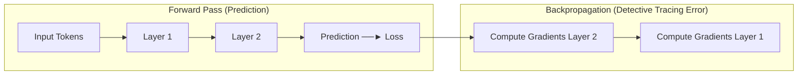
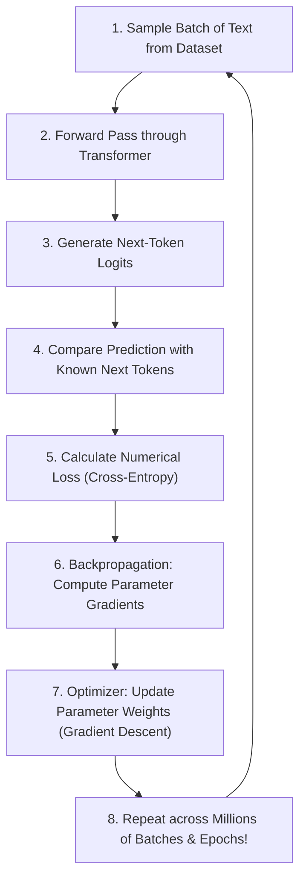

# 🤖 Sharpening the Brain

> **Episode 07** | *This episode moves from an already-trained transformer to the process that makes it useful, explaining parameters, forward prediction, loss, backpropagation, gradients, optimizers, self-supervised targets, generalization, overfitting, and the repeated training loop.*

---

## 📌 In This Episode

```text
01 What learning means for a neural network
02 Parameters, training data, and prediction targets
03 Forward pass and loss
04 Backpropagation, gradients, and optimizers
05 Gradient descent and learning rate
06 The complete self-supervised training loop
07 Training, inference, generalization, and overfitting
08 Distributed training, learned embeddings, and understanding
```

---

## 👶 From a Trained Model to an Untrained One

In previous lessons, we watched data flow through an already-trained Transformer that accurately predicted words (*"The pizza is ready to..."* $\rightarrow$ *"eat"*).

Now, imagine starting with a **completely untrained neural network**:

```
┌────────────────────────────────────────────────────────────────────────┐
│                        PROMPT: "The sky is ..."                        │
├──────────────────────────────────┬─────────────────────────────────────┤
│ Trained Model (After Learning)   │ Untrained Model (Newborn State)     │
├──────────────────────────────────┼─────────────────────────────────────┤
│ Predicts: "blue" (85%)           │ Predicts: "potato", "banana",       │
│                                  │ "magic", or random gibberish!       │
└──────────────────────────────────┴─────────────────────────────────────┘
```

An untrained model is like a newborn baby seeing the world for the very first time.

> **Definition of Learning:**  
> For a neural network, **learning** means repeatedly adjusting its internal parameters so that future next-token predictions become more accurate.

---

## 🎛️ Parameters: The Billions of Adjustable Knobs

A neural network contains billions of adjustable floating-point numbers called **parameters (weights and biases)**.

```
┌────────────────────────────────────────────────────────────────────────┐
│                        3 INTUITIVE ANALOGIES                           │
├───────────────────┬───────────────────┬────────────────────────────────┤
│ 1. DJ Controller  │ 2. Old Radio Dial │ 3. Guitar Tuning               │
│ Billions of knobs │ Turning the dial  │ Training is TUNING the strings;│
│ tuned to produce  │ to lock on exact  │ Inference is PLAYING the tuned │
│ the perfect sound │ broadcast station │ guitar to make music!          │
└───────────────────┴───────────────────┴────────────────────────────────┘
```

* **Scale of Parameters:** GPT-3 contains **175 Billion parameters** ($17,500\text{ crore}$ numbers). Training makes tiny, coordinated updates (e.g., $2.5 \rightarrow 2.4 \rightarrow 2.2$) to reduce error.

---

## 🔍 Which Values Are Parameters?

```text
Inside the Transformer:
- Token Embedding Table coordinates (768D to 4096D per token)
- Query (Wq), Key (Wk), Value (Wv), and Output (Wo) Attention weights
- Layer Normalization scale (γ) and shift (β)
- Feed-Forward Network (FFN / MLP) projection weights and biases
```

---

## 🗄️ Do Parameters Store Knowledge?

> [!NOTE]
> **Interview Perspective:**  
> Parameters do **not** store text files, databases, or Wikipedia articles. They are continuous mathematical weights that encode **statistical patterns and linguistic relationships**. The instructor calls parameters **"Knowledge Enablers"**.

* **Training Data vs. Parameters:**
  * **Training Data:** The external text corpus (terabytes of cleaned web text, books, code).
  * **Parameters:** The internal mutable numbers living inside the network that change as they learn from the data.

---

## 🚀 The Forward Pass and a Known Target

A **Forward Pass** feeds an input sequence through the network to generate next-token prediction probabilities:

```
  Source Text: "The sky is blue"
  
  Input Sample : "The sky is"
  Known Target : "blue"  (Self-supervised target from the text itself!)
  Untrained Pass: Predicts "banana" (80%) vs "blue" (2%)  <-- High Error!
```

---

## 📉 Loss: Measuring the Mistake

> **Definition:**  
> A **Loss Function** converts prediction quality into a single numerical error score:
> * **Small Loss:** The correct target (`blue`) received a high probability ($90\%$).
> * **High Loss:** The wrong token (`banana`) received $80\%$, while target (`blue`) got only $2\%$.

$$\text{Predict} \longrightarrow \text{Compare with Target} \longrightarrow \text{Calculate Loss} \longrightarrow \text{Update Parameters}$$

---

## 🕵️ Backpropagation: Detective Tracing Error Backward

With 175 billion parameters, a single loss number is not enough. Which specific weights made the error?



**Backpropagation** acts as a detective. Using calculus (the **Chain Rule**), it works backward from the output error through all layers, computing the **gradient** for every single parameter.

### Gradients Are Sensitivities:
A **gradient** tells us:
1. **Direction:** Whether to increase or decrease the parameter to reduce loss.
2. **Sensitivity:** How strongly that specific parameter affects the total error.

> **Backpropagation vs. The Optimizer:**  
> $$\mathbf{\text{Backpropagation DIAGNOSES gradients; the Optimizer ADJUSTS the weights.}}$$

---

## ⛰️ Gradient Descent: The Foggy-Mountain Analogy

> **Definition:**  
> **Gradient Descent** is an optimization algorithm that minimizes the loss function by taking small steps in the direction opposite to the gradient.

```
┌──────────────────────────────┬──────────────────────────────┐
│ Foggy Mountain Analogy       │ Deep Learning Concept        │
├──────────────────────────────┼──────────────────────────────┤
│ Current Altitude / Height    │ Loss Value (Error)           │
│ Local Ground Slope           │ Gradient Direction           │
│ Step Size                    │ Learning Rate ($\alpha$)     │
│ Repeated Steps Downhill      │ Iterative Parameter Updates  │
│ Valley Bottom                │ Minimized Loss (Trained)     │
└──────────────────────────────┴──────────────────────────────┘
```

```
  Loss ▲
       │    Current State (High Loss)
       │       ●
       │        \   Step-by-step downhill descent (Learning Rate = Step Size)
       │         \
       │          \____● (Valley Bottom = Minimized Error!)
       └────────────────────────────────────────► Parameter Values
```

### Learning Rate ($\alpha$) Challenges:
* **Too Small:** Step size is tiny; training takes months and gets stuck on flat plateaus.
* **Too Large:** Overshoots the valley bottom, causing loss to explode into infinity ($NaN$).

---

## ⚖️ Batch vs. Stochastic vs. Mini-Batch Gradient Descent

```
┌───────────────────┬───────────────────┬────────────────────────────────┐
│ Batch GD          │ Stochastic (SGD)  │ Mini-Batch GD (Standard)       │
├───────────────────┼───────────────────┼────────────────────────────────┤
│ • Uses full data  │ • Uses 1 sample   │ • Uses small batch (32-4096)   │
│ • Stable but SLOW │ • Fast but NOISY  │ • 🎯 BALANCED, FAST & STABLE!  │
│ • Too big for GPU │ • Fluctuates wildly│ • Fits GPU VRAM perfectly     │
└───────────────────┴───────────────────┴────────────────────────────────┘
```

---

## 🔄 The Complete 8-Step Training Loop



---

## 🧠 Why is Next-Token Pre-Training "Self-Supervised"?

* In classical supervised learning (like cat vs dog classification), humans must manually tag thousands of images.
* In next-token prediction, **the text itself provides the ground-truth target**:
  * In *"The sky is blue"*, we hide *"blue"* and make it the target.
  * No human annotators needed $\implies$ Enables training on **trillions of internet tokens**!

---

## 📖 Key Training Terminology: Sample to Epoch

```
┌──────────────────┬─────────────────────────────────────────────────────┐
│ Term             │ Meaning & Definition                                │
├──────────────────┼─────────────────────────────────────────────────────┤
│ Sample           │ A single text example/sequence.                     │
│ Dataset          │ The complete collection of all training samples.    │
│ Batch            │ A group of samples processed simultaneously on GPUs.│
│ Training Step    │ One forward pass + loss + backprop + weight update. │
│ Epoch            │ One complete pass through the entire dataset.       │
│ Context Window   │ The maximum token length processed at once.         │
└──────────────────┴─────────────────────────────────────────────────────┘
```

---

## ⚙️ Training vs. Inference Compared

| Feature | Training Phase | Inference Phase |
| :--- | :--- | :--- |
| **Core Action** | Forward pass $\rightarrow$ Loss $\rightarrow$ Backprop $\rightarrow$ Update weights | Forward pass $\rightarrow$ Generate output tokens |
| **Parameters** | **Mutable (Updating constantly)** | **Frozen (Fixed weights)** |
| **Compute Scale** | Massive ($10M+, GPU clusters, months) | Lightweight (Milliseconds per token) |
| **Analogy** | **Tuning the guitar strings** | **Playing the tuned guitar** |

---

## 🎯 Generalization vs. Overfitting

```
┌────────────────────────────────────────────────────────────────────────┐
│                    GENERALIZATION vs. OVERFITTING                      │
├──────────────────────────────────┬─────────────────────────────────────┤
│ Generalization (The Goal)        │ Overfitting (The Failure)           │
├──────────────────────────────────┼─────────────────────────────────────┤
│ • Training: "The sky is blue"    │ • Dataset repeats "The sky is blue" │
│ • Unseen Test: "On a sunny day,  │   10,000 times                      │
│   the sky looked..."             │ • Fails on slight wording changes   │
│ • ✅ Outputs: "blue"             │ • ❌ Memorizes text like a parrot   │
│ • Learns underlying rules!       │   without understanding patterns!   │
└──────────────────────────────────┴─────────────────────────────────────┘
```

---

## 🖥️ Distributed GPU Clusters & Learned Embeddings

* **GPU Clusters:** Training frontier LLMs requires orchestrating thousands of **NVIDIA H100 GPUs** using data and tensor parallelism.
* **Embeddings Learn from Scratch:** Embeddings for `king` and `queen` begin as random numbers. Backpropagation passes gradients to embedding vectors along with all other layers, causing the optimizer to move their coordinates together naturally!

---

## ❓ Does Prediction Count as Understanding?

* **Engineering View:** If a model writes working code, passes medical exams, and diagnoses bugs, its functional output behaves as understanding.
* **Philosophical View:** The model is a high-dimensional mathematical optimization engine. When it says *"I am sad"*, it experiences no biological feelings or conscious awareness.

---

## 📝 Chapter Summary

For a neural network, learning means adjusting parameters to minimize next-token prediction error. The model runs a forward pass, compares its output against the self-supervised target from the text, and calculates loss.

Backpropagation traces backward through the layers using calculus to compute gradients, and the optimizer (using gradient descent and a learning rate) updates the parameters. Training tunes the model across distributed GPU clusters, building generalizable representations that apply to unseen prompts.

---

## 🔥 Key Takeaways

* **Learning Definition:** Iteratively adjusting weights to reduce prediction loss.
* **Self-Supervised Target:** The source text supplies its own ground-truth target.
* **Backprop vs. Optimizer:** Backprop *diagnoses* gradients; Optimizer *adjusts* parameters.
* **Gradient Descent:** Moves parameters downhill toward minimized loss.
* **Mini-Batch GD:** The universal industry standard balancing speed and stability.
* **Generalization:** Model applies learned patterns to novel, unseen prompts.

---

Previous : [05. The Computational Brain of Machines](./05_The_Computational_Brain_of_Machines.md) | Index: [00_index.md](../00_index.md) | Next: [07. From a Base Model to an AI Assistant](./07_From_a_Base_Model_to_an_AI_Assistant.md)
