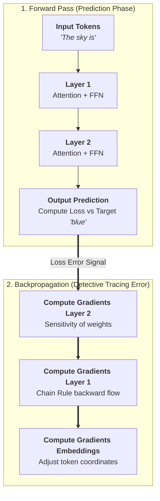
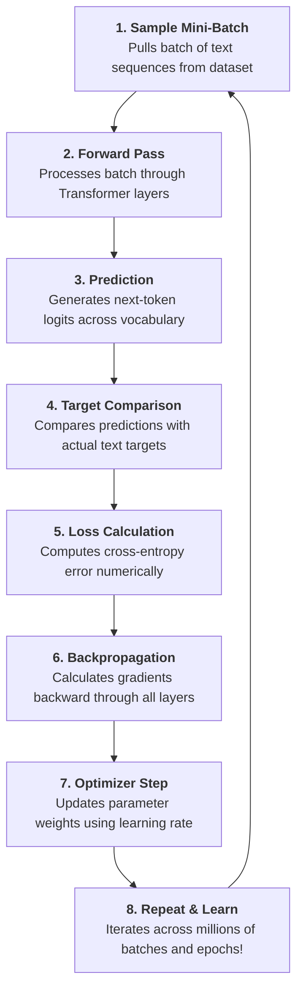

# 🤖 Sharpening the Brain

> **Episode 07** | *This episode moves from an already-trained transformer to the process that makes it useful, explaining parameters, forward prediction, loss, backpropagation, gradients, optimizers, self-supervised targets, generalization, overfitting, and the repeated training loop.*

---

## 📌 In This Episode

```text
01 What learning means for a neural network
02 Parameters, training data, and prediction targets
03 Forward pass and loss
04 Backpropagation, gradients, and optimizers
05 Gradient descent and learning rate
06 The complete self-supervised training loop
07 Training, inference, generalization, and overfitting
08 Distributed training, learned embeddings, and understanding
```

---

## 👶 01. From a Trained Model to an Untrained One

In previous lessons, we watched data flow through an already-trained Transformer that could easily finish phrases (*"The pizza is ready to..."* $\rightarrow$ *"eat"*).

Now, let us strip away that assumption and start with a **completely untrained neural network**:

```
┌──────────────────────────────────────────────────────────────────────────────────┐
│                         UNTRAINED vs. TRAINED PREDICTIONS                        │
├──────────────────────────────┬───────────────────────────────────────────────────┤
│ Prompt: "The sky is ..."     │ Model Output                                      │
├──────────────────────────────┼───────────────────────────────────────────────────┤
│ 👶 Untrained Neural Network  │ "potato", "banana", "magic", "cool", or gibberish!│
│ 🎓 Trained Neural Network    │ "blue" (High confidence / high probability)       │
└──────────────────────────────┴───────────────────────────────────────────────────┘
```

An untrained model is like a newborn infant experiencing the world for the first time—everything looks like random noise.

```
┌──────────────────────────────────────────────────────────────────────────────────┐
│                             WHAT IS "LEARNING"?                                  │
├──────────────────────────────────────────────────────────────────────────────────┤
│ For a neural network, LEARNING means repeatedly adjusting its internal numerical │
│ parameters so that its future next-token predictions become progressively better.│
└──────────────────────────────────────────────────────────────────────────────────┘
```

---

## 🎛️ 02. Parameters: The Adjustable Knobs Inside the Network

A neural network contains an astronomical collection of adjustable numbers called **Parameters (Weights and Biases)**. These numbers dictate every calculation: embedding lookups, Q/K/V attention dot products, feed-forward transformations, and output logit scoring.

```
┌──────────────────────────────────────────────────────────────────────────────────┐
│                              THREE EVERYDAY ANALOGIES                            │
├─────────────────────┬─────────────────────┬──────────────────────────────────────┤
│ 1. DJ Controller    │ 2. Old Radio Tuner  │ 3. Guitar Tuning vs. Playing         │
├─────────────────────┼─────────────────────┼──────────────────────────────────────┤
│ A massive board with│ Tuning a radio knob │ • Training is TUNING the guitar      │
│ millions of dials.  │ to eliminate static │   strings until the pitch is right.  │
│ Turning any one knob│ and lock onto a     │ • Inference is PLAYING the tuned     │
│ slightly alters the │ clear, crisp song   │   guitar to produce beautiful music. │
│ overall sound.      │ frequency.          │                                      │
└─────────────────────┴─────────────────────┴──────────────────────────────────────┘
```

### The Scale of Modern Parameters:
* **GPT-3:** Contains **175 Billion parameters** ($17,500\text{ crore}$ numbers).
* Training makes tiny, continuous numerical micro-adjustments (e.g., $2.50 \rightarrow 2.40 \rightarrow 2.20$) across all billions of knobs simultaneously until prediction errors shrink.

---

## 🔍 03. Which Values Inside the Model Are Parameters?

```
┌──────────────────────────────────────────────────────────────────────────────────┐
│                        THE PARAMETER FAMILIES INSIDE AN LLM                      │
├────────────────────────────┬─────────────────────────────────────────────────────┤
│ Component                  │ Parameter Family                                    │
├────────────────────────────┼─────────────────────────────────────────────────────┤
│ Token Embedding Table      │ Coordinates for every token in vocabulary           │
│ Multi-Head Attention       │ Query ($W_q$), Key ($W_k$), Value ($W_v$), and      │
│                            │ Output Projection ($W_o$) weight matrices           │
│ Layer Normalization        │ Scale ($\gamma$, gamma) and Shift ($\beta$, beta)   │
│ Feed-Forward Network (MLP) │ Input projection weights, hidden layer weights,     │
│                            │ output weights, and additive bias vectors           │
└────────────────────────────┴─────────────────────────────────────────────────────┘
```

In a fresh, untrained model, all these values start as **random numbers**. Training reshapes them into useful mathematical filters.

---

## 🗄️ 04. Do Parameters Store "Knowledge"? (Interview Perspective)

> [!IMPORTANT]
> **Key Distinction:**  
> Parameters do **not** contain a database of text files, memorized paragraphs, or Wikipedia articles. They are continuous floating-point weights that encode **distributed statistical patterns and relationships**. The instructor calls parameters **"Knowledge Enablers."**

```
┌──────────────────────────────────────────────────────────────────────────────────┐
│                        TRAINING DATA vs. PARAMETERS                              │
├──────────────────────────────────┬───────────────────────────────────────────────┤
│ Training Data (External)         │ Parameters (Internal)                         │
├──────────────────────────────────┼───────────────────────────────────────────────┤
│ • Terabytes / Petabytes of text, │ • Billions of floating-point numbers living   │
│   code, articles, and books      │   inside the model's layers                   │
│ • Supplies the examples & targets│ • Updated continuously by the optimizer       │
│ • Discarded after training runs  │ • Saved to disk as the final model weights    │
└──────────────────────────────────┴───────────────────────────────────────────────┘
```

---

## 🚀 05. The Forward Pass and the Self-Supervised Target

A **Forward Pass** is the prediction computation from input to output:
1. Ingest an input text sequence.
2. Convert tokens to vectors and add positional encoding.
3. Process through stacked Transformer layers.
4. Output probability scores across the entire vocabulary.

### The Self-Supervised Target:
In next-token prediction, **no human annotator needs to manually label the text**. The raw source text provides its own target:

```
  Source Sentence: "The sky is blue"
  
  Input Sample : "The sky is"
  Target Token : "blue"  (Hidden from model during forward pass)
```

```
┌──────────────────────────────────────────────────────────────────────────────────┐
│                          UNTRAINED FORWARD PASS SCORING                          │
├──────────────────────────┬──────────────────┬────────────────────────────────────┤
│ Candidate Token          │ Untrained Score  │ Desired Trained Behavior           │
├──────────────────────────┼──────────────────┼────────────────────────────────────┤
│ "banana" (Wrong token)   │ 80% (or 85 score)│ Must DECREASE toward 0%            │
│ "blue"   (Target token)  │ 2%  (or 20 score)│ Must INCREASE toward 90%+          │
└──────────────────────────┴──────────────────┴────────────────────────────────────┘
```

---

## 📉 06. Loss: Measuring Prediction Error

```
┌──────────────────────────────────────────────────────────────────────────────────┐
│                              WHAT IS A LOSS FUNCTION?                            │
├──────────────────────────────────────────────────────────────────────────────────┤
│ A LOSS FUNCTION converts prediction quality into a single numerical error score. │
│ • High Loss: Model assigned high probability to "banana" (80%) and low to "blue" │
│ • Low Loss: Model assigned high probability to "blue" (92%) and low to "banana"  │
└──────────────────────────────────────────────────────────────────────────────────┘
```

$$\text{Forward Predict} \longrightarrow \text{Compare with Target} \longrightarrow \text{Calculate Loss} \longrightarrow \text{Update Parameters}$$

---

## 🕵️ 07. Backpropagation: Detective Tracing Error Backward

With 175 billion parameters, knowing the total loss is not enough. Which specific layer, matrix, and knob was responsible for the error?



**Backpropagation** works backward from the output loss through every layer using calculus (**The Chain Rule**).

### Gradients are Sensitivities:
A **gradient** calculated during backpropagation provides two critical pieces of information for every parameter:
1. **Direction:** Should this parameter be increased or decreased to lower the loss?
2. **Magnitude (Sensitivity):** How strongly does a tiny change in this parameter affect the total loss?

```
┌──────────────────────────────────────────────────────────────────────────────────┐
│                       BACKPROPAGATION vs. THE OPTIMIZER                          │
├──────────────────────────────────┬───────────────────────────────────────────────┤
│ Backpropagation                  │ The Optimizer                                 │
├──────────────────────────────────┼───────────────────────────────────────────────┤
│ • The DIAGNOSTICIAN              │ • The SURGEON / MECHANIC                      │
│ • Computes gradients & errors    │ • Uses gradients and learning rate to         │
│   for all parameters             │   actually change the parameter values        │
└──────────────────────────────────┴───────────────────────────────────────────────┘
```

$$\mathbf{\text{"Backpropagation diagnoses; the Optimizer updates."}}$$

---

## ⛰️ 08. Gradient Descent: The Foggy-Mountain Analogy

> **Definition:**  
> **Gradient Descent** is an iterative optimization algorithm that minimizes the loss function by taking repeated steps in the direction opposite to the gradient.

```
┌──────────────────────────────────────────────────────────────────────────────────┐
│                         THE FOGGY MOUNTAIN ANALOGY                               │
├──────────────────────────────┬───────────────────────────────────────────────────┤
│ Mountain Analogy             │ Deep Learning Optimization Concept                │
├──────────────────────────────┼───────────────────────────────────────────────────┤
│ Mountain Altitude / Height   │ Loss Value (Total Error)                          │
│ Ground Slope under your feet │ Gradient (Direction of steepest increase)         │
│ Downhill Direction           │ Negative Gradient (Opposite to slope)             │
│ Size of Each Footstep        │ Learning Rate ($\alpha$)                          │
│ Repeated Steps Downhill      │ Iterative Parameter Updates                       │
│ Valley Bottom                │ Minimized Loss (Optimal Trained Parameters)       │
└──────────────────────────────┴───────────────────────────────────────────────────┘
```

```
  Loss (Altitude) ▲
                  │     Current State (High Loss)
                  │        ●
                  │         \   Step-by-step downhill descent
                  │          \  (Learning Rate = Step Size)
                  │           \____● (Valley Bottom = Minimized Loss!)
                  └────────────────────────────────────────► Parameter Values
```

### The Learning Rate ($\alpha$) Traps:
* **Learning Rate Too Small:** Footsteps are microscopic. Training takes months, wastes millions of dollars in compute, and gets stuck on flat plateaus or saddle points.
* **Learning Rate Too Large:** Steps are massive leaps. The optimizer overshoots the valley bottom and flies up the opposite cliff, causing loss to explode into `NaN` (infinity).

---

## ⚖️ 09. Batch, Stochastic, and Mini-Batch Gradient Descent

```
┌─────────────────────┬─────────────────────┬──────────────────────────────────────┐
│ Batch GD            │ Stochastic GD (SGD) │ Mini-Batch GD (Universal Standard)   │
├─────────────────────┼─────────────────────┼──────────────────────────────────────┤
│ • Uses ENTIRE       │ • Uses ONE single   │ • Uses a SMALL BATCH (e.g., 32 to    │
│   dataset per update│   sample per update │   4,096 tokens/sequences)            │
│ • Very stable path  │ • Super fast steps  │ • 🎯 Best of both worlds!            │
│ • Computationally   │ • Wildly noisy &    │ • Smooth, fast, and fits perfectly   │
│   impossible on     │   fluctuates        │   into GPU VRAM memory!              │
│   terabytes of web  │                     │                                      │
└─────────────────────┴─────────────────────┴──────────────────────────────────────┘
```

---

## 🔄 10. The Complete 8-Step Training Loop



---

## 🧠 11. Human Progression vs. Model Learning Stages

How does a model evolve as it trains across billions of tokens?

```
┌──────────────────────────────────────────────────────────────────────────────────┐
│                        HUMAN PHRASE COMPLETION ANALOGY                           │
├──────────────────────────────────────────────────┬───────────────────────────────┤
│ Phrase Prompt                                    │ Natural Completion            │
├──────────────────────────────────────────────────┼───────────────────────────────┤
│ "Honesty is the best ..."                        │ ──► "policy"                  │
│ "The sun rises in the ..."                       │ ──► "east"                    │
│ "Roses are ..."                                  │ ──► "red"                     │
│ "Namaste AI is ..."                              │ ──► "beautiful"               │
│ Code syntax: `if (condition) { ...`              │ ──► Expects closing `}`       │
└──────────────────────────────────────────────────┴───────────────────────────────┘
```

### The 6 Stages of Model Learning:
1. **Stage 1: Pure Gibberish:** Random character and word combinations.
2. **Stage 2: Common Collocations:** Memorizing high-frequency pairs (*"New York"*, *"ice cream"*).
3. **Stage 3: Basic Grammar & Syntax:** Singular/plural agreement, verb tenses, punctuation.
4. **Stage 4: Contextual Attention:** Pronoun resolution (*"it"* refers to *"cat"*).
5. **Stage 5: Long-Range Dependencies:** Tracking topics across multiple paragraphs.
6. **Stage 6: Reasoning & Domain Mastery:** Code generation, math problem solving, technical translation.

---

## 🖥️ 12. GPU Clusters and Distributed Infrastructure

Training frontier models cannot happen on a single laptop:
* Requires clusters of thousands of **NVIDIA H100 GPUs** interconnected with ultra-fast networking (NVLink, InfiniBand).
* It is simultaneously a **Machine Learning problem** and a massive **Distributed Systems Engineering problem** involving power grids, cooling water, storage pipelines, and memory optimization.

---

## 📖 13. Training Vocabulary: Sample to Epoch

```
┌──────────────────┬───────────────────────────────────────────────────────────────┐
│ Term             │ Precise Lecture Definition                                    │
├──────────────────┼───────────────────────────────────────────────────────────────┤
│ Sample / Example │ A single text sequence (sentence, paragraph, or document).    │
│ Dataset          │ The entire curated corpus of training examples.               │
│ Batch            │ A subset of samples processed simultaneously in parallel.     │
│ Training Step    │ One forward pass + loss calculation + backprop + weight update│
│ Epoch            │ One complete traversal through the entire training dataset.   │
│ Context Window   │ The maximum sequence length the model processes at once.      │
└──────────────────┴───────────────────────────────────────────────────────────────┘
```

---

## ⚙️ 14. Training vs. Inference Compared

```
┌─────────────────────────┬─────────────────────────────┬──────────────────────────┐
│ Dimension               │ Training Phase              │ Inference Phase          │
├─────────────────────────┼─────────────────────────────┼──────────────────────────┤
│ Primary Goal            │ Tune model parameters       │ Generate output text     │
│ Target Data Needed?     │ Yes (known next tokens)     │ No (pure prompt input)   │
│ Forward Pass?           │ Yes                         │ Yes                      │
│ Loss & Backpropagation? │ Yes (calculates gradients)  │ No                       │
│ Parameter State         │ 🔄 MUTABLE (changing)       │ 🔒 FROZEN (static)       │
│ Compute & Energy        │ Colossal ($10M+, months)    │ Milliseconds per token   │
│ Instrument Analogy      │ 🎸 TUNING guitar strings    │ 🎸 PLAYING the guitar    │
└─────────────────────────┴─────────────────────────────┴──────────────────────────┘
```

---

## 🎯 15. Generalization vs. Overfitting

```
┌──────────────────────────────────────────────────────────────────────────────────┐
│                         GENERALIZATION vs. OVERFITTING                           │
├──────────────────────────────────┬───────────────────────────────────────────────┤
│ Generalization (The True Goal)   │ Overfitting (The Memorization Trap)           │
├──────────────────────────────────┼───────────────────────────────────────────────┤
│ • Training: "The sky is blue",   │ • Training repeats "The sky is blue"          │
│   "The ocean is blue",           │   10,000 times.                               │
│   "Grass is green"               │ • Model excels on exact training text, but    │
│ • Unseen Prompt: "The clear      │   fails completely on:                        │
│   afternoon sky looked ..."      │   "On a clear summer afternoon, the sky       │
│ • ✅ Correct Output: "blue"      │   appeared ..."                               │
│ • Discovers underlying patterns! │ • ❌ Parrots training data without learning!  │
└──────────────────────────────────┴───────────────────────────────────────────────┘
```

---

## 💎 16. Embeddings Learn from Scratch via Backpropagation

Connecting back to Episode 05:
* Vectors for `king` and `queen` begin as completely random numbers.
* As sentences containing `king` and `queen` are processed, prediction errors flow backward through all layers right into the **Token Embedding Table**.
* The optimizer updates embedding coordinates so that `king` and `queen` naturally drift close together in vector space!
* **No human hand-drags coordinates together—learning emerges mathematically from the training loop.**

---

## ❓ 17. Does Prediction Count as "Understanding"?

```
┌──────────────────────────────────┬───────────────────────────────────────────────┐
│ The Engineering View             │ The Philosophical View                        │
├──────────────────────────────────┼───────────────────────────────────────────────┤
│ If a model writes flawless code, │ The model is a next-token statistical         │
│ diagnoses medical scans, and     │ probability engine. When it outputs "I feel   │
│ translates nuances, its practical│ sad", it experiences zero biological emotion, │
│ behavior functions as            │ sentience, or subjective consciousness.       │
│ understanding.                   │                                               │
└──────────────────────────────────┴───────────────────────────────────────────────┘
```

The course leaves this profound question open for philosophical reflection.

---

## 📝 Chapter Summary

For a neural network, learning means modifying parameters so that next-token predictions become progressively better. Training data provides inputs and known self-supervised targets. Parameters are the internal floating-point numbers distributed across embeddings, attention heads, layer norms, and feed-forward layers.

A forward pass computes logits and cross-entropy loss against the target. Backpropagation traces responsibility backward across the network using calculus to compute parameter gradients. The optimizer (via gradient descent and a learning rate) adjusts the weights. Repeating this loop across mini-batches and epochs allows models to generalize patterns to novel prompts.

---

## 🔥 Key Takeaways

* **Definition of Learning:** Iteratively tuning internal parameters to reduce prediction loss.
* **Knowledge Enablers:** Parameters do not store database rows; they encode distributed patterns.
* **Self-Supervised Targets:** Source text provides its own next-token labels automatically.
* **Backpropagation vs. Optimizer:** Backpropagation *diagnoses* gradients; the Optimizer *updates* weights.
* **Gradient Descent:** Takes steps downhill on the error surface (Step size = Learning rate).
* **Mini-Batch GD:** The standard algorithm balancing computational stability and training speed.
* **Generalization:** The ability of a model to apply learned linguistic rules to novel, unseen sentences.

---

Previous : [05. The Computational Brain of Machines](./05_The_Computational_Brain_of_Machines.md) | Index: [00_index.md](../00_index.md) | Next: [07. From a Base Model to an AI Assistant](./07_From_a_Base_Model_to_an_AI_Assistant.md)
