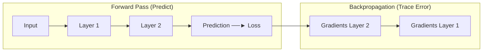
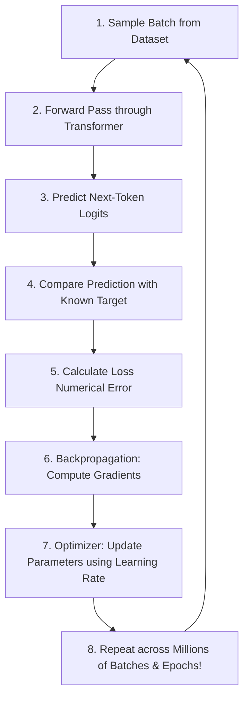

# 🤖 Sharpening the Brain

> **Episode 07** | *This episode moves from an already-trained transformer to the process that makes it useful, explaining parameters, forward prediction, loss, backpropagation, gradients, optimizers, self-supervised targets, generalization, overfitting, and the repeated training loop.*

---

## 📌 In This Episode

```text
01 What learning means for a neural network
02 Parameters, training data, and prediction targets
03 Forward pass and loss
04 Backpropagation, gradients, and optimizers
05 Gradient descent and learning rate
06 The complete self-supervised training loop
07 Training, inference, generalization, and overfitting
08 Distributed training, learned embeddings, and understanding
```

---

## 👶 Trained Model vs. Untrained Model

```
┌────────────────────────────────────────────────────────────────────────┐
│                        PROMPT: "The sky is ..."                        │
├──────────────────────────────────┬─────────────────────────────────────┤
│ Trained Model                    │ Untrained Model (Newborn Baby)      │
├──────────────────────────────────┼─────────────────────────────────────┤
│ Predicts: "blue" (85%)           │ Predicts: "potato", "banana",       │
│                                  │ "magic", or random gibberish!       │
└──────────────────────────────────┴─────────────────────────────────────┘
```

> **Definition:**  
> **Learning** means repeatedly adjusting the model's parameters so future predictions become better for next-token prediction.

---

## 🎛️ Parameters: The Adjustable Knobs

A neural network contains billions of adjustable floating-point numbers called **parameters (weights)**.

```
┌────────────────────────────────────────────────────────────────────────┐
│                        3 INTUITIVE ANALOGIES                           │
├───────────────────┬───────────────────┬────────────────────────────────┤
│ 1. DJ Controller  │ 2. Old Radio Dial │ 3. Guitar Tuning               │
│ Billions of knobs │ Tuning frequency  │ Training is TUNING strings;    │
│ to adjust sound   │ to remove static  │ Inference is PLAYING music     │
└───────────────────┴───────────────────┴────────────────────────────────┘
```

* **Scale:** GPT-3 has **175 Billion parameters** ($17,500\text{ crore}$). Training makes tiny adjustments (e.g., $2.5 \rightarrow 2.4 \rightarrow 2.2$) to minimize error.

---

## 🔍 Which Values Are Parameters?

```text
Inside the Transformer:
- Token Embedding Table coordinates
- Query (Wq), Key (Wk), Value (Wv), and Output (Wo) Attention weights
- Layer Normalization scale (γ) and shift (β)
- Feed-Forward (FFN / MLP) projection weights and biases
```

---

## 🗄️ Do Parameters Store Knowledge?

> [!NOTE]
> Parameters are **"Knowledge Enablers"**. They do **not** store text files or database rows; they store continuous mathematical patterns that allow knowledge to emerge dynamically during a forward pass.

* **Training Data vs. Parameters:**
  * **Training Data:** External text (articles, books, code) supplied to the model.
  * **Parameters:** Internal mutable numbers inside the network adjusted by the data.

---

## 🚀 Forward Pass & Self-Supervised Target

```
  Source Text: "The sky is blue"
  
  Input Sample : "The sky is"
  Known Target : "blue"  (Self-supervised from the text itself!)
  Prediction   : "banana" (80%) vs "blue" (2%)  <-- Needs tuning!
```

---

## 📉 Loss: Measuring Error

> **Definition:**  
> A **Loss Function** turns prediction quality into a single error number:
> * **Small Loss:** Target (`blue`) got a high probability.
> * **High Loss:** Wrong token (`banana`) got $80\%$, while target (`blue`) got $2\%$.

$$\text{Predict} \longrightarrow \text{Compare with Target} \longrightarrow \text{Calculate Loss} \longrightarrow \text{Update Parameters}$$

---

## 🕵️ Backpropagation: Detective Tracing Error Backward

How do we know which of the 175 billion knobs caused the error?



* **Gradients Are Sensitivities:** A gradient tells us 1) Which **direction** to move a parameter, and 2) How **sensitive** the loss is to that parameter.

> **Backpropagation vs. Optimizer:**  
> $$\mathbf{\text{Backpropagation DIAGNOSES gradients; the Optimizer ADJUSTS the weights.}}$$

---

## ⛰️ Gradient Descent: The Foggy-Mountain Analogy

> **Definition:**  
> **Gradient Descent** minimizes loss by taking small steps in the direction opposite to the gradient.

```
┌──────────────────────────────┬──────────────────────────────┐
│ Foggy Mountain Analogy       │ Deep Learning Training       │
├──────────────────────────────┼──────────────────────────────┤
│ Current Altitude / Height    │ Loss Value (Error)           │
│ Local Ground Slope           │ Gradient Direction           │
│ Step Size                    │ Learning Rate ($\alpha$)     │
│ Repeated Steps Downhill      │ Iterative Parameter Updates  │
│ Valley Bottom                │ Minimized Loss (Trained)     │
└──────────────────────────────┴──────────────────────────────┘
```

```
  Loss ▲
       │    Current State
       │       ●
       │        \   Step-by-step downhill descent (Learning Rate = Step Size)
       │         \
       │          \____● (Valley Bottom = Minimized Error!)
       └────────────────────────────────────────► Parameter Values
```

### Learning Rate Traps:
* **Too Small:** Training takes forever; gets stuck on flat plateaus.
* **Too Large:** Overshoots the valley, causing loss to explode to infinity ($NaN$).

---

## ⚖️ Batch vs. Stochastic vs. Mini-Batch GD

```
┌───────────────────┬───────────────────┬────────────────────────────────┐
│ Batch GD          │ Stochastic (SGD)  │ Mini-Batch GD (Standard)       │
├───────────────────┼───────────────────┼────────────────────────────────┤
│ • Uses full data  │ • Uses 1 sample   │ • Uses small batch (32-4096)   │
│ • Stable but SLOW │ • Fast but NOISY  │ • 🎯 BALANCED, FAST & STABLE!  │
└───────────────────┴───────────────────┴────────────────────────────────┘
```

---

## 🔄 The Complete 8-Step Training Loop



---

## 🧠 Why is Next-Token Pre-Training "Self-Supervised"?

* In image classification, humans must manually tag `"Cat"` or `"Dog"`.
* In text pre-training, **the text itself provides the target**:
  * In *"The sky is blue"*, we hide *"blue"* and make it the target.
  * No human annotators needed $\implies$ Enables training on **trillions of internet tokens**!

---

## 📖 Key Training Terms

```
┌──────────────────┬─────────────────────────────────────────────────────┐
│ Term             │ Meaning                                             │
├──────────────────┼─────────────────────────────────────────────────────┤
│ Sample           │ A single text example/sentence.                     │
│ Dataset          │ The complete collection of all training samples.    │
│ Batch            │ A group of samples processed together in parallel.  │
│ Training Step    │ One forward pass + loss + backprop + weight update. │
│ Epoch            │ One complete pass through the entire dataset.       │
│ Context Window   │ The maximum sequence length processed at once.      │
└──────────────────┴─────────────────────────────────────────────────────┘
```

---

## ⚙️ Training vs. Inference

| Feature | Training Phase | Inference Phase |
| :--- | :--- | :--- |
| **Operation** | Forward pass $\rightarrow$ Loss $\rightarrow$ Backprop $\rightarrow$ Update | Forward pass $\rightarrow$ Generate output |
| **Parameters** | **Mutable (Updating constantly)** | **Frozen (Fixed weights)** |
| **Compute** | Massive (Thousands of GPUs, months) | Lightweight (Milliseconds per token) |
| **Analogy** | **Tuning the guitar strings** | **Playing the tuned guitar** |

---

## 🎯 Generalization vs. Overfitting

```
┌────────────────────────────────────────────────────────────────────────┐
│                    GENERALIZATION vs. OVERFITTING                      │
├──────────────────────────────────┬─────────────────────────────────────┤
│ Generalization (Goal)            │ Overfitting (Failure)               │
├──────────────────────────────────┼─────────────────────────────────────┤
│ • Training: "The sky is blue"    │ • Dataset repeats "The sky is blue" │
│ • Unseen Test: "On a sunny day,  │   10,000 times                      │
│   the sky looked..."             │ • Fails on slight variations        │
│ • ✅ Outputs: "blue"             │ • ❌ Memorizes text like a parrot   │
│ • Applies underlying rules!      │   without understanding patterns!   │
└──────────────────────────────────┴─────────────────────────────────────┘
```

---

## 🖥️ Distributed Training & Learned Embeddings

* **GPU Clusters:** Training giant models requires thousands of interconnected **NVIDIA H100 GPUs** using data and tensor parallelism.
* **Embeddings Learn Too:** `king` and `queen` embeddings start as random coordinates. Backpropagation gradients tune their numbers until they naturally cluster in vector space!

---

## ❓ Does Prediction Count as Understanding?

* **Engineering View:** If a model solves problems, debugs code, and synthesizes knowledge accurately, it functionally behaves as understanding.
* **Philosophical View:** The model is a statistical pattern calculator. When it says *"I am sad"*, it experiences no conscious feelings or biological awareness.

---

## 📝 Chapter Summary

For a neural network, learning means adjusting parameters to minimize next-token prediction error. The model runs a forward pass, compares its output against the self-supervised target from the text, and calculates loss.

Backpropagation traces backward through the layers using calculus to compute gradients, and the optimizer (using gradient descent and a learning rate) updates the parameters. Training tunes the model across distributed GPU clusters, building generalizable representations that apply to unseen prompts.

---

## 🔥 Key Takeaways

* **Learning:** Iteratively updating weights to reduce prediction loss.
* **Self-Supervised Target:** The source text supplies its own ground truth.
* **Backprop vs. Optimizer:** Backprop *diagnoses* gradients; Optimizer *adjusts* parameters.
* **Gradient Descent:** Moves parameters downhill toward minimized loss.
* **Mini-Batch GD:** The industry standard balancing speed and stability.
* **Generalization:** Model applies patterns to novel text rather than memorizing training data.

---

## ❓ Revision Questions & Answers

1. **What is the difference between trained and untrained output for "The sky is ..."?**  
   *Answer:* A trained model predicts high-probability sensible words like *"blue"*; an untrained model outputs random words like *"potato"* or gibberish.
2. **State the episode's definition of learning.**  
   *Answer:* Adjusting parameters so future predictions become better for a chosen objective.
3. **How do the DJ-knob, radio, and guitar analogies each explain parameters?**  
   *Answer:* DJ knobs represent adjusting billions of individual controls; the radio represents tuning to eliminate static noise; the guitar shows that training is tuning the instrument, while inference is playing it.
4. **Which parts of the Episode 06 transformer are identified as parameters?**  
   *Answer:* Token embedding tables, Query/Key/Value attention weights, output projections, LayerNorm scale/shift ($\gamma, \beta$), and FFN weights/biases.
5. **How does the instructor distinguish distributed learned patterns from database-like memory?**  
   *Answer:* Parameters do not store literal text records or tables; they encode continuous mathematical patterns across billions of weights (acting as "knowledge enablers").
6. **What different roles do training data and parameters play?**  
   *Answer:* Training data is the external text corpus supplying examples; parameters are the internal mutable numbers updated inside the model.
7. **What happens during a forward pass?**  
   *Answer:* Input tokens are converted to embeddings, processed through Transformer layers, and projected to logits and Softmax probabilities to predict the next token.
8. **How does `blue` become a self-supervised target from "The sky is blue"?**  
   *Answer:* The prefix *"The sky is"* is fed as input, and the naturally occurring next word *"blue"* is withheld and used as the ground-truth target.
9. **What does loss measure?**  
   *Answer:* The numerical error between the model's predicted probability distribution and the actual ground-truth target token.
10. **Why is `blue = 2%` and `banana = 80%` a high-loss output?**  
    *Answer:* Because the model assigned a tiny probability to the correct target (`blue`) and a massive probability to a completely incorrect token (`banana`).
11. **What does backpropagation compute as it travels backward through the layers?**  
    *Answer:* It computes the gradient (partial derivative $\frac{\partial \mathcal{L}}{\partial W}$) for every parameter using the Chain Rule.
12. **What is a gradient in the lecture's terminology?**  
    *Answer:* A value indicating the direction a parameter should move and how sensitive the overall loss is to that parameter.
13. **What is the difference between backpropagation and the optimizer?**  
    *Answer:* Backpropagation *diagnoses* (calculates gradients); the optimizer *adjusts* (updates parameter weights using those gradients).
14. **Define gradient descent in the wording of the episode.**  
    *Answer:* An iterative optimization process that minimizes loss by adjusting parameters in the opposite direction of the gradient.
15. **What does the learning rate control?**  
    *Answer:* The step size taken by the optimizer during each parameter update.
16. **Map height, slope, step size, and the mountain bottom to their training concepts.**  
    *Answer:* Height = Loss; Slope = Gradient; Step Size = Learning Rate; Mountain Bottom = Minimized Loss.
17. **Compare batch, stochastic, and mini-batch gradient descent.**  
    *Answer:* Batch uses the full dataset (slow, stable); Stochastic uses 1 sample (fast, noisy); Mini-batch uses small subsets (fast, stable, GPU-friendly).
18. **What happens when the learning rate is too small or too large?**  
    *Answer:* Too small causes extremely slow convergence or getting stuck; too large causes overshooting and diverging loss ($NaN$).
19. **How can a flat or saddle region make optimization difficult?**  
    *Answer:* Because the slope (gradient) is near zero, providing little directional signal to guide parameter updates.
20. **Reconstruct the complete training loop in the correct order.**  
    *Answer:* 1) Sample batch, 2) Forward pass, 3) Predict logits, 4) Compare with target, 5) Calculate loss, 6) Backpropagate gradients, 7) Optimizer updates parameters, 8) Repeat.
21. **Define sample, dataset, batch, training step, epoch, and context window.**  
    *Answer:* *Sample* = single example; *Dataset* = all examples; *Batch* = group processed together; *Training step* = single weight update; *Epoch* = full pass over dataset; *Context window* = max token length processed.
22. **Why is next-token pre-training called self-supervised in this episode?**  
    *Answer:* Because the training data requires no human labels; the text sequence itself supplies its own targets.
23. **How do training and inference use the same forward architecture differently?**  
    *Answer:* Training runs forward passes to calculate loss and update weights; inference runs forward passes with frozen weights to generate user responses.
24. **Explain generalization using the unseen afternoon-sky sentence.**  
    *Answer:* The model correctly outputs *"blue"* for *"On a clear summer afternoon, the sky appeared..."* because it learned the general concept rather than memorizing exact strings.
25. **Explain overfitting using the repeated "The sky is blue" example.**  
    *Answer:* If repeated 10,000 times, the model memorizes that exact sequence perfectly but fails when given slight linguistic variations.
26. **Why does the instructor call large-model training a distributed-systems problem?**  
    *Answer:* Because training models with hundreds of billions of parameters requires orchestrating thousands of GPUs in parallel clusters.
27. **How do initially random `king` and `queen` embeddings become related?**  
    *Answer:* Backpropagation passes gradients to embedding vectors during training, and the optimizer moves their coordinates close together as they appear in similar contexts.
28. **What two opposing views about machine understanding does the instructor present?**  
    *Answer:* One view holds that useful functional prediction is understanding; the other holds that mathematical token prediction lacks human consciousness, emotion, and true comprehension.

---

Previous : [05. The Computational Brain of Machines](./05_The_Computational_Brain_of_Machines.md) | Index: [00_index.md](../00_index.md) | Next: [07. From a Base Model to an AI Assistant](./07_From_a_Base_Model_to_an_AI_Assistant.md)
