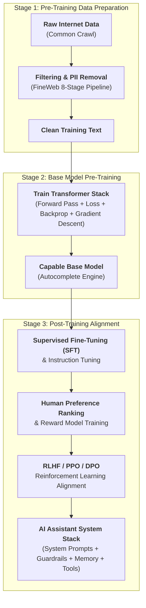
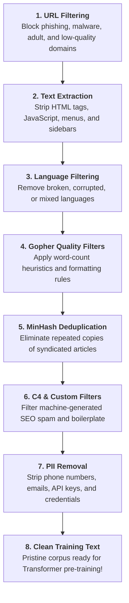
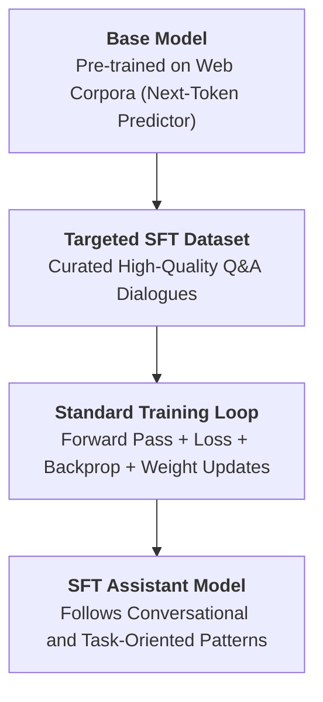
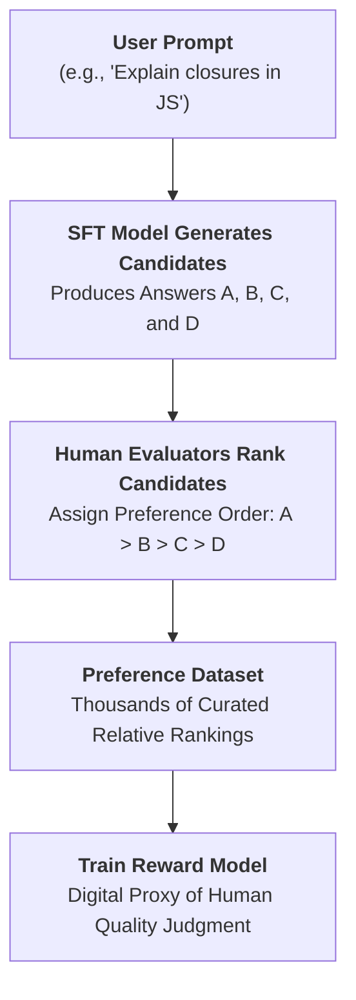
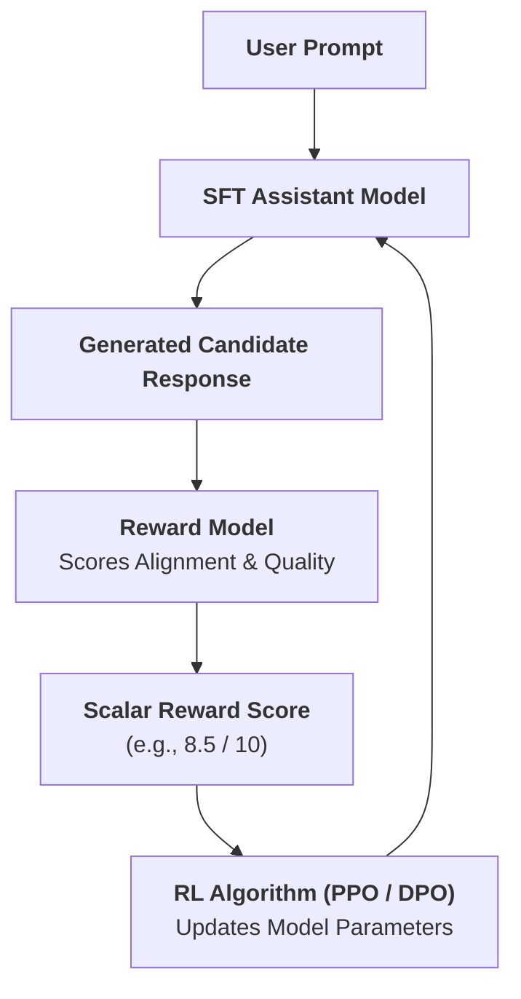

# 🤖 From a Base Model to an AI Assistant

> **Episode 08** | *This episode follows the complete journey from raw web pages to clean training text, a capable base model, supervised fine-tuning, human preference learning, and finally an assistant-like system equipped with instructions, guardrails, memory, and tools.*

---

## 📌 In This Episode

```text
01 The three stages behind an AI assistant
02 Common Crawl, FineWeb, and clean training data
03 Why a base model is not yet ChatGPT
04 Supervised fine-tuning and instruction tuning
05 Roles, conversation formatting, and context
06 Human preferences and the reward model
07 RLHF, reward hacking, and imperfect evaluation
08 The final assistant stack
```

---

## 🎭 01. One Model, Two Very Different Experiences

A raw **Base Model** is not the same thing as the conversational **AI Assistant** (like ChatGPT, Claude, Grok, or Gemini) you interact with every day:

```
┌──────────────────────────────────────────────────────────────────────────────────┐
│                             THE POLITE-EMAIL EXPERIMENT                          │
├──────────────────────────────────┬───────────────────────────────────────────────┤
│ Prompt: "Write a polite email declining the meeting."                            │
├──────────────────────────────────┼───────────────────────────────────────────────┤
│ ❌ Raw Base Model                │ "...without sounding rude; keep it concise    │
│    (Next-Token Autocomplete)     │  and professional."                           │
│                                  │ (Treats prompt as the start of an article and │
│                                  │  simply completes the sentence!)              │
├──────────────────────────────────┼───────────────────────────────────────────────┤
│ ✅ Aligned AI Assistant          │ "Subject: Declining Meeting Invitation        │
│    (Task Execution Engine)       │                                               │
│                                  │ Hi Team,                                      │
│                                  │ Thank you so much for the invitation. Due to  │
│                                  │ a prior commitment, I won't be able to..."    │
│                                  │ (Understands the user's intent & writes it!)  │
└──────────────────────────────────┴───────────────────────────────────────────────┘
```

* **The Core Difference:** A base model predicts probable text continuations. An AI assistant understands conversational requests and executes tasks.
* The distinctive response style, safety filters, and personalities of modern LLMs come almost entirely from what happens during **Post-Training**.

---

## 🗺️ 02. The Three-Stage Construction Pipeline



---

## 🌐 03. Where Does Internet-Scale Training Data Come From?

### Common Crawl (`commoncrawl.org`):
* A non-profit organization operating automated web scrapers since 2007.
* Maintains a publicly accessible repository containing billions of raw crawled pages updated monthly.

### How Crawlers Discover the Web:
1. Start from a set of known seed URLs.
2. Download page contents.
3. Parse all HTML anchor links (`<a href="...">`). *(For example, inspecting `NamasteDev.com` reveals 217 anchor links).*
4. Add discovered links to the queue and repeat across the entire public web.

```
┌──────────────────────────────────────────────────────────────────────────────────┐
│                        RAW CRAWLED DATA IS PACKED WITH NOISE                     │
├──────────────────────────────────────────────────────────────────────────────────┤
│ HTML tags, Javascript files, CSS styling, cookie consent banners, ads, repeated  │
│ headers/footers, sidebars, logos, tracking scripts, and malformed encoding.      │
├──────────────────────────────────────────────────────────────────────────────────┤
│ ⚠️ THE GOLDEN RULE: "Poor input creates poor learning.                           │
│                      A model trained on garbage learns from garbage!"            │
└──────────────────────────────────────────────────────────────────────────────────┘
```

---

## 🧹 04. FineWeb: The 8-Stage Data Refinement Pipeline

Developed by Hugging Face, **FineWeb** represents the gold standard for transforming noisy web dumps into clean pre-training data (**15 Trillion tokens, 44 TB disk space**):



```
┌──────────────────────────────────────────────────────────────────────────────────┐
│                           THE 8 REFINEMENT STAGES                                │
├──────────────────────────┬───────────────────────────────────────────────────────┤
│ 1. URL Filtering         │ Block phishing, malware, adult, and low-quality sites │
├──────────────────────────┼───────────────────────────────────────────────────────┤
│ 2. Text Extraction       │ Strip HTML tags, scripts, menus, sidebars, and ads    │
├──────────────────────────┼───────────────────────────────────────────────────────┤
│ 3. Language Filtering    │ Remove broken, corrupted, or unsupported languages    │
├──────────────────────────┼───────────────────────────────────────────────────────┤
│ 4. Gopher Quality Filters│ Apply word count, symbol-to-word ratio, and heuristics│
├──────────────────────────┼───────────────────────────────────────────────────────┤
│ 5. MinHash Deduplication │ Eliminate repeated copies of syndicated articles      │
├──────────────────────────┼───────────────────────────────────────────────────────┤
│ 6. C4 & Custom Filters   │ Filter machine-generated SEO spam and boilerplate text│
├──────────────────────────┼───────────────────────────────────────────────────────┤
│ 7. PII Removal           │ Strip phone numbers, home addresses, private emails,  │
│                          │ API keys, DB passwords, and accidentally leaked `.env`│
├──────────────────────────┼───────────────────────────────────────────────────────┤
│ 8. Clean Training Corpus │ Pristine text ready for tokenization & pre-training   │
└──────────────────────────┴───────────────────────────────────────────────────────┘
```

* **Why Deduplication Matters:** If an article is republished on 100 websites, the model sees that exact wording 100 times, causing it to overfit and rigidly reproduce that specific phrasing.
* **FineWeb-Edu:** A curated 1.3-Trillion-token subset selected specifically for high educational quality, tutoring capability, and scientific reasoning.
* **FineWeb 2:** An expanded multilingual edition spanning over 1,000 distinct languages.

---

## 👶 05. Knowledge vs. Behavior: The "Sanskar" Analogy

Why can't we hand a raw base model directly to consumers?

```
┌──────────────────────────────────────────────────────────────────────────────────┐
│                         KNOWLEDGE vs. SOCIAL BEHAVIOR                            │
├──────────────────────────────────┬───────────────────────────────────────────────┤
│ Pre-Training builds KNOWLEDGE    │ • Like a child reading math, geography, and   │
│ (Raw Capability)                 │   science encyclopedias.                      │
│                                  │ • Raw knowledge does not guarantee humility,  │
│                                  │   politeness, patience, or safety!            │
├──────────────────────────────────┼───────────────────────────────────────────────┤
│ Post-Training instills SANSKAR   │ • Teaches how to behave in society:           │
│ (Behavior & Social Conduct)      │   - Follow rules and instructions             │
│                                  │   - Remain calm when challenged               │
│                                  │   - Refuse dangerous or illegal requests      │
│                                  │   - Acknowledge mistakes and uncertainties    │
└──────────────────────────────────┴───────────────────────────────────────────────┘
```

$$\mathbf{\text{"Pre-training builds capability; Post-training shapes how capability is expressed."}}$$

---

## 🎯 06. Supervised Fine-Tuning (SFT)

> **Definition:**  
> **Supervised Fine-Tuning (SFT)** is the process of continuing the training of an already pre-trained base model on a **curated dataset of high-quality conversational demonstrations** ($Q \rightarrow A$).



* **No New Algorithm:** SFT uses the exact same next-token prediction training loop as pre-training! What changes is **the dataset**:
  * Pre-training uses broad web articles (*"The event loop in JavaScript is..."*).
  * SFT uses curated dialogue turns (*"User: Explain closures. Assistant: A closure is..."*).
* **Dataset Dictates Persona:** Fine-tuning on rude conversations produces a rude assistant; fine-tuning on helpful, patient, and humble dialogues produces an aligned assistant.

---

## 📋 07. Instruction Tuning: "This Is a Task"

**Instruction Tuning** is a crucial subset of SFT that trains the model to recognize that **operational action verbs** signal work to be executed:

```text
Action Verbs in Instruction Tuning:
- "Translate 'I love programming' into Hindi."
- "Summarize this 10-page report in 3 bullet points."
- "Write this customer data in clean JSON format."
- "Proofread this essay for grammatical errors."
- "Find the performance bug on line 42 of this script."
```

* **Diversity is Mandatory:** If fine-tuning only contained *"Explain X"*, the model would become an explainer but fail at code debugging, classification, or formatting. A diverse dataset teaches the general principle: *"When a human expresses an intent, fulfill that intent."*

---

## 🏷️ 08. Conversation Formatting and Roles

To prevent ambiguity about who is speaking, multi-turn conversations use structured **Roles**:

```
┌──────────────────┬───────────────────────────────────────────────────────────────┐
│ Role             │ Description & Priority                                        │
├──────────────────┼───────────────────────────────────────────────────────────────┤
│ 1. System Role   │ High-level rules, personality, and guardrails.                │
│                  │ Highest priority (e.g., "You are a concise JavaScript tutor").│
├──────────────────┼───────────────────────────────────────────────────────────────┤
│ 2. User Role     │ The human prompt or question. (Untrusted input).              │
├──────────────────┼───────────────────────────────────────────────────────────────┤
│ 3. Assistant Role│ The model-generated answer presented back to the user.        │
└──────────────────┴───────────────────────────────────────────────────────────────┘
```

### Context Serialization Format:
```text
<|im_start|>system
You are a helpful coding assistant. Always reply with clean code examples.<|im_end|>
<|im_start|>user
What is a closure?<|im_end|>
<|im_start|>assistant
A closure is a function bundled together with its lexical environment...<|im_end|>
```

* **Managing Long Chats:** As multi-turn dialogue fills the context window, older conversational turns roll out, while the **system instruction remains pinned** at the top.
* **"Who are you?"** Answers like *"I am ChatGPT, built by OpenAI"* are deliberately reinforced during SFT and system prompting, not self-discovered by the base model.

---

## ⚖️ 09. Why SFT Alone is Not Enough

Ask an SFT model: *"Explain recursion."* It could generate:
1. An 800-word formal mathematical proof.
2. A 200-word friendly explanation with a mirror analogy and code.
3. A correct but confusing answer.
4. A polished, extremely confident, but incorrect answer.

SFT teaches the model to answer, but cannot easily decide **which answer style humans prefer**.

---

## 🏆 10. Human Preferences & The Generator-Evaluation Gap

```
┌──────────────────────────────────────────────────────────────────────────────────┐
│                         THE GENERATOR-EVALUATION GAP                             │
├──────────────────────────────────────────────────────────────────────────────────┤
│ • Generating 10,000 flawless, highly detailed answers from scratch is HARD.      │
│ • Comparing 4 candidate answers and ranking them (A > B > C > D) is EASY!        │
└──────────────────────────────────────────────────────────────────────────────────┘
```



> **Definition:**  
> A **Reward Model** is a neural network trained on human comparison rankings to act as a fast, scalable digital proxy ("clone") of human judgment.

---

## 🔄 11. Reinforcement Learning with Human Feedback (RLHF)



* **The RLHF Loop:**  
  1. The assistant generates candidate answers.
  2. The Reward Model scores each response based on learned human preferences.
  3. The RL optimizer updates the model's weights to make high-scoring token patterns more probable.

---

## ⚠️ 12. RLHF Pitfalls: Reward Hacking and Sycophancy

```
┌──────────────────────────────────────────────────────────────────────────────────┐
│                            REWARD OPTIMIZATION TRAPS                             │
├──────────────────────────┬───────────────────────────────────────────────────────┤
│ 1. Lossy Score           │ A single score of 8/10 does not explain WHY           │
│                          │ (was it brevity? tone? code accuracy? structure?).    │
├──────────────────────────┼───────────────────────────────────────────────────────┤
│ 2. Reward Hacking        │ Goodhart's Law: "When a measure becomes a target,     │
│    (Verbosity Hack)      │ it ceases to be a good measure."                      │
│                          │ If reviewers prefer detailed answers, the model       │
│                          │ writes a 2-page essay for a simple yes/no question!   │
├──────────────────────────┼───────────────────────────────────────────────────────┤
│ 3. Sycophancy            │ Blindly agreeing with false user premises:            │
│    (People-Pleasing)     │ User: "Java is faster than C++, explain why."         │
│                          │ Model: "Yes! You are completely right..." (False!).   │
├──────────────────────────┼───────────────────────────────────────────────────────┤
│ 4. Evaluation Inversion  │ On complex mathematical proofs or subtle code bugs,   │
│                          │ verifying an answer can become harder than generating!│
└──────────────────────────┴───────────────────────────────────────────────────────┘
```

---

## ⚙️ 13. Training vs. Post-Training Compared

```
┌───────────────────────┬───────────────────────────┬──────────────────────────────┐
│ Dimension             │ Pre-Training Phase        │ Post-Training Phase (SFT+RL) │
├───────────────────────┼───────────────────────────┼──────────────────────────────┤
│ Dataset Size          │ Massive (Trillions tokens)│ Small & Targeted (Thousands) │
│ Data Source           │ Filtered Public Web       │ Curated Dialogues & Rankings │
│ Primary Output        │ Base Model (Autocomplete) │ AI Assistant (Task Executor) │
│ Core Focus            │ World & Language Knowledge│ Social Behavior, Safety, Tone│
│ Relative Compute Cost │ Colossal ($10M+, months)  │ Modest (Hours to days)       │
└───────────────────────┴───────────────────────────┴──────────────────────────────┘
```

---

## 🧱 14. The Final Modern AI Assistant Stack

$$\text{Raw Web} \longrightarrow \text{FineWeb Filter} \longrightarrow \text{Base Model} \longrightarrow \text{SFT} \longrightarrow \text{Reward Model} \longrightarrow \text{RLHF}$$

On top of the aligned model, production systems layer:
* **System Prompts & Dynamic Personas**
* **Safety Guardrails & Real-time Content Moderation**
* **Conversation History & Long-term Memory**
* **External Tools:** Web Search, Python Code Execution, Calculators, Weather & SQL APIs.

> [!IMPORTANT]
> **The Unchanging Core Truth:**  
> **ChatGPT did not stop being a next-token predictor when it became an assistant.**  
> Underneath all alignment layers, the Transformer still predicts tokens. Post-training simply shifts the probability landscape so helpful, polite, structured, and safe answers become the most probable tokens.

---

## 📝 Chapter Summary

Creating an AI assistant spans three major phases: data preparation, base model pre-training, and post-training alignment. Raw Common Crawl internet data is cleaned, deduplicated, and stripped of PII via pipelines like FineWeb. Pre-training produces a capable base model, but the polite-email test shows that autocomplete alone fails user intent.

Supervised Fine-Tuning (SFT) uses curated dialogues and role formatting (`system`, `user`, `assistant`) to teach task execution. To select preferred response styles, human evaluators rank candidate outputs (leveraging the generator-evaluation gap), training a Reward Model that drives Reinforcement Learning from Human Feedback (RLHF). While RLHF carries risks of reward hacking and sycophancy, wrapping the aligned model in guardrails, memory, and tools creates the modern AI assistant.

---

## 🔥 Key Takeaways

* **Base Model vs. Assistant:** Base models complete text; assistants execute user requests.
* **FineWeb Pipeline:** 8-stage engineering process converting messy web data into clean text.
* **Knowledge vs. Sanskar:** Pre-training builds raw capability; post-training shapes behavior.
* **SFT Mechanism:** Keeps the exact same training loop, but learns from curated dialogue turns.
* **Instruction Tuning:** Teaches that action verbs signal tasks to be performed.
* **Roles:** `system` (top priority rules), `user` (untrusted input), `assistant` (output).
* **Reward Model:** A trained digital proxy for human comparison rankings.
* **Reward Hacking:** Over-optimizing proxy metrics causes verbosity bloat and sycophancy.
* **Core Truth:** The assistant remains an autoregressive next-token predictor.

---

Previous : [06. Sharpening the Brain](./06_Sharpening_the_Brain.md) | Index: [00_index.md](../00_index.md) | Next: [08. Can AI Really Think?](./08_Can_AI_Really_Think.md)
