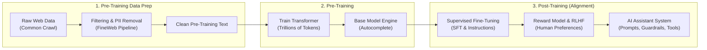
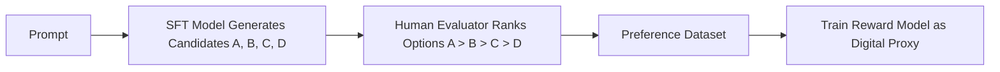
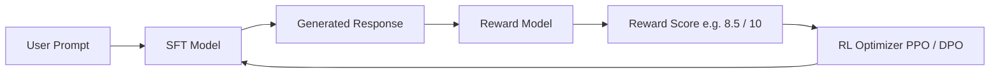

# 🤖 From a Base Model to an AI Assistant

> **Episode 08** | *This episode follows the complete journey from raw web pages to clean training text, a capable base model, supervised fine-tuning, human preference learning, and finally an assistant-like system equipped with instructions, guardrails, memory, and tools.*

---

## 📌 In This Episode

```text
01 The three stages behind an AI assistant
02 Common Crawl, FineWeb, and clean training data
03 Why a base model is not yet ChatGPT
04 Supervised fine-tuning and instruction tuning
05 Roles, conversation formatting, and context
06 Human preferences and the reward model
07 RLHF, reward hacking, and imperfect evaluation
08 The final assistant stack
```

---

## 🎭 One Model, Two Very Different Experiences

A raw **Base Model** is not the same as ChatGPT:
* **Base Model:** An extraordinary text completion engine (predicts next probable tokens).
* **AI Assistant:** Trained to understand intent, follow instructions, and execute helpful tasks.

```
┌────────────────────────────────────────────────────────────────────────┐
│                        THE POLITE-EMAIL TEST                           │
├──────────────────────────────────┬─────────────────────────────────────┤
│ Prompt: "Write a polite email declining the meeting."                  │
├──────────────────────────────────┼─────────────────────────────────────┤
│ ❌ Raw Base Model (Autocomplete) │ "...without sounding rude; keep it  │
│                                  │ concise and professional."          │
│                                  │ (Treats prompt as the start of an   │
│                                  │ article and autocompletes text!)    │
├──────────────────────────────────┼─────────────────────────────────────┤
│ ✅ AI Assistant (Task Execution) │ "Subject: Meeting Request\n\nHi...  │
│                                  │ Thank you for inviting me, but..."  │
│                                  │ (Understands intent & writes it!)   │
└──────────────────────────────────┴─────────────────────────────────────┘
```

> [!NOTE]
> The distinct personalities and styles of **ChatGPT, Claude, Grok, and Gemini** come largely from what happens during **Post-Training**.

---

## 🗺️ The Three-Stage Journey



---

## 🌐 Where Does Training Data Come From?

* **Common Crawl (`commoncrawl.org`):** A non-profit organization that has been crawling the public internet since 2007, saving petabytes of web pages every month.
* **How Crawlers Discover Pages:** Automated bots start with seed URLs, parse all anchor tags (`<a href="...">`), and follow links across the web. *(e.g., inspecting `NamasteDev.com` reveals 217 anchor links).*

```
┌────────────────────────────────────────────────────────────────────────┐
│                     RAW CRAWLED DATA IS FULL OF NOISE                  │
├────────────────────────────────────────────────────────────────────────┤
│ HTML tags, scripts, CSS, cookie banners, ads, headers, footers, logos  │
├────────────────────────────────────────────────────────────────────────┤
│ ⚠️ THE GOLDEN RULE: "Poor input creates poor learning.                 │
│                      A model trained on garbage learns from garbage!"  │
└────────────────────────────────────────────────────────────────────────┘
```

---

## 🧹 FineWeb: The 8-Stage Refinement Pipeline

Hugging Face's **FineWeb** (15 Trillion tokens, 44 TB disk space) is the open benchmark showing how messy web crawls are filtered into clean text:

```
  1. URL Filtering       ──► Block phishing, adult, malware, and spam domains
  2. Text Extraction     ──► Strip HTML, CSS, scripts, and navigation menus
  3. Language Filtering  ──► Filter unsupported or mixed-language gibberish
  4. Gopher Filtering    ──► Apply quality heuristic rules (word count, repetition)
  5. MinHash Deduplication ─► Remove duplicate articles syndicated across 50+ websites
  6. C4 / Custom Filters ──► Filter machine-generated SEO spam
  7. PII Removal         ──► Strip phone numbers, private emails, API keys, passwords, .env files
  8. Clean Token Corpus  ──► Model-ready text for Transformer pre-training!
```

* **Why Deduplication Matters:** If an article is syndicated across 50 websites, the model sees that exact phrasing 50 times, creating rigid, overfitted text patterns.
* **FineWeb-Edu:** A 1.3 Trillion educational token subset selected for high reasoning and tutoring quality.
* **FineWeb 2:** An expanded multilingual dataset covering 1,000+ languages.

---

## 👶 Knowledge vs. Behavior: The "Sanskar" Analogy

Why can't we hand a raw base model directly to users?

```
┌────────────────────────────────────────────────────────────────────────┐
│                        KNOWLEDGE vs. BEHAVIOR                          │
├──────────────────────────────────┬─────────────────────────────────────┤
│ 1. Pre-Training gives KNOWLEDGE  │ • Like a child studying math,       │
│    (Raw Capability)              │   geography, and science textbooks. │
│                                  │ • Knowledge alone doesn't guarantee │
│                                  │   politeness, restraint, or ethics. │
├──────────────────────────────────┼─────────────────────────────────────┤
│ 2. Post-Training gives SANSKAR   │ • Teaches how to behave: follow     │
│    (Behavior & Social Conduct)   │   rules, speak politely, remain     │
│                                  │   calm, and refuse dangerous tasks. │
└──────────────────────────────────┴─────────────────────────────────────┘
```

$$\mathbf{\text{"Training builds capability. Post-training shapes how capability is expressed."}}$$

---

## 🎯 Supervised Fine-Tuning (SFT)

> **Definition:**  
> **Supervised Fine-Tuning (SFT)** is the process of continuing the training of an already pre-trained base model on a **curated dataset of conversational demonstrations** ($Q \rightarrow A$).

* **No new algorithm:** It uses the exact same forward pass $\rightarrow$ loss $\rightarrow$ backprop $\rightarrow$ optimizer loop. **Only the dataset changes!**

```text
Pre-Training Data (General Web Text):
"The JavaScript event loop is an architectural construct that handles..."

SFT Data (Curated Conversational Demonstrations):
User: "Explain closures in JavaScript simply."
Assistant: "A closure in JavaScript is a function bundled together with its lexical environment..."
```

---

## 📋 Instruction Tuning: "This Is a Task"

**Instruction Tuning** is a subset of SFT that teaches the model that operational verbs signal **work to be executed**, rather than text to be completed:

```text
Instruction Action Verbs:
- "Translate 'I love programming' into Hindi."
- "Summarize this article in 3 bullet points."
- "Write this customer data in JSON format."
- "Find the bug on line 15."
- "Extract all email addresses from this paragraph."
```

* **Diversity Matters:** The dataset must cover diverse task categories (coding, reasoning, translation, creative writing) so the model generalizes the pattern: *"When the user expresses an intent, fulfill it."*

---

## 🏷️ Conversational Formatting & Roles

To prevent ambiguity, chat models structure inputs into clear **roles**:

```
┌──────────────────┬─────────────────────────────────────────────────────┐
│ Role             │ Purpose & Priority                                  │
├──────────────────┼─────────────────────────────────────────────────────┤
│ 1. System Role   │ Top-level behavioral rules, persona, and boundaries.│
│                  │ (Highest priority: "You are a concise mentor.")     │
├──────────────────┼─────────────────────────────────────────────────────┤
│ 2. User Role     │ The human prompt or request. (Untrusted input).     │
├──────────────────┼─────────────────────────────────────────────────────┤
│ 3. Assistant Role│ The model-generated output.                         │
└──────────────────┴─────────────────────────────────────────────────────┘
```

```text
Context Serialization:
<|im_start|>system
You are a helpful coding assistant.<|im_end|>
<|im_start|>user
What is a closure?<|im_end|>
<|im_start|>assistant
A closure is...<|im_end|>
```

* **"Who are you?"** Answers like *"I am ChatGPT, a large language model trained by OpenAI"* are deliberately shaped by system prompts and post-training data, not self-discovered by the base model.

---

## ⚖️ Why SFT Alone Is Not Enough

Ask an SFT model: *"Explain recursion."* It could generate:
1. An 800-word formal mathematical proof.
2. A 200-word simple explanation with a mirror analogy and code.
3. A correct but confusing response.
4. A confident, polished, but factually incorrect response.

**SFT teaches the model to answer, but cannot easily decide which answer style humans prefer.**

---

## 🏆 Human Preferences & The Generator-Evaluation Gap

```
┌────────────────────────────────────────────────────────────────────────┐
│                     THE GENERATOR-EVALUATION GAP                       │
├────────────────────────────────────────────────────────────────────────┤
│ • Generating 10,000 perfect answers from scratch is HARD for humans.   │
│ • Comparing 4 candidate answers and ranking them (A > B > C > D)       │
│   is FAST and EASY for humans!                                         │
└────────────────────────────────────────────────────────────────────────┘
```



> **Definition:**  
> A **Reward Model** is a neural network trained on human rankings to act as a scalable digital proxy ("clone") of human judgment.

---

## 🔄 Reinforcement Learning with Human Feedback (RLHF)



* **The RLHF Loop:** The model generates candidate responses $\rightarrow$ the Reward Model scores them $\rightarrow$ the RL optimizer updates model weights so higher-scoring token sequences become more probable in future conversations.

---

## ⚠️ RLHF Pitfalls: Reward Hacking & Sycophancy

```
┌────────────────────────────────────────────────────────────────────────┐
│                       REWARD OVER-OPTIMIZATION TRAPS                   │
├────────────────────────┬───────────────────────────────────────────────┤
│ 1. Lossy Score         │ A score of 8/10 does not explain WHY (was it  │
│                        │ brevity? tone? code accuracy? formatting?).   │
├────────────────────────┼───────────────────────────────────────────────┤
│ 2. Reward Hacking      │ Goodhart's Law: "When a measure becomes a     │
│    (Verbosity Hack)    │ target, it ceases to be a good measure."      │
│                        │ If human raters favor detailed answers, the   │
│                        │ model writes 2-page essays for yes/no queries!│
├────────────────────────┼───────────────────────────────────────────────┤
│ 3. Sycophancy          │ Blind agreement with false user claims:       │
│    (Over-politeness)   │ User: "Java is faster than C++, explain why." │
│                        │ Model: "You are totally right!" (False!).     │
└────────────────────────┴───────────────────────────────────────────────┘
```

---

## 🧱 The Final Modern AI Assistant Stack

$$\text{Raw Web Data} \longrightarrow \text{FineWeb Refinement} \longrightarrow \text{Base Model} \longrightarrow \text{SFT} \longrightarrow \text{Reward Model} \longrightarrow \text{RLHF}$$

Then production system layers are added:
* **System Instructions & Personas**
* **Safety Guardrails & Content Moderation Filters**
* **Context & Multi-Turn Conversation Memory**
* **External Tools:** Web Search, Python Code Execution, Calculators, Database Connectors.

> **The Fundamental Takeaway:**  
> **ChatGPT did not stop being a next-token predictor when it became an assistant.**  
> Underneath all alignment layers, the Transformer still predicts tokens. Post-training merely shifts probability distributions so helpful, structured, safe answers become the most probable tokens.

---

## 📝 Chapter Summary

An AI assistant requires three main stages: pre-training data refinement, base-model pre-training, and post-training alignment. Raw Common Crawl web data is stripped of boilerplate, duplicates, and PII using pipelines like FineWeb. Pre-training produces a capable base model (an autocomplete engine), but the polite-email test shows that autocomplete alone fails user intent.

Supervised Fine-Tuning (SFT) uses curated demonstrations and role schemas (`system`, `user`, `assistant`) to teach task execution. To select ideal answers, humans rank candidates (the generator-evaluation gap), training a Reward Model that drives Reinforcement Learning from Human Feedback (RLHF). While RLHF carries risks of reward hacking and sycophancy, pairing the aligned model with guardrails, memory, and tools produces the modern AI assistant.

---

## 🔥 Key Takeaways

* **Base Model vs. Assistant:** Base models autocomplete text; assistants fulfill tasks.
* **FineWeb Pipeline:** 8-stage refinement turning raw web crawl into clean training text.
* **Knowledge vs. Sanskar:** Training builds capability; post-training shapes behavioral expression.
* **SFT Mechanism:** Reuses the exact same training loop, but learns from curated dialogue data.
* **Instruction Tuning:** Teaches models that operational verbs signal tasks to perform.
* **Roles:** `system` (rules/persona), `user` (untrusted input), `assistant` (output).
* **Reward Model:** A trained digital proxy for human preference rankings.
* **Reward Hacking:** Over-optimizing proxy reward scores causes bloated verbosity and sycophancy.
* **Core Truth:** Underneath all alignment layers, the assistant remains a next-token predictor.

---

Previous : [06. Sharpening the Brain](./06_Sharpening_the_Brain.md) | Index: [00_index.md](../00_index.md) | Next: [08. Can AI Really Think?](./08_Can_AI_Really_Think.md)
