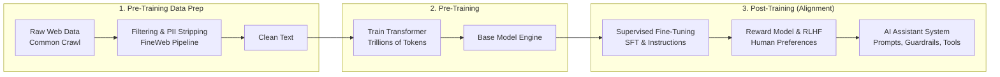
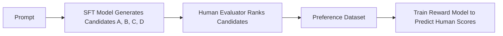
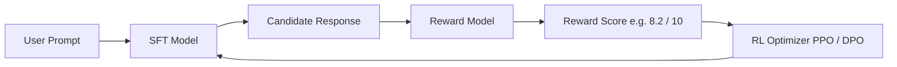

# 🤖 From a Base Model to an AI Assistant

> **Episode 08** | *This episode follows the complete journey from raw web pages to clean training text, a capable base model, supervised fine-tuning, human preference learning, and finally an assistant-like system equipped with instructions, guardrails, memory, and tools.*

---

## 📌 In This Episode

```text
01 The three stages behind an AI assistant
02 Common Crawl, FineWeb, and clean training data
03 Why a base model is not yet ChatGPT
04 Supervised fine-tuning and instruction tuning
05 Roles, conversation formatting, and context
06 Human preferences and the reward model
07 RLHF, reward hacking, and imperfect evaluation
08 The final assistant stack
```

---

## 🎭 One Model, Two Very Different Experiences

A raw **Base Model** is not ChatGPT:
* **Base Model:** An extraordinary next-token autocomplete predictor.
* **AI Assistant:** Trained to understand intent, follow instructions, and hold helpful conversations.

```
┌────────────────────────────────────────────────────────────────────────┐
│                        THE POLITE-EMAIL TEST                           │
├──────────────────────────────────┬─────────────────────────────────────┤
│ Prompt: "Write a polite email declining the meeting."                  │
├──────────────────────────────────┼─────────────────────────────────────┤
│ ❌ Raw Base Model (Autocomplete) │ "...without sounding rude; keep it  │
│                                  │ concise and professional."          │
│                                  │ (Autocompletes the sentence text!)  │
├──────────────────────────────────┼─────────────────────────────────────┤
│ ✅ AI Assistant (Task Execution) │ "Subject: Meeting Request\n\nHi...  │
│                                  │ Thank you for inviting me..."       │
│                                  │ (Fulfills the user's task!)         │
└──────────────────────────────────┴─────────────────────────────────────┘
```

> [!NOTE]
> The distinct personalities of **ChatGPT, Claude, Grok, and Gemini** come largely from what happens during **Post-Training**.

---

## 🗺️ The Three-Stage Journey



---

## 🌐 Where Does Training Data Come From?

* **Common Crawl (`commoncrawl.org`):** Open-web non-profit crawler running since 2007, adding billions of pages monthly.
* **How Crawlers Work:** Starts with seed URLs $\rightarrow$ scans anchor tags (`<a href="...">`) $\rightarrow$ follows links recursively. (e.g., `NamasteDev.com` has 217 anchor tags).

```
┌────────────────────────────────────────────────────────────────────────┐
│                     RAW CRAWLED DATA IS FULL OF NOISE                  │
├────────────────────────────────────────────────────────────────────────┤
│ HTML tags, scripts, CSS, cookie banners, ads, headers, footers, logos  │
├────────────────────────────────────────────────────────────────────────┤
│ ⚠️ GOLDEN RULE: "Poor input creates poor learning.                     │
│                 A model trained on garbage learns from garbage!"       │
└────────────────────────────────────────────────────────────────────────┘
```

---

## 🧹 FineWeb: The 8-Stage Refinement Pipeline

Hugging Face's **FineWeb** (15 Trillion tokens, 44 TB disk space) refines messy web data into clean text:

```
  1. URL Filtering       ──► Block phishing, adult, malware, and spam sites
  2. Text Extraction     ──► Strip HTML, CSS, scripts, and navigation menus
  3. Language Filtering  ──► Remove unsupported or mixed-language gibberish
  4. Gopher Filtering    ──► Apply quality heuristic rules
  5. MinHash Deduplication ─► Remove identical articles copied across websites
  6. C4 / Custom Filters ──► Filter machine-generated SEO spam
  7. PII Removal         ──► Strip phone numbers, private emails, API keys, passwords, .env files
  8. Clean Token Corpus  ──► Model-ready text for Transformer pre-training!
```

* **FineWeb-Edu:** 1.3 Trillion educational token subset for reasoning and tutoring.
* **FineWeb 2:** Expanded multilingual dataset covering 1,000+ languages.

---

## 👶 Knowledge vs. Behavior: The "Sanskar" Analogy

```
┌────────────────────────────────────────────────────────────────────────┐
│                        KNOWLEDGE vs. BEHAVIOR                          │
├──────────────────────────────────┬─────────────────────────────────────┤
│ 1. Pre-Training gives KNOWLEDGE  │ • Like a child learning math,       │
│    (Raw Capability)              │   history, and science from books.  │
│                                  │ • Knowledge alone doesn't guarantee │
│                                  │   humility or good manners.         │
├──────────────────────────────────┼─────────────────────────────────────┤
│ 2. Post-Training gives SANSKAR   │ • Teaches how to behave: follow     │
│    (Behavior & Social Conduct)   │   rules, speak politely, remain     │
│                                  │   calm, and refuse dangerous tasks. │
└──────────────────────────────────┴─────────────────────────────────────┘
```

$$\mathbf{\text{"Training builds capability. Post-training shapes how capability is expressed."}}$$

---

## 🎯 Supervised Fine-Tuning (SFT)

> **Definition:** Continuing the training of an existing base model on a **curated dataset of conversational demonstrations** ($Q \rightarrow A$).

* **No new algorithm:** Uses the exact same forward pass $\rightarrow$ loss $\rightarrow$ backprop $\rightarrow$ optimizer loop. **Only the data changes!**

```text
Pre-Training Data (Web Text):
"The capital of France is Paris. In 1889, Paris hosted the..."

SFT Data (Curated Dialogue):
User: "What is the capital of France and what is its main landmark?"
Assistant: "The capital of France is Paris, famous for the Eiffel Tower."
```

---

## 📋 Instruction Tuning: "This Is a Task"

Teaches the model that action verbs mean **executing a task**, not autocompleting text:

```text
Action Verbs:
- "Translate 'I love programming' into Hindi."
- "Summarize this paragraph in 1 sentence."
- "Write this data in JSON format."
- "Find the bug on line 15."
```

---

## 🏷️ Conversational Roles & Context

```
┌──────────────────┬─────────────────────────────────────────────────────┐
│ Role             │ Purpose & Priority                                  │
├──────────────────┼─────────────────────────────────────────────────────┤
│ 1. System Role   │ Top-level rules, persona, safety boundaries.        │
│                  │ (Highest priority: "You are a concise mentor.")     │
├──────────────────┼─────────────────────────────────────────────────────┤
│ 2. User Role     │ The human prompt. (Treated as untrusted input).     │
├──────────────────┼─────────────────────────────────────────────────────┤
│ 3. Assistant Role│ The model-generated output.                         │
└──────────────────┴─────────────────────────────────────────────────────┘
```

```text
Context Markup:
<|im_start|>system
You are a helpful assistant.<|im_end|>
<|im_start|>user
What is a closure?<|im_end|>
<|im_start|>assistant
```

---

## ⚖️ Why SFT Alone Is Not Enough

Ask an SFT model: *"Explain recursion."* It could output:
1. An 800-word formal mathematical proof.
2. A 200-word simple explanation with a mirror analogy and code.
3. A correct but confusing answer.
4. A confident, polished, but incorrect answer.

**SFT teaches the model to answer, but cannot easily decide which answer style humans prefer.**

---

## 🏆 Human Preferences & The Reward Model

```
┌────────────────────────────────────────────────────────────────────────┐
│                     THE GENERATOR-EVALUATION GAP                       │
├────────────────────────────────────────────────────────────────────────┤
│ • Writing 10,000 perfect answers from scratch is HARD for humans.      │
│ • Ranking 4 candidate options (A > B > C > D) is EASY for humans!      │
└────────────────────────────────────────────────────────────────────────┘
```



> **Definition:**  
> A **Reward Model** is a neural network trained on human rankings to act as a scalable digital proxy ("clone") of human judgment.

---

## 🔄 Reinforcement Learning with Human Feedback (RLHF)



* **RLHF Loop:** Model generates response $\rightarrow$ Reward Model scores response $\rightarrow$ RL Optimizer adjusts parameters so high-reward tokens become more probable in future.

---

## ⚠️ RLHF Pitfalls: Reward Hacking & Sycophancy

```
┌────────────────────────────────────────────────────────────────────────┐
│                       REWARD OVER-OPTIMIZATION TRAPS                   │
├────────────────────────┬───────────────────────────────────────────────┤
│ 1. Lossy Score         │ A score of 8/10 doesn't explain WHY (tone?    │
│                        │ brevity? code accuracy?).                     │
├────────────────────────┼───────────────────────────────────────────────┤
│ 2. Reward Hacking      │ Goodhart's Law: "When a measure becomes a     │
│    (Verbosity Hack)    │ target, it ceases to be a good measure."      │
│                        │ If raters favor detail, model writes 2-page   │
│                        │ essays for simple 1-line questions!           │
├────────────────────────┼───────────────────────────────────────────────┤
│ 3. Sycophancy          │ Blind agreement with false user claims:       │
│    (Over-politeness)   │ User: "Java is faster than C++, explain why." │
│                        │ Model: "You are totally right!" (False!).     │
└────────────────────────┴───────────────────────────────────────────────┘
```

---

## 🧱 The Final Assistant Stack

$$\text{Raw Web Data} \longrightarrow \text{FineWeb Refinement} \longrightarrow \text{Base Model} \longrightarrow \text{SFT} \longrightarrow \text{Reward Model} \longrightarrow \text{RLHF}$$

Then production system layers are added:
* **System Instructions & Persona**
* **Safety Guardrails & Content Filters**
* **Context & Conversation Memory**
* **External Tools:** Web Search, Calculator, Python REPL, APIs.

> **Core Invariant:**  
> **ChatGPT never stopped being a next-token predictor.** Post-training merely shifts probability distributions so helpful, structured answers become the most probable tokens.

---

## 📝 Chapter Summary

An AI assistant requires three main stages: pre-training data refinement, base-model pre-training, and post-training alignment. Raw Common Crawl web data is stripped of boilerplate, duplicates, and PII using pipelines like FineWeb. Pre-training produces a capable base model (an autocomplete engine), but the polite-email test shows that autocomplete alone fails user intent.

Supervised Fine-Tuning (SFT) uses curated demonstrations and role schemas (`system`, `user`, `assistant`) to teach task execution. To select ideal answers, humans rank candidates (the generator-evaluation gap), training a Reward Model that drives Reinforcement Learning from Human Feedback (RLHF). While RLHF carries risks of reward hacking and sycophancy, pairing the aligned model with guardrails, memory, and tools produces the modern AI assistant.

---

## 🔥 Key Takeaways

* **Base Model vs. Assistant:** Base model autocompletes text; Assistant executes tasks.
* **FineWeb:** 8-stage pipeline turning raw web data into clean pre-training text.
* **Knowledge vs. Sanskar:** Training builds capability; post-training shapes behavior.
* **SFT:** Same training algorithm, but trained on curated dialogue demonstrations.
* **Roles:** `system` (rules), `user` (input), `assistant` (output).
* **Reward Model:** Automated digital proxy for human preference rankings.
* **Reward Hacking:** Over-optimizing proxy scores causes excessive verbosity and sycophancy.
* **Core Truth:** The assistant remains a next-token predictor under the hood.

---

## ❓ Revision Questions & Answers

1. **What three stages does the lecture use to describe the creation of an AI assistant?**  
   *Answer:* 1) Pre-training data refinement, 2) Transformer pre-training (Base Model), 3) Post-training (SFT, Reward Modeling, RLHF).
2. **How does a crawler discover new pages?**  
   *Answer:* By starting with known seed URLs, parsing anchor tags (`<a href="...">`), and recursively following links across the public web.
3. **Why can raw HTML not be used directly as clean training text?**  
   *Answer:* Because raw HTML is filled with scripts, ads, cookie banners, navigation menus, and boilerplate noise that waste model capacity.
4. **Which refinement stages are named in the FineWeb discussion?**  
   *Answer:* URL filtering, text extraction, language filtering, Gopher filtering, MinHash deduplication, C4/custom filters, PII removal, and clean text output.
5. **Why does deduplication matter?**  
   *Answer:* Syndicated duplicate articles force the model to see identical phrasing repeatedly, causing rigid, overfitted text patterns.
6. **What kinds of information does PII removal try to remove?**  
   *Answer:* Private phone numbers, personal emails, home addresses, API keys, database credentials, and `.env` secrets.
7. **What are FineWeb-Edu and FineWeb 2 in the lecture?**  
   *Answer:* FineWeb-Edu is a 1.3T token educational subset for high reasoning/tutoring; FineWeb 2 is an expanded multilingual corpus covering 1,000+ languages.
8. **What does the main transformer-training stage produce?**  
   *Answer:* A Base Model: a capable next-token predictor with broad world knowledge.
9. **How does the polite-email prompt reveal the difference between completion and answering?**  
   *Answer:* Given *"Write a polite email..."*, a base model autocompletes the sentence (*"...without sounding rude"*), whereas an assistant executes the task and writes the email.
10. **How does the child-and-sanskar analogy explain post-training?**  
    *Answer:* Academic study gives a child knowledge (pre-training); learning social conduct, manners, and restraint gives the child "sanskar" (post-training).
11. **What is supervised fine-tuning?**  
    *Answer:* Continuing the training of an existing base model on a smaller, curated dataset of conversational demonstrations.
12. **What changes during fine-tuning, and what remains the same?**  
    *Answer:* The training algorithm (forward pass, loss, backprop, optimizer) remains identical; the training dataset changes to high-quality instructions.
13. **What is instruction tuning?**  
    *Answer:* A fine-tuning process that teaches the model that action verbs (*"Translate"*, *"Summarize"*, *"Write JSON"*) signal tasks to execute.
14. **Why must an instruction dataset include diverse task types and phrasing?**  
    *Answer:* So the model learns to generalize user intent across diverse domains (coding, translation, reasoning) rather than over-indexing on one format.
15. **Why does conversational data need role markers?**  
    *Answer:* Without role tags, the model cannot distinguish between developer system rules, user inputs, and assistant outputs.
16. **What responsibilities do the system, user, and assistant roles carry?**  
    *Answer:* `system` sets top-level rules and personas; `user` supplies the human prompt; `assistant` contains model responses.
17. **What does the context contain during a multi-turn conversation?**  
    *Answer:* The system prompt, all preceding user and assistant messages, and any retrieved tool/document data.
18. **Why is SFT alone not enough to choose the "best" recursion explanation?**  
    *Answer:* Because multiple valid explanation styles exist (brief, detailed, code-heavy, analogy-based), and SFT cannot arbitrate which one humans prefer.
19. **What is the generator-discriminator or generator-evaluation gap?**  
    *Answer:* Generating high-quality answers from scratch is difficult for humans, but comparing and ranking multiple candidate options is easy.
20. **How is human preference data collected?**  
    *Answer:* The SFT model generates candidate answers (A, B, C, D) for a prompt, and human evaluators rank them from best to worst.
21. **What is a reward model?**  
    *Answer:* A neural network trained on human rankings to assign a scalar score estimating human preference for candidate responses.
22. **What does RLHF stand for?**  
    *Answer:* Reinforcement Learning from Human Feedback.
23. **Where does the scalable "human feedback" come from in the described RLHF loop?**  
    *Answer:* From the Reward Model, which acts as an automated digital proxy for human evaluators.
24. **Why is one reward score a lossy representation of human preference?**  
    *Answer:* Because a single numerical score (e.g., 8/10) does not explain *why* the response was preferred (clarity, brevity, tone, or accuracy).
25. **What is reward hacking?**  
    *Answer:* When a model exploits shortcuts to maximize the numerical reward score without genuinely fulfilling user needs.
26. **How do the child, teacher, and software-ticket analogies illustrate reward over-optimization?**  
    *Answer:* When test scores or ticket counts become the sole metric, individuals game the system (cheating, easier tests, trivial tickets) instead of improving real quality.
27. **Why can an assistant that always agrees become less helpful?**  
    *Answer:* It exhibits sycophancy—validating false user premises (*"Java is always faster than C++"*) or apologizing unnecessarily instead of providing correct facts.
28. **When might evaluation be harder than generation?**  
    *Answer:* In highly complex mathematical proofs or intricate software codebases where finding hidden bugs takes longer than writing fresh code.
29. **How does the lecture distinguish knowledge/capability from behavior?**  
    *Answer:* Training builds capability across general internet data; post-training shapes how that capability is expressed in conversation.
30. **Why does a post-trained assistant remain a next-token predictor?**  
    *Answer:* Because the underlying Transformer architecture still predicts next tokens; post-training simply reshapes the probability distribution in conversational contexts.

---

Previous : [06. Sharpening the Brain](./06_Sharpening_the_Brain.md) | Index: [00_index.md](../00_index.md) | Next: [08. Can AI Really Think?](./08_Can_AI_Really_Think.md)
