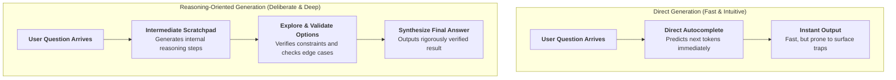
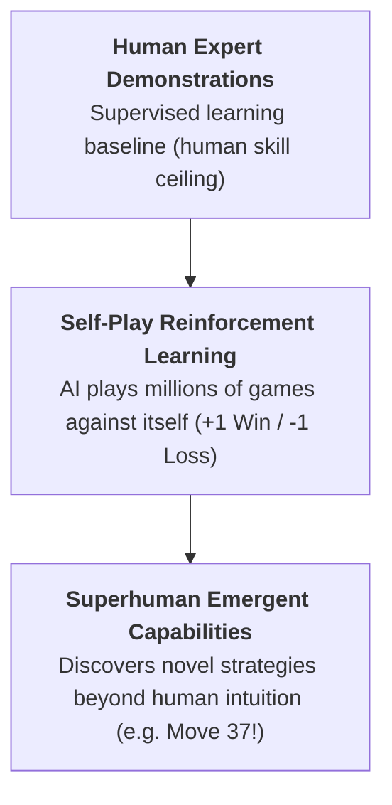
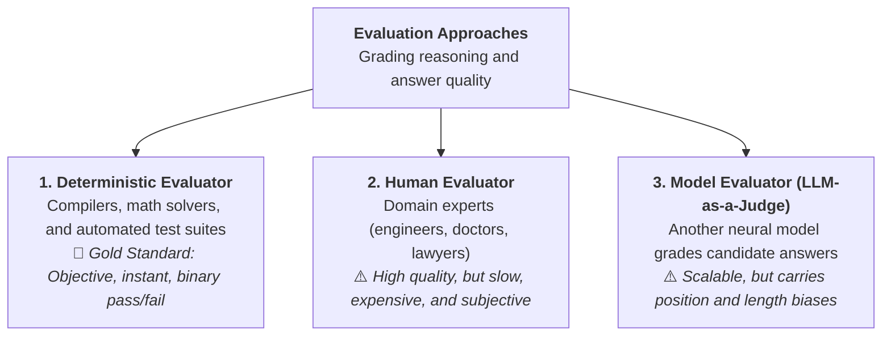

# 🤖 Can AI Really Think?

> **Episode 09 (Season 1 Finale)** | *The season finale explores what "thinking" means, why fluent language models can fail simple problems, how reasoning models use reinforcement learning and inference-time computation, and why powerful machine reasoning still does not settle the philosophical question of human-like thought.*

---

## 📌 In This Episode

```text
01 Thinking, reasoning, and fluent generation
02 Direct answers versus deliberate computation
03 DeepSeek-R1, AlphaGo, and reinforcement learning
04 Intermediate reasoning and chain of thought
05 Inference-time compute and overthinking
06 Verifiable rewards and three kinds of evaluator
07 Chain, tree, and graph-of-thought structures
08 The limits of reasoning — and the question left open
```

---

## ⏸️ 01. Pause Before You Answer: What is "Thinking"?

Before analyzing neural networks and mathematical algorithms, pause and reflect on a fundamental question:
> **What do we actually mean when we say a human being is "thinking"?**

Is thinking remembering your childhood home? Is it calculating a restaurant bill? Is it selecting a birthday gift? Is it planning a career pivot? Is it experiencing love, fear, or sadness?

In previous episodes, we established that a **base model** is an autocomplete prediction engine, while an **AI assistant** adds instruction tuning, safety guardrails, and tools. This season finale explores the frontier of modern AI: **Machine Reasoning**.

```
┌──────────────────────────────────────────────────────────────────────────────────┐
│                            THE THINKING UMBRELLA                                 │
├──────────────────────────────────────────────────────────────────────────────────┤
│ "Thinking" is a massive cognitive umbrella encompassing:                         │
│ • Remembering past memories and experiences                                      │
│ • Processing sensory stimuli (vision, sound, touch)                              │
│ • Planning sequences of future actions                                           │
│ • Comparing alternatives and weighing trade-offs                                 │
│ • Reasoning logically from premises to conclusions                               │
│ • Experiencing biological emotions, empathy, and consciousness                   │
└──────────────────────────────────────────────────────────────────────────────────┘
```

From an engineering perspective, the question *"Can AI think?"* primarily becomes: **Can AI reason?**

---

## 🤯 02. Brilliant Prose, Elementary Mistake

A frontier Large Language Model can write an exhaustive, textbook-quality explanation of quantum physics or rocket engineering, yet fail on trivial, child-level logic:

```
┌──────────────────────────────────────────────────────────────────────────────────┐
│                             TWO ELEMENTARY FAILURES                              │
├──────────────────────────────────┬───────────────────────────────────────────────┤
│ Demonstration 1: Decimal Trap    │ Prompt: "What is bigger: 9.11 or 9.9?"        │
│                                  │ ❌ Model Answer: "9.11 is bigger."             │
│                                  │ (Misled by surface text: 11 > 9, failing to   │
│                                  │  perform mathematical decimal comparison!)    │
├──────────────────────────────────┼───────────────────────────────────────────────┤
│ Demonstration 2: Character Trap  │ Prompt: "Print every 3rd character in         │
│                                  │  'Namaste Artificial Intelligence'."          │
│                                  │ ❌ Model Answer: Produces the wrong sequence! │
│                                  │ (Tokens are word chunks, not individual       │
│                                  │  indexable character arrays!)                 │
└──────────────────────────────────┴───────────────────────────────────────────────┘
```

```
┌──────────────────────────────────────────────────────────────────────────────────┐
│                         GENERATION vs. REASONING                                 │
├──────────────────────────────────┬───────────────────────────────────────────────┤
│ Fluent Generation                │ Deliberate Reasoning                          │
├──────────────────────────────────┼───────────────────────────────────────────────┤
│ • Autocompletes learned text     │ • Pauses before committing to an answer       │
│   patterns with high speed       │ • Breaks problem into dependent sub-steps     │
│ • Excellent for essays, summaries│ • Evaluates constraints and validates math    │
│ • Can hallucinate confidently    │ • Detects and repairs errors before output    │
└──────────────────────────────────┴───────────────────────────────────────────────┘
```

$$\mathbf{\text{"Fluent generation does not guarantee calculation quality."}}$$

---

## ⚡ 03. Direct Generation vs. Reasoning-Oriented Generation

```
┌──────────────────────────────────────────────────────────────────────────────────┐
│                        SUGGESTING A GIFT FOR A FRIEND                            │
├──────────────────────────────────┬───────────────────────────────────────────────┤
│ Direct Generation (Intuitive)    │ Reasoning-Oriented Generation (Thoughtful)    │
├──────────────────────────────────┼───────────────────────────────────────────────┤
│ Prompt goes in ──► Generic top   │ Prompt goes in ──► System pauses and evaluates│
│ candidates output immediately:   │ intermediate constraints:                     │
│ • "Chocolates"                   │ • What are their specific hobbies/passions?   │
│ • "A bouquet of roses"           │ • What is their profession and age?           │
│ • "A teddy bear"                 │ • What items do they already own?             │
│ • "A leather purse"              │ • What fits the designated budget?            │
│ (Common surface text patterns)   │ ──► Recommends a highly tailored, personal gift│
└──────────────────────────────────┴───────────────────────────────────────────────┘
```



---

## 📐 04. When Extra Steps Change the Answer

### 1. The 20% Revenue Problem:
* **Problem:** A company grows revenue by $+20\%$, then loses $-20\%$. Is it back to its original revenue?
* **Fast Intuition:** Yes, $+20$ and $-20$ cancel out to $100$ (Wrong!).
* **Deliberate Reasoning:**
  $$100 \xrightarrow{+20\%} 120 \xrightarrow{-20\% \text{ of } 120} 120 - 24 = \mathbf{96}$$
  *(The second $20\%$ operates on the expanded base of $120$!)*

### 2. The Bat and Ball Problem:
* **Problem:** A bat and a ball together cost $\$110$. The bat costs $\$100$ more than the ball. How much does the ball cost?
* **Fast Intuition:** $\$10$ (Wrong! If ball is $\$10$, bat is $\$110$, total is $\$120$).
* **Algebraic Reasoning:**
  $$\text{Ball} = x, \quad \text{Bat} = 100 + x$$
  $$x + (100 + x) = 110 \implies 2x + 100 = 110 \implies 2x = 10 \implies x = \mathbf{\$5}$$
  *(The ball costs $\$5$ and the bat costs $\$105$).*

### 3. The 23 Students & Notebooks Problem:
* **Problem:** 23 students each need 4 notebooks. Notebooks are sold only in packs of 10. How many packs must be bought?
* **Intermediate Steps:**
  $$23 \text{ students} \times 4 \text{ notebooks} = 92 \text{ notebooks}$$
  $$92 \div 10 = 9.2 \text{ packs} \implies \text{Round up to } \mathbf{10 \text{ full packs}}.$$

> [!TIP]
> **Do Not Overthink Simple Tasks:**  
> Asking *"Translate 'hello' to Hindi"* should return an immediate *"नमस्ते"*. The model should not waste 30 seconds comparing linguistic roots across Tamil, French, and Spanish!

---

## ⏳ 05. Reasoning Happens During Inference

In traditional LLMs, all computational energy is spent during **Training**. Reasoning models introduce deliberate computation during **Inference (Test Time)**:

```text
User: "There is a bug on line 15 of this function."

❌ Thoughtless Direct Answer: "Delete line 15."
✅ Reasoning-Oriented Answer :
   1. Read line 15 syntax and variables.
   2. Inspect surrounding scope and function inputs.
   3. Check for type mismatches or unhandled nulls.
   4. Trace error message stack trace.
   5. Formulate candidate repair.
   6. Mentally dry-run code with edge-case inputs.
   7. Output verified, working fix!
```

---

## 🇨🇳 06. The DeepSeek-R1 Moment and AlphaGo Self-Play

In early 2025, Chinese AI lab DeepSeek released **DeepSeek-R1** (*"Incentivizing Reasoning Capability in LLMs via Reinforcement Learning"*), sending shockwaves through the global tech market ($1 Trillion stock shift).

DeepSeek proved that **pure Reinforcement Learning (RL)** can incentivize models to self-generate reasoning chains, backtrack on errors, and verify math without needing human-annotated chains of thought!

```
┌──────────────────────────────────────────────────────────────────────────────────┐
│                        THE ALPHAGO PARADIGM (2016)                               │
├──────────────────────────────────────────────────────────────────────────────────┤
│ Developed by Google DeepMind to play Go against 18-time world champion Lee Sedol │
│ (AlphaGo won 4-1). In Game 2, Move 37 shocked the world: a creative, superhuman  │
│ move that no human player would have traditionally played!                       │
├──────────────────────────────────────────────────────────────────────────────────┤
│ Two Learning Pillars:                                                            │
│ 1. Supervised Learning: Climbs to the ceiling of human expert demonstrations.    │
│ 2. Self-Play RL: Plays millions of games against itself (+1 Win, -1 Loss).       │
│    Smashes through human demonstration ceilings to reach superhuman capability!  │
└──────────────────────────────────────────────────────────────────────────────────┘
```



---

## 🇲🇾 07. The Malaysia Travel Plan: Thinking in Action

The lecture demonstrates giving a constrained prompt to DeepSeek-R1 in deep-thinking mode:
> *"I want to go on a vacation in Malaysia in October with a budget of ₹2 lakh, with my wife and an infant. I want to explore cool food. Give me an itinerary and price breakdown."*

```
┌──────────────────────────────────────────────────────────────────────────────────┐
│                       WHAT THE MODEL THINKS ABOUT (116 SECONDS)                  │
├──────────────────────────────────────────────────────────────────────────────────┤
│ • Clarifies missing constraints (suggests a realistic 6-7 day duration)          │
│ • Analyzes seasonal weather in October (monsoon rain considerations)             │
│ • Evaluates cities: Kuala Lumpur (modern/easy) vs. Penang (food capital)         │
│ • Checks infant-friendly constraints: stroller access, baby food, bottled water  │
│ • Computes currency conversion: ₹2,00,000 INR to Malaysian Ringgit (MYR)         │
│ • Allocates budget across flights, hotels, food, and local Grab transport        │
└──────────────────────────────────────────────────────────────────────────────────┘
```

```
┌──────────────────────────────────┬───────────────────────────────────────────────┐
│ Thinking Level                   │ Time Spent & Behavior                         │
├──────────────────────────────────┼───────────────────────────────────────────────┤
│ 1. No Deep Thinking              │ Instant answer (makes rigid, unchecked assump)│
│ 2. Instant Thinking              │ ~20 seconds of basic scratchpad reasoning     │
│ 3. Expert Deep Thinking          │ ~116 seconds of comprehensive validation      │
└──────────────────────────────────┴───────────────────────────────────────────────┘
```

---

## 📈 08. The Second Scaling Dimension: Inference-Time Compute

Historically, AI scaled along **Training-Time Compute** (more GPUs, more data, bigger models). Reasoning models unlock a second dimension: **Inference-Time Compute**.

```
┌──────────────────────────────────┬───────────────────────────────────────────────┐
│ Training-Time Compute            │ Inference-Time Compute                        │
├──────────────────────────────────┼───────────────────────────────────────────────┤
│ • Trillions of internet tokens   │ • Prompt-specific deliberation                │
│ • Billions of weights updated    │ • Generates intermediate scratchpad tokens    │
│ • Fixed once model is deployed   │ • Scales compute dynamically based on problem │
│ • Builds general world knowledge │ • Validates math, executes code, fixes bugs   │
└──────────────────────────────────┴───────────────────────────────────────────────┘
```

### The Three-Zone Mental Model:

```
  Accuracy ▲
           │              2. Useful Thinking (Optimal Accuracy)
           │             ┌──────────────┐
           │            /                \   3. Overthinking
           │           /                  \ (Wastes tokens; e.g., 5+5="55")
           │          /                    \───────►
           │         /
           │        /  1. Underthinking (Hasty, intuitive errors)
           │       /
           └─────┴────────────────────────────────────► Inference Tokens / Time
```

```
┌──────────────────┬───────────────────────────────────────────────────────────────┐
│ Zone             │ Characteristics & Risk                                        │
├──────────────────┼───────────────────────────────────────────────────────────────┤
│ 1. Underthinking │ Responds prematurely; falls into deceptive surface traps.     │
│ 2. Useful Think  │ Decomposes steps, checks bounds, catches errors, solves task. │
│ 3. Overthinking  │ Diminishing returns; over-analyzes simple prompts into errors!│
└──────────────────┴───────────────────────────────────────────────────────────────┘
```

---

## 🎯 09. RLVR: Reinforcement Learning with Verifiable Rewards

How do we train models to reason reliably without human evaluators grading billions of steps?

```
┌──────────────────────────────────┬───────────────────────────────────────────────┐
│ RLHF (Human Preferences)         │ RLVR (Verifiable Rewards)                     │
├──────────────────────────────────┼───────────────────────────────────────────────┤
│ • Subjective tasks               │ • Objective, deterministic tasks              │
│ • Poetry, creative tone, essays  │ • Mathematics, Code execution, DSA, Logic     │
│ • Graded by human reviewers/RMs  │ • Graded automatically by compilers and tests │
│ • Prone to bias and sycophancy   │ • Ground-truth binary reward (Pass / Fail)    │
└──────────────────────────────────┴───────────────────────────────────────────────┘
```

* **The RLVR Loop:** Give the model 1,000 complex coding tasks $\rightarrow$ Execute code against test suites $\rightarrow$ Reward passing code ($+1$), penalize failing code ($-1$) $\rightarrow$ Update weights via RL.

---

## 👨‍⚖️ 10. The Three Kinds of Evaluators



> [!WARNING]
> **Who Judges the Judge?**  
> Using an LLM to evaluate other LLMs scales testing, but it inherits position bias, length bias, and hallucinations. **Using AI to evaluate AI does not magically create absolute objective truth.**

---

## 🌳 11. Reasoning Topologies: Chain vs. Tree vs. Graph of Thoughts

```
┌──────────────────────────────────────────────────────────────────────────────────┐
│                             REASONING TOPOLOGIES                                 │
├──────────────────────────────────────────────────────────────────────────────────┤
│ 1. Chain of Thought (CoT):                                                       │
│    [Step 1] ──► [Step 2] ──► [Step 3] ──► [Answer]                               │
│    • Linear sequence (like a linked list).                                       │
│    • If Step 2 makes a calculation error, the error cascades to the end!         │
├──────────────────────────────────────────────────────────────────────────────────┤
│ 2. Tree of Thoughts (ToT):                                                       │
│               ┌──► [Path A1] ──► [Failed Check ❌] ──► [Backtrack]               │
│    [Problem] ─┼──► [Path B1] ──► [Verified Step B2] ──► [Success ✅]             │
│               └──► [Path C1]                                                     │
│    • Explores multiple branches in parallel; backtracks when hitting dead ends.  │
├──────────────────────────────────────────────────────────────────────────────────┤
│ 3. Graph of Thoughts (GoT):                                                      │
│    [Fast Method A: O(n)] ────────┐                                               │
│                                  ├──► [Merge & Synthesize] ──► [Optimal Solution]│
│    [Edge-Case Handler B: O(n²)] ─┘                                               │
│    • Combines complementary branches into an optimal synthesis.                  │
└──────────────────────────────────────────────────────────────────────────────────┘
```

---

## 🪞 12. Visible Reasoning Is Not Always Faithful

When DeepSeek or other reasoning models display an English thinking trace:
* Is that prose a 100% literal transcript of internal neural activations? **No.**
* Internally, the model computes high-dimensional matrix dot products. The displayed English text is a **reconstructed narrative** generated around the computation.
* Research from Anthropic shows that internal influences can sometimes diverge from the generated explanation.

---

## 🛠️ 13. The Modern Assistant Trinity

A modern, production-grade AI system combines three distinct pillars:

$$\mathbf{\text{Complete AI System} = \text{1. Learned Knowledge} + \text{2. Inference Reasoning} + \text{3. External Tools}}$$

```
┌──────────────────────────────────┬───────────────────────────────────────────────┐
│ Task                             │ Primary Capability Needed                     │
├──────────────────────────────────┼───────────────────────────────────────────────┤
│ Explain closures in JavaScript   │ 📚 Learned Knowledge (Pre-training / SFT)     │
│ Current stock price of Apple     │ 🌐 Live Web Search Tool                       │
│ Calculate $458 \times 892$       │ 🧮 Calculator / Python Execution Tool         │
│ Solve complex mathematical proof │ 🧠 Inference Reasoning (CoT / RLVR)           │
│ Debug distributed backend system │ 🛠️ Reasoning + Code Tools + Knowledge        │
└──────────────────────────────────┴───────────────────────────────────────────────┘
```

---

## ❓ 14. So, Can AI Really Think?

```
┌──────────────────────────────────────────────────────────────────────────────────┐
│                         TWO PERSPECTIVES ON THINKING                             │
├──────────────────────────────────┬───────────────────────────────────────────────┤
│ The Engineering Reality          │ The Human Reality                             │
├──────────────────────────────────┼───────────────────────────────────────────────┤
│ • Decomposes complex logic       │ • Biologically embodied in a living organism  │
│ • Explores reasoning trees       │ • Driven by emotions, pain, love, and fears   │
│ • Validates constraints and fixes│ • Ask 5 humans to picture a "pet":            │
│ • Outperforms human champions    │   dog vs cat vs cow vs elephant!              │
│ • Remarkable COMPUTATIONAL       │   (Shaped by culture, geography, and memory)  │
│   REASONING!                     │                                               │
└──────────────────────────────────┴───────────────────────────────────────────────┘
```

> **The Season Finale's Closing Verdict:**  
> The lecture refuses to force a simplistic "yes" or "no". The computational and algorithmic mechanisms of artificial intelligence are now fully demystified. Whether you choose to define high-dimensional mathematical reasoning as "thinking" is left for you to decide.

---

## 📝 Chapter Summary

The season finale explores the distinction between fluent generation and deliberate reasoning. While autocomplete models can fail elementary traps like decimal comparisons ($9.11 > 9.9$), reasoning models introduce inference-time compute to plan, verify, and backtrack.

Using reinforcement learning with verifiable rewards (RLVR) and topologies like Chain, Tree, and Graph of Thoughts, machines can achieve superhuman performance on verifiable tasks (such as code and math). A modern assistant combines learned knowledge, inference-time reasoning, and external tools—leaving the ultimate philosophical definition of "thinking" open to the learner.

---

## 🔥 Key Takeaways

* **Generation $\neq$ Reasoning:** Fluent writing does not guarantee logical or mathematical correctness.
* **Inference-Time Compute:** Spending extra compute during query execution allows models to deliberate before answering.
* **The 3 Compute Zones:** Underthinking (hasty mistakes), Useful Thinking (optimal verification), Overthinking (wasted compute).
* **RLVR:** Reinforcement learning with automated, objective test verification (compilers, math checkers).
* **Reasoning Structures:** Chain of Thought (linear), Tree of Thoughts (branching/backtracking), Graph of Thoughts (combining paths).
* **The AI Assistant Trinity:** $\text{Learned Knowledge} + \text{Inference Reasoning} + \text{External Tools}$.
* **Philosophical Open Question:** Machine reasoning is mathematical computation; human thought is biologically and culturally embodied.

---

Previous : [07. From a Base Model to an AI Assistant](./07_From_a_Base_Model_to_an_AI_Assistant.md) | Index: [00_index.md](../00_index.md) | Next: —
