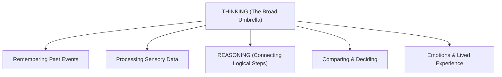

# 🤖 Can AI Really Think?

> **Episode 09 (Season 1 Finale)** | *The season finale explores what "thinking" means, why fluent language models can fail simple problems, how reasoning models use reinforcement learning and inference-time computation, and why powerful machine reasoning still does not settle the philosophical question of human-like thought.*

---

## 📌 In This Episode

```text
01 Thinking, reasoning, and fluent generation
02 Direct answers versus deliberate computation
03 DeepSeek-R1, AlphaGo, and reinforcement learning
04 Intermediate reasoning and chain of thought
05 Inference-time compute and overthinking
06 Verifiable rewards and three kinds of evaluator
07 Chain, tree, and graph-of-thought structures
08 The limits of reasoning — and the question left open
```

---

## ⏸️ Pause Before You Answer

Before analyzing models, pause and ask:
> **What do we actually mean when we say that a person is "thinking"?**

Is thinking remembering? Calculating? Planning? Feeling emotion?

In earlier episodes, we saw that base models predict next tokens, while aligned assistants follow instructions. This finale explores the next major leap: **Machine Reasoning**.

---

## 🤯 Brilliant Prose, Elementary Mistake

A frontier LLM can write a master's thesis on quantum physics, yet fail at child-level logic:

```
┌────────────────────────────────────────────────────────────────────────┐
│                        TWO ELEMENTARY FAILURES                         │
├──────────────────────────────────┬─────────────────────────────────────┤
│ 1. "Which is bigger: 9.11 or 9.9"│ ❌ Model outputs: "9.11 is bigger"  │
│                                  │ (Misled by surface text: "11 > 9")  │
├──────────────────────────────────┼─────────────────────────────────────┤
│ 2. "Print every 3rd character in │ ❌ Model outputs wrong characters!  │
│    'Namaste Artificial Intel...'"│ (Tokens are word chunks, not chars) │
└──────────────────────────────────┴─────────────────────────────────────┘
```

> **The Core Insight:**  
> **Generation quality $\neq$ Calculation quality.**  
> * **Generation:** Continuing learned language patterns fluently.  
> * **Reasoning:** Pausing, carrying out intermediate work, checking constraints, and validating an answer before committing.

---

## 🧠 Thinking is Larger Than Reasoning



```text
Human Reasoning Examples:
1. Planning a Birthday Trip: Mountains or beach? -> Past visited places? -> Budget? -> Season? -> Choice!
2. Preparing a Lecture: First-year students or senior devs? -> What depth? -> Adjust content!
```

---

## ⚡ Direct Generation vs. Reasoning-Oriented Generation

```
┌────────────────────────────────────────────────────────────────────────┐
│                        TWO GENERATION PARADIGMS                        │
├──────────────────────────────────┬─────────────────────────────────────┤
│ Direct Generation (Fast)         │ Reasoning-Oriented (Deliberate)     │
├──────────────────────────────────┼─────────────────────────────────────┤
│ • Prompt arrives ──► Immediate   │ • Prompt arrives ──► Intermediate   │
│   text output                    │   scratchpad computation            │
│ • "Suggest a gift for my friend" │ • Considers interests, budget, age  │
│   ──► "Chocolates, teddy bear"   │   ──► Thoughtful, personal choice   │
│ • Best for simple, routine tasks │ • Best for multi-step, logic tasks  │
└──────────────────────────────────┴─────────────────────────────────────┘
```

---

## 📐 When Extra Steps Change the Answer

### 1. The 20% Revenue Problem:
* Revenue grows by $+20\%$, then loses $-20\%$. Is it back to $100$?
* **Fast Intuition:** $100$ (Wrong!).
* **Step-by-Step Reasoning:**
  $$100 \xrightarrow{+20\%} 120 \xrightarrow{-20\% \text{ of } 120} 120 - 24 = \mathbf{96}$$

### 2. The Bat and Ball Problem:
* Bat + Ball = $\$110$. Bat costs $\$100$ more than ball. How much is the ball?
* **Fast Intuition:** $\$10$ (Wrong! $100 - 10 = 90$).
* **Step-by-Step Algebra:**
  $$\text{Ball} = x, \quad \text{Bat} = x + 100$$
  $$x + (x + 100) = 110 \implies 2x = 10 \implies x = \mathbf{\$5}$$
  *(Ball = $\$5$, Bat = $\$105$).*

> [!TIP]
> **Do Not Overthink Everything:** Asking *"Translate 'hello' to Hindi"* should receive an immediate *"नमस्ते"*, not 30 seconds of wasted compute!

---

## ⏳ Reasoning Happens During Inference

Traditional models spend all compute during **Training**. Reasoning models introduce deliberate computation during **Inference (Test Time)**:

```text
User: "There is an error on line 15."
❌ Thoughtless Answer : "Delete line 15."
✅ Reasoning Answer   : 1. Read line 15 -> 2. Check scope -> 3. Check syntax -> 4. Trace logic ->
                        5. Inspect error -> 6. Test fix -> 7. Return verified solution!
```

---

## 🇨🇳 DeepSeek-R1 & AlphaGo Self-Play

```
┌────────────────────────────────────────────────────────────────────────┐
│                        THE ALPHAGO PARADIGM                            │
├────────────────────────────────────────────────────────────────────────┤
│ 1. Supervised Learning on Humans: Hits ceiling of human habits/flaws.  │
│ 2. Self-Play Reinforcement Learning: AlphaGo played millions of games  │
│    against itself (+1 Win, -1 Loss) ──► Discovered Move 37!            │
│ 3. DeepSeek-R1 (2025): Showed pure RL incentivizes LLM reasoning &     │
│    self-correction without human-labeled chains of thought!            │
└────────────────────────────────────────────────────────────────────────┘
```

---

## 📈 The Second Scaling Dimension: Inference-Time Compute

```
                             TWO PLACES TO SPEND COMPUTE
                             
      Training-Time Compute                    Inference-Time Compute
    ┌─────────────────────────┐              ┌─────────────────────────┐
    │ • Trillions of tokens   │              │ • Prompt received       │
    │ • Billions of weights   │     PLUS     │ • Explores scratchpad   │
    │ • Shapes base model     │              │ • Verifies calculations │
    │ • Fixed pre-deployment  │              │ • Spends extra tokens   │
    └─────────────────────────┘              └─────────────────────────┘
```

### The Three-Zone Mental Model:
```
  Accuracy ▲
           │              Useful Thinking (High Accuracy)
           │             ┌──────────────┐
           │            /                \   Overthinking
           │           /                  \ (Wastes tokens on "5+5=55")
           │          /                    \───────►
           │         /
           │        /  Underthinking (Hasty errors)
           │       /
           └─────┴────────────────────────────────────► Inference Tokens Spent
```

---

## 🎯 RLVR: Reinforcement Learning with Verifiable Rewards

```
┌────────────────────────────────────────────────────────────────────────┐
│                               RLHF vs. RLVR                            │
├──────────────────────────────────┬─────────────────────────────────────┤
│ RLHF (Preference Feedback)       │ RLVR (Verifiable Rewards)           │
├──────────────────────────────────┼─────────────────────────────────────┤
│ • Subjective (Poetry, tone, style│ • Deterministic (Math, Code, DSA)   │
│ • Graded by humans/reward models │ • Graded by compilers & test suites │
│ • Prone to rater bias/disagreement│ • Absolute Pass/Fail correctness   │
└──────────────────────────────────┴─────────────────────────────────────┘
```

---

## 👨‍⚖️ The 3 Kinds of Evaluators

1. **Deterministic Evaluator:** Exact test suites, math checkers, compilers. *(Always prefer this!)*.
2. **Human Evaluator:** Domain experts judging aesthetics and ethics. *(Slow & expensive)*.
3. **Model Evaluator (LLM-as-a-Judge):** Another LLM grades answers. *(Scalable, but carries length and position biases)*.

---

## 🌳 Reasoning Topologies: Chain vs. Tree vs. Graph of Thoughts

```
┌────────────────────────────────────────────────────────────────────────┐
│                        REASONING TOPOLOGIES                            │
├────────────────────────────────────────────────────────────────────────┤
│ 1. Chain of Thought (CoT):                                             │
│    [Step A] ──► [Step B] ──► [Step C] ──► [Answer]                     │
│    (Linear like a linked list; if Step B fails, error cascades).       │
│                                                                        │
│ 2. Tree of Thoughts (ToT):                                             │
│               ┌──► [Path A1] ──► [Dead End - Backtrack]                │
│    [Problem] ─┼──► [Path B1] ──► [Valid Solution ✅]                   │
│               └──► [Path C1]                                           │
│    (Branches into alternatives and backtracks).                        │
│                                                                        │
│ 3. Graph of Thoughts (GoT):                                            │
│    [Fast Method A] ──────┐                                             │
│                          ├──► [Merge & Synthesize] ──► [Best Result]   │
│    [Edge Case Handler B] ┘                                             │
│    (Recombines complementary reasoning paths).                         │
└────────────────────────────────────────────────────────────────────────┘
```

---

## 🪞 Visible Reasoning Is Not Always Faithful

When DeepSeek or OpenAI models show an English "thinking trace":
* It is **not** a literal transcript of neuron activations.
* The model executes high-dimensional matrix mathematics; the English trace is a **generated post-hoc narrative**.

---

## 🛠️ The Modern Assistant Trinity

$$\mathbf{\text{Modern AI System} = \text{1. Learned Knowledge} + \text{2. Inference Reasoning} + \text{3. External Tools}}$$

```
┌──────────────────────────────────┬─────────────────────────────────────┐
│ Task                             │ Primary Capability Needed           │
├──────────────────────────────────┼─────────────────────────────────────┤
│ Explain closures in JS           │ Learned Knowledge (Pre-training)    │
│ Current stock price              │ Live Search Tool                    │
│ Complex arithmetic ($458 \times 892$)    │ Calculator / Python Tool            │
│ Solve a math proof               │ Reasoning (CoT / RLVR)              │
│ Debug complex distributed system │ Reasoning + Code Tools + Knowledge  │
└──────────────────────────────────┴─────────────────────────────────────┘
```

---

## ❓ So, Can AI Really Think?

```
┌────────────────────────────────────────────────────────────────────────┐
│                        TWO PERSPECTIVES ON THINKING                    │
├──────────────────────────────────┬─────────────────────────────────────┤
│ Engineering Reality              │ Human Reality                       │
├──────────────────────────────────┼─────────────────────────────────────┤
│ • Solves complex logic & code    │ • Biologically embodied & emotional │
│ • Plans, searches trees & verifies│ • Shaped by culture & memories     │
│ • Remarkable COMPUTATIONAL       │ • Ask 5 people to picture a "pet":  │
│   REASONING!                     │   dog vs cat vs cow vs elephant!    │
└──────────────────────────────────┴─────────────────────────────────────┘
```

> **The Finale's Conclusion:**  
> The lecture leaves the philosophical definition open. The technical mechanics are fully laid bare; whether you choose to call high-dimensional matrix optimization "thinking" is left to you.

---

## 📝 Chapter Summary

The finale contrasts fluent language generation with deliberate logical reasoning. While next-token prediction can fail simple traps like decimal comparisons ($9.11 > 9.9$), reasoning models introduce inference-time compute to plan, verify, and backtrack.

Using reinforcement learning with verifiable rewards (RLVR) and topologies like Chain, Tree, and Graph of Thoughts, machines can achieve superhuman performance on verifiable tasks (such as code and math). A modern assistant combines learned knowledge, inference-time reasoning, and external tools—leaving the ultimate philosophical definition of "thinking" open to the learner.

---

## 🔥 Key Takeaways

* **Generation $\neq$ Reasoning:** Fluent writing does not guarantee logical or mathematical correctness.
* **Inference-Time Compute:** Scaling computation during query execution allows models to "think" before answering.
* **The 3 Compute Zones:** Underthinking (hasty mistakes), Useful Thinking (accurate verification), Overthinking (wasteful compute).
* **RLVR:** Reinforcement learning with automated, objective test verification (compilers, math checkers).
* **Reasoning Structures:** Chain of Thought (linear), Tree of Thoughts (branching/backtracking), Graph of Thoughts (combining paths).
* **The AI Assistant Trinity:** $\text{Learned Knowledge} + \text{Inference Reasoning} + \text{External Tools}$.
* **Philosophical Open Question:** Machine reasoning is mathematical computation; human thought is biologically and culturally embodied.

---

## ❓ Revision Questions & Answers

1. **Why does the instructor ask the learner to define thinking before discussing AI?**  
   *Answer:* To highlight that "thinking" is a broad, subjective human concept that must be clarified before evaluating machine capabilities.
2. **What happened in the 9.11-versus-9.9 demonstration?**  
   *Answer:* The language model incorrectly declared that $9.11$ is bigger than $9.9$ because surface text patterns associate the number $11$ as greater than $9$.
3. **Why is the final result of the every-third-character example uncertain in the supplied transcript?**  
   *Answer:* Because token-based autoregression cannot count raw characters without scratchpad execution or code tools.
4. **How does the lecture distinguish generation from reasoning?**  
   *Answer:* Generation is immediate statistical text completion; reasoning is multi-step intermediate computation that explores, verifies, and revises before committing.
5. **Which activities sit under the broad term thinking?**  
   *Answer:* Remembering, processing, planning, comparing, deciding, feeling, and perceiving.
6. **How do the birthday-trip and guest-lecture examples illustrate reasoning?**  
   *Answer:* They require evaluating multiple connected constraints (budget, season, audience background) rather than retrieving a single stored answer.
7. **What is the difference between a direct gift suggestion and a thoughtful one?**  
   *Answer:* A direct suggestion gives generic items (chocolates, roses); a thoughtful one evaluates the recipient's age, interests, and preferences.
8. **Why does +20% followed by -20% produce 96 when the starting value is 100?**  
   *Answer:* Because the $20\%$ increase makes the total $120$, and the subsequent $20\%$ decrease removes $24$ ($20\%$ of $120$), leaving $96$.
9. **Which kinds of prompt should receive a direct answer?**  
   *Answer:* Simple, familiar, factual prompts like *"Translate 'hello' into Hindi"*.
10. **What does inference mean in this chapter?**  
    *Answer:* The phase where an already-trained model processes a user prompt and generates a response.
11. **How does the line-15 debugging example decompose a problem?**  
    *Answer:* It reads nearby code, checks syntax/logic, inspects error traces, forms hypotheses, tests fixes, and returns verified code.
12. **What role does reinforcement learning play in the DeepSeek-R1 discussion?**  
    *Answer:* It shows that pure RL can incentivize reasoning and self-correction without human-labeled reasoning demonstrations.
13. **Which two learning sources are named for AlphaGo?**  
    *Answer:* 1) Supervised learning on human grandmaster games, 2) Reinforcement learning from self-play.
14. **Why can self-play scale beyond human demonstration data?**  
    *Answer:* Because machines can simulate millions of games against themselves, discovering strategies beyond human knowledge.
15. **What does a win or loss provide during AlphaGo training?**  
    *Answer:* An automated, unambiguous reward signal ($+1$ or $-1$) to update policy weights.
16. **What constraints are present in the Malaysia travel prompt?**  
    *Answer:* Destination, October timing (monsoon rain), ₹2 lakh budget, 2 adults + 1 infant, food focus, and itemized pricing.
17. **What kinds of subproblem does the visible travel reasoning explore?**  
    *Answer:* Language choice, trip duration, candidate cities, weather, visa requirements, currency conversion, flights, hotels, and infant food/water safety.
18. **What is intermediate reasoning?**  
    *Answer:* Generating step-by-step intermediate deductions where each step preserves information for the next.
19. **How does the notebook-packet problem arrive at 10 packets?**  
    *Answer:* $23 \times 4 = 92$ notebooks $\div 10 = 9.2 \implies \lceil 9.2 \rceil = 10$ full packets.
20. **What is a chain of thought?**  
    *Answer:* A sequence of intermediate reasoning steps generated before reaching the final answer.
21. **Why is $5—not $10—the answer to the bat-and-ball problem?**  
    *Answer:* $x + (x + 100) = 110 \implies 2x = 10 \implies x = 5$ (Ball = $\$5$, Bat = $\$105$).
22. **What is the difference between training-time and inference-time compute?**  
    *Answer:* Training compute builds the model parameters; inference compute spends tokens reasoning through a specific query during execution.
23. **Why do more tokens not automatically mean more intelligence?**  
    *Answer:* Overthinking simple queries wastes latency and can lead to hallucinated complexity.
24. **What are underthinking, useful thinking, and overthinking?**  
    *Answer:* Underthinking = hasty errors; Useful thinking = verified multi-step logic; Overthinking = diminishing returns and confusion on trivial tasks.
25. **What makes a task verifiable?**  
    *Answer:* When its correctness can be objectively tested by an exact mathematical rule, test suite, or compiler.
26. **What does RLVR stand for?**  
    *Answer:* Reinforcement Learning with Verifiable Rewards.
27. **Why are mathematics, code, and games useful for verifiable rewards?**  
    *Answer:* Because their solutions produce unambiguous programmatic pass/fail outcomes.
28. **What are the three evaluator types?**  
    *Answer:* 1) Deterministic evaluators, 2) Human evaluators, 3) Model evaluators (LLM-as-a-judge).
29. **What is LLM as a judge?**  
    *Answer:* Using a secondary language model to evaluate and score the output of another model.
30. **Why must a model evaluator itself be evaluated?**  
    *Answer:* Because model judges carry length bias, position bias, and self-enhancement tendencies.
31. **How do a chain, tree, and graph of thoughts differ?**  
    *Answer:* Chain is linear; Tree branches with backtracking; Graph allows branches to diverge, reconnect, and combine complementary solutions.
32. **Why might a visible English thought process not be faithful to internal computation?**  
    *Answer:* Because the English trace is a generated narrative reconstruction of underlying high-dimensional matrix mathematics.
33. **What limitations remain in reasoning models?**  
    *Answer:* They can still hallucinate, accept false premises, overthink, and make arithmetic errors if ungrounded.
34. **Which task examples in the recap use generation, tools, retrieval, reasoning, or a combination?**  
    *Answer:* Recursion explanation uses generation; stock price uses tools; travel planning uses knowledge + reasoning + tools; proof uses reasoning.
35. **What three capabilities make up the final modern-assistant picture?**  
    *Answer:* 1) Learned Knowledge, 2) Inference-Time Reasoning, 3) External Tools.
36. **Why does the instructor leave the central question without a yes-or-no answer?**  
    *Answer:* Because while computational reasoning is an engineering fact, the philosophical definition of conscious thought remains deeply human and open to interpretation.

---

Previous : [07. From a Base Model to an AI Assistant](./07_From_a_Base_Model_to_an_AI_Assistant.md) | Index: [00_index.md](../00_index.md) | Next: —
