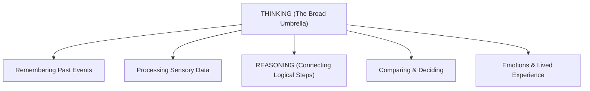

# 🤖 Can AI Really Think?

> **Episode 09 (Season 1 Finale)** | *The season finale explores what "thinking" means, why fluent language models can fail simple problems, how reasoning models use reinforcement learning and inference-time computation, and why powerful machine reasoning still does not settle the philosophical question of human-like thought.*

---

## 📌 In This Episode

```text
01 Thinking, reasoning, and fluent generation
02 Direct answers versus deliberate computation
03 DeepSeek-R1, AlphaGo, and reinforcement learning
04 Intermediate reasoning and chain of thought
05 Inference-time compute and overthinking
06 Verifiable rewards and three kinds of evaluator
07 Chain, tree, and graph-of-thought structures
08 The limits of reasoning — and the question left open
```

---

## ⏸️ Pause Before You Answer

Before analyzing models and mathematics, pause and ask:
> **What do we actually mean when we say that a person is "thinking"?**

Is thinking remembering a past event? Is it planning a vacation? Is it calculating a budget? Is it feeling an emotion?

In earlier episodes, we saw that base models predict next tokens, while aligned assistants follow instructions and use tools. This finale explores the next major leap in artificial intelligence: **Machine Reasoning**.

---

## 🤯 Brilliant Prose, Elementary Mistake

A frontier Large Language Model can write a scientific thesis on quantum mechanics, yet fail at child-level logic:

```
┌────────────────────────────────────────────────────────────────────────┐
│                        TWO ELEMENTARY FAILURES                         │
├──────────────────────────────────┬─────────────────────────────────────┤
│ 1. "Which is bigger: 9.11 or 9.9"│ ❌ Model outputs: "9.11 is bigger"  │
│                                  │ (Misled by surface text: "11 > 9"   │
│                                  │ without decimal alignment!)         │
├──────────────────────────────────┼─────────────────────────────────────┤
│ 2. "Print every 3rd character in │ ❌ Model outputs wrong characters!  │
│    'Namaste Artificial Intel...'"│ (Tokens are word chunks, not        │
│                                  │ individual indexable letters!)      │
└──────────────────────────────────┴─────────────────────────────────────┘
```

> **The Core Insight:**  
> **Generation quality $\neq$ Calculation quality.**  
> * **Generation:** Fluently continuing learned statistical text patterns.  
> * **Reasoning:** Pausing, carrying out intermediate work, checking constraints, and validating an answer before committing.

---

## 🧠 Thinking is Larger Than Reasoning



**Reasoning** is one specific slice of the thinking umbrella: *using connected, logical steps to deduce what follows from available information.*

```text
Human Reasoning Examples:
1. Planning a Birthday Trip: Mountains or beach? -> Visited places? -> Budget limit? -> Weather season? -> Final Choice!
2. Preparing a Guest Lecture: First-year students or senior engineers? -> What depth? -> Tailor examples!
```

---

## ⚡ Direct Generation vs. Reasoning-Oriented Generation

```
┌────────────────────────────────────────────────────────────────────────┐
│                        TWO GENERATION PARADIGMS                        │
├──────────────────────────────────┬─────────────────────────────────────┤
│ Direct Generation (Fast)         │ Reasoning-Oriented (Deliberate)     │
├──────────────────────────────────┼─────────────────────────────────────┤
│ • Prompt arrives ──► Immediate   │ • Prompt arrives ──► Intermediate   │
│   text output                    │   scratchpad computation            │
│ • "Suggest a gift for my friend" │ • Evaluates hobbies, budget, age,   │
│   ──► "Chocolates, teddy bear"   │   and past gifts ──► Thoughtful pick│
│ • Best for simple, routine tasks │ • Best for multi-step logic & math  │
└──────────────────────────────────┴─────────────────────────────────────┘
```

---

## 📐 When Extra Steps Change the Answer

### 1. The 20% Revenue Problem:
* A company's revenue grows by $+20\%$, then drops by $-20\%$. Is it back to $100$?
* **Fast Intuition:** $100$ (Wrong!).
* **Step-by-Step Reasoning:**
  $$100 \xrightarrow{+20\%} 120 \xrightarrow{-20\% \text{ of } 120} 120 - 24 = \mathbf{96}$$
  *(The second percentage acts on a larger base of $120$!)*

### 2. The Bat and Ball Problem:
* A bat and a ball together cost $\$110$. The bat costs $\$100$ more than the ball. How much is the ball?
* **Fast Intuition:** $\$10$ (Wrong! $100 - 10 = 90$).
* **Step-by-Step Algebra:**
  $$\text{Ball} = x, \quad \text{Bat} = x + 100$$
  $$x + (x + 100) = 110 \implies 2x + 100 = 110 \implies 2x = 10 \implies x = \mathbf{\$5}$$
  *(The ball costs $\$5$ and the bat costs $\$105$).*

> [!TIP]
> **Do Not Overthink Simple Queries:**  
> Asking *"Translate 'hello' to Hindi"* should receive an immediate *"नमस्ते"*, not 30 seconds of wasted compute comparing 10 languages!

---

## ⏳ Reasoning Happens During Inference

Traditional models spend all compute during **Training**. Reasoning models introduce deliberate computation during **Inference (Test Time)**:

```text
User: "There is an error on line 15."
❌ Thoughtless Answer : "Delete line 15."
✅ Reasoning Answer   : 1. Read line 15 -> 2. Check scope -> 3. Check syntax -> 4. Trace logic ->
                        5. Inspect error trace -> 6. Test candidate fix -> 7. Return verified solution!
```

---

## 🇨🇳 DeepSeek-R1 & AlphaGo Self-Play

```
┌────────────────────────────────────────────────────────────────────────┐
│                        THE ALPHAGO PARADIGM                            │
├────────────────────────────────────────────────────────────────────────┤
│ 1. Supervised Learning on Humans: Climbs to the ceiling of human habits│
│    and blind spots.                                                    │
│ 2. Self-Play Reinforcement Learning: AlphaGo played millions of games  │
│    against itself (+1 Win, -1 Loss) ──► Discovered Move 37!            │
│ 3. DeepSeek-R1 (2025): Proved that pure RL incentivizes emergent LLM   │
│    reasoning, backtracking, and self-correction without human chains!  │
└────────────────────────────────────────────────────────────────────────┘
```

---

## 📈 The Second Scaling Dimension: Inference-Time Compute

```
                             TWO PLACES TO SPEND COMPUTE
                             
      Training-Time Compute                    Inference-Time Compute
    ┌─────────────────────────┐              ┌─────────────────────────┐
    │ • Trillions of tokens   │              │ • Prompt received       │
    │ • Billions of weights   │     PLUS     │ • Explores scratchpad   │
    │ • Shapes base model     │              │ • Verifies calculations │
    │ • Fixed pre-deployment  │              │ • Spends extra tokens   │
    └─────────────────────────┘              └─────────────────────────┘
```

### The Three-Zone Mental Model:

```
  Accuracy ▲
           │              Useful Thinking (High Accuracy)
           │             ┌──────────────┐
           │            /                \   Overthinking
           │           /                  \ (Wastes tokens on "5+5=55")
           │          /                    \───────►
           │         /
           │        /  Underthinking (Hasty errors)
           │       /
           └─────┴────────────────────────────────────► Inference Tokens Spent
```

```
┌──────────────────┬─────────────────────────────────────────────────────┐
│ Zone             │ Behavior & Outcome                                  │
├──────────────────┼─────────────────────────────────────────────────────┤
│ 1. Underthinking │ Rushes to answer; makes premature, intuitive errors.│
│ 2. Useful Think  │ Explores steps, checks constraints, solves problem. │
│ 3. Overthinking  │ Spends 2 mins on "5+5", hallucinating complex bugs. │
└──────────────────┴─────────────────────────────────────────────────────┘
```

---

## 🎯 RLVR: Reinforcement Learning with Verifiable Rewards

```
┌────────────────────────────────────────────────────────────────────────┐
│                               RLHF vs. RLVR                            │
├──────────────────────────────────┬─────────────────────────────────────┤
│ RLHF (Preference Feedback)       │ RLVR (Verifiable Rewards)           │
├──────────────────────────────────┼─────────────────────────────────────┤
│ • Subjective tasks (Poetry, tone)│ • Deterministic (Math, Code, DSA)   │
│ • Graded by humans/reward models │ • Graded by compilers & test suites │
│ • Prone to rater bias/disagreement│ • Absolute Pass/Fail correctness   │
└──────────────────────────────────┴─────────────────────────────────────┘
```

---

## 👨‍⚖️ The 3 Kinds of Evaluators

1. **Deterministic Evaluator:** Exact test suites, math checkers, compilers. *(Always preferred when available!)*
2. **Human Evaluator:** Domain experts judging aesthetics, tone, and medical ethics. *(Slow and expensive)*.
3. **Model Evaluator (LLM-as-a-Judge):** Another LLM grades candidate answers. *(Scalable, but carries length and position biases)*.

---

## 🌳 Reasoning Topologies: Chain vs. Tree vs. Graph of Thoughts

```
┌────────────────────────────────────────────────────────────────────────┐
│                        REASONING TOPOLOGIES                            │
├────────────────────────────────────────────────────────────────────────┤
│ 1. Chain of Thought (CoT):                                             │
│    [Step A] ──► [Step B] ──► [Step C] ──► [Answer]                     │
│    (Linear like a linked list; if Step B fails, error cascades).       │
│                                                                        │
│ 2. Tree of Thoughts (ToT):                                             │
│               ┌──► [Path A1] ──► [Dead End - Backtrack]                │
│    [Problem] ─┼──► [Path B1] ──► [Valid Solution ✅]                   │
│               └──► [Path C1]                                           │
│    (Branches into alternatives and backtracks when paths fail).        │
│                                                                        │
│ 3. Graph of Thoughts (GoT):                                            │
│    [Fast Method A] ──────┐                                             │
│                          ├──► [Merge & Synthesize] ──► [Best Result]   │
│    [Edge Case Handler B] ┘                                             │
│    (Recombines complementary reasoning paths).                         │
└────────────────────────────────────────────────────────────────────────┘
```

---

## 🪞 Visible Reasoning Is Not Always Faithful

When DeepSeek or OpenAI models show an English "thinking trace":
* Is that prose a literal transcript of neuron activations? **No.**
* The model executes high-dimensional matrix mathematics; the English trace is a **generated post-hoc narrative** reconstructed around the calculation.

---

## 🛠️ The Modern Assistant Trinity

$$\mathbf{\text{Complete AI System} = \text{1. Learned Knowledge} + \text{2. Inference Reasoning} + \text{3. External Tools}}$$

```
┌──────────────────────────────────┬─────────────────────────────────────┐
│ Task                             │ Primary Capability Needed           │
├──────────────────────────────────┼─────────────────────────────────────┤
│ Explain closures in JavaScript   │ Learned Knowledge (Pre-training)    │
│ Current stock price of Apple     │ Live Search Tool                    │
│ Complex arithmetic ($458 \times 892$)    │ Calculator / Python Code Tool       │
│ Solve a mathematical proof       │ Reasoning (CoT / RLVR)              │
│ Debug complex distributed system │ Reasoning + Code Tools + Knowledge  │
└──────────────────────────────────┴─────────────────────────────────────┘
```

---

## ❓ So, Can AI Really Think?

```
┌────────────────────────────────────────────────────────────────────────┐
│                        TWO PERSPECTIVES ON THINKING                    │
├──────────────────────────────────┬─────────────────────────────────────┤
│ Engineering Reality              │ Human Reality                       │
├──────────────────────────────────┼─────────────────────────────────────┤
│ • Solves complex logic & code    │ • Biologically embodied & emotional │
│ • Searches reasoning trees       │ • Shaped by culture, pain & memories│
│ • Verifies constraints & fixes   │ • Ask 5 people to picture a "pet":  │
│ • Remarkable COMPUTATIONAL       │   dog vs cat vs cow vs elephant!    │
│   REASONING!                     │   (Driven by lived experience!)     │
└──────────────────────────────────┴─────────────────────────────────────┘
```

> **The Finale's Conclusion:**  
> The lecture leaves the philosophical definition open. The technical mechanics are fully laid bare; whether you choose to call high-dimensional matrix optimization "thinking" is left to you.

---

## 📝 Chapter Summary

The finale contrasts fluent language generation with deliberate logical reasoning. While next-token prediction can fail simple traps like decimal comparisons ($9.11 > 9.9$), reasoning models introduce inference-time compute to plan, verify, and backtrack.

Using reinforcement learning with verifiable rewards (RLVR) and topologies like Chain, Tree, and Graph of Thoughts, machines can achieve superhuman performance on verifiable tasks (such as code and math). A modern assistant combines learned knowledge, inference-time reasoning, and external tools—leaving the ultimate philosophical definition of "thinking" open to the learner.

---

## 🔥 Key Takeaways

* **Generation $\neq$ Reasoning:** Fluent writing does not guarantee logical or mathematical correctness.
* **Inference-Time Compute:** Scaling computation during query execution allows models to "think" before answering.
* **The 3 Compute Zones:** Underthinking (hasty mistakes), Useful Thinking (accurate verification), Overthinking (wasteful compute).
* **RLVR:** Reinforcement learning with automated, objective test verification (compilers, math checkers).
* **Reasoning Structures:** Chain of Thought (linear), Tree of Thoughts (branching/backtracking), Graph of Thoughts (combining paths).
* **The AI Assistant Trinity:** $\text{Learned Knowledge} + \text{Inference Reasoning} + \text{External Tools}$.
* **Philosophical Open Question:** Machine reasoning is mathematical computation; human thought is biologically and culturally embodied.

---

Previous : [07. From a Base Model to an AI Assistant](./07_From_a_Base_Model_to_an_AI_Assistant.md) | Index: [00_index.md](../00_index.md) | Next: —
