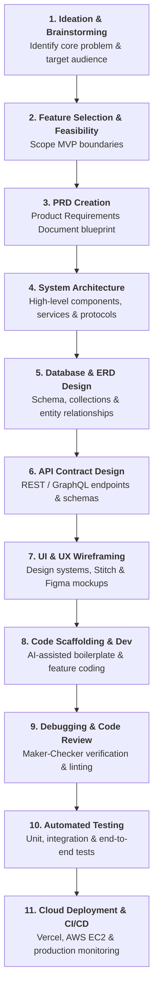

# 🤖 Fundamentals of Building with AI

> **Season 02 — Episode 01** | *This episode marks the transition from learning how AI works internally (Season 1) to actually building real-world software products with AI as your core development partner, covering the supervisor mindset shift, the AI-augmented SDLC, tool selection, and engineering fundamentals.*

---

## 📌 In This Episode

```text
01 The Mindset Shift: From Coder to Commander (Supervisor)
02 The AI Software Development Life Cycle (SDLC)
03 Feasibility & Minimum Viable Product (MVP)
04 Core Stages: PRD, Architecture, ERD, APIs, UI, and Testing
05 AI Code Editors & Tool Landscape (Cursor, Codex, Antigravity, Claude Code)
06 Free Limits vs. Paid Subscriptions: Investing in Productivity
07 Tech Stack Selection: MERN and Python/FastAPI in the AI Era
08 "Adopt the Change": Tools Evolve, Fundamentals Remain Constant
```

---

## 👑 01. The Mindset Shift: From Coder to Commander

For decades, software development required engineers to type out every single line of HTML, CSS, JavaScript, and backend logic by hand. In the AI era, the role of a software engineer has fundamentally transformed:

```
┌──────────────────────────────────────────────────────────────────────────────────┐
│                             THE MODERN CODER PARADIGM                            │
├──────────────────────────────────┬───────────────────────────────────────────────┤
│ 🏛️ Old School (Stone Age Coder)   │ "I will write every single character of code  │
│                                  │  manually, from scratch, line by line."       │
├──────────────────────────────────┼───────────────────────────────────────────────┤
│ 🚀 AI Era (Supervisor / Lead)    │ "Namaste AI developers don't write code,      │
│                                  │  they give orders to get it written!"         │
└──────────────────────────────────┴───────────────────────────────────────────────┘
```

> **The Mirzapur / Bahubali Analogy:**  
> Just like a powerful commander (*"Bahubali marte nahi, marne ka order dete hain"*), a modern developer acts as an **engineering supervisor and architect**. You command the AI models, specify the constraints, review the output, and guide the architecture.

* **Full-Stack Knowledge Still Matters:** You must know HTML, CSS, JS, React, Node.js, and Python not to type syntax blindly, but to **evaluate, direct, and debug** what AI writes.
* **The 1% Developer Rule:** To be in the top 1% of developers, you must learn prompt precision, architectural thinking, and debugging. Never accept AI output blindly—always understand *what* it did and *why*.

---

## 🔄 02. The Software Development Life Cycle (SDLC) in the AI Era

A software product does not start with typing code in an IDE. It follows a rigorous, multi-stage engineering pipeline:



```
┌──────────────────────────────────────────────────────────────────────────────────┐
│                         THE 11 PRODUCT BUILD STEPS                               │
├──────────────────────────┬───────────────────────────────────────────────────────┤
│ 1. Ideation              │ Brainstorm the core value proposition and problem.    │
│ 2. Feature Filtering     │ Separate "must-have" MVP features from future ideas.  │
│ 3. PRD                   │ Product Requirements Document: the master blueprint.  │
│ 4. System Architecture   │ High-level tech stack, monolithic vs microservice.    │
│ 5. Database (ERD)        │ Design relational/document entities and linkages.     │
│ 6. API Design            │ Define routes, request payloads, and status codes.    │
│ 7. UI/UX Design          │ Build wireframes, design tokens (`DESIGN.md`), mockups│
│ 8. Development           │ Generate boilerplate, scaffold, and implement logic.  │
│ 9. Debugging & Review    │ Verify logic, analyze stack traces, audit security.   │
│ 10. Testing              │ Run test suites (unit, integration, load testing).    │
│ 11. Deployment           │ Ship to cloud hosting (Vercel, AWS) and maintain.     │
└──────────────────────────┴───────────────────────────────────────────────────────┘
```

---

## 🎯 03. Feasibility and the Minimum Viable Product (MVP)

When brainstorming an idea, beginners often make the mistake of attempting to build everything at once.

```
┌──────────────────────────────────────────────────────────────────────────────────┐
│                           FEASIBILITY vs. MVP SCOPING                            │
├──────────────────────────┬───────────────────────────────────────────────────────┤
│ Feasibility Analysis     │ Can this technically be built with available time,    │
│                          │ budget, APIs, and computational resources?            │
├──────────────────────────┼───────────────────────────────────────────────────────┤
│ Minimum Viable Product   │ The smallest, most functional version of a product    │
│ (MVP)                    │ that solves the core problem for real users.          │
└──────────────────────────┴───────────────────────────────────────────────────────┘
```

* **The Trap:** Asking AI to build a 20-feature application in one prompt will overwhelm the context window, introduce hallucinations, and create bloated, broken code.
* **The Solution:** Define a lean MVP in the PRD, build modular components step-by-step, and iterate systematically.

---

## 📑 04. The Core Engineering Artifacts

Before writing a single function, professional engineering requires generating foundational specifications:

```
┌──────────────────┬───────────────────────────────────────────────────────────────┐
│ Document         │ Purpose & Engineering Significance                            │
├──────────────────┼───────────────────────────────────────────────────────────────┤
│ 1. PRD           │ Product Requirements Document: Defines *what* is being built, │
│                  │ *why* it matters, target users, and functional scope.         │
├──────────────────┼───────────────────────────────────────────────────────────────┤
│ 2. Architecture  │ High-level design: Frontend, Backend, Cloud Storage, Auth,    │
│    Document      │ Email gateways, and how requests flow through the system.     │
├──────────────────┼───────────────────────────────────────────────────────────────┤
│ 3. ERD (DB Doc)  │ Entity Relationship Diagram: Defines primary keys, foreign    │
│                  │ relations, collections, schemas, and indexing strategies.     │
├──────────────────┼───────────────────────────────────────────────────────────────┤
│ 4. API Contract  │ Explicit HTTP routes, methods (`GET`, `POST`, `PATCH`),       │
│                  │ payload validation, status codes, and error formats.          │
├──────────────────┼───────────────────────────────────────────────────────────────┤
│ 5. DESIGN.md     │ Design system rules: Color palettes, typography, spacing, and │
│                  │ component conventions handed to AI UI generators.             │
└──────────────────┴───────────────────────────────────────────────────────────────┘
```

$$\mathbf{\text{"More time you spend and discuss with AI upfront, less time you debug your project later."}}$$

---

## 🛠️ 05. The AI Code Editor Landscape

An **IDE (Integrated Development Environment)** is the workspace where developers build software. Modern AI-native IDEs and assistants integrate frontier LLMs directly into the coding environment:

```
┌──────────────────┬───────────────────┬───────────────────────────────────────────┐
│ Tool / IDE       │ Creator / Backing │ Key Characteristics                       │
├──────────────────┼───────────────────┼───────────────────────────────────────────┤
│ Cursor           │ Anysphere         │ VS Code fork with deep codebase indexing, │
│                  │                   │ multi-file editing, and composer mode.    │
├──────────────────┼───────────────────┼───────────────────────────────────────────┤
│ OpenAI Codex     │ OpenAI            │ Cloud/IDE integration for agentic code    │
│                  │                   │ generation and task orchestration.        │
├──────────────────┼───────────────────┼───────────────────────────────────────────┤
│ Antigravity IDE  │ Google            │ Advanced agentic coding IDE featuring     │
│                  │                   │ deep workspace knowledge and browser test.│
├──────────────────┼───────────────────┼───────────────────────────────────────────┤
│ Claude Code      │ Anthropic         │ Terminal-native agentic tool with high-   │
│                  │                   │ accuracy architectural reasoning.         │
├──────────────────┼───────────────────┼───────────────────────────────────────────┤
│ Lovable / v0     │ Independent /     │ Prompt-to-fullstack UI generator for rapid│
│                  │ Vercel            │ prototype creation.                       │
└──────────────────┴───────────────────┴───────────────────────────────────────────┘
```

---

## 💰 06. Free Limits vs. Paid Subscriptions: Investing in Productivity

```
┌──────────────────────────────────────────────────────────────────────────────────┐
│                         INVESTING IN PROFESSIONAL TOOLS                          │
├──────────────────────────────────────────────────────────────────────────────────┤
│ "To learn and build serious software, drop your entertainment subscription next  │
│  month, but never drop the subscription to your AI development tools."           │
└──────────────────────────────────────────────────────────────────────────────────┘
```

* **Free Tiers:** Great for initial exploration, but hit strict rate limits, smaller context windows, and slower fallback models during peak hours.
* **Pro Subscriptions ($20/month):** Provide uncapped access to frontier reasoning models (GPT-4o, Claude 3.5 Sonnet, Gemini 1.5 Pro, DeepSeek-R1), large context windows, and multi-file editing.

---

## ⚙️ 07. Tech Stack Selection in the AI Era

For the comprehensive project built across Season 2 (**Make My Marriage**), we use a modern, industry-standard stack:

```
┌───────────────────────┬──────────────────────────────────────────────────────────┐
│ Layer                 │ Technology Selected & Rationale                          │
├───────────────────────┼──────────────────────────────────────────────────────────┤
│ Frontend              │ Next.js (React framework with SSR, routing, fast UI)     │
├───────────────────────┼──────────────────────────────────────────────────────────┤
│ Backend / API         │ FastAPI (Python) or Node.js / Express (High performance) │
├───────────────────────┼──────────────────────────────────────────────────────────┤
│ Application Database  │ MongoDB Atlas (Flexible JSON document storage)           │
├───────────────────────┼──────────────────────────────────────────────────────────┤
│ Object / File Storage │ Google Cloud Storage (GCS) / AWS S3 (Binary media files) │
├───────────────────────┼──────────────────────────────────────────────────────────┤
│ Authentication        │ Google OAuth 2.0 (Secure, passwordless identity)         │
├───────────────────────┼──────────────────────────────────────────────────────────┤
│ Transactional Email   │ Resend API (Developer-first email delivery)              │
├───────────────────────┼──────────────────────────────────────────────────────────┤
│ Deployment            │ Vercel (Frontend & Serverless) ──► AWS EC2 (Migration)   │
└───────────────────────┴──────────────────────────────────────────────────────────┘
```

* **Language Agnosticism:** Because AI can translate concepts across languages seamlessly, you are no longer limited to one syntax. You can write Python, JavaScript, TypeScript, or Go with equal confidence.

---

## 🔄 08. "Adopt the Change": Tools Evolve, Fundamentals Endure

```
┌──────────────────────────────────────────────────────────────────────────────────┐
│                       THE GOLDEN RULE OF AI ENGINEERING                          │
├──────────────────────────────────────────────────────────────────────────────────┤
│ • The AI IDE you use today may be replaced by a better one tomorrow.             │
│ • The AI model benchmarked #1 this week may be surpassed next month.             │
│ • But CORE SOFTWARE FUNDAMENTALS (Architecture, System Design, Data Structures,  │
│   HTTP Protocols, Clean Schemas, Security) NEVER CHANGE!                         │
└──────────────────────────────────────────────────────────────────────────────────┘
```

---

## 📝 Chapter Summary

Season 2 introduces the practical paradigm of building full-stack applications with AI. Developers must transition from manual line-by-line typing to an architectural supervisor mindset. 

Building production-grade software follows the complete SDLC: starting with Ideation, Feature Filtering, and a detailed Product Requirements Document (PRD), moving into System Design, Database ERDs, API contracts, and UI design tokens (`DESIGN.md`), and culminating in code scaffolding, debugging, testing, and deployment. While AI tools and models evolve rapidly, mastering the foundational engineering stages ensures scalable, robust software development.

---

## 🔥 Key Takeaways

* **Supervisor Mindset:** Direct, evaluate, and orchestrate AI rather than writing repetitive boilerplate manually.
* **SDLC Discipline:** Never jump straight to coding; follow the full pipeline from PRD to Architecture to ERD to Scaffolding.
* **Feasibility & MVP:** Scope core functional boundaries first to avoid overwhelming the AI context window.
* **Specification-Driven:** PRD, Architecture, and ERDs serve as the grounding context for all subsequent AI prompts.
* **Tool Investment:** Treat frontier AI subscriptions as essential developer tooling.
* **Enduring Fundamentals:** Models and IDEs change constantly; fundamental computer science principles remain constant.

---

Previous : — | Index: [00_index.md](../00_index.md) | Next: [02. Ideation & Brainstorming Features](./02_Ideation_&_Brainstorming_Features.md)
