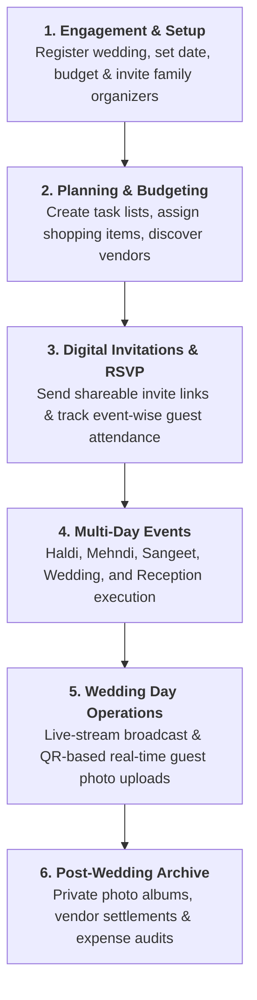
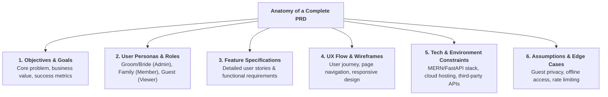

# 🤖 Ideation & Brainstorming Features using AI

> **Season 02 — Episode 02** | *This episode demonstrates how to take a raw, unstructured product idea, brainstorm features using conversational AI and speech-to-text, solve domain-specific edge cases, and synthesize everything into a formal, production-grade Product Requirements Document (PRD).*

---

## 📌 In This Episode

```text
01 The Core Problem: Why Indian Weddings Need a "Wedding Operating System"
02 The Project: "Make My Marriage" Overview & Core Value Proposition
03 AI Brainstorming Tactics: Using Speech-to-Text (`Ctrl + H`) & Conversational LLMs
04 Mapping the Multi-Stage Wedding Lifecycle (Planning to Post-Wedding)
05 Feature Breakdown: Dashboard, Multi-Events, Guests, Expenses, Vendors, & Media
06 The Anatomy of a PRD (Product Requirements Document)
07 Project Summary & Interactive "Ashu's Marriage" Demo
08 Preventing Scope Bloat & Context Overload Before Coding
```

---

## 💍 01. The Core Problem: The Messy Reality of Indian Weddings

Anyone who has organized or participated in an Indian family wedding knows how chaotic, fragmented, and resource-heavy the process can be:

```
┌──────────────────────────────────────────────────────────────────────────────────┐
│                    THE CHAOS OF TRADITIONAL WEDDING PLANNING                     │
├──────────────────────────┬───────────────────────────────────────────────────────┤
│ 1. Fragmented Channels   │ WhatsApp groups, Excel sheets, handwritten diaries,   │
│                          │ phone calls, and scattered sticky notes.              │
├──────────────────────────┼───────────────────────────────────────────────────────┤
│ 2. Multi-Day Events      │ Haldi, Mehndi, Sangeet, Wedding Ceremony, Reception.   │
│                          │ Different guest subsets attend different events!      │
├──────────────────────────┼───────────────────────────────────────────────────────┤
│ 3. Uncontrolled Budget   │ Multiple family members spending simultaneously on    │
│                          │ caterers, decorators, outfits, jewelry, and gifts.    │
├──────────────────────────┼───────────────────────────────────────────────────────┤
│ 4. Media Chaos           │ 500+ guests taking photos, but the couple only gets   │
│                          │ official photographer photos months later.            │
└──────────────────────────┴───────────────────────────────────────────────────────┘
```

> **The Solution:**  
> Rather than just building a static "wedding invitation website," we build a **Wedding Operating System for Indian Weddings** called **Make My Marriage**—a centralized digital workspace to plan, manage, coordinate, and remember every detail.

---

## 💡 02. The Project: "Make My Marriage"

```
┌──────────────────────────────────────────────────────────────────────────────────┐
│                     "MAKE MY MARRIAGE" CORE ARCHITECTURE                         │
├──────────────────────────────────────────────────────────────────────────────────┤
│ "One place to plan, manage, coordinate, and remember an Indian wedding."         │
├──────────────────────────────────────────────────────────────────────────────────┤
│ • 1 Account = 1 Wedding (Groom & Bride as Primary Admins)                        │
│ • Family Organizers (Siblings, Parents, Planners) join via Google OAuth          │
│ • Guests access digital invitations, RSVP, and photo uploads WITHOUT logging in  │
│ • Dynamic, auto-generated public wedding website & interactive demo              │
└──────────────────────────────────────────────────────────────────────────────────┘
```

---

## 🎙️ 03. AI Brainstorming Tactics: Voice-to-Text & Conversational Refinement

When ideating a product with AI, typing long, complex thoughts manually creates friction. 

```
┌──────────────────────────────────────────────────────────────────────────────────┐
│                        THE SPEECH-TO-TEXT WORKFLOW                               │
├──────────────────────────────────────────────────────────────────────────────────┤
│ 1. Press `Ctrl + H` on Windows (or native voice dictation on Mac/Mobile).        │
│ 2. Speak your raw, unstructured thoughts in natural conversational Hindi/English.│
│ 3. Let the LLM (ChatGPT, Claude, Grok, Perplexity) analyze, structure, and     │
│    identify blind spots in your thinking before you write a single line of code! │
└──────────────────────────────────────────────────────────────────────────────────┘
```

### The Initial Voice Prompt to ChatGPT:
> *"Hello ChatGPT, I need to develop Make My Marriage project actually. Indian weddings are very messy and hard to manage. Suppose you are a single child or the main organizer; you're spending money without tracking expenses, you have multiple events like Haldi, Mehndi, Sangeet, Wedding, and you don't have a central way to track guests, tasks, shopping lists, and vendors. Help me brainstorm this product."*

### What the AI Did:
* It recognized that this was not a simple landing page, but an **operating system**.
* It identified missing operational dimensions: vendor quotes, event-specific RSVP tracking, QR-code photo uploads, and budget milestones.

---

## 🗺️ 04. The 6-Stage Wedding Lifecycle



---

## 📦 05. Core Feature Inventory

```
┌──────────────────┬───────────────────────────────────────────────────────────────┐
│ Feature Module   │ Operational Capabilities                                      │
├──────────────────┼───────────────────────────────────────────────────────────────┤
│ 1. Auth & Roles  │ Google OAuth for Admins/Managers/Members. No login for guests.│
├──────────────────┼───────────────────────────────────────────────────────────────┤
│ 2. Dashboard     │ Wedding countdown, total budget vs. spent, RSVP stats, tasks. │
├──────────────────┼───────────────────────────────────────────────────────────────┤
│ 3. Multi-Events  │ Default events (Haldi, Mehndi, Sangeet, Wedding, Reception) + │
│                  │ custom events with individual schedules and locations.        │
├──────────────────┼───────────────────────────────────────────────────────────────┤
│ 4. Guest & RSVP  │ Central guest list with event-level attendance mapping.       │
├──────────────────┼───────────────────────────────────────────────────────────────┤
│ 5. Tasks & Shop  │ Action item checklist assigned to family members + items list.│
├──────────────────┼───────────────────────────────────────────────────────────────┤
│ 6. Expenses      │ Budget categorization, receipts, paid vs. pending tracking.   │
├──────────────────┼───────────────────────────────────────────────────────────────┤
│ 7. Vendors       │ Vendor discovery via Google Maps API + contracts & quotes.    │
├──────────────────┼───────────────────────────────────────────────────────────────┤
│ 8. Photo Gallery │ GCS cloud storage, QR-code guest uploads, private albums.     │
├──────────────────┼───────────────────────────────────────────────────────────────┤
│ 9. Public Site   │ Auto-generated couple landing page, live stream, and RSVP.    │
└──────────────────┴───────────────────────────────────────────────────────────────┘
```

---

## 📄 06. The Anatomy of a PRD (Product Requirements Document)

> **Definition:**  
> A **Product Requirements Document (PRD)** is a formal written blueprint that explains **what** is being built, **why** it is being made, **who** it is for, and **how** each feature should behave.



```
┌──────────────────────────────────────────────────────────────────────────────────┐
│                         WHAT GOES INTO A PROFESSIONAL PRD?                       │
├──────────────────────────┬───────────────────────────────────────────────────────┤
│ 1. Objectives & Goals    │ Defines the mission statement and core value metric.  │
├──────────────────────────┼───────────────────────────────────────────────────────┤
│ 2. Feature Requirements  │ Exhaustive breakdown of every screen, button, and flow│
├──────────────────────────┼───────────────────────────────────────────────────────┤
│ 3. UX & Design Notes     │ Wireframe expectations, responsive mobile behavior.   │
├──────────────────────────┼───────────────────────────────────────────────────────┤
│ 4. Technical Constraints │ Languages, databases, external APIs, hosting choices. │
├──────────────────────────┼───────────────────────────────────────────────────────┤
│ 5. Assumptions & Limits  │ Bandwidth limits, privacy rules, data retention.      │
└──────────────────────────┴───────────────────────────────────────────────────────┘
```

---

## 🌟 07. Interactive Showcase: "Ashu's Marriage" Demo

To allow potential users, family members, and recruiters to experience the product immediately without signing up or creating mock data:
* The application includes a pre-populated **"Ashu & Priya's Marriage"** demo wedding.
* Anyone can click **"Explore Demo"** on the landing page to inspect a fully configured wedding with active events, budgets, guest RSVPs, and photo galleries.

---

## ⚠️ 08. Preventing Scope Bloat & Context Overload

```
┌──────────────────────────────────────────────────────────────────────────────────┐
│                         THE TOKEN & CONTEXT OVERLOAD TRAP                        │
├──────────────────────────────────────────────────────────────────────────────────┤
│ • If you don't finalize and filter your PRD upfront, you will continuously ask   │
│   your AI coding assistant to change features mid-development.                   │
│ • Mid-flight changes burn massive context tokens, cause LLM confusion, and       │
│   result in spaghetti code and architectural breakage!                           │
│ • THE GOLDEN RULE: "Think, finalize, filter, and lock the PRD before coding!"    │
└──────────────────────────────────────────────────────────────────────────────────┘
```

---

## 📝 Chapter Summary

In this episode, we transitioned from an initial idea to a structured product blueprint. Using conversational LLMs and speech-to-text, we brainstormed the core features of **Make My Marriage**, a comprehensive Wedding Operating System tailored for the complexities of Indian weddings. 

We mapped the complete 6-stage wedding lifecycle, structured our feature inventory across 9 core modules, and established the formal components of a Product Requirements Document (PRD). By locking down the PRD before writing code, we prevent scope creep, optimize AI context efficiency, and establish a firm foundation for system architecture.

---

## 🔥 Key Takeaways

* **Wedding Operating System:** Beyond a static website, the platform acts as an end-to-end management hub.
* **Speech-to-Text (`Ctrl + H`):** Accelerates brainstorming by eliminating manual typing friction.
* **Multi-Event Reality:** Guest lists, budgets, and vendors must support event-level granularity (Haldi, Sangeet, Wedding).
* **PRD as Master Blueprint:** Translates raw thoughts into precise technical and functional specifications.
* **Demo Sandbox:** Pre-populated "Ashu's Marriage" demo ensures frictionless user onboarding.
* **Filter Before Building:** Finalizing the PRD prevents token waste and code rewrites down the line.

---

Previous : [01. Fundamentals of Building with AI](./01_Fundamentals_of_Building_with_AI.md) | Index: [00_index.md](../00_index.md) | Next: [04. System Design Architecture](./04_System_Design_Architecture.md)
