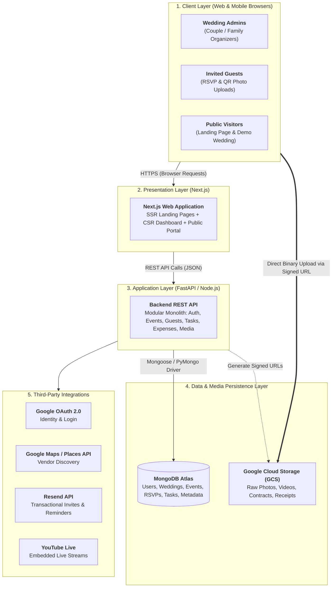
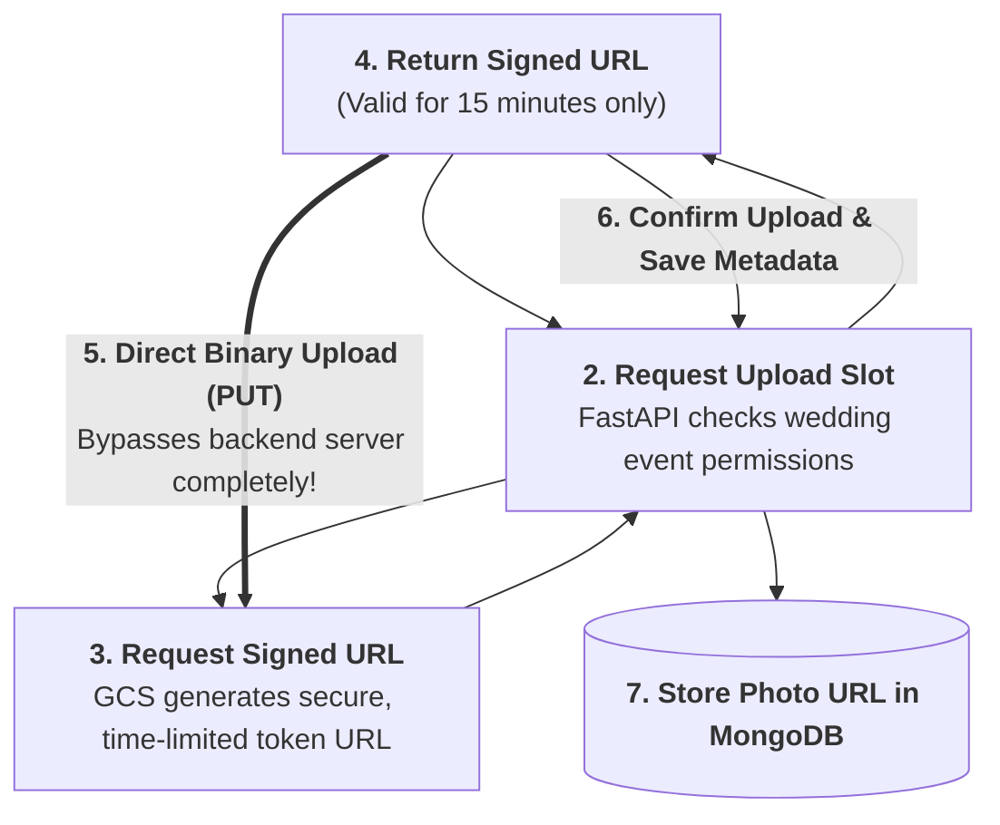

# 🤖 System Design Architecture Documentation using AI

> **Season 02 — Episode 04** | *This episode transitions from product requirements to high-level engineering architecture, covering modular monolithic design, cloud object storage vs. document databases, presigned/signed URLs for secure guest uploads, email delivery scaling, and deployment strategies.*

---

## 📌 In This Episode

```text
01 From PRD to Architecture: Stepping into the Engineering Lead Role
02 High-Level System Architecture: Modular Monolith vs. Microservices
03 Tech Stack Decisions: Next.js + FastAPI + MongoDB Atlas + GCS
04 Media Storage Architecture: Why MongoDB Never Stores Raw Images
05 Presigned / Signed Expiring URLs: Preventing Database Spam & Direct Cloud Uploads
06 Transactional Email Architecture: Resend API & Asynchronous Mass Email
07 Third-Party External Integrations (Google OAuth, Maps, YouTube Live, Resend)
08 Cloud Deployment Strategy: Vercel Serverless to AWS EC2 Migration
```

---

## 🏗️ 01. From PRD to Architecture: The Engineering Lead Role

Once the Product Requirements Document (PRD) is finalized, the project moves from product management to the **Engineering Lead / Software Architect**.

```
┌──────────────────────────────────────────────────────────────────────────────────┐
│                             THE ARCHITECT'S PROMPT                               │
├──────────────────────────────────────────────────────────────────────────────────┤
│ "PRD looks good to me. Let's develop a system design architecture diagram for    │
│  me, and let me provide our preferences:                                         │
│  • Architecture: Modular Monolithic application                                  │
│  • Frontend: Next.js (React Framework with SSR & SPA)                            │
│  • Backend: FastAPI (Python) or Node.js Express REST API                         │
│  • Database: MongoDB Atlas (Managed Document Database)                           │
│  • Object Storage: Google Cloud Storage (GCS) / AWS S3 for media binaries        │
│  • Auth: Google OAuth 2.0                                                        │
│  Ask me clarifying questions so we can finalize the technical baseline."         │
└──────────────────────────────────────────────────────────────────────────────────┘
```

> **The Architectural Rule:**  
> Never accept AI architecture suggestions blindly. Take active control over where data lives, how requests flow, and how services communicate to prevent costly refactors later.

---

## 🗺️ 02. High-Level System Architecture



---

## 🧱 03. Modular Monolith Architecture

Why choose a **Modular Monolith** over Microservices for this system?

```
┌──────────────────────────────────────────────────────────────────────────────────┐
│                   MODULAR MONOLITH vs. MICROSERVICES TRADE-OFF                   │
├──────────────────────────────────┬───────────────────────────────────────────────┤
│ 🏢 Microservices (Complex)       │ • Separate repos, network hops, independent   │
│                                  │   deployments, Kubernetes orchestration.      │
│                                  │ • Overkill for initial product scale!         │
├──────────────────────────────────┼───────────────────────────────────────────────┤
│ 🚀 Modular Monolith (Chosen)     │ • Single deployable codebase with strict,     │
│                                  │   isolated internal module boundaries.        │
│                                  │ • Simple to develop, deploy, and debug.       │
│                                  │ • Can easily split into services later!       │
└──────────────────────────────────┴───────────────────────────────────────────────┘
```

* **Core Internal Modules:** `Auth`, `Weddings`, `Events`, `Guests & RSVP`, `Tasks & Shopping`, `Expenses & Budget`, `Vendors`, `Gallery & Media`, `Public Portal`.

---

## 📸 04. Media Storage: Why MongoDB Never Stores Raw Images

A classic beginner mistake is trying to save raw photo binary data (Base64 strings or Blobs) directly inside database documents:

```
┌──────────────────────────────────────────────────────────────────────────────────┐
│                       WHERE SHOULD MEDIA FILES BE STORED?                        │
├──────────────────────────┬───────────────────────────────────────────────────────┤
│ ❌ Raw DB Storage        │ Saving 5MB images in MongoDB hits the 16MB document   │
│    (Anti-Pattern)        │ limit, inflates database RAM, and slows down queries. │
├──────────────────────────┼───────────────────────────────────────────────────────┤
│ ✅ Cloud Object Storage  │ Store the raw binary photo in Google Cloud Storage    │
│    (GCS / AWS S3)        │ (GCS) or S3. Store only the URL string and file       │
│                          │ metadata inside MongoDB!                              │
└──────────────────────────┴───────────────────────────────────────────────────────┘
```

$$\mathbf{\text{MongoDB} = \text{Lightweight Metadata \& File Paths}} \quad \vert \quad \mathbf{\text{GCS / S3}} = \text{Raw Binary Media (Photos, Videos, PDFs)}$$

---

## 🔐 05. Presigned / Signed Expiring URLs

How can 500 wedding guests upload photos directly from their phones without opening our database to public spam or overwhelming our backend server?



```
┌──────────────────────────────────────────────────────────────────────────────────┐
│                   BENEFITS OF PRESIGNED / SIGNED URL UPLOADS                     │
├──────────────────────────┬───────────────────────────────────────────────────────┤
│ 1. Zero Server Overhead  │ Backend doesn't stream gigabytes of raw image data;   │
│                          │ client uploads directly to Google Cloud Storage.      │
├──────────────────────────┼───────────────────────────────────────────────────────┤
│ 2. Strong Spam Defense   │ Upload URLs expire automatically after 15 minutes.    │
├──────────────────────────┼───────────────────────────────────────────────────────┤
│ 3. Security Isolation    │ Guests upload without needing admin credentials or    │
│                          │ permanent write access to the cloud storage bucket.   │
└──────────────────────────┴───────────────────────────────────────────────────────┘
```

---

## 📧 06. Transactional Email Architecture: Resend & Mass Delivery

* **Transactional Provider:** We integrate **Resend API** (clean developer experience, 100 free emails/day).
* **The 1,000-Email Problem:**
  * *Bad Approach:* Firing 1,000 synchronous API requests in a single HTTP loop will timeout the server and crash the request.
  * *Scalable Approach:* For bulk digital invitations, push email tasks into an **asynchronous job queue (Redis / Celery / BullMQ)** and process them in batches with rate-limiting.

---

## 🌐 07. Third-Party External Integrations

```
┌──────────────────┬───────────────────┬───────────────────────────────────────────┐
│ Integration      │ Service Provider  │ Operational Role in Make My Marriage      │
├──────────────────┼───────────────────┼───────────────────────────────────────────┤
│ Identity / Auth  │ Google OAuth 2.0  │ Frictionless one-tap login for organizers.│
├──────────────────┼───────────────────┼───────────────────────────────────────────┤
│ Vendor Discovery │ Google Places API │ Search local caterers, venues, decorators.│
├──────────────────┼───────────────────┼───────────────────────────────────────────┤
│ Live Streaming   │ YouTube Live      │ Embed broadcast feed on public wedding UI.│
├──────────────────┼───────────────────┼───────────────────────────────────────────┤
│ Notifications    │ Resend API        │ Send digital invitations & RSVP updates.  │
├──────────────────┼───────────────────┼───────────────────────────────────────────┤
│ Fast CDN         │ Google Cloud CDN  │ Cache and serve wedding photos at scale.  │
└──────────────────┴───────────────────┴───────────────────────────────────────────┘
```

---

## 🚀 08. Cloud Deployment & Migration Pathway

```
┌──────────────────────────────────────────────────────────────────────────────────┐
│                          TWO-STAGE DEPLOYMENT ROADMAP                            │
├──────────────────────────────────┬───────────────────────────────────────────────┤
│ Phase 1: Prototype & MVP         │ • Deploy Next.js frontend on Vercel.          │
│                                  │ • Deploy FastAPI backend as a serverless/monox│
│                                  │ • MongoDB Atlas (Free Shared Tier) + GCS.     │
├──────────────────────────────────┼───────────────────────────────────────────────┤
│ Phase 2: Production Scale        │ • Containerize backend with Docker.           │
│                                  │ • Deploy on AWS EC2 / ECS behind a load       │
│                                  │   balancer with CloudFront / Cloud CDN.       │
└──────────────────────────────────┴───────────────────────────────────────────────┘
```

---

## 📝 Chapter Summary

In this episode, we transformed our functional PRD into a robust system architecture. We selected a modular monolithic design combining Next.js, FastAPI, MongoDB Atlas, and Google Cloud Storage (GCS). 

We established core engineering guardrails: separating document metadata from raw binary storage, utilizing presigned/signed expiring URLs to enable direct, secure guest photo uploads, and structuring email delivery for future asynchronous scaling. This architectural blueprint serves as the technical contract for database design and API specification.

---

## 🔥 Key Takeaways

* **Modular Monolith:** Provides high development velocity without the networking overhead of microservices.
* **Separation of Concerns:** MongoDB manages structured JSON documents; GCS/S3 manages raw binary assets.
* **Signed URLs:** Prevents database bloat and offloads heavy media uploads directly to cloud storage.
* **Asynchronous Emailing:** High-volume notifications must be queued asynchronously rather than executed in synchronous loops.
* **Staged Deployment:** Launch fast on Vercel serverless, then migrate to dedicated containerized cloud instances (AWS EC2) as traffic scales.

---

Previous : [02. Ideation & Brainstorming Features](./02_Ideation_&_Brainstorming_Features.md) | Index: [00_index.md](../00_index.md) | Next: [05. Database and API Design](./05_Database_and_API_Design.md)
