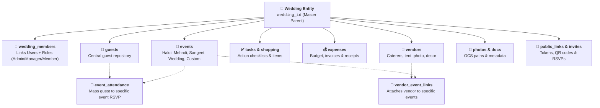
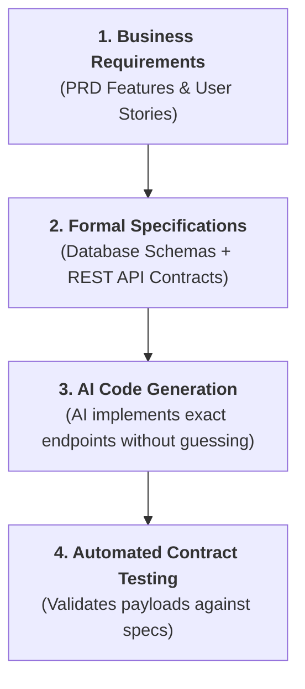

# 🤖 Database and API Design Documentation using AI

> **Season 02 — Episode 05** | *This episode covers the formalization of data schemas, Entity Relationship Diagrams (ERD), soft vs. hard delete strategies, and REST API contracts using Specification-Driven Development (SDD) to guide AI coding assistants.*

---

## 📌 In This Episode

```text
01 What is a Database Design Document (DDD)?
02 The Central Entity Pattern: Modeling Around `wedding_id`
03 Complete Entity Relationship Breakdown (Users, Members, Guests, Events, Tasks, Expenses)
04 Multi-Event Mapping: Central Guests vs. `event_attendance`
05 Soft Delete vs. Hard Delete: Preserving Relational Integrity
06 Database Model Summary Matrix
07 Specification-Driven Development (SDD): Designing REST APIs Upfront
08 Core API Endpoints: Authentication, Weddings, Members, Events, & RSVPs
```

---

## 📑 01. What is a Database Design Document (DDD)?

> **Definition:**  
> A **Database Design Document (DDD)** is a formal technical blueprint that defines the structure, schemas, entity relationships, validation constraints, and indexes of a database system. It translates high-level product requirements into an unambiguous data model.

```
┌──────────────────────────────────────────────────────────────────────────────────┐
│                         THE DATABASE DESIGN PROMPT                               │
├──────────────────────────────────────────────────────────────────────────────────┤
│ "All looks good from the System Architecture. Let's build the formal Database    │
│  Design Document (DDD) and Entity Relationship Diagram (ERD) for                 │
│  Make My Marriage using MongoDB document collections."                           │
└──────────────────────────────────────────────────────────────────────────────────┘
```

---

## 🗄️ 02. The Central Entity Pattern: Modeling Around `wedding_id`

In a multi-tenant wedding management platform, data isolation and relational clarity are paramount. The architecture models all secondary entities around the central **Wedding** parent:



---

## 🧩 03. Entity Relationship Breakdown

```
┌──────────────────┬───────────────────┬───────────────────────────────────────────┐
│ Collection       │ Primary Key / Ref │ Description & Relationship                │
├──────────────────┼───────────────────┼───────────────────────────────────────────┤
│ `weddings`       │ `wedding_id`      │ Master wedding record (couple info, dates)│
├──────────────────┼───────────────────┼───────────────────────────────────────────┤
│ `users`          │ `user_id`         │ Registered user profiles (Google OAuth)   │
├──────────────────┼───────────────────┼───────────────────────────────────────────┤
│ `wedding_members`│ `wedding_id` +    │ Connects users to weddings with roles:    │
│                  │ `user_id`         │ `ADMIN`, `MANAGER`, or `MEMBER`.          │
├──────────────────┼───────────────────┼───────────────────────────────────────────┤
│ `events`         │ `event_id` +      │ Sub-events (Haldi, Sangeet, Reception)    │
│                  │ `wedding_id`      │ with custom venues, times, and streams.   │
├──────────────────┼───────────────────┼───────────────────────────────────────────┤
│ `guests`         │ `guest_id` +      │ Central list of all invited family/friends│
│                  │ `wedding_id`      │ (Name, Phone, Email, Side: Bride/Groom).  │
├──────────────────┼───────────────────┼───────────────────────────────────────────┤
│ `event_attendance`│ `event_id` +     │ Junction collection tracking RSVP status  │
│                  │ `guest_id`        │ (`ACCEPTED`, `DECLINED`, `PENDING`).      │
├──────────────────┼───────────────────┼───────────────────────────────────────────┤
│ `tasks`          │ `task_id` +       │ To-do items assigned to specific members  │
│                  │ `wedding_id`      │ and optionally linked to an `event_id`.   │
├──────────────────┼───────────────────┼───────────────────────────────────────────┤
│ `expenses`       │ `expense_id` +    │ Financial line items tracking category,   │
│                  │ `wedding_id`      │ vendor, payment status, and receipts.     │
├──────────────────┼───────────────────┼───────────────────────────────────────────┤
│ `photos`         │ `photo_id` +      │ GCS file path, uploader info, event tag,  │
│                  │ `wedding_id`      │ and public/private visibility status.     │
└──────────────────┴───────────────────┴───────────────────────────────────────────┘
```

---

## 👥 04. Multi-Event Mapping: Central Guests vs. `event_attendance`

A common database modeling mistake in event apps is creating duplicate guest entries whenever a guest is invited to multiple events.

```
┌──────────────────────────────────────────────────────────────────────────────────┐
│                   THE GUEST INVITATION MODELING PATTERN                          │
├──────────────────────────────────┬───────────────────────────────────────────────┤
│ ❌ Duplicating Guests             │ Creating separate guest records for Haldi,    │
│    (Bad Practice)                │ Sangeet, and Wedding causes phone/email sync  │
│                                  │ nightmares if guest details change!           │
├──────────────────────────────────┼───────────────────────────────────────────────┤
│ ✅ Normalized Junction Collection│ Store the guest ONCE in `guests`.             │
│    (`event_attendance`)          │ Create lightweight `event_attendance` records │
│                                  │ mapping `(guest_id, event_id, rsvp_status)`.  │
└──────────────────────────────────┴───────────────────────────────────────────────┘
```

---

## 🗑️ 05. Soft Delete vs. Hard Delete in Production Databases

```
┌──────────────────────────────────────────────────────────────────────────────────┐
│                         SOFT DELETE vs. HARD DELETE                              │
├──────────────────────────┬───────────────────────────────────────────────────────┤
│ 💥 Hard Delete           │ Permanently executes `DELETE / REMOVE` from disk.     │
│                          │ • Destructive & irreversible!                         │
│                          │ • If an event is hard deleted, all historic guest     │
│                          │   RSVPs and financial records break!                  │
├──────────────────────────┼───────────────────────────────────────────────────────┤
│ 🛡️ Soft Delete (Standard)│ Updates a boolean flag: `is_deleted: true`.           │
│                          │ • Data is hidden from active UI queries.              │
│                          │ • Can be instantly restored ("Undo").                 │
│                          │ • Preserves complete audit and relational integrity.  │
└──────────────────────────┴───────────────────────────────────────────────────────┘
```

```javascript
// Soft Delete Query Example in MongoDB / Mongoose:
// Instead of deleting the document, update the flag:
await Event.updateOne({ _id: eventId }, { $set: { is_deleted: true } });

// Active queries automatically filter out soft-deleted records:
const activeEvents = await Event.find({ wedding_id: currentWeddingId, is_deleted: false });
```

---

## 🚀 06. Specification-Driven Development (SDD)

> **Definition:**  
> **Specification-Driven Development (SDD)** is an engineering methodology where API endpoints, data models, and system contracts are fully defined and agreed upon **before any implementation code is written**.



---

## 🌐 07. Core API Endpoint Contracts

```
┌──────────────────┬───────────────────────────────────────┬───────────────────────┐
│ Module           │ Endpoint                              │ Method & Purpose      │
├──────────────────┼───────────────────────────────────────┼───────────────────────┤
│ Authentication   │ `/auth/google`                        │ `GET` Initiate OAuth  │
│                  │ `/auth/google/callback`               │ `GET` Handle OAuth cb │
│                  │ `/auth/logout`                        │ `POST` Clear session  │
│                  │ `/auth/me`                            │ `GET` Current user    │
├──────────────────┼───────────────────────────────────────┼───────────────────────┤
│ Weddings         │ `/weddings`                           │ `POST` Create wedding │
│                  │ `/weddings/{wedding_id}`              │ `GET` Fetch details   │
│                  │ `/weddings/{wedding_id}`              │ `PATCH` Update config │
├──────────────────┼───────────────────────────────────────┼───────────────────────┤
│ Members          │ `/weddings/{wedding_id}/members`      │ `GET` List members    │
│                  │ `/weddings/{wedding_id}/members/invite│ `POST` Send invite    │
│                  │ `/weddings/{wedding_id}/members/{id}` │ `DELETE` Remove role  │
├──────────────────┼───────────────────────────────────────┼───────────────────────┤
│ Events           │ `/weddings/{wedding_id}/events`       │ `GET` / `POST` Events │
│                  │ `/events/{event_id}`                  │ `PATCH` / `DELETE`    │
├──────────────────┼───────────────────────────────────────┼───────────────────────┤
│ Guests & RSVP    │ `/weddings/{wedding_id}/guests`       │ `GET` / `POST` Guests │
│                  │ `/events/{event_id}/rsvp`             │ `POST` Update status  │
├──────────────────┼───────────────────────────────────────┼───────────────────────┤
│ Media / Photos   │ `/weddings/{wedding_id}/photos/upload`│ `POST` Get signed URL │
│                  │ `/weddings/{wedding_id}/photos`       │ `GET` List gallery    │
└──────────────────┴───────────────────────────────────────┴───────────────────────┘
```

---

## 📝 Chapter Summary

In this episode, we formalized the data layer and API contracts for Make My Marriage using Specification-Driven Development (SDD). We structured the database around the central `wedding_id` parent entity, linking users via role-based memberships (`wedding_members`) and decoupling guests from multi-event attendance using the normalized `event_attendance` pattern.

We established the necessity of soft delete flags (`is_deleted`) to preserve referential integrity across interconnected modules. Finally, we defined the complete REST API contract spanning authentication, wedding management, events, guest RSVPs, and presigned media uploads.

---

## 🔥 Key Takeaways

* **Central Entity Pattern:** Every piece of data traces back to `wedding_id` for clean multi-tenant isolation.
* **Normalized Event Attendance:** Maintain a single guest list and map attendance per event via junction records.
* **Soft Delete Best Practice:** Never hard delete relational records; use `is_deleted: true` to preserve historical integrity and allow instant recovery.
* **Specification-Driven Development (SDD):** Define database schemas and API routes upfront to give AI assistants strict guardrails.
* **REST Contract Precision:** Standardized HTTP verbs (`GET`, `POST`, `PATCH`, `DELETE`) streamline frontend and backend integration.

---

Previous : [04. System Design Architecture](./04_System_Design_Architecture.md) | Index: [00_index.md](../00_index.md) | Next: [06. UI & UX Design using AI](./06_UI_&_UX_Design_using_AI.md)
