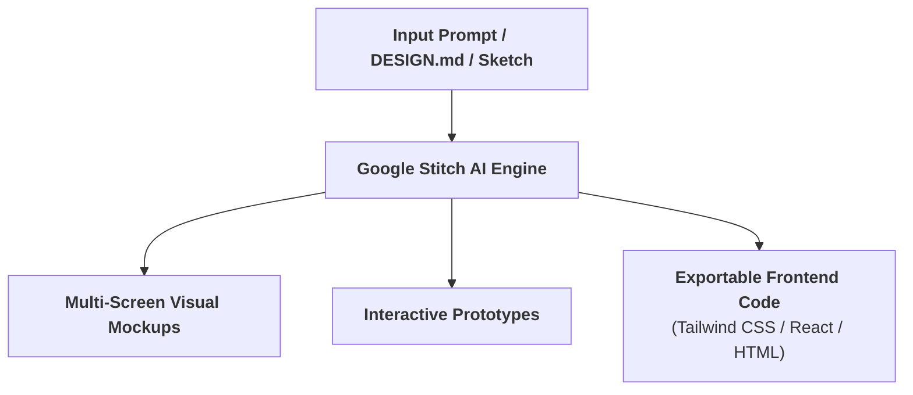
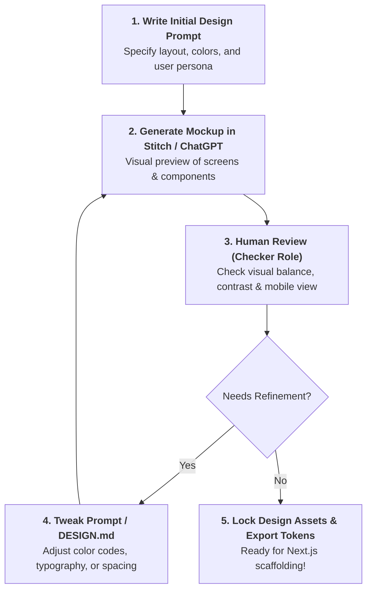

# 🤖 UI & UX Design using AI

> **Season 02 — Episode 06** | *This episode covers the transition from technical specifications to visual user experience, exploring AI-native design tools like Google Stitch, creating a standard `DESIGN.md` specification file, and generating responsive SaaS landing pages and dedicated couple wedding portals.*

---

## 📌 In This Episode

```text
01 The UI/UX Revolution: Why Design Systems Matter Before Coding
02 What is Google Stitch? Prompt-to-UI from Google Labs
03 What is a `DESIGN.md` File? The AI Designer Rulebook
04 Designing Two Core Surfaces: SaaS Landing Page vs. Dedicated Wedding Portal
05 Color Theory & Theme Customization: The Royal Heritage Editorial Palette
06 Generating & Iterating Mockups with ChatGPT & Google Stitch
07 The Complete Pre-Code Specification Inventory
```

---

## 🎨 01. The UI/UX Revolution: Design Systems Before Code

Up to this stage, we have created four technical specifications:
1. **PRD (Product Requirements Document)**
2. **System Design Architecture Document**
3. **Database Design Document (DDD & ERD)**
4. **API Design Document (REST Endpoints & Payloads)**

Before writing frontend React / Next.js code, we must establish a cohesive **Design System**:

```
┌──────────────────────────────────────────────────────────────────────────────────┐
│                             WHY A DESIGN SYSTEM MATTERS                          │
├──────────────────────────────────┬───────────────────────────────────────────────┤
│ ❌ Ad-Hoc Styling (Chaos)        │ Every page uses different button styles,      │
│                                  │ random hex colors, arbitrary padding, and     │
│                                  │ mismatched fonts. Looks amateurish!           │
├──────────────────────────────────┼───────────────────────────────────────────────┤
│ ✅ Unified Design Tokens         │ Standardized color palette, typographic scale,│
│    (Professional System)         │ border-radius tokens, and responsive spacing  │
│                                  │ shared across all frontend components.        │
└──────────────────────────────────┴───────────────────────────────────────────────┘
```

---

## 🧵 02. What is Google Stitch?

> **Definition:**  
> **Google Stitch** is an AI-powered design and prototyping tool from Google Labs that converts text prompts, rough sketches, screenshots, or design specification files into **fully responsive user interfaces and clean frontend code**.



* **Figma Alternative:** In traditional software teams, dedicated UI designers spent weeks crafting wireframes in Figma. With Google Stitch and conversational LLMs, developers can generate production-grade UI mockups in minutes.

---

## 📜 03. What is a `DESIGN.md` File?

> **Definition:**  
> A `DESIGN.md` file is an open-source standard markdown cheat sheet that explicitly defines the visual style, color palette, typography, spacing rules, and component behaviors of an application for AI coding assistants.

```
┌──────────────────────────────────────────────────────────────────────────────────┐
│                           THE `DESIGN.md` ANALOGY                                │
├──────────────────────────────────────────────────────────────────────────────────┤
│ Handing a `DESIGN.md` file to an AI agent is like hiring a new designer and      │
│ handing them a one-page brand guideline before they touch the canvas.            │
│ Instead of guessing your colors or fonts, the AI reads the exact specification!  │
└──────────────────────────────────────────────────────────────────────────────────┘
```

### Sample `DESIGN.md` Specification:
```markdown
# Design System Specification

## Brand Color Palette
- Primary Brand: `#D97706` (Regal Saffron Gold)
- Background Base: `#FDFBF7` (Warm Champagne)
- Surface Cards: `#FFFFFF` (Pure White)
- Primary Text: `#1E293B` (Deep Slate Charcoal)
- Muted Text: `#64748B` (Secondary Gray)
- Accent Emerald: `#047857` (Forest Green)

## Typography
- Headings: 'Cinzel', serif / 'Outfit', sans-serif
- Body Text: 'Inter', sans-serif
- Font Scale: H1 (36px), H2 (28px), H3 (20px), Body (16px), Small (14px)

## Component Rules
- Border Radius: `12px` (Smooth, modern rounded cards)
- Shadows: `0 4px 6px -1px rgb(0 0 0 / 0.05)` (Subtle, elegant elevation)
- Buttons: Primary (Gold background with white bold text, hover scale `1.02`)
```

---

## 📱 04. Designing the Two Core Application Surfaces

The *Make My Marriage* platform requires two distinct UI experiences:

```
┌──────────────────────────────────────────────────────────────────────────────────┐
│                          THE TWO CORE PRODUCT SURFACES                           │
├──────────────────────────────────┬───────────────────────────────────────────────┤
│ 1. Public SaaS Landing Page      │ • Target: Prospective couples & organizers    │
│    (Marketing & Pricing)         │ • Hero section: "Your wedding. One workspace."│
│                                  │ • Features grid, how it works, social proof   │
│                                  │ • Pricing tiers: Basic (₹1,999), Premium      │
│                                  │   (₹3,999), and VIP (₹6,999)                  │
│                                  │ • CTAs: "Start Planning" & "Explore Demo"     │
├──────────────────────────────────┼───────────────────────────────────────────────┤
│ 2. Dedicated Couple Portal       │ • Target: Invited guests and wedding attendees│
│    (Ashu & Priya's Wedding)      │ • Couple hero banner & countdown timer        │
│                                  │ • Multi-event schedule: Haldi, Mehndi,        │
│                                  │   Sangeet, Wedding Ceremony                   │
│                                  │ • Interactive RSVP form & venue map           │
│                                  │ • QR-code guest photo gallery & YouTube Live  │
└──────────────────────────────────┴───────────────────────────────────────────────┘
```

---

## 🎨 05. The Royal Heritage Editorial Palette

To create an aesthetic that feels celebratory, elegant, and modern for Indian weddings:

```
┌──────────────────────┬──────────────────────┬────────────────────────────────────┐
│ Color Name           │ Hex Code             │ Emotional Impact & Role            │
├──────────────────────┼──────────────────────┼────────────────────────────────────┤
│ Saffron Gold         │ `#D97706` / `#F59E0B`│ Primary brand CTA, warmth, royalty │
├──────────────────────┼──────────────────────┼────────────────────────────────────┤
│ Warm Champagne       │ `#FDFBF7`            │ Clean, inviting background base    │
├──────────────────────┼──────────────────────┼────────────────────────────────────┤
│ Deep Forest Emerald  │ `#047857`            │ Sophistication, success tags       │
├──────────────────────┼──────────────────────┼────────────────────────────────────┤
│ Slate Charcoal       │ `#1E293B`            │ High-contrast readable typography  │
├──────────────────────┼──────────────────────┼────────────────────────────────────┤
│ Rose Crimson         │ `#E11D48`            │ Romantic accents & live highlights │
└──────────────────────┴──────────────────────┴────────────────────────────────────┘
```

---

## 🔄 06. Iterating on Design Before Writing Code



$$\mathbf{\text{"Iterating on visual mockups takes minutes; rewriting compiled code takes hours."}}$$

---

## 📝 Chapter Summary

In this episode, we completed the visual design phase of our product life cycle. We explored how AI-native tools like Google Stitch streamline UI/UX wireframing and prototyping. We learned how to author a standard `DESIGN.md` specification to govern color palettes, typography, and component styling across AI workflows.

We designed the two primary surfaces of Make My Marriage—the public marketing SaaS landing page and the personalized couple wedding portal—applying the Royal Heritage Editorial design system. With PRD, Architecture, Database ERD, API specs, and UI design locked, we are fully prepared to begin codebase scaffolding.

---

## 🔥 Key Takeaways

* **Design Systems Matter:** Unified design tokens prevent visual inconsistencies across large codebases.
* **Google Stitch:** Google Labs AI tool converting prompts and sketches into responsive UI mockups and code.
* **`DESIGN.md` as AI Rulebook:** A one-page specification defining colors, typography, and spacing for AI coding agents.
* **Dual-Surface Architecture:** Separate the marketing SaaS landing page from the interactive couple wedding portal.
* **Visual Prototyping Speed:** Refine layouts and themes visually before generating React components.

---

Previous : [05. Database and API Design](./05_Database_and_API_Design.md) | Index: [00_index.md](../00_index.md) | Next: [07. Building the Scaffold using AI](./07_Building_the_Scaffold_using_AI.md)
