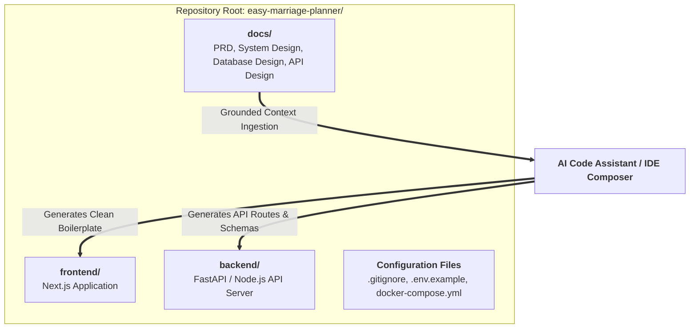
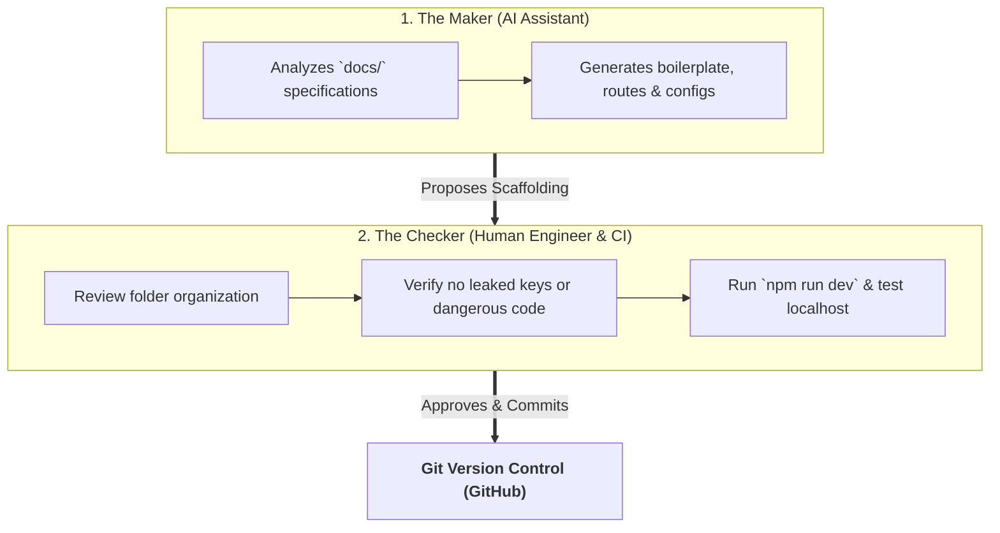

# 🤖 Building the Scaffold using AI

> **Season 02 — Episode 07** | *This episode covers the transition from documentation to active code: setting up the developer environment, utilizing Specification-Driven Scaffolding by feeding project docs into AI IDEs, organizing multi-tier folder structures, and applying the Maker-Checker governance pattern.*

---

## 📌 In This Episode

```text
01 Development Environment Setup (Node.js, Git, GitHub, & AI IDEs)
02 Organizing the Project Repository & the `docs/` Directory
03 What is Software Scaffolding? The Construction Analogy
04 Prompting the AI Lead Architect for Full-Stack Scaffolding
05 Standard Production Folder Layout (Frontend, Backend, Docs, Configs)
06 The Maker-Checker Concept in AI Software Development
07 Running the Scaffolding on Localhost & Version Control
```

---

## 💻 01. Environment Setup & Tool Prerequisites

Before starting the code generation process, the local developer workstation must have standard version control and runtime tooling configured:

```
┌──────────────────────────────────────────────────────────────────────────────────┐
│                             DEVELOPER SETUP CHECKLIST                            │
├──────────────────┬───────────────────────────────────────────────────────────────┤
│ 1. Runtime       │ Node.js (LTS version) & Python (3.11+) installed locally.     │
├──────────────────┼───────────────────────────────────────────────────────────────┤
│ 2. Version Ctrl  │ Git installed & configured with global username/email.        │
├──────────────────┼───────────────────────────────────────────────────────────────┤
│ 3. Cloud Repo    │ GitHub account created & new repository initialized           │
│                  │ (`easy-marriage-planner`).                                    │
├──────────────────┼───────────────────────────────────────────────────────────────┤
│ 4. AI Code IDE   │ Cursor, VS Code (with AI extensions), Antigravity, or Codex.  │
└──────────────────┴───────────────────────────────────────────────────────────────┘
```

---

## 📁 02. Grounding AI Context: The `docs/` Directory

Instead of asking an AI assistant to start coding with a vague prompt, professional AI engineering uses **Specification-Grounded Context**:



```
┌──────────────────────────────────────────────────────────────────────────────────┐
│                       THE 4 FOUNDATIONAL REPO DOCUMENTS                          │
├──────────────────────────────────┬───────────────────────────────────────────────┤
│ `docs/PRD.md`                    │ Product scope, user stories, and features     │
│ `docs/System_Design.md`          │ High-level architecture and cloud services    │
│ `docs/Database_Design.md`        │ MongoDB schemas, collections, and relations   │
│ `docs/API_Design.md`             │ REST endpoint contracts, routes, and payloads │
└──────────────────────────────────┴───────────────────────────────────────────────┘
```

---

## 🏗️ 03. What is Software Scaffolding?

> **Definition:**  
> In software development, **Scaffolding** is an automated technique that quickly creates the basic skeleton, folder hierarchy, configuration files, and starting boilerplate code for a new project or feature.

```
┌──────────────────────────────────────────────────────────────────────────────────┐
│                            THE CONSTRUCTION ANALOGY                              │
├──────────────────────────────────────────────────────────────────────────────────┤
│ Just like physical metal scaffolding supports a building while construction      │
│ workers erect the walls, software scaffolding supports a developer by handling  │
│ all the tedious, repetitive setup work (linters, folder trees, route skeletons). │
└──────────────────────────────────────────────────────────────────────────────────┘
```

---

## 🤖 04. Prompting the AI Lead Architect for Scaffolding

When instructing your AI IDE to scaffold the application, use a structured, high-context prompt:

```
┌──────────────────────────────────────────────────────────────────────────────────┐
│                             THE SCAFFOLDING PROMPT                               │
├──────────────────────────────────────────────────────────────────────────────────┤
│ "You are the lead software architect for this project. We are building:          │
│  MAKE MY MARRIAGE — A wedding planning and management SaaS.                      │
│                                                                                  │
│  I have placed all project specifications inside the `docs/` directory:          │
│  1. PRD                                                                          │
│  2. System Design Architecture                                                   │
│  3. Database Design Document                                                     │
│  4. API Design Document                                                          │
│                                                                                  │
│  Step 1: Ingest and analyze all four documents.                                  │
│  Step 2: Plan the complete folder structure and boilerplate layout.              │
│  Step 3: Generate the initial full-stack scaffolding (Next.js frontend +         │
│          FastAPI/Node backend) without adding deep business logic yet."          │
└──────────────────────────────────────────────────────────────────────────────────┘
```

---

## 📂 05. Standard Production Folder Layout

```text
make-my-marriage/
├── frontend/                     # Next.js 14+ App Router Frontend
│   ├── src/
│   │   ├── app/                  # Routes: /dashboard, /events, /rsvp, /gallery
│   │   ├── components/           # Reusable UI components (buttons, cards, forms)
│   │   ├── lib/                  # API client, utility functions, auth helpers
│   │   └── styles/               # Global CSS & Tailwind configuration
│   ├── public/                   # Static assets, logos, placeholder images
│   ├── package.json
│   └── tsconfig.json
│
├── backend/                      # Python FastAPI (or Node.js Express)
│   ├── app/
│   │   ├── api/                  # Route handlers: /auth, /weddings, /events
│   │   ├── models/               # MongoDB Mongoose / PyMongo schemas
│   │   ├── services/             # Cloud storage (GCS), Resend email, Google Maps
│   │   └── core/                 # Config, security, JWT auth, database client
│   ├── requirements.txt / package.json
│   └── main.py / server.js
│
├── docs/                         # Specification documents (PRD, DDD, API, Design)
├── .env.example                  # Template of required environment variables
├── .gitignore                    # Prevents committing node_modules, .env, and dist
├── docker-compose.yml            # Local development orchestration (DB, API, Web)
└── README.md                     # Project overview and setup instructions
```

---

## 🛡️ 06. The Maker-Checker Concept in AI Engineering

```
┌──────────────────────────────────────────────────────────────────────────────────┐
│                            THE MAKER-CHECKER PATTERN                             │
├──────────────────────────────────────────────────────────────────────────────────┤
│ The MAKER-CHECKER pattern is a security, quality, and governance framework       │
│ where the entity that generates code (the "Maker" - AI) is strictly separated    │
│ from the entity that reviews, validates, and approves the changes                │
│ (the "Checker" - Human Developer / Test Suite).                                  │
└──────────────────────────────────────────────────────────────────────────────────┘
```



* **Why Maker-Checker is Mandatory:** You do not need to read every single line of generated boilerplate, but you must verify architecture, security configs, dependency vulnerabilities, and ensure the app boots cleanly on `localhost`.

---

## 🚀 07. Localhost Boot & Version Control

Once the scaffolding is generated:
1. Run backend server: `uvicorn main:app --reload` (FastAPI) or `npm run dev` (Node.js).
2. Run frontend app: `npm run dev` (Next.js on `localhost:3000`).
3. Verify basic route rendering (landing page, dummy wedding dashboard).
4. Stage and commit:
   ```bash
   git add .
   git commit -m "feat: scaffold initial fullstack architecture from specifications"
   git push origin main
   ```

---

## 📝 Chapter Summary

In this episode, we turned our comprehensive specification documents into a working full-stack codebase. By placing the PRD, System Architecture, Database Design, and API contracts into the `docs/` directory, we grounded our AI assistant with precise project context.

We generated a clean, modular folder hierarchy separating the Next.js frontend, backend API, and shared configs. By applying the Maker-Checker governance principle, we validated the generated boilerplate, successfully launched the prototype on localhost, and established our version-controlled GitHub baseline.

---

## 🔥 Key Takeaways

* **Specification-Grounded Scaffolding:** Always place specification docs in the repo before asking AI to scaffold code.
* **Scaffolding Purpose:** Automates repetitive directory trees, configs, and boilerplate setup.
* **Modular Fullstack Layout:** Maintain strict separation between `frontend/`, `backend/`, and `docs/`.
* **Maker-Checker Governance:** The AI acts as the code generator (Maker); the human developer acts as the quality and security reviewer (Checker).
* **Localhost Verification:** Always verify that the generated scaffold builds and runs cleanly before adding business logic.

---

Previous : [06. UI & UX Design using AI](./06_UI_&_UX_Design_using_AI.md) | Index: [00_index.md](../00_index.md) | Next: —
