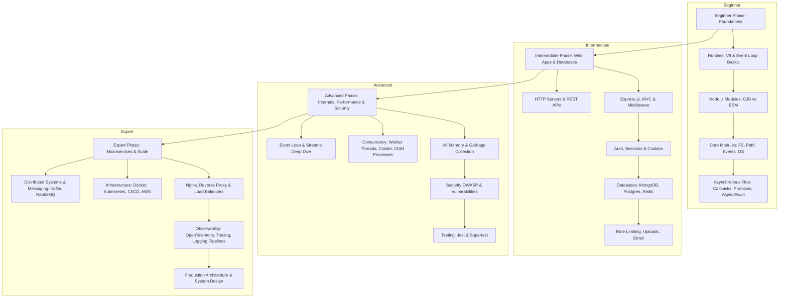

# Node.js Mastery Roadmap

Welcome to the **Node.js Mastery Learning Repository**. This curriculum takes you from an absolute beginner to an expert-level Production Architect.

---

## Course Overview

Node.js is not just a framework—it is a runtime environment that allows you to execute JavaScript on the server. Understanding Node.js requires understanding its internals: the V8 engine, the event loop, libuv, and the asynchronous programming paradigm. This course uses **First Principles Thinking** to teach you how Node.js works under the hood and how to design scalable, production-grade applications with it.

---

## Learning Roadmap

Below is the conceptual journey you will follow:

---

## Direct Navigation

Use the links below to navigate straight to any lesson:

### Beginner Phase
- [01_Introduction_to_NodeJS.md](01_Introduction_to_NodeJS.md)
- [02_NodeJS_Environment_Setup.md](02_NodeJS_Environment_Setup.md)
- [03_JavaScript_Fundamentals_for_NodeJS.md](03_JavaScript_Fundamentals_for_NodeJS.md)
- [04_Runtime_vs_Framework.md](04_Runtime_vs_Framework.md)
- [05_V8_Engine.md](05_V8_Engine.md)
- [06_Event_Loop_Basics.md](06_Event_Loop_Basics.md)
- [07_npm.md](07_npm.md)
- [08_npx.md](08_npx.md)
- [09_Modules.md](09_Modules.md)
- [10_CommonJS.md](10_CommonJS.md)
- [11_ES_Modules.md](11_ES_Modules.md)
- [12_File_System_Module.md](12_File_System_Module.md)
- [13_Path_Module.md](13_Path_Module.md)
- [14_OS_Module.md](14_OS_Module.md)
- [15_Events_Module.md](15_Events_Module.md)
- [16_Buffers.md](16_Buffers.md)
- [17_Streams_Basics.md](17_Streams_Basics.md)
- [18_Callbacks.md](18_Callbacks.md)
- [19_Promises.md](19_Promises.md)
- [20_Async_Await.md](20_Async_Await.md)

### Intermediate Phase
- [21_HTTP_Module.md](21_HTTP_Module.md)
- [22_Creating_Web_Servers.md](22_Creating_Web_Servers.md)
- [23_REST_APIs.md](23_REST_APIs.md)
- [24_ExpressJS.md](24_ExpressJS.md)
- [25_Middleware.md](25_Middleware.md)
- [26_Routing.md](26_Routing.md)
- [27_MVC_Architecture.md](27_MVC_Architecture.md)
- [28_Environment_Variables.md](28_Environment_Variables.md)
- [29_Validation.md](29_Validation.md)
- [30_Error_Handling.md](30_Error_Handling.md)
- [31_Logging.md](31_Logging.md)
- [32_Authentication.md](32_Authentication.md)
- [33_Authorization.md](33_Authorization.md)
- [34_JWT.md](34_JWT.md)
- [35_Cookies.md](35_Cookies.md)
- [36_Sessions.md](36_Sessions.md)
- [37_MongoDB.md](37_MongoDB.md)
- [38_Mongoose.md](38_Mongoose.md)
- [39_PostgreSQL.md](39_PostgreSQL.md)
- [40_ORM_Concepts.md](40_ORM_Concepts.md)
- [41_Redis.md](41_Redis.md)
- [42_Caching.md](42_Caching.md)
- [43_Rate_Limiting.md](43_Rate_Limiting.md)
- [44_File_Uploads.md](44_File_Uploads.md)
- [45_Email_Services.md](45_Email_Services.md)

### Advanced Phase
- [46_Event_Loop_Deep_Dive.md](46_Event_Loop_Deep_Dive.md)
- [47_Streams_Deep_Dive.md](47_Streams_Deep_Dive.md)
- [48_Worker_Threads.md](48_Worker_Threads.md)
- [49_Cluster_Module.md](49_Cluster_Module.md)
- [50_Child_Processes.md](50_Child_Processes.md)
- [51_Memory_Management.md](51_Memory_Management.md)
- [52_Garbage_Collection.md](52_Garbage_Collection.md)
- [53_Performance_Optimization.md](53_Performance_Optimization.md)
- [54_NodeJS_Internals.md](54_NodeJS_Internals.md)
- [55_Security_Fundamentals.md](55_Security_Fundamentals.md)
- [56_OWASP_Top_Risks.md](56_OWASP_Top_Risks.md)
- [57_Helmet.md](57_Helmet.md)
- [58_CORS.md](58_CORS.md)
- [59_CSRF.md](59_CSRF.md)
- [60_XSS.md](60_XSS.md)
- [61_SQL_Injection.md](61_SQL_Injection.md)
- [62_NoSQL_Injection.md](62_NoSQL_Injection.md)
- [63_Testing_Fundamentals.md](63_Testing_Fundamentals.md)
- [64_Unit_Testing.md](64_Unit_Testing.md)
- [65_Integration_Testing.md](65_Integration_Testing.md)
- [66_Jest.md](66_Jest.md)
- [67_Supertest.md](67_Supertest.md)
- [68_Swagger_OpenAPI.md](68_Swagger_OpenAPI.md)

### Expert Phase
- [69_Microservices.md](69_Microservices.md)
- [70_Event_Driven_Architecture.md](70_Event_Driven_Architecture.md)
- [71_RabbitMQ.md](71_RabbitMQ.md)
- [72_Kafka.md](72_Kafka.md)
- [73_Distributed_Systems.md](73_Distributed_Systems.md)
- [74_Scaling_NodeJS.md](74_Scaling_NodeJS.md)
- [75_Docker.md](75_Docker.md)
- [76_Kubernetes.md](76_Kubernetes.md)
- [77_CI_CD.md](77_CI_CD.md)
- [78_GitHub_Actions.md](78_GitHub_Actions.md)
- [79_AWS_Deployment.md](79_AWS_Deployment.md)
- [80_Nginx.md](80_Nginx.md)
- [81_Reverse_Proxy.md](81_Reverse_Proxy.md)
- [82_Load_Balancing.md](82_Load_Balancing.md)
- [83_Observability.md](83_Observability.md)
- [84_Monitoring.md](84_Monitoring.md)
- [85_Logging_Pipelines.md](85_Logging_Pipelines.md)
- [86_Distributed_Tracing.md](86_Distributed_Tracing.md)
- [87_Production_Architecture.md](87_Production_Architecture.md)
- [88_System_Design_for_NodeJS.md](88_System_Design_for_NodeJS.md)

---

## Beginner Phase

The goal of the **Beginner Phase** is to acquire a solid conceptual base of Node.js. You will transition from front-end JS paradigms to standard Unix-style execution environments, learn modules, and understand basic asynchronous mechanics.

- **Checklist**:
  - [ ] Complete lessons 01 - 20
  - [ ] Run sample code for ESModules and CommonJS local systems
  - [ ] Build a filesystem navigation script using `fs`, `path`, and `os`
  - [ ] Write asynchronous flow patterns using Promises and Async/Await

---

## Intermediate Phase

The **Intermediate Phase** moves you into the web engineering space. You will learn to construct servers, create REST APIs, use express middleware, integrate databases, write secure session and JWT authentication schemes, and build helper utility systems like mailers and file upload handlers.

- **Checklist**:
  - [ ] Complete lessons 21 - 45
  - [ ] Write a raw HTTP server using standard Node.js `http` module
  - [ ] Construct an Express.js API with custom middleware and routing following the MVC pattern
  - [ ] Build data schemas using Mongoose for MongoDB and Sequelize/Kysely for PostgreSQL
  - [ ] Implement secure authentication and rate-limiting middleware

---

## Advanced Phase

The **Advanced Phase** dives deep into performance optimization, operating system interfaces, thread concurrency, memory profiles, low-level streaming, security policies, and test integration patterns.

- **Checklist**:
  - [ ] Complete lessons 46 - 68
  - [ ] Build a custom multi-threaded processing task using `worker_threads`
  - [ ] Scale a server locally using Node.js `cluster` and `child_process` modules
  - [ ] Debug a node memory leak using Chrome DevTools or heap snapshots
  - [ ] Audit an application for OWASP Vulnerabilities and secure it with Helmet
  - [ ] Write integration test suites using Jest and Supertest

---

## Expert Phase

The **Expert Phase** covers web scalability, distributed architectures, orchestration systems, load balancers, messaging queues, telemetry collection, and core infrastructure design patterns.

- **Checklist**:
  - [ ] Complete lessons 69 - 88
  - [ ] Set up a containerized service mesh locally using Docker Compose and Kubernetes configurations
  - [ ] Build an asynchronous, event-driven system with RabbitMQ or Kafka
  - [ ] Configure Nginx as a reverse proxy, load balancer, and static asset cache
  - [ ] Instrument a Node.js microservice architecture with OpenTelemetry distributed tracing and metrics
  - [ ] Structure a highly available, multi-region cloud deployment architecture

---

## Project Roadmap

To solidify your theoretical knowledge, build the following sequence of projects:

1. **CLI System Monitor (Beginner)**: A terminal-based system monitoring utility that logs CPU load, memory utilization, and network statistics to local JSON files using Streams, Events, and OS/FS modules.
2. **E-Commerce Backend REST API (Intermediate)**: A robust Express.js API with MongoDB database, Mongoose ODM, JWT Authentication (Cookies & Sessions), data validation, custom rate-limiting, and Stripe payment integration.
3. **High-Throughput File Processing pipeline (Advanced)**: A worker thread pool that takes large CSV/JSON imports, compresses them using Streams, processes data fields in parallel, and uploads chunks asynchronously to S3 with custom error/retry policies.
4. **Resilient Microservices Order Processing Engine (Expert)**: A distributed microservices fleet communicating via RabbitMQ/Kafka, Dockerized, configured under Nginx with a Kubernetes cluster, instrumented with Prometheus, Grafana, and Zipkin/Jaeger.

---

## Interview Preparation Roadmap

Prepare for technical screenings using our curriculum:
- **Beginner Questions**: Focus on Callbacks vs Promises vs Async/Await, V8 Event Loop basics, Core APIs (`fs`, `path`).
- **Intermediate Questions**: Focus on MVC structure, Middleware execution, JWT vs Sessions, Database query optimizations, REST specs.
- **Advanced Questions**: Focus on Event Loop phases (timers, poll, check), Worker threads vs Clusters, Stream buffering, Memory allocation/GC behavior, Cross-Site Scripting (XSS) and CSRF mitigation.
- **Expert/Architect Questions**: Focus on Horizontal Scaling patterns, CAP Theorem trade-offs, Messaging guarantees (At-least-once vs Exactly-once), Circuit Breakers, Distributed Tracing architecture, API Gateways, and Disaster Recovery.

---

## Completion Checklist

Tracks your path to graduation:
- [ ] Beginner Phase Completed
- [ ] Intermediate Phase Completed
- [ ] Advanced Phase Completed
- [ ] Expert Phase Completed
- [ ] All 4 Projects Completed
- [ ] Mock Interview preparation finished

---

## Revision Notes

Centralized summaries of major learning modules.

### Beginner

#### 01 Introduction to Node.js
- Node.js is an open-source, cross-platform runtime environment built on Chrome's V8 JS Engine.
- Key architecture relies on an event-driven, non-blocking I/O model.

#### 02 Environment Setup
- Recommended environments use NVM (Node Version Manager) to switch versions easily.
- Production systems should lock Node.js versions in package.json (`engines`).

#### 03 JavaScript Fundamentals for Node.js
- Focuses on scopes, closures, execution contexts, lexical environments, prototype chains, and hoisting.
- Event loop bindings depend heavily on these basics.

#### 04 Runtime vs Framework
- Node.js is a runtime, not a language or a framework.
- Express, Nest.js, Fastify, and Koa are frameworks built on top of the runtime APIs.

#### 05 V8 Engine
- Compiles JS directly to machine code using JIT (Just-In-Time) compilation (Ignition interpreter and TurboFan compiler).
- Employs hidden classes and inline caches to optimize property lookups.

#### 06 Event Loop Basics
- Offloads async requests to Libuv thread pool or OS kernels.
- Iterates over phases (timers, pending callbacks, idle/prepare, poll, check, close callbacks).

#### 07 npm
- Package manager that maintains `package.json` and `package-lock.json`.
- Lock files ensure exact versions across all environments (semantic version locking).

#### 08 npx
- Package runner that executes binaries from local or remote packages without globally installing them.

#### 09 Modules
- Essential system for code reusability. Encapsulation helps avoid global scope namespace collision.

#### 10 CommonJS
- Uses `require()` and `module.exports`. Synchronous loading mechanism designed for server-side environments.

#### 11 ES Modules
- Standardized JS import/export syntax using `import` and `export`. Asynchronous static analysis during compile time.

#### 12 File System Module
- Houses synchronous and asynchronous filesystem interactions. Avoid synchronous methods in production.

#### 13 Path Module
- Provides platform-specific filesystem path utilities (resolves path differences between Windows and Posix).

#### 14 OS Module
- Gives information about the underlying operating system (RAM, CPU cores, uptime, interfaces).

#### 15 Events Module
- Implement EventEmitter to support the publisher-subscriber pattern. Essential for core Node.js architecture.

#### 16 Buffers
- Represents raw, fixed-size binary data allocation outside the V8 heap memory space.

#### 17 Streams Basics
- Handles chunked data operations to optimize memory consumption when loading large datasets.

#### 18 Callbacks
- Functions passed as arguments to other functions to execute after operations complete. Can lead to "Callback Hell".

#### 19 Promises
- Objects representing eventual completion/failure of an asynchronous operation, avoiding nested callbacks.

#### 20 Async/Await
- Syntactic sugar built over Promises to write asynchronous code that reads like synchronous code.

### Intermediate

#### 21 HTTP Module
- Raw Node.js module used to orchestrate low-level network servers and handle standard TCP request/response events.

#### 22 Creating Web Servers
- Instantiating standard listener systems and routing HTTP requests based on incoming paths and verbs.

#### 23 REST APIs
- Structural interface style mapping client actions to resource URIs via standard HTTP status codes and methods.

#### 24 Express.js
- Highly popular, minimalist framework providing robust routing and middleware APIs.

#### 25 Middleware
- Functions that run sequentially during the HTTP request-response cycle to validate, mutate, or respond to requests.

#### 26 Routing
- Directing incoming HTTP paths and methods to specific controller functions.

#### 27 MVC Architecture
- Separating applications into Model (data logic), View (UI layout/presentation), and Controller (orchestration logic).

#### 28 Environment Variables
- Storing keys, database connection strings, and application configuration outside source code files using `.env`.

#### 29 Validation
- Validating client inputs at the request boundary using libraries like Joi, Zod, or Express-Validator.

#### 30 Error Handling
- Implementing global exception catching, custom error classes, and graceful crash management.

#### 31 Logging
- Using structured log formats (JSON) with libraries like Winston or Pino, classifying events by severity (info, warn, error).

#### 32 Authentication
- Verification of client identity using credentials (passwords, tokens, OAuth providers).

#### 33 Authorization
- Mapping verified identities to specific resource access rights (Role-Based Access Control - RBAC).

#### 34 JWT
- Stateless JSON Web Tokens containing signed claims to authorize clients without database lookups.

#### 35 Cookies
- Small data payloads stored on clients, automatically sent back to servers in request headers.

#### 36 Sessions
- Stateful authorization pattern maintaining active client data on servers (e.g., Redis) and linking via session ID cookies.

#### 37 MongoDB
- Document-oriented NoSQL database that offers flexible schema designs and high-throughput write performance.

#### 38 Mongoose
- Object Modeling Tool (ODM) for MongoDB providing validation, schema enforcement, and middleware hooks.

#### 39 PostgreSQL
- Standard relational database offering robust transaction isolation (ACID) and rich querying features.

#### 40 ORM Concepts
- Object-Relational Mapping (and Query Builders like Kysely/Knex) to interact with relational tables using JS/TS.

#### 41 Redis
- In-memory key-value database commonly used for low-latency caching, rate limiting, and pub/sub queues.

#### 42 Caching
- Storing query results or processed data in fast-access storage (Redis/RAM) to prevent redundant computation.

#### 43 Rate Limiting
- Capping client request volume within time windows to defend APIs against brute force and DDoS.

#### 44 File Uploads
- Parsing multipart/form-data payloads to process and store file uploads locally or on cloud storage buckets.

#### 45 Email Services
- Orchestrating automated notifications using SMTP libraries (Nodemailer) or third-party APIs (SendGrid/Mailgun).

### Advanced

#### 46 Event Loop Deep Dive
- Detailed study of microtask queues (Process.nextTick, Promise resolve) relative to macrotasks and phase transitions.

#### 47 Streams Deep Dive
- Detailed manipulation of Readable, Writable, Duplex, Transform streams, and backpressure management rules.

#### 48 Worker Threads
- Spawning independent threads executing concurrent JavaScript tasks in parallel by instantiating separate V8 runtimes.

#### 49 Cluster Module
- Spawning worker processes that share execution ports to take advantage of multi-core CPU architectures.

#### 50 Child Processes
- Executing system commands and shell scripts via Node.js using `spawn`, `exec`, `execFile`, or `fork`.

#### 51 Memory Management
- Understanding V8 Heap (Young/Old space, Code space, Large object space) and stack memory boundaries.

#### 52 Garbage Collection
- Analyzing V8 scavenge (Minor GC) and mark-sweep-compact (Major GC) algorithms and their impact on execution latency.

#### 53 Performance Optimization
- Minimizing event loop blockage, leveraging CPU profiling, optimizing database calls, and optimizing JSON parsing.

#### 54 Node.js Internals
- Exploring the bridge layer between JavaScript, C++ Bindings, Libuv, V8, and OS-specific execution blocks.

#### 55 Security Fundamentals
- Applying deep defense layers, scanning dependencies (npm audit), and sanitizing inputs.

#### 56 OWASP Top Risks
- Identifying and defending against injection, broken authentication, data exposure, and broken access controls.

#### 57 Helmet
- Middleware securing HTTP headers to mitigate cross-site scripting, sniffing, and clickjacking attacks.

#### 58 CORS
- Cross-Origin Resource Sharing policy management to permit or deny browser API requests from outside domains.

#### 59 CSRF
- Cross-Site Request Forgery defenses (using anti-CSRF tokens and SameSite cookie options).

#### 60 XSS
- Cross-Site Scripting defenses (escaping inputs, validating payloads, using strict Content Security Policies).

#### 61 SQL Injection
- Defending relational databases using parameterized queries or ORM sanitization.

#### 62 NoSQL Injection
- Defending MongoDB documents from operator injection by sanitizing query parameters and enforcing strict typings.

#### 63 Testing Fundamentals
- Writing assertions to verify backend system logic, organizing unit, integration, and E2E suites.

#### 64 Unit Testing
- Testing isolated code components (functions, single modules) using mock behaviors for dependencies.

#### 65 Integration Testing
- Verifying the interaction between different system modules, databases, and third-party APIs.

#### 66 Jest
- A comprehensive JavaScript testing framework featuring test runner, assertion libraries, and mock APIs.

#### 67 Supertest
- HTTP assertion library used to test route controllers and response payloads without spinning up physical TCP ports.

#### 68 Swagger/OpenAPI
- Writing API documentation standards that generate visual mock endpoints, schemas, and specifications.

### Expert

#### 69 Microservices
- Splitting applications into small, independently deployable services organized around business capabilities.

#### 70 Event-Driven Architecture
- Designing asynchronous communication systems based on events emitted, consumed, and routed through brokers.

#### 71 RabbitMQ
- AMQP messaging broker implementing complex routing patterns, exchange bindings, and consumer message queues.

#### 72 Kafka
- High-throughput distributed log system designed for partitionable streaming, event replay, and durable metrics.

#### 73 Distributed Systems
- Orchestrating independent computing nodes to work as a unified cluster, handling network partitions and consistency.

#### 74 Scaling Node.js
- Vertical and horizontal scaling methodologies using stateless application architecture and load distribution layers.

#### 75 Docker
- Containerization tool packaging applications and runtime environments into portable, reproducible images.

#### 76 Kubernetes
- Container orchestration platform managing container lifecycles, autoscaling, ingress routing, and service discovery.

#### 77 CI/CD
- Continuous Integration and Continuous Deployment pipelines automating build, test, and container deployment flows.

#### 78 GitHub Actions
- Workflow automation platform to build CI/CD pipelines directly inside GitHub repositories.

#### 79 AWS Deployment
- Launching and managing Node.js servers using ECS, EKS, Lambda, or EC2 instances with RDS databases.

#### 80 Nginx
- High-performance web server utilized to load balance, reverse proxy, terminate SSL, and serve static assets.

#### 81 Reverse Proxy
- Gateway directing incoming client traffic to internal app processes without revealing internal networks.

#### 82 Load Balancing
- Distributing incoming network traffic evenly across backend app instances (e.g. Round-Robin, Least Connections).

#### 83 Observability
- Gaining visibility into running applications using logs, metrics, and distributed request traces.

#### 84 Monitoring
- Gathering time-series metrics (CPU, memory usage, request counts) using Prometheus and visualizing them in Grafana.

#### 85 Logging Pipelines
- Shipping structured application logs (Pino/Winston) through agents (Fluentd/Logstash) into storage (ElasticSearch/Loki).

#### 86 Distributed Tracing
- Tracking request paths across multiple microservice hops using OpenTelemetry standards and Jaeger visualization.

#### 87 Production Architecture
- High-level design for high availability, multi-tier databases, caching layers, and geographical load balancing.

#### 88 System Design for Node.js
- Architecting high-concurrency Node.js systems, considering network boundaries, cluster sizing, and database scaling.

---

## Key Takeaways

### Beginner Takeaways
- Node.js is single-threaded for JS execution, but offloads tasks to Libuv threads/OS kernels, enabling high concurrency.
- Mastery of basic modules (`fs`, `path`, `events`) and modern async constructs is the foundation of backend programming.

### Intermediate Takeaways
- Express middleware acts as a pipeline pattern. Error handling, input validation, and auth should reside at the boundary.
- Always use stateless authentication (JWTs) or fast memory caches (Redis sessions) to enable simple horizontal scaling.

### Advanced Takeaways
- Event loop phases decide when microtasks (Promises, process.nextTick) run relative to I/O callbacks and timers.
- Memory leaks can easily occur in Node.js when references are retained in closures or global scopes. Always profile heap structures.

### Expert Takeaways
- Microservices scale horizontally but increase network complexity. Event-driven message brokers (Kafka/RabbitMQ) decoupled these.
- Observability (Distributed Tracing, structured logs, and metrics) is critical when running containerized apps in Kubernetes.
