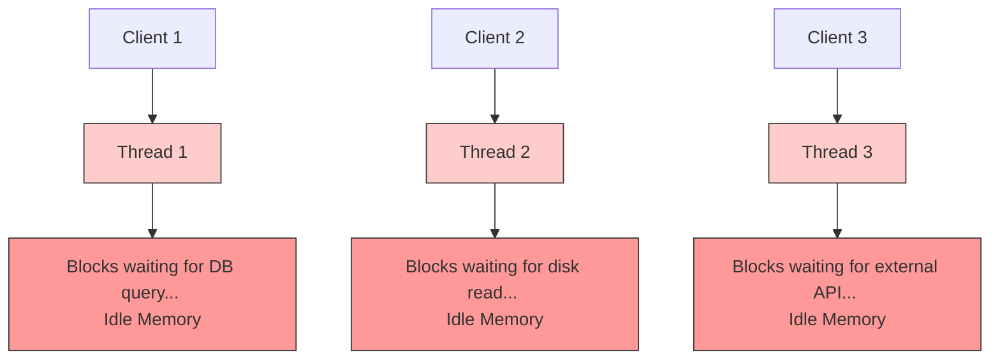
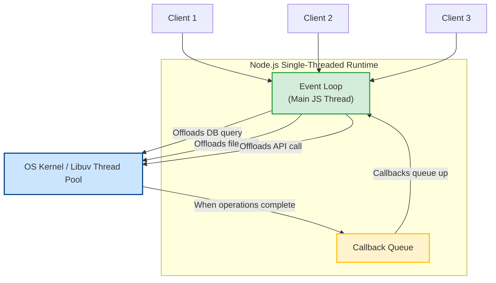

# Introduction to Node.js

As a backend engineer, you must understand the foundation of your runtime environment. Knowing the internals of Node.js prevents common pitfalls, such as blocking the single main execution thread, and helps you make informed architectural decisions on when to use Node.js and when to select a different tool.

Before Node.js, JavaScript was confined to running inside web browsers. Ryan Dahl created Node.js in 2009 to solve a key problem: traditional web servers (like Apache) allocated a dedicated thread per connection. Under heavy load, these servers spent excessive memory context-switching and waiting on database/network I/O.

Ryan Dahl combined:
1. **Google Chrome's V8 Engine**: To execute JavaScript extremely fast outside the browser.
2. **Libuv (written in C)**: A multi-platform support library focusing on asynchronous, non-blocking I/O.
3. **C++ Bindings & JS Library**: Wrapper layers that expose low-level operating system APIs (like network sockets, filesystem operations) to JavaScript.

### Synchronous vs Asynchronous I/O Execution Models
* **Thread-per-Connection (e.g., Traditional Apache)**:
  For every incoming request, a new OS thread is spawned. If the thread needs to fetch a file or run a database query, it halts execution and sits idle (blocks) until the data is returned.
* **Single-Threaded Event Loop (Node.js)**:
  Node.js executes JavaScript code in a single thread. When a database or filesystem operation is requested, Node offloads the operation to the operating system or to its thread pool (managed by libuv) and immediately moves on to handle the next client request. Once the task is complete, a callback is queued to resume processing.

## Deep Dive
Let's look at the architectural layers of Node.js:

1. **Application Layer**: Your JavaScript/TypeScript code.
2. **V8 Engine**: Compiles JS into optimized machine code. It acts as the bridge between JS objects and C++ representations.
3. **Node.js Bindings (C++ Glue Code)**: Translates JS calls into C++ code that can communicate directly with Libuv and the system kernel.
4. **Libuv**: An asynchronous, non-blocking event-driven loop library. It manages the internal system event loop and a pool of background worker threads to handle operations that cannot be handled asynchronously at the OS kernel level (such as filesystem and cryptography tasks).
5. **Operating System Kernel**: Executes high-performance networking operations (e.g., using `epoll` on Linux, `kqueue` on macOS, or `IOCP` on Windows) which are inherently asynchronous.

### CPU-Bound vs. I/O-Bound Tasks
* **I/O-Bound**: The application spends most of its time waiting for input/output operations (e.g., reading disk files, database queries, network requests). Node.js is exceptionally efficient here because it frees up the main thread during the wait.
* **CPU-Bound**: The application spends most of its time executing complex computations (e.g., image resizing, cryptography, data compression). Node.js can struggle here because computing on the single main thread blocks the Event Loop, halting all other client requests.

## Visual Explanation

### Thread-per-Connection vs Node.js Event Loop

#### Multi-Threaded Sync (e.g., Apache/Java servlet model)


#### Node.js Single-Thread Asynchronous Model


## Real-World Example
Consider an API that queries a database and returns JSON data. In Node.js, the main thread initiates the database call, hands it over to the system database driver, and immediately processes other incoming HTTP requests. Once the database driver gets the data, it notifies Libuv, which queues the callback to format and send the response back to the client. The main thread never blocks waiting for the database network latency.

## Code Examples

### Blocking vs. Non-Blocking Read
This example demonstrates the difference between blocking the event loop and letting it execute asynchronously.

```javascript
const fs = require('fs');

// --- BLOCKING (Synchronous) ---
console.log('1. Starting blocking read...');
try {
  // The main execution thread stops here until the file is completely read
  const data = fs.readFileSync('large_file.txt', 'utf8');
  console.log('2. Blocking read finished.');
} catch (err) {
  console.error('Error during blocking read:', err.message);
}
console.log('3. Moving to next task.\n');

// --- NON-BLOCKING (Asynchronous) ---
console.log('1. Starting non-blocking read...');
// The main execution thread requests the read and immediately continues to line 22
fs.readFile('large_file.txt', 'utf8', (err, data) => {
  if (err) {
    console.error('Error during non-blocking read:', err.message);
    return;
  }
  console.log('3. Non-blocking read finished (Callback invoked).');
});
console.log('2. Moving to next task (Main thread free).');
```

## Best Practices
* **Never Block the Event Loop**: Do not perform heavy CPU operations (such as large loops, heavy crypto, or synchronous file operations) on the main thread.
* **Avoid Synchronous APIs in Production**: Use `fs.promises` or callback-based asynchronous methods instead of `fs.readFileSync` or `fs.writeFileSync` in request handlers.
* **Offload Heavy Computation**: Use worker threads, child processes, or separate microservices for heavy CPU-bound tasks.

## Interview Questions

**Q:** What is Node.js and why is it single-threaded?

> **Answer:**
> Node.js is an open-source runtime environment that compiles JavaScript to machine code using Google's V8 engine and wraps it with C++ bindings to execute outside the browser. It uses a single thread for JS execution to simplify programming models, avoiding lock contention and race conditions. Concurrency is handled by offloading I/O blocking tasks to Libuv and the OS kernel.

**Q:** How does Node.js handle concurrency if it only runs on one thread?

> **Answer:**
> It utilizes an Event Loop and non-blocking I/O. When an asynchronous operation is triggered (like fetching data over a socket), Node delegates this to the OS kernel or Libuv's thread pool. The single JS thread continues running other code. When the operation completes, the OS or Libuv informs the Event Loop, placing the registered callback in the queue to be executed when the JS thread is idle.

**Q:** What is the difference between CPU-bound and I/O-bound tasks in Node.js, and how should a senior engineer handle CPU-bound tasks?

> **Answer:**
> I/O-bound tasks wait on external hardware or network events (e.g., database queries or file reading), which Node.js excels at. CPU-bound tasks involve heavy calculations that block the main thread. A senior engineer handles CPU-bound tasks by using Node's `worker_threads` module (which spawns native OS threads running isolated V8 instances) or offloading the task to a message broker (e.g., RabbitMQ) connected to specialized worker services.

**Q:** Discuss Ryan Dahl's original design goals for Node.js and how Apache's thread-per-connection scaling issues drove the creation of Libuv.

> **Answer:**
> Ryan Dahl aimed to design a web application framework where I/O was handled asynchronously, preventing blocking. Apache's model (one OS thread per connection) scales poorly due to context-switching overhead and memory consumption (each thread consumes ~1-2 MB of memory stack space). To support thousands of concurrent client connections without scaling hardware lineally, Dahl integrated V8 with Libuv. Libuv abstracts platform-specific asynchronous APIs (`epoll` on Linux, `kqueue` on macOS, `IOCP` on Windows) to create a single interface that schedules executions on a single main loop thread.

---
Previous : N/A | Index : [00_index.md](00_index.md) | Next : [02_NodeJS_Environment_Setup.md](02_NodeJS_Environment_Setup.md)
