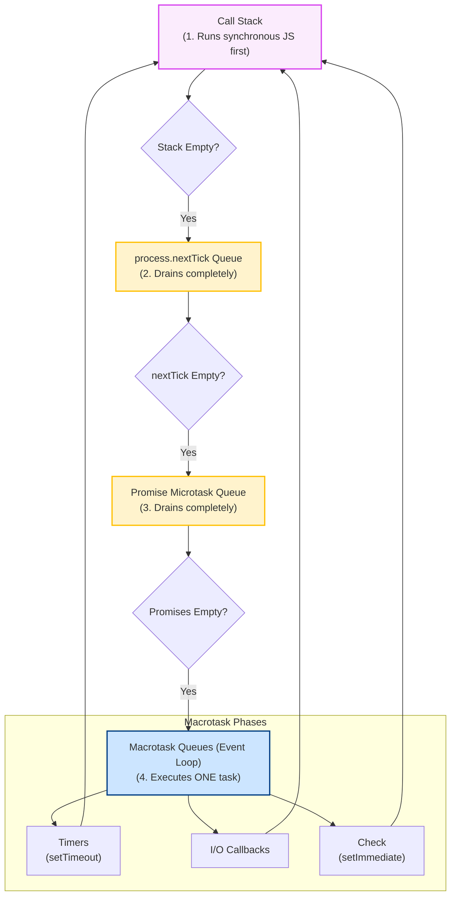

# Event Loop Basics

Asynchronous execution is the heart of Node.js. If you do not understand how execution priority is scheduled, you will introduce race conditions, write buggy asynchronous flows, and struggles to debug timing issues in production web services.

### Asynchronous Execution offloading
JavaScript runs on a single main thread. However, Node.js handles thousands of concurrent operations by offloading blocking calls (like reading files, network requests, database transactions) to **Libuv** or the **OS Kernel**.

When an asynchronous task completes, its callback is placed in a queue. The **Event Loop** is the mechanism that monitors the call stack and determines when to push these callbacks onto the stack for execution.

### Macrotasks and Microtasks
Callbacks are organized into different queues based on their source:
1. **Microtasks**: High-priority callbacks.
   * `process.nextTick` (Has its own microtask queue, executed first).
   * Promise callbacks (`.then()`, `.catch()`, `.finally()`, and `async/await` resumptions).
2. **Macrotasks (often just called Tasks)**: Standard asynchronous events.
   * Timers (`setTimeout`, `setInterval`).
   * I/O callbacks (filesystem, network sockets).
   * Immediate timers (`setImmediate`).

### Priority Rule
The Event Loop executes the main script first. Whenever the Call Stack becomes empty:
1. The engine checks the **process.nextTick queue**. If callbacks exist, they are executed until the queue is completely empty.
2. The engine checks the **Promise microtask queue**. If callbacks exist, they are executed until the queue is completely empty.
3. Only when both microtask queues are completely empty does the Event Loop move to execute the next **Macrotask** from the macrotask queues.

## Deep Dive
Let's analyze how the Event Loop transitions between executions. The loop follows a continuous cycle:

1. **Timers Phase**: Executes callbacks scheduled by `setTimeout()` and `setInterval()`.
2. **I/O Pending Callbacks Phase**: Executes I/O callbacks deferred from the previous loop iteration.
3. **Poll Phase**: Retrieves new I/O events. The loop will block here if there are no timers or setImmediates scheduled, waiting for database or network data.
4. **Check Phase**: Executes callbacks scheduled by `setImmediate()`.
5. **Close Callbacks Phase**: Executes close events, like `socket.on('close', ...)`.

*Crucial note*: **Microtasks** (Promises and `nextTick` callbacks) do not belong to a single phase of the Event Loop. They are executed **immediately after the current execution block completes**, regardless of which phase the Event Loop is currently running, before moving to the next task.

## Visual Explanation

### Execution Flow: Stack vs. Microtask vs. Macrotask


## Real-World Example
Suppose you run a server that queries a cache database. If the cache hits, you want to return the result immediately. If it misses, you fetch it asynchronously. You must ensure the response is always returned asynchronously to maintain a predictable execution order. Mixing synchronous return paths and asynchronous callbacks causes race conditions (a anti-pattern known as "releasing Zalgo").

## Code Examples

### Execution Priority Tracing
This script demonstrates the execution order of synchronous and asynchronous blocks in Node.js.

```javascript
console.log('1. Synchronous Start');

// Macrotask 1: Timeout (Timer Queue)
setTimeout(() => {
  console.log('2. setTimeout (Macrotask Timer)');
}, 0);

// Macrotask 2: setImmediate (Check Queue)
setImmediate(() => {
  console.log('3. setImmediate (Macrotask Check)');
});

// Microtask 1: Promise (Promise Queue)
Promise.resolve().then(() => {
  console.log('4. Promise then (Microtask)');
});

// Microtask 2: process.nextTick (nextTick Queue)
process.nextTick(() => {
  console.log('5. process.nextTick (High-Priority Microtask)');
});

console.log('6. Synchronous End');

/* 
EXPECTED OUTPUT ORDER:
1. Synchronous Start
6. Synchronous End
5. process.nextTick (High-Priority Microtask)
4. Promise then (Microtask)
2. setTimeout (Macrotask Timer)
3. setImmediate (Macrotask Check)
*/
```

## Best Practices
* **Never Block the Event Loop**: Keep operations on the main thread short. Avoid heavy computation or synchronous I/O.
* **Do Not Abuse process.nextTick**: Calling `process.nextTick` recursively can starve the Event Loop, preventing timers and I/O callbacks from ever running.
* **Keep Code Asynchronous**: Ensure helper functions always run asynchronously, preventing timing issues.

## Interview Questions

**Q:** What is the Event Loop in Node.js?

> **Answer:**
> The Event Loop is an infinite loop mechanism that allows Node.js to perform non-blocking I/O operations. It executes JavaScript callbacks from queues on the main thread after offloading I/O operations to Libuv or the operating system.

**Q:** What is the difference between a Microtask and a Macrotask? Provide examples of both.

> **Answer:**
> Microtasks are high-priority tasks executed immediately after the currently running script or task completes, before the Event Loop transitions to the next phase. Examples include `process.nextTick` and Promise callbacks. Macrotasks are standard events processed in their respective phases of the Event Loop. Examples include `setTimeout`, `setInterval`, `setImmediate`, and I/O callbacks.

**Q:** In what order do `setTimeout(..., 0)`, `setImmediate`, and `process.nextTick` execute, and why?

> **Answer:**
> `process.nextTick` executes first because it is a microtask that executes immediately when the current execution context clears, before the loop transitions. Between `setTimeout(..., 0)` (timers phase) and `setImmediate` (check phase), the order can be non-deterministic if called from the main script module. This is because V8 startup time can take 1-2ms, meaning the timers phase check may run before or after the timer actually registers. However, if invoked within an I/O callback (e.g. inside `fs.readFile`), `setImmediate` will always run first because the check phase executes immediately after the poll phase where I/O callbacks run.

**Q:** What is "releasing Zalgo" in Node.js API design, how does it degrade system predictability, and how do you resolve it?

> **Answer:**
> "Releasing Zalgo" refers to designing an API that executes either synchronously or asynchronously depending on runtime state (e.g., returning a cached result synchronously, but fetching a db record asynchronously).
> This degrades system predictability because the caller cannot guarantee the order of execution. If caller code expects asynchronous behavior, it may execute dependent logic before the callback runs under cache misses, but after the callback under cache hits.
> To resolve this, ensure all pathways are asynchronous. You can wrap synchronous returns in `process.nextTick()`, `queueMicrotask()`, or use Promises to guarantee that the callback always executes in a future tick.

---
Previous : [05_V8_Engine.md](05_V8_Engine.md) | Index : [00_index.md](00_index.md) | Next : [07_npm.md](07_npm.md)
