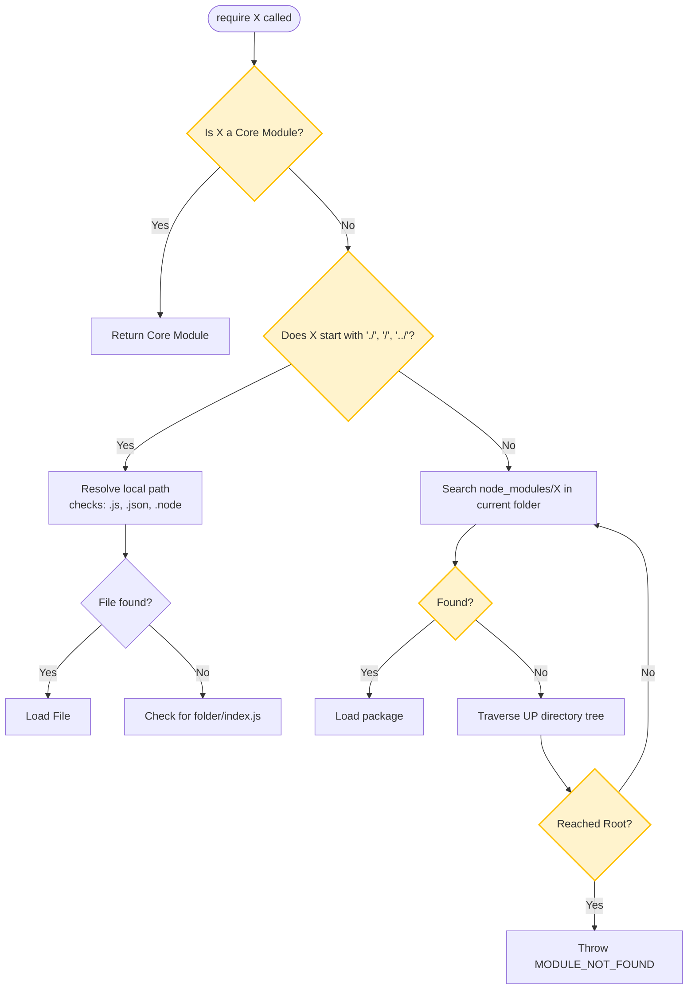

# CommonJS

CommonJS is Node.js's legacy module system and remains widely used in millions of legacy libraries. Understanding how `require()` resolves paths and caches instances prevents bugs where configuration changes are shared across file boundaries, or where incorrect paths cause deployment crashes.

### CommonJS Core Rules
* **Synchronous Loading**: CommonJS files are loaded synchronously. When you call `require('./db')`, the main thread blocks until the file is read from disk, compiled, and executed.
* **Module-level Caching**: Once a module is resolved and loaded, its exports are cached in memory. Subsequent calls to `require()` the same file return the cached object, skipping execution of the file.

### The `require()` Resolver Algorithm
When you call `require(X)`, Node.js follows a strict algorithm to find the target file:
1. **Core Modules**: If X is a core module (like `fs` or `path`), it is returned immediately.
2. **Relative/Absolute Paths**: If X starts with `./`, `/`, or `../`:
   * It looks for a file named X.
   * It looks for X with extensions: `X.js`, `X.json`, `X.node`.
   * It looks for a folder named X containing a `package.json` with a `"main"` property, or falls back to `index.js`.
3. **node_modules Lookup**: If X is not a path, Node starts at the current directory, looks for `node_modules/X`, and traverses up the directory tree until it finds the package or reaches the root directory.

## Deep Dive

### Module Caching (`require.cache`)
Every module loaded is stored in a key-value map called `require.cache`. The key is the absolute path to the module file.
* **Singletons**: This cache makes modules act like singletons. If you modify properties of an exported object, those changes are reflected across all files importing that module.
* **Cache Eviction**: You can delete entries from `require.cache` to force Node to reload and re-execute a file on the next `require()` call. However, this is generally discouraged in production as it can create memory leaks and inconsistent states.

### Exports Syntax Pitfalls
CommonJS modules export values using `module.exports`. The helper parameter `exports` is merely a reference to `module.exports`. If you assign a new value to `exports` (e.g., `exports = myClass`), you overwrite the local reference instead of modifying `module.exports`, and the module returns its default empty object `{}`.

## Visual Explanation

### The `require()` Resolution Flowchart


## Real-World Example
Suppose you store database configurations in a local module `config.js` and use it across multiple files. Because of `require.cache`, the database credentials and configurations are loaded and parsed once, and all subsequent `require('./config')` calls get the cached object immediately, reducing disk I/O overhead.

## Code Examples

### require.cache Modification and Export Pitfalls

```javascript
// database.js
class Database {
  constructor() {
    this.connectionString = 'localhost:5432';
  }
}
// Exporting an instance (creates a singleton via require cache)
module.exports = new Database();
```

```javascript
// app.js
const db1 = require('./database');
db1.connectionString = 'production-cluster:5432'; // Mutates the instance

// Importing again returns the cached, mutated instance
const db2 = require('./database');
console.log('db2 connection:', db2.connectionString); // 'production-cluster:5432'
console.log('db1 and db2 are reference equal:', db1 === db2); // true

// Clear the cache for this module
const modulePath = require.resolve('./database');
delete require.cache[modulePath];

// Importing again executes the file anew, returning a fresh instance
const db3 = require('./database');
console.log('db3 connection (reloaded):', db3.connectionString); // 'localhost:5432'
console.log('db1 and db3 are reference equal:', db1 === db3); // false
```

## Best Practices
* **Use module.exports for Exports**: To avoid reference issues, use `module.exports = ...` when exporting objects, functions, or classes.
* **Keep Modules Side-Effect Free**: Avoid running heavy calculations or modifying global states during module initialization, as modules execute as soon as they are required.
* **Do Not Mutate module.exports**: Keep exported modules immutable or export class definitions instead of instances if you need to prevent mutations across files.

## Interview Questions

**Q:** How do you export and import modules in CommonJS?

> **Answer:**
> In CommonJS, you import modules using the `require('module-name')` function and export them by assigning properties or objects to `module.exports` (e.g. `module.exports = { myFunc }`).

**Q:** Explain how `require.cache` works and how it affects module instances.

> **Answer:**
> When a module is loaded via `require()`, Node.js cache-stores the evaluated module's exports in a key-value object `require.cache`, using the absolute file path as the key. Subsequent imports of the same file return the cached exports directly, acting as a singleton across the application.

**Q:** Walk through the resolution steps when `require('my-library')` is executed.

> **Answer:**
> When `require('my-library')` runs:
> 1. Node.js checks if `my-library` is a native core module.
> 2. If not, it checks the current directory for a directory named `node_modules/my-library`.
> 3. If not found, it traverses up parent directories, checking for `node_modules/my-library` at each level until it reaches the root directory.
> 4. Once found, it checks `node_modules/my-library/package.json` for the `"main"` property to identify the entrypoint. If the file or property does not exist, it falls back to `index.js`, `index.json`, or `index.node`.
> 5. If the directory traversal completes without finding the module, it throws a `MODULE_NOT_FOUND` error.

**Q:** Discuss the architectural trade-offs of CommonJS's synchronous loading design in high-throughput server applications. What issues arise when clearing `require.cache` dynamically to implement hot-reloading?

> **Answer:**
> CommonJS loads modules synchronously, which works well on the server during startup because files are loaded from local disk. However, if modules are required dynamically during active client requests (e.g., inside an HTTP route handler), the event loop will block while reading the files from disk, degrading request throughput.
> 
> Implementing dynamic hot-reloading by clearing `require.cache` presents major risks:
> 1. It can create memory leaks because other active modules may still hold references to the old module instances, preventing garbage collection.
> 2. It can cause state mismatches if the reloaded module references global variables or registers event emitters that get duplicate-bound.
> 3. It invalidates V8 hidden classes and inline caches for the reloaded code, forcing deoptimization and slowing down code execution.

---
Previous : [09_Modules.md](09_Modules.md) | Index : [00_index.md](00_index.md) | Next : [11_ES_Modules.md](11_ES_Modules.md)
