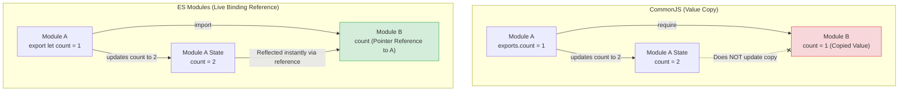

# ES Modules

ESM is the official ECMAScript standard for JavaScript modules. Modern Node.js codebases are migrating to ESM because it offers better client-side compatibility and supports performance optimizations like tree-shaking. However, mixing ESM and CommonJS packages is a common source of runtime errors, which you must know how to handle.

### Asynchronous Module Execution and Static Analysis
* **CommonJS** evaluates modules dynamically at runtime. Imports are resolved synchronously as the code runs.
* **ES Modules** use static analysis. The engine parses imports and exports *before* executing any code. This allows it to check for syntax errors and build the module dependency tree without running the files.

Static analysis enables **Tree Shaking**: build tools can detect which module exports are never imported or used in the application and remove them from the final production bundle, reducing code size.

### Key Differences: ESM vs CommonJS
1. **Live Bindings**: ESM imports are read-only, live bindings to the exported values. In contrast, CommonJS imports are copies of the exported values.
2. **Missing Node Variables**: ESM files do not have access to variables like `__dirname`, `__filename`, or `require`.
3. **Implicit Strict Mode**: ESM files run in strict mode (`"use strict"`) by default.
4. **Top-Level Await**: ESM supports using the `await` keyword in the global scope of a file, allowing you to initialize databases asynchronously without wrapping code in async functions.

## Deep Dive

### Emulating `__filename` and `__dirname`
To get file and folder paths in ESM, you must use `import.meta.url` (which returns a file URL string) and convert it using the `fileURLToPath` utility from Node's native `url` module:

```javascript
import { fileURLToPath } from 'url';
import { dirname } from 'path';

// Emulating __filename
const __filename = fileURLToPath(import.meta.url);

// Emulating __dirname
const __dirname = dirname(__filename);
```

### ESM and CommonJS Interoperability
* **Importing CommonJS from ESM**: You can import CommonJS files into ESM using standard imports. Node automatically wraps the CommonJS exports object as the default export of the module:
  ```javascript
  import cjsModule from './legacy-file.cjs';
  ```
* **Importing ESM from CommonJS**: You cannot import ESM files using `require()` because ESM is asynchronous. To load an ESM file in a CommonJS script, you must use dynamic `import()`:
  ```javascript
  const esmModule = await import('./modern-file.js');
  ```

## Visual Explanation

### Live Bindings (ESM) vs. Value Copies (CJS)


## Real-World Example
Consider initializing a database connection. In CommonJS, you must wrap the server initialization in an async function to await the database connection. In ESM, you can use top-level `await` at the root of `server.js`. The module will pause execution during startup until the database connects, preventing the server from accepting traffic before it is ready.

## Code Examples

### ESM Features: Live Bindings, Top-Level Await, and Path Resolution

```javascript
// counter.js (ESM Module)
export let count = 0;

export function increment() {
  count++;
}
```

```javascript
// app.js (ESM Module - Run as package type="module" or file extension .js/.mjs)
import { fileURLToPath } from 'url';
import { dirname, join } from 'path';
import { count, increment } from './counter.js';

// 1. Emulating __dirname
const __filename = fileURLToPath(import.meta.url);
const __dirname = dirname(__filename);
console.log('ESM Directory Path:', __dirname);

// 2. Demonstrating Live Bindings
console.log('Initial Count:', count); // 0
increment();
console.log('Count after increment:', count); // 1 (Automatically updated reference)

// 3. Top-Level Await
console.log('Starting dummy database initialization...');
const connectionStatus = await new Promise((resolve) => {
  setTimeout(() => resolve('Connected!'), 100);
});
console.log('Database status:', connectionStatus);
```

## Best Practices
* **Use `.mjs` or `type: "module"`**: Use the `.mjs` file extension or add `"type": "module"` to `package.json` to enable ES Modules in your project.
* **Do Not Mutate Imports**: Treat imported variables as read-only. Attempting to assign a new value to an imported variable (e.g. `count = 10`) throws a runtime `TypeError`.
* **Use dynamic import() for conditional loading**: Use dynamic `import()` when you need to load modules conditionally or inside CommonJS environments.

## Interview Questions

**Q:** What is the difference between `import/export` and `require/module.exports`?

> **Answer:**
> `import/export` is the standard ES Modules (ESM) syntax, which evaluates modules asynchronously and uses static analysis. `require/module.exports` is the CommonJS (CJS) syntax, which loads and evaluates modules synchronously at runtime.

**Q:** Why are `__dirname` and `__filename` not available in ES Modules, and how do you access them?

> **Answer:**
> ESM does not define local variables like `__dirname` and `__filename` because module resolution in ESM is based on URLs, not local file paths. You can access the current directory and file path by parsing `import.meta.url` using `fileURLToPath` from the `url` module, and extracting the directory path with `path.dirname()`.

**Q:** Explain the concept of live bindings in ES Modules and how they differ from exports in CommonJS.

> **Answer:**
> In CommonJS, importing a primitive value creates a local copy of that value. If the exporting module updates that value later, the importing module does not see the change. In ESM, imported variables are live, read-only bindings (reference pointers) to the exporting module's scope. If the exporting module updates the variable, the importing module automatically reads the updated value.

**Q:** Discuss the execution phases of ES Modules under the V8 engine (Construction, Instantiation, Evaluation) and how dynamic `import()` breaks the static compilation model. What performance impacts does this have on cold starts?

> **Answer:**
> V8 executes ES Modules in three distinct phases:
> 1. **Construction**: Parses the JS file, identifies imports/exports, and recursively fetches and parses imported files to build the Module Record Graph.
> 2. **Instantiation**: Allocates memory locations for all exported variables and creates reference bindings (pointers) between imports and exports. No JS code runs during this phase.
> 3. **Evaluation**: Executes the JS code line-by-line, resolving top-level awaits and writing actual values to the allocated memory locations.
> 
> Dynamic `import()` loads modules conditionally at runtime, bypassing the initial construction phase. While this helps optimize cold starts by splitting code bundles and loading heavy modules only when needed, it shifts parsing and instantiation costs to runtime request paths, which can introduce latency spikes when the dynamic module is first requested.

---
Previous : [10_CommonJS.md](10_CommonJS.md) | Index : [00_index.md](00_index.md) | Next : [12_File_System_Module.md](12_File_System_Module.md)
